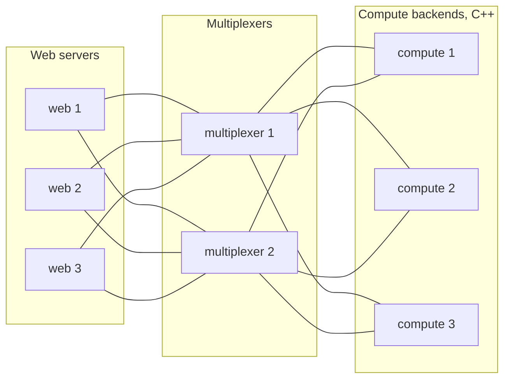

<p align="center"></p>

# Multiplexer

A lightweight, highly available message broker for request/reply and
publish/subscribe messaging between microservices on a trusted internal
network. Peers connect over TCP, announce their peer type, and exchange typed
messages with low latency. A declarative rules file defines the routing for
each message type: round-robin load balancing across a pool of backends,
fan-out to every subscriber, or direct addressing by instance id. It is
stateless by design: no queues, no persistence, no authentication, and no
coordination between instances.

The core is C++17 with client libraries for C++ and Python, built with Bazel.
Deploy several instances active-active: there is no single point of failure,
every client and backend connects to all of them, and failover between them
is automatic and transparent.

Multiplexer has been in continuous production use in countless projects since
2008, almost twenty years. This repository adds what publication calls for:
complete documentation, a test for every failure mode, and static
thread-safety analysis.

## What a deployment looks like

Web servers on the left, two multiplexers in the middle, a pool of C++
backends doing the expensive computation on the right. Every peer is
connected to both multiplexers; a request from any web server reaches one
backend, chosen round robin, and the answer comes back to the server that
asked. Lose either multiplexer, or any backend, and nothing stops.



The rules behind the picture, in the format [rules.md](docs/rules.md)
describes; the web servers are `is_passive` because they use the
synchronous client, which calls in only to send (a threaded client would not
need it):

```
peer {
    type: 102
    name: "WEB"
    is_passive: true
}

peer {
    type: 201
    name: "COMPUTE"
}

type {
    type: 301
    name: "COMPUTE_REQUEST"
    to {
        peer: "COMPUTE"
        whom: ANY
    }
}

type {
    type: 302
    name: "COMPUTE_RESPONSE"
}
```

## Highlights

- **Highly available, no single point of failure.** Run several multiplexers
  active-active; clients and backends connect to all of them, fail over
  automatically, and reconnect on their own. A rolling restart of three
  multiplexers under traffic costs no request more than a millisecond
  ([rolling_restart](tests/scenarios/rolling_restart/README.md)).
- **Fault-tolerant requests.** A request whose backend dies is retried through
  another backend found by a search across every multiplexer, and a request
  whose connection dies is resent, all inside one call
  ([how a query is answered](docs/query.md)).
- **Zero-downtime deployments.** A backend asked to leave drains: it declines
  new work and finishes what it holds, so a Kubernetes rolling restart with a
  preStop hook costs nobody a timeout
  ([backend_drains](tests/scenarios/backend_drains/README.md)).
- **Load balancing and fan-out from one rules file.** Round-robin across a
  backend pool, publish/subscribe to every subscriber, or direct addressing,
  chosen per message type, no code change ([rules](docs/rules.md)).
- **High performance, low latency.** One thread and one event loop per multiplexer, frames forwarded
  as they arrived, never re-serialized: over 100,000 request/reply round
  trips per second through one multiplexer on 70% of one core, 18 µs per
  round trip when idle, 7 MB resident, measured with
  [tests/bench.sh](tests/bench.sh) on a Threadripper PRO 9965WX.
- **Stateless and lightweight.** No external coordination service, no
  persistence, one binary and one rules file; scale horizontally by adding
  instances and backends. A documented binary protocol over TCP with
  Protocol Buffers ([wire format](docs/wire_format.md)).
- **Thread-safe clients for C++ and Python, and asyncio.** A synchronous
  client for simple programs, a threaded client with callback-based
  asynchronous queries for servers, safe to share between threads, and an
  `AsyncClient` for asyncio programs that awaits queries and sends and
  delivers events to coroutines on the loop; all fork-aware and clean at
  interpreter exit ([Python API](docs/api_python.md), [C++ API](docs/api_cpp.md)).
- **Tested for every failure mode.** One documented integration scenario per
  failure, AddressSanitizer, ThreadSanitizer, LeakSanitizer, clang thread-safety
  analysis and a soak test ([scenarios](tests/scenarios/README.md)).
- **Test infrastructure you can import.** The harness those scenarios run on
  is a public package: real multiplexers on ephemeral ports in one line,
  scripted backends and clients in-process for unit tests, peers as
  processes for end-to-end tests, and a Bazel macro that runs a scenario
  against the shipped roles or a binary of your own
  ([testing](docs/api_python.md#testing)).
- **See what was routed, when asked.** A peers file lists who is
  connected. A recording holds every routed message, with who sent it, who
  received it or why nobody did; switched on at start, or started, stopped
  and tapped live on a running cluster from one command, with the
  operator's consent given as a flag. A session replays offline and scripts
  test peers from real traffic ([operations](docs/operations.md#recording)).

## How it compares

- **RabbitMQ, Kafka:** those persist and queue; the multiplexer does neither.
  A message goes to whoever is connected right now or is dropped, at most
  once per multiplexer, which is what makes it stateless and simple to run.
- **ZeroMQ:** a library without a broker, so peers need each other's
  addresses; here every peer knows only the multiplexers, and routing is
  configuration.
- **gRPC:** point-to-point calls with generated stubs per service; here one
  rules file routes typed messages to pools, subscribers or instances, and a
  request finds a live backend on its own.
- **NATS:** the closest in spirit. NATS servers form a cluster; multiplexers
  do not know each other, and the clients provide the redundancy by
  connecting to all of them.

[Guarantees, failure modes and defaults](docs/guarantees.md) states exactly
what is promised.

Start with [docs/README.md](docs/README.md): it defines the terminology,
shows the reference deployment, and traces a query and an event step by step.
Then follow [docs/walkthrough.md](docs/walkthrough.md), which runs
[examples/echo](examples/echo), a complete backend and client in both
languages. The reference pages under [docs/](docs/) cover the rules file, both
client libraries, `mxcontrol`, the wire format and operations.

## Quick start

```
bazel build //...                       # see docs/building.md for the packages
bazel test --test_tag_filters=-slow //...
cd examples/echo && bazel test //...    # a backend and a client, built the way your code will be
```

## Rules and routing

### Terminology

- `peer`: any program connected to the multiplexer, a client or a backend. Peers send and receive messages. Must be of a defined `peer type`.
- `peer type`: a numeric value defined via a `peer {...}` block in `multiplexer.rules`
- `peer instance id`: every peer gets assigned an `instance id` when it connects to the multiplexer. Peers can send messages directly to each other using this id.
- `message`: a data packet that peers can send to each other. Must be of a defined `message type`.
- `message type`: a numeric value defined via a `type {...}` block in `multiplexer.rules`

### multiplexer.rules file

Peer types and message types are defined in `multiplexer.rules` file.

**If you make any changes to any of the type ids or constants, client library files will need to be regenerated. It happens automatically if you use the `bazel run` or `bazel build`. Multiplexer itself doesn't need to be rebuilt, only restarted.**

### Send message directly to a peer

Specify another peer's `peer instance id` in the `to` field in the message to send it directly to that particular peer.

**This routing rule takes precedence over other rules specified below.**

### Route message by message type

File `multiplexer.rules` allows you to define how messages of particular types are routed. Example:

```
# Peers
peer {
    type: 106
    name: "PYTHON_TEST_SERVER"
}

# Messages
type {
    type: 110
    name: "PYTHON_TEST_REQUEST"
    to {
        peer: "PYTHON_TEST_SERVER"
        whom: ANY
    }
}
```

This means: every messages of type `PYTHON_TEST_REQUEST` will be sent to one of the connected `PYTHON_TEST_SERVER` peers (round-robin).
If you need the message to be sent to all peers of a particular type, use `whom: ALL`. [docs/rules.md](docs/rules.md) describes every field.

## Building with Bazel

Prerequisites, verified on clean Debian 12, Ubuntu 24.04 and Debian 13
installations: Bazel 6.2 through Bazelisk, a C++17 compiler,
`protobuf-compiler` with `libprotobuf-dev`, Python 3.10 or newer with
`python3-dev` and `python3-protobuf`. Boost and pybind11 are fetched by
Bazel. [docs/building.md](docs/building.md) has the exact packages, how to
bring your own protobuf, and `docker/check.sh`, which proves the list on a
clean container.

```
bazel build //...
bazel test //...                              # unit and integration tests
bazel test --test_tag_filters=-slow //...     # the fast ones, a few seconds
bazel run //mxcontrol run_multiplexer
```

The integration tests under [tests/](tests/) start real multiplexers and play
peers in Python and C++; see [tests/README.md](tests/README.md). `mxcontrol
run_multiplexer` accepts `--address host:0 --port-file PATH` to pick a free
port and report it, and exits with 0 on SIGTERM.

`--config=debug` keeps debug info and frame pointers; `--config=release` builds optimized, stripped binaries. Run the server inside `screen` or `tmux` if you want to get back to the session later.

### Your own peer and message types

`multiplexer.rules` in this repository is an example. Keep your deployment's rules file in your own repository and point the build at it:

```
bazel build --//:multiplexer_rules=//your/pkg:multiplexer.rules //...
```

When this repository is consumed as an external Bazel repository named `mx`, the flag is `--@mx//:multiplexer_rules=...`. At run time `mxcontrol run_multiplexer` reads `multiplexer.rules` from the current directory unless `--rules` points elsewhere.

## Building without Bazel

For a machine that will not have Bazel, a `Makefile` builds the same things
from the distribution's own compiler, protobuf, Boost and pybind11:

```
make -j                      # build/bin/mxcontrol, build/libmultiplexer.a with headers, build/python/
make check                   # the C++ and Python unit tests, against what was built
make wheel                   # a pip wheel of the Python package
sudo make install            # mxcontrol, the library and the headers under /usr/local
make RULES=your.rules -j     # the constants from your rules file
```

[docs/building.md](docs/building.md#without-bazel) lists the packages and
what a program links and imports. The test roles, the scenarios, the
examples and the sanitizer builds stay with Bazel.

## Using it from another Bazel workspace

Declare this repository as `mx`, then two calls in your `WORKSPACE`:

```
load("@bazel_tools//tools/build_defs/repo:git.bzl", "git_repository")

git_repository(
    name = "mx",
    commit = "<commit sha>",
    remote = "https://github.com/kulewski/multiplexer.git",
)

load("@mx//bazel:deps.bzl", "mx_dependencies")
mx_dependencies()
load("@mx//bazel:setup.bzl", "mx_setup")
mx_setup()
```

Then depend on `@mx//multiplexer:clients` (a client) or
`@mx//multiplexer:servers` (a backend) from Python, `@mx//multiplexer:client`
from C++; import and include paths are unchanged. [examples/](examples/) holds
complete workspaces built that way, starting with [examples/echo](examples/echo).
Your tests get `@mx//multiplexer/testing`: real multiplexers on ephemeral
ports, scripted peers, and the macro this repository's own scenarios use
([docs/api_python.md](docs/api_python.md#testing)).

## Using it from Python

A backend waits for requests and answers them. `serve_forever()` runs the loop
and calls `handle_message` for each request; `send_message` replies to the peer
that asked.

```python
from multiplexer.servers import BaseMultiplexerServer
from multiplexer.multiplexer_constants import peers, types


class Echo(BaseMultiplexerServer):
    def handle_message(self, mxmsg):
        self.send_message(message=mxmsg.message.upper(), type=types.PYTHON_TEST_RESPONSE)


Echo([("127.0.0.1", 1980)], type=peers.PYTHON_TEST_SERVER).serve_forever()
```

A client sends a request and gets the answer back; give it the addresses of
all your multiplexers.

```python
from multiplexer.clients import Client
from multiplexer.multiplexer_constants import peers, types

client = Client([("127.0.0.1", 1980), ("127.0.0.1", 1981)], type=peers.PYTHON_TEST_CLIENT)
response = client.query(b"hello", type=types.PYTHON_TEST_REQUEST, timeout=10)
print(response.message)  # b"HELLO"
```

An event is sent the same way without waiting for an answer:
`client.send_message(b"payload", type=types.SOME_EVENT)`. To address one
specific peer, pass `to=<its instance id>`; that bypasses the routing rules.
The peer and message names come from the rules file the build was pointed at;
these are from the example file in this repository.

The C++ client offers the same calls: `Client::query`, `schedule_one`,
`schedule_all`, and `BaseMultiplexerServer` for backends. See
[examples/echo/backend.cc](examples/echo/backend.cc).

## History

Multiplexer was built at Azouk Network Ltd. in 2008-2009, first as a Python
prototype by Krzysztof Kulewski and then as the C++ implementation this
repository grew out of, by Piotr Findeisen. Azouk released it under the MIT
license, and Krzysztof Kulewski has owned and developed it since 2010. It
has run in production in countless projects throughout, which is where the
failure handling described in [docs/guarantees.md](docs/guarantees.md) was
learned. See [AUTHORS](AUTHORS).

## License

MIT, see [LICENSE](LICENSE).
