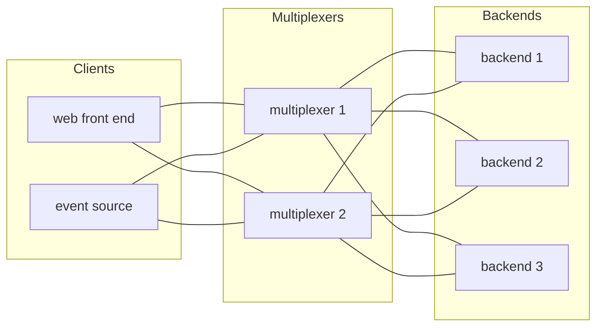

# Overview

## What it is

The multiplexer is a lightweight, highly available message broker for
services on a trusted internal network. Each service connects to it over
TCP, announces its peer type, and from then on sends and receives messages.
The multiplexer routes every message by its type according to a declarative
rules file: round-robin load balancing across a pool, fan-out to every
subscriber, or a direct address. It holds no state: a message is delivered
to the peers connected at that moment, or it is dropped. Several
multiplexers run active-active, and every peer connects to all of them, so
there is no single point of failure and failover is automatic.

That covers the two interaction patterns services need: request/reply against
a pool of interchangeable workers, and publish/subscribe for events.

## The words

- **Multiplexer**: the broker process, started with `mxcontrol run_multiplexer`.
  Several usually run at once, independent of each other; they do not talk to
  each other. "mx" is the short form you will see in code and command names.
- **Peer**: any program connected to a multiplexer. Every backend and every
  client is a peer.
- **Backend**: a peer that hands control to the library. The library runs the
  backend's loop, and calls it whenever a message arrives; the backend does
  its work and, for a request, sends the answer. Whether it answers or only
  acts is up to it.
- **Client**: a peer that keeps control and calls the library only when it
  has something to send: a request, which expects exactly one answer, or an
  event, which expects nothing. A client built on the synchronous `Client`
  does not run the loop between calls, so its peer type is marked
  `is_passive` in the rules file and the multiplexer does not expect a
  heartbeat from it. A `ThreadedClient` runs the loop on a thread of its own
  and needs no such mark.
- **Peer type**: what kind of program a peer is, chosen from the rules file
  when it connects. Backends of one type are interchangeable; routing is by
  peer type.
- **Instance id**: a random 64-bit number each peer picks for itself when it
  starts, so that a message can be addressed to exactly that peer.
- **Message**: a typed envelope with a byte payload. The payload is yours; the
  multiplexer never looks inside it.
- **Message type** and **rules file**: every message has a type, and the rules
  file says for each type which peer type receives it and whether one backend
  of that type (`whom: ANY`, round robin) or all of them (`whom: ALL`) do.
- **Request** and **event**: the two things a client sends. A request is
  answered by the backend that received it; an event is not answered.

## The healthy deployment

Every client and every backend is connected to every multiplexer. Any one
multiplexer can go away and nothing stops; any one backend can go away and
requests move to the others.

## What it promises, and what it does not

- A message reaches a connected peer of the right type, or is dropped. There
  is no queue for peers that are not there and no persistence across restarts.
- A request either gets its answer or the call fails with a timeout or a
  delivery error, so the caller always knows.
- Delivery is at most once per multiplexer; sending through several
  multiplexers can produce copies, which the receiving library drops by
  message id.
- There is no authentication. Anyone who can reach the port is a peer. Put the
  port behind the network.
- Payloads are opaque bytes. Most peers use protocol buffers, but that is
  their choice.

## How to use it

1. **Write a rules file.** Start from `multiplexer.rules` at the root: keep the
   entries below 100, which the protocol itself needs, and add your own peer
   types and message types with their routing. [The rules file](rules.md)
   describes the format.
2. **Run one or more multiplexers**, each with that rules file:
   `mxcontrol run_multiplexer --address 0.0.0.0:1980 --rules your.rules`
   (see [mxcontrol](mxcontrol.md)).
3. **Write a backend.** Subclass `BaseMultiplexerServer`, implement
   `handle_message`, reply with `send_message` when the message is a request,
   and call `serve_forever()`. Python and C++ versions of a complete one are in
   [examples/echo](../examples/echo).
4. **Write a client.** Create a `Client` with the addresses of all your
   multiplexers and call `query()` for requests or `send_message()` for events.
5. **Build against it** from your own Bazel workspace as `@mx`, with the two
   lines described in [examples/README.md](../examples/README.md), and point
   the build at your rules file with `--@mx//:multiplexer_rules=`.

## Start here

- [Walkthrough: the echo example](walkthrough.md): run a multiplexer, a
  backend and a client, and read what they print.

## How it works, step by step

Each page is one fixed picture whose arrows light up one step at a time.

- [How a query is answered](query.md): the normal round trip, recovery when a
  backend fails mid-request, and what happens when no backend exists.
- [Sending an event](events.md): through one connection, or through all of them.
- [How the multiplexer routes a message](routing.md): `whom: ALL`, `whom: ANY`,
  direct addressing, delivery errors.
- [Connecting to a multiplexer](handshake.md): the welcome handshake, the
  heartbeats that keep connections alive, and reconnecting after a restart.

## Reference

- [The rules file](rules.md): peer types, message types, routing rules, the
  reserved ranges, pointing a build at your file.
- [Using the Python library](api_python.md) and
  [using the C++ library](api_cpp.md): `Client`, `ThreadedClient`,
  `AsyncClient` for asyncio, and `BaseMultiplexerServer`, every call and
  every exception; the Python page also covers
  [testing](api_python.md#testing) with `multiplexer.testing` and reading a
  recording.
- [mxcontrol](mxcontrol.md): running a multiplexer, the log tools, dumping
  and driving a recording.
- [The wire format](wire_format.md): frames, the envelope, the handshake and
  the protocol's own messages, for peers written without the library.
- [Guarantees, failure modes and defaults](guarantees.md): what is promised,
  what happens when things die, and every timeout and limit in one table.
- [Building](building.md): the packages a clean machine needs, bringing
  your own protobuf, the build configurations, the Docker check, and the
  build without Bazel.
- [Operations](operations.md): several multiplexers, restarts, logs, the
  peers file, recording what was routed and driving it on a running
  cluster, sizing.
- [Questions people ask](faq.md): why it is built this way.
- [Code map](code_map.md): one line per source file and where each
  mechanism lives, generated from the files' header comments.

## Recipes

- [Add a peer type or a message type](recipes/add_a_message_type.md)
- [Use the client from an async web server](recipes/async_web_server.md):
  `AsyncClient` under Django Channels, one per worker, pushing to sockets,
  backpressure.
- [Use the client from a threaded web server](recipes/web_server.md): one
  `ThreadedClient` per process, request threads, events without a receiver thread, fork and exit.
- [Add an integration test scenario](recipes/add_a_scenario.md)
- [Add an mxcontrol subcommand](recipes/add_an_mxcontrol_subcommand.md)
- [Change a timeout or a limit](recipes/change_a_default.md)

Elsewhere: [tests/README.md](../tests/README.md) for the integration test
harness and [tests/scenarios/README.md](../tests/scenarios/README.md) for
every scenario with a picture of what it does, [examples/README.md](../examples/README.md) for consuming the
multiplexer from another workspace, [AGENTS.md](../AGENTS.md) for the
conventions contributors and coding agents follow.

## Editing the diagrams

The step-by-step pages are generated. Edit
[diagrams/generate.py](diagrams/generate.py), which holds each picture's
boxes, arrows and steps once, then run it; `./format.sh` runs it too, and
`./format.sh --check` fails when a page is stale. Preview in VS Code with
`Ctrl+Shift+V`; from 1.121 on, Mermaid renders in the built-in preview.
