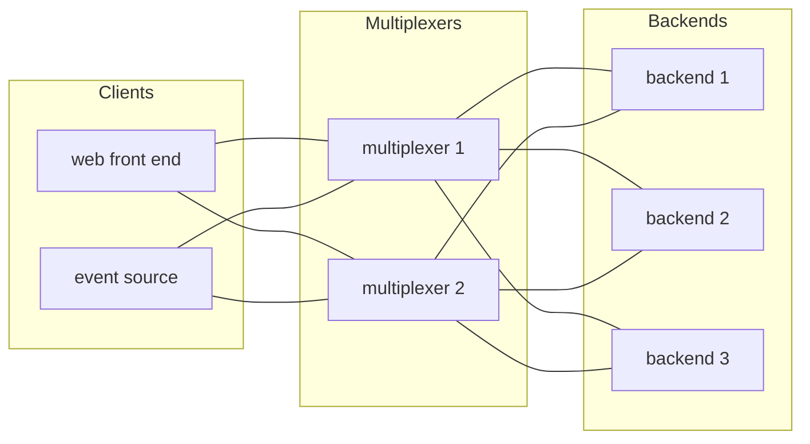

# Overview

## What it is

The multiplexer is a lightweight, highly available message broker for
services on a trusted network: a TCP message broker for service-to-service
messaging, not a socket multiplexer and not a WebSocket server. Each service connects to it over TCP, announces its peer type, and
from then on sends and receives messages. Web servers are one kind of
service; their HTTP and WebSocket connections with browsers are their own,
never the multiplexer's.
The multiplexer routes every message by its type according to a declarative
rules file: round-robin load balancing across a pool, fan-out to every
subscriber, or a direct address. It holds no state: a message is delivered
to the peers connected at that moment, or it is dropped. Several
multiplexers run active-active, and every peer connects to all of them, so
there is no single point of failure and failover is automatic.

That covers the two interaction patterns services need: request/reply against
a pool of interchangeable workers, and publish/subscribe for events.

## The words

- **Multiplexer**: the broker process, started with `mxcontrol run_multiplexer`.
  Several usually run at once, independent of each other; they do not talk to
  each other. "mx" is the short form you will see in code and command names.
- **Peer**: any program connected to a multiplexer. Every backend and every
  client is a peer.
- **Backend**: a peer that receives requests or events and acts on them,
  answering each request. A backend that only receives events answers
  nothing. It is a role, not a class: a backend can be built on
  `BaseMultiplexerServer`, `BaseThreadedMultiplexerServer`,
  `ThreadedClient`, `AsyncClient`, or in a pinch `SyncClient`.
- **Client**: a peer that sends requests or events: a request expects
  exactly one answer, an event expects nothing. A client built on
  `SyncClient` does not run the loop between calls, so its peer type is
  marked `is_passive` in the rules file and the multiplexer does not expect
  a heartbeat from it. That is the only class that needs the mark:
  `ThreadedClient`, `AsyncClient` and the two server classes run the loop
  all the time.
- **Class names**: five classes connect a program to the multiplexers.
  `SyncClient` (named `Client` before 2.4.0; both names work),
  `ThreadedClient` and `AsyncClient` give you calls and hand you what
  arrives; `BaseMultiplexerServer` and `BaseThreadedMultiplexerServer`,
  the server classes, run a `serve_forever()` loop that calls your
  `handle_message()`. "Client" in a class name is part of the name, not
  the role, and "server" names no role here: which class a program is
  built on says nothing about what it does.
- **Peer type**: what kind of program a peer is, chosen from the rules file
  when it connects. Backends of one type are interchangeable; routing is by
  peer type.
- **Instance id**: a random 64-bit number each peer picks for itself when it
  starts, so that a message can be addressed to exactly that peer.
- **Message**: a typed envelope with a byte payload. The payload is yours; the
  multiplexer never looks inside it.
- **Message type** and **rules file**: every message has a type, and the rules
  file says for each type which peer type receives it and whether one backend
  of that type (`whom: ANY`, round robin) or all of them (`whom: ALL`) do.
- **Request** and **event**: the two things a client sends. A request is
  answered by the backend that received it; an event is not answered.

## Which class to build on

A program that serves requests by type must answer the search that
typed requests are routed by. Both server classes do; so does a
`ThreadedClient` given a search policy (`search_policy` in Python,
`set_search_policy` in C++), which is how the Python
`BaseThreadedMultiplexerServer` is built. A backend that answers only
requests addressed to its instance id needs no search policy and can be
built on `ThreadedClient` or `AsyncClient`: a service reachable by `to`
after an introduction. Otherwise which class is a matter of how the
program is shaped.

Between the server classes: `BaseMultiplexerServer` when every handler is
quick and requests are handled one at a time, the simplest class and the
usual one; `BaseThreadedMultiplexerServer` when a request may run longer
than the multiplexer's drop interval (90 s as shipped), when several
must be handled at once, or when a handler blocks on a query of its own.
Among the other three: `SyncClient` for a program with one thread and no
event loop, the only class whose peer type needs `is_passive`;
`ThreadedClient` for a threaded server or anything with more than one
thread, a backend included; `AsyncClient` for asyncio.

| | `BaseMultiplexerServer` | `BaseThreadedMultiplexerServer` | `ThreadedClient` | `AsyncClient` | `SyncClient` |
|---|---|---|---|---|---|
| who runs the loop | the library, on the calling thread, in `serve_forever()` | the library, on its io thread; handlers on workers | the library, on its io thread | the library, on the asyncio loop | nobody between calls |
| found by typed requests | yes: answers the backend search | yes | with a search policy (`search_policy`, `set_search_policy`); otherwise only a search addressed to it | no | no |
| receives | requests routed by type, events, addressed messages | the same | requests and events routed to its type, addressed messages | the same, as handlers or streams | what `receive_message()` returns; while a query waits, everything but its reply is dropped |
| handles | `handle_message()`, one at a time, reply by default | `handle_message(request)`, `workers` at a time, reply through the request | `on_message`, must return quickly | `subscribe()` handlers, `messages()` streams | nothing by itself: a loop of your own calls `receive_message()` |
| a handler may block | no: nothing heartbeats meanwhile | yes, for as long as it needs | no: it runs on the io thread | no: it runs on the loop | |
| sends | replies, and anything from `periodic_task()` | replies from any thread, events from any thread | queries and events from any thread | awaited | queries and events from its thread |
| peer type | not passive | not passive | not passive | not passive | `is_passive` |
| leaves | drain, then `serve_forever()` returns | the same, the queue finished first | `shutdown()` | `aclose()` | `shutdown()` |

A backend on `SyncClient` is possible in a pinch: a loop of its own calls
`receive_message()` and answers each request with `send_message(reply,
type=..., to=request.from_, references=request.id)`. On its own it
answers neither the backend search nor a `PING`, so a typed request
reaches it only through the rules, at a query's first attempt or that
attempt sent again after a lost connection, never through the search that
follows a delivery error or a timeout, and an addressed query's probe
never finds it. A backend that typed requests must find belongs on a
server class or on a `ThreadedClient` given a search policy, and one
reached only by `to` can be built on any of the other four.

[Using the Python library](api_python.md) and [the C++ library](api_cpp.md)
describe each.

## The healthy deployment

Every client and every backend is connected to every multiplexer. Any one
multiplexer can go away and nothing stops; any one backend can go away and
requests move to the others. Every page here assumes this deployment: two
multiplexers at least. One multiplexer works, for development or a small
installation, but its restart is visible to whoever has a request in
flight; [semantics](semantics.md) says how.

```mermaid
graph LR
  subgraph c [Clients]
    C1[web front end]
    C2[event source]
  end
  subgraph m [Multiplexers]
    M1[multiplexer 1]
    M2[multiplexer 2]
  end
  subgraph b [Backends]
    B1[backend 1]
    B2[backend 2]
    L1[backend 3]
  end
  C1 --- M1
  C1 --- M2
  C2 --- M1
  C2 --- M2
  M1 --- B1
  M1 --- B2
  M1 --- L1
  M2 --- B1
  M2 --- B2
  M2 --- L1
```

## What it promises, and what it does not

- A message reaches a connected peer of the right type, or is dropped. There
  is no queue for peers that are not there and no persistence across restarts.
- A request either gets its answer or the call fails with a timeout or a
  delivery error, so the caller always knows. A request addressed to one
  instance reaches that instance or fails; it never goes to another.
- Order holds per connection; a lane keeps a stream on one connection.
- Delivery is at most once per multiplexer; sending through several
  multiplexers can produce copies, which the receiving library drops by
  message id.
- There is no authentication. Anyone who can reach the port is a peer. Put the
  port behind the network.
- Payloads are opaque bytes. Most peers use protocol buffers, but that is
  their choice.

## How to use it

1. **Write a rules file.** `mxcontrol generate_rules your.rules` writes the
   system rules, which every rules file starts from; add your own peer types
   and message types after them, with their routing. `pip install
   mx-multiplexer` installs the `mxcontrol` command; every release carries
   one too ([packaging](packaging.md)). [The rules file](rules.md)
   describes the format.
2. **Run one or more multiplexers**, each with that rules file:
   `mxcontrol run_multiplexer --address 0.0.0.0:1980 --rules your.rules`
   (see [mxcontrol](mxcontrol.md)).
3. **Write a backend**, here on `BaseMultiplexerServer`: subclass it,
   implement `handle_message`, reply with `send_message` when the message is
   a request, and call `serve_forever()`. Python and C++ versions of a complete one are in
   [examples/echo](../examples/echo).
4. **Write a client.** Create a `SyncClient` with the addresses of all your
   multiplexers and call `query()` for requests or `send_message()` for events.
5. **Build against it** from your own Bazel workspace as `@mx`, with the two
   lines described in [examples/README.md](../examples/README.md), and point
   the build at your rules file with `--@mx//:multiplexer_rules=`; or install
   a release, `pip install mx-multiplexer` or the Debian package, and write
   the constants of your rules file with `mxcontrol generate_constants`
   ([packaging](packaging.md)).

## Start here

- [Running the echo example, step by step](../examples/echo/walkthrough.md): run a multiplexer, a
  backend and a client, and read what they print.
- [Building the chat gateway, step by step](../examples/aio/walkthrough.md):
  an asyncio TCP server on one `AsyncClient`, a line awaited as a query
  and a broadcast delivered to every client, the piece the channel layer
  and the audio room rest on.
- [Building the cache, step by step](../examples/cache/walkthrough.md):
  a replicated cache as a Django cache backend, the smallest program
  that uses both routing modes, every line explained as it is added,
  and a journal added by changing the rules under running multiplexers;
  with the measured steps and a walk through testing a backend on the
  harness.
- [Building the channel layer, step by step](../examples/channels/walkthrough.md):
  a Django Channels channel layer on the multiplexer, Redis replaced by
  one setting, with the tutorial's chat on it;
  with the steps and the test.
- [Walkthrough: a web app and a pool of model workers](../examples/inference/walkthrough.ipynb):
  a notebook that builds the inference example up step by step, from
  `pip install` to a rolling restart of the workers under load.
- [Building the streaming answers, step by step](../examples/stream/walkthrough.md):
  an answer that arrives token by token, the request's follow-ups
  addressed and numbered and its one reply at the end, through a pinned
  lane so that they arrive in order and sent again to the same generator
  when its multiplexer dies, with a multiplexer and a generator killed
  under an answer and a rolling restart; with the measured steps and the
  test.
- [Building the audio room, step by step](../examples/audio/walkthrough.md):
  live audio through a C++ worker, every 10 ms frame a query answered in
  a fifth of a millisecond and heard by everyone in the room, the worker
  killed and rolled under the stream;
  with the measured steps and the test.

## How it works, step by step

Each page is one fixed picture whose arrows light up one step at a time.

- [How a query is answered](query.md): the normal round trip, recovery when a
  backend fails mid-request, and what happens when no backend exists.
- [Sending an event](events.md): through one connection, or through all of them.
- [How the multiplexer routes a message](routing.md): `whom: ALL`, `whom: ANY`,
  direct addressing, delivery errors.
- [Connecting to a multiplexer](handshake.md): the welcome handshake, the
  heartbeats that keep connections alive, and reconnecting after a restart.
- [How a backend leaves](leaving.md): a drain then the close, a stop without
  a drain, a kill, and what each costs the callers.

## Reference

- [The rules file](rules.md): peer types, message types, routing rules, the
  reserved ranges, pointing a build at your file.
- [Using the Python library](api_python.md) and
  [using the C++ library](api_cpp.md): `SyncClient`, `ThreadedClient`,
  `AsyncClient` for asyncio, and `BaseMultiplexerServer`, every call and
  every exception; the Python page also covers
  [testing](api_python.md#testing) with `multiplexer.testing` and reading a
  recording.
- [mxcontrol](mxcontrol.md): running a multiplexer, the log tools, dumping
  and driving a recording.
- [The wire format](wire_format.md): frames, the envelope, the handshake and
  the protocol's own messages, for peers written without the library.
- [Semantics: delivery, failures and defaults](semantics.md): what is promised,
  what happens when things die, and every timeout and limit in one table.
- [Building](building.md): the packages a clean machine needs, bringing
  your own protobuf, the build configurations, the Docker check, and the
  build without Bazel.
- [Packaging](packaging.md): what a release ships, the static mxcontrol,
  the container image, the Debian packages, the wheels, and how a release
  is cut.
- [Operations](operations.md): several multiplexers, on Kubernetes,
  restarts, logs, the peers file, recording what was routed and driving
  it on a running cluster, sizing.
- [Questions people ask](faq.md): why it is built this way.
- [Code map](code_map.md): one line per source file and where each
  mechanism lives, generated from the files' header comments.

## Recipes

- [Add a peer type or a message type](recipes/add_a_message_type.md)
- [Use the client from an async web server](recipes/async_web_server.md):
  `AsyncClient` under Django Channels, one per worker, pushing to sockets,
  backpressure.
- [Use the client from a threaded web server](recipes/web_server.md): one
  `ThreadedClient` per process, request threads, events without a receiver thread, fork and exit.
- [Add an integration test scenario](recipes/add_a_scenario.md)
- [Add an mxcontrol subcommand](recipes/add_an_mxcontrol_subcommand.md)
- [Change a timeout or a limit](recipes/change_a_default.md)

Elsewhere: [tests/README.md](../tests/README.md) for the integration test
harness and [tests/scenarios/README.md](../tests/scenarios/README.md) for
every scenario with a picture of what it does, [examples/README.md](../examples/README.md) for consuming the
multiplexer from another workspace, [AGENTS.md](../AGENTS.md) for the
conventions contributors and coding agents follow.

## Editing the diagrams

The step-by-step pages are generated. Edit
[diagrams/generate.py](diagrams/generate.py), which holds each picture's
boxes, arrows and steps once, then run it; `./format.sh` runs it too, and
`./format.sh --check` fails when a page is stale. Preview in VS Code with
`Ctrl+Shift+V`; from 1.121 on, Mermaid renders in the built-in preview.
