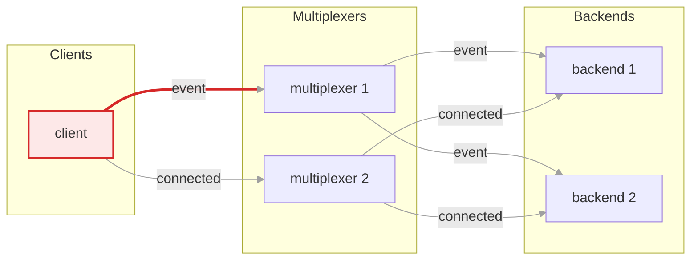
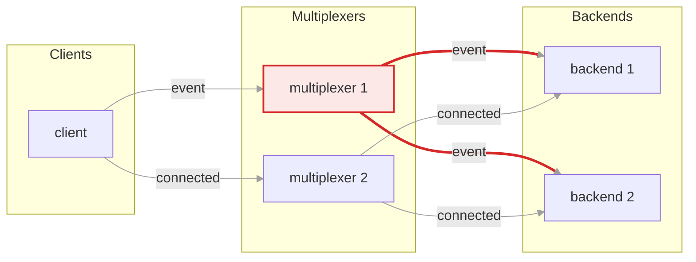
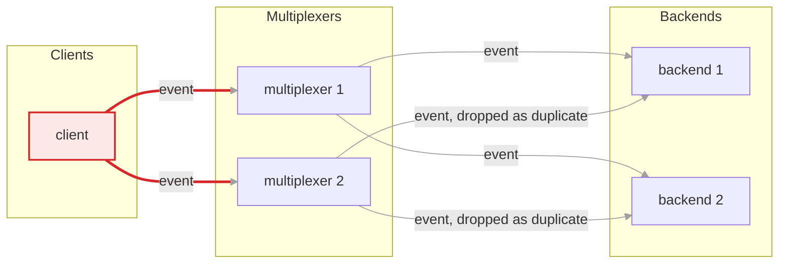
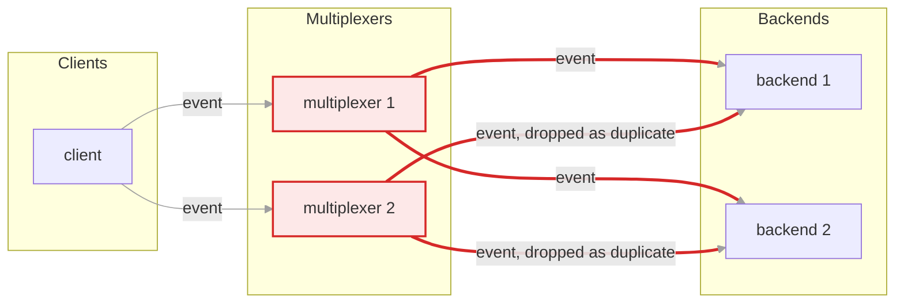

# Sending an event

An event is a message nobody answers: `send_message()` in Python, `schedule_one()`
or `schedule_all()` in C++. The client chooses how many of its multiplexer
connections carry the message; each multiplexer then delivers it to the
backends its rules name. Nothing comes back unless the client sets
`report_delivery_error` and delivery fails.

The pictures use the healthy deployment: one client and two backends, all of
them connected to both multiplexers. The rule for the event type says
`whom: ALL`, so every backend of that type gets every event.

## Through one connection

The default, `multiplexer=ONE` in Python and `schedule_one()` in C++, and the
normal way to send an event. One connection is chosen round robin among the
live ones.

### 1. The client picks one connection

The message is queued on one connection, multiplexer 1 this time, and the call returns. With `flush=True` it waits until the bytes are handed to the socket; there is no acknowledgement either way.

### 2. That multiplexer delivers to every backend of the type

Multiplexer 1 applies the rule: `whom: ALL`, so every backend of the type connected to it gets a copy. Since every backend is connected to every multiplexer, one connection is enough to reach them all.

## Through every connection

`multiplexer=ALL` in Python, also available as `Client.event()`, and
`schedule_all()` in C++. The same message goes out on each connection. Use it
when the event must get through even if a multiplexer is unreachable from some
backends; it costs one copy per multiplexer on every link.

### 1. One copy per connection

The client queues the message on every live connection. The call returns how many connections took it; `flush=True` is not supported in this mode.

### 2. Each multiplexer delivers, and duplicates are dropped

Both multiplexers apply the rule, so each backend is sent two copies. The receiving library remembers the ids of the last 2048 messages it saw and silently drops the second copy, so the backend's code sees the event once.

With a `whom: ANY` rule each multiplexer would pick one backend instead of all
of them; see [routing](routing.md). Where this lives: `Client.send_message` and
`Client.event` in `multiplexer/mxclient.py`, `schedule_one` and `schedule_all`
in `multiplexer/client.h`, duplicate suppression in
`BasicClient::handle_message` in `multiplexer/basic_client.cc`. Scenarios
`event_all_backends.py` and `any_vs_all.py` under `tests/scenarios/` cover
the fan-out.

<!-- generated by docs/diagrams/generate.py; edit that file, not this one -->
