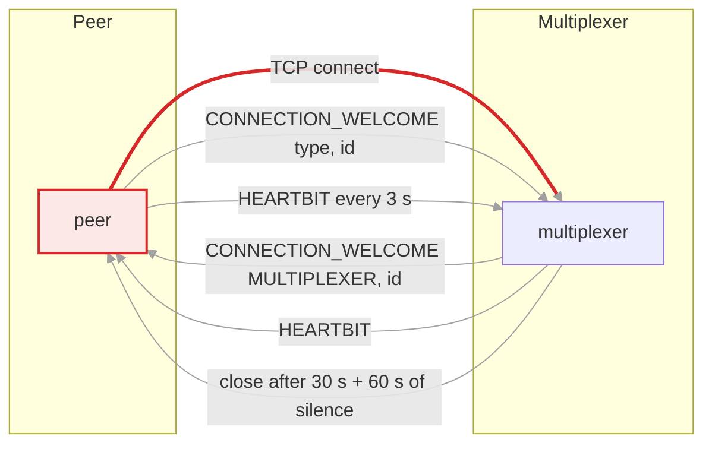
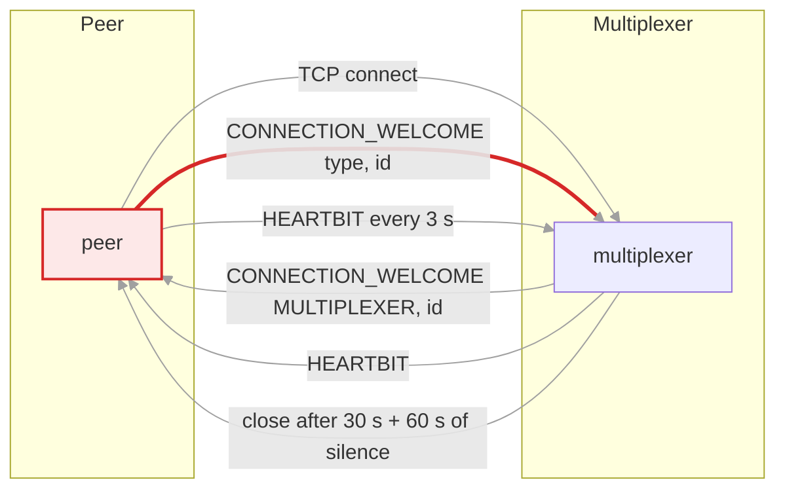
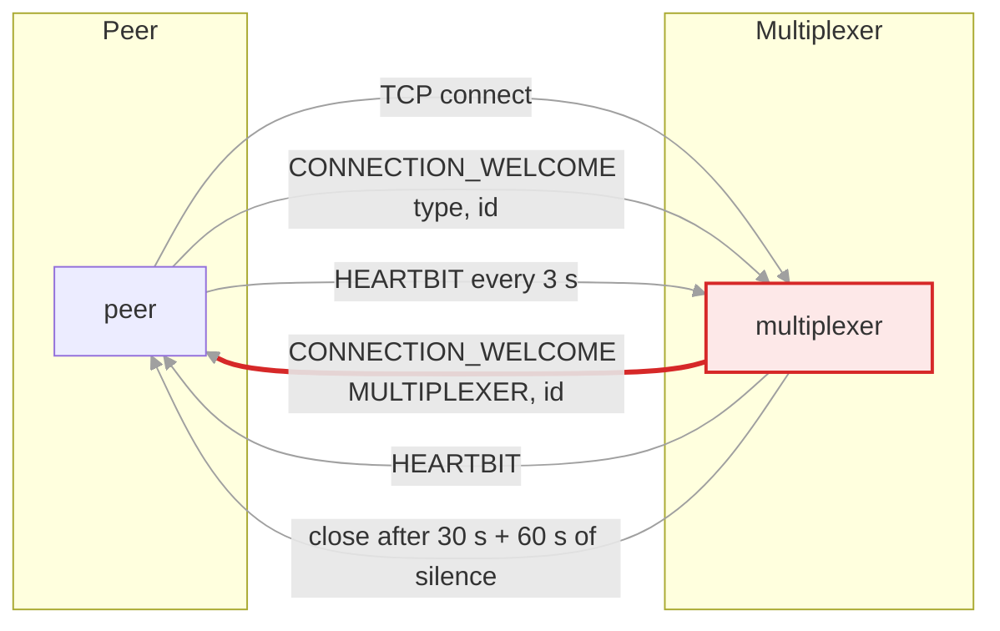
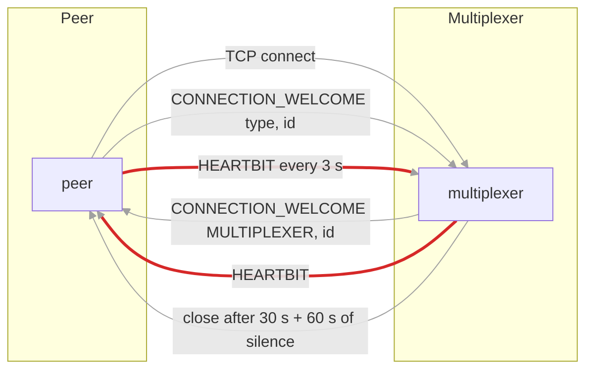
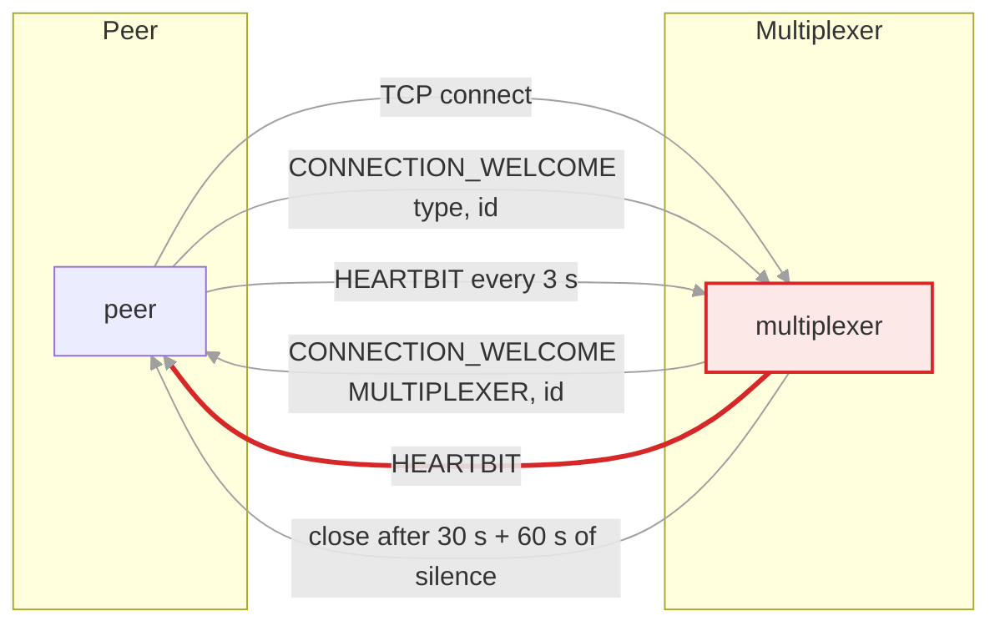
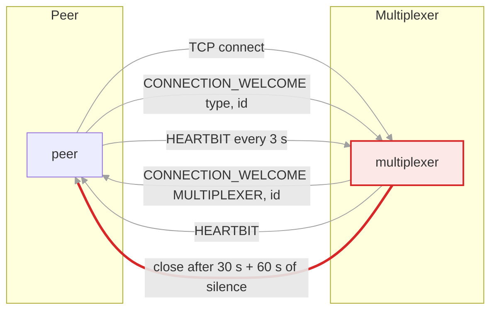
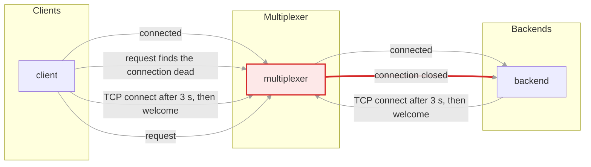
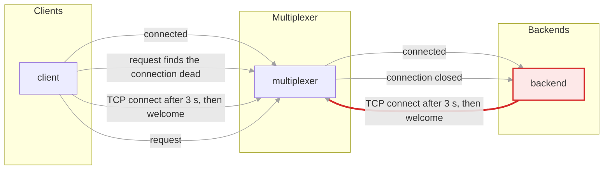
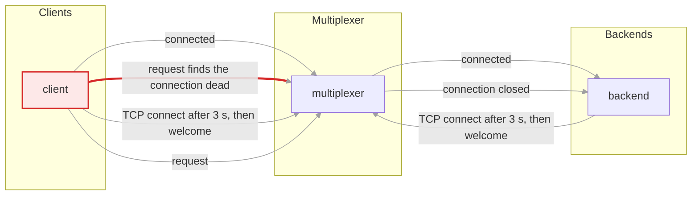
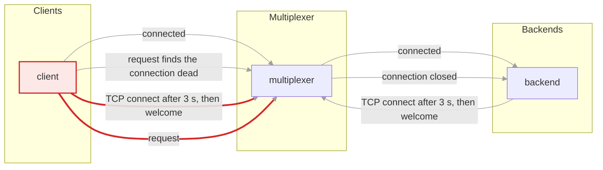

# Connecting to a multiplexer

A peer opens a TCP connection and both sides exchange one `CONNECTION_WELCOME`
message before anything else. The peer speaks first; the multiplexer registers
it and only then answers. After that, heartbeats keep the connection alive.

There are two kinds of peer. A backend hands control to the library, which
runs its loop all the time, so its heartbeats flow on their own; so does a
`ThreadedClient`, whose io thread does the same. A synchronous `Client` only
runs the loop inside calls, so its peer type is declared `is_passive` in the
rules file and the multiplexer neither expects heartbeats from it nor drops it
for silence.

## Handshake and heartbeats

### 1. Connect

The peer opens the socket. Nothing it sends before its welcome is routed; a message before the handshake gets the connection closed.

### 2. The peer introduces itself

A `WelcomeMessage` carries the peer's type, which must exist in the multiplexer's rules file, and its instance id, a random 64-bit number the peer chose. The multiplexer registers the connection under both.

### 3. The multiplexer answers

Only now does the multiplexer send its own welcome, with type `MULTIPLEXER` and its instance id. From here on messages flow in both directions.

### 4. Heartbeats, backends

Each side sends `HEARTBIT` every 3 s and expects some message within 30 s, then grants 60 s more. Any message resets that clock. A backend sits in the loop, so this just works.

### 5. Heartbeats, clients

A client sends no heartbeats between calls. The multiplexer does not require any from it and sends it at most one heartbeat per message received, so an idle client is neither dropped nor flooded.

### 6. Silence from a backend

If a backend stops talking, the multiplexer closes the connection after the two intervals. The backend's library reconnects 3 s after noticing.

## Reconnecting after a multiplexer restart

Every peer's library remembers the address it was told to connect to and
reconnects on its own when the connection goes away. A backend, which runs
the loop all the time, does this within a few seconds. A client does it the
next time it calls the library. The picture has one backend, one client and
one multiplexer that is restarted.

### 1. The multiplexer goes down

Both peers lose their connection. The backend's loop notices at once, because its read fails. The client notices nothing yet: it is not in the loop.

### 2. The backend reconnects

The backend's library waits 3 s, connects to the same address again and repeats the handshake. If the multiplexer is still down it tries again every 3 s. Once it is back, the backend is registered as if nothing had happened, under the same instance id.

### 3. The client's next call finds the connection dead

The client's library learns about the closed connection only when it next runs the loop, inside a call. The request it just wrote is lost with the connection; the call does not fail, it keeps running the loop.

### 4. The same call reconnects and sends again

The reconnect timer fires 3 s later, inside the call, the handshake runs, and the request goes out again with a fresh id. The caller sees a slow call, not an error, as long as the multiplexer is back within the call's timeout. With connections to several multiplexers the request goes through another one at once instead.

Where this lives: `multiplexer/io/connection.h` for the welcome exchange and
the heartbeat timers, `multiplexer/connections_manager.h` for registration,
`multiplexer/basic_client.cc` for the reconnect timer, `multiplexer/defaults.h`
for the intervals. The `raw_protocol` scenario in `tests/scenarios/` performs
the handshake byte by byte; the `mx_restarts` and `mx_restarts_under_idle_client`
scenarios record what a backend and a client see across a restart.

<!-- generated by docs/diagrams/generate.py; edit that file, not this one -->
