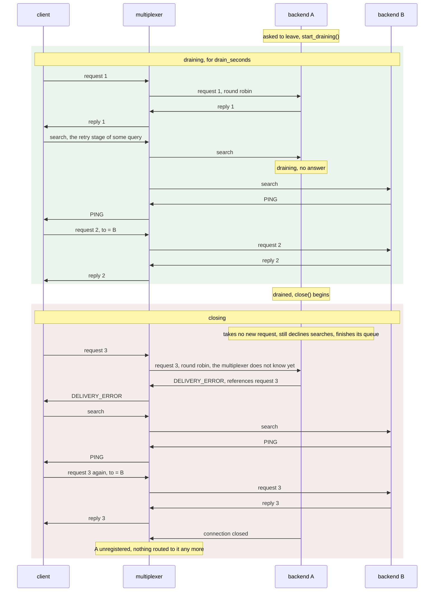
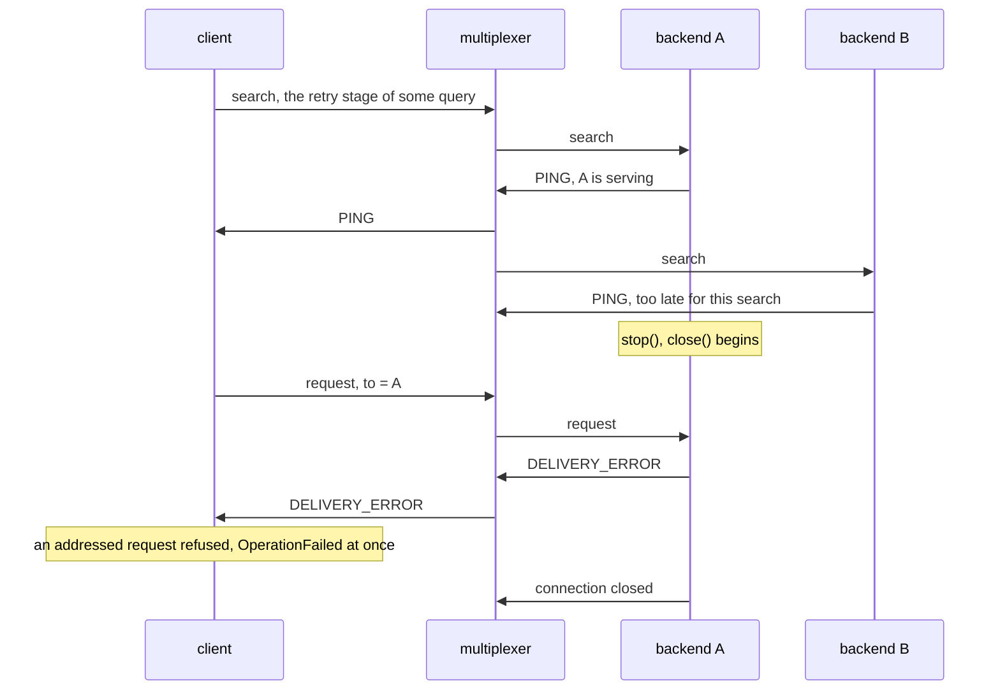
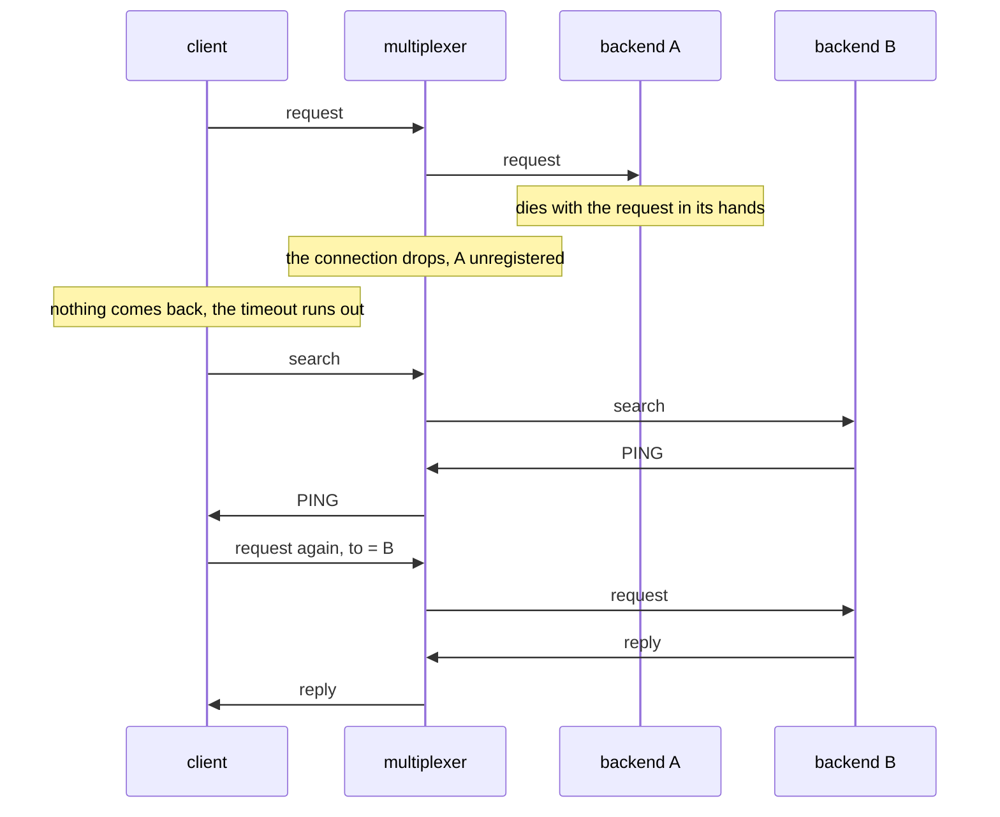

# How a backend leaves

A backend goes through three phases on its way out: serving, draining and
closing. Two kinds of message reach it in every phase: the requests the
multiplexer routes to it, round robin among the backends of its type, and
the searches clients send when a first attempt failed and they are looking
for a backend to retry with. What the backend does with each decides what
its leaving costs the callers.

| Phase | Requests the multiplexer routes to it | Searches | Ends when |
| --- | --- | --- | --- |
| serving | served | answered with a `PING` | `start_draining()`, `stop()`, or death |
| draining, after `start_draining()` | served | declined, so no retry lands here | `drained()`, by default `drain_seconds` later |
| closing, inside `close()` | refused at once with `DELIVERY_ERROR`, so the caller retries elsewhere now | declined | the queue is finished and the connections are closed |

The multiplexer keeps routing to a backend until it sees the connection go,
so a backend cannot stop the requests from coming; it can only choose
between serving, refusing and dropping them. Draining serves them, closing
refuses them, and dying drops them, which is one timeout each for the
callers.

## A drain, then the close: a rolling restart

The deployment asks the backend to leave, a preStop hook writing a file
that `periodic_task()` watches, for instance. The backend drains for
`drain_seconds`, then `serve_forever()` returns and `close()` runs. Backend
B is another instance of the same type.

Request 1 arrived during the drain and was served. The search for request
2 was declined by A and answered by B, so the retry went to B; a drain
exists for this, since a retry that lands on a backend about to leave would
fail a second time. Request 3 arrived after A had stopped taking work, in
the instant before the multiplexer saw the connection go; A refused it with
the delivery error a multiplexer sends when nobody could take a message,
and the client, which treats a delivery error on its first attempt as the
signal to search, had B's answer a few milliseconds later. No caller waited
for a timeout. The inference walkthrough measures exactly this, three
hundred requests through a rolling restart of two workers.

## `stop()` without a drain

A backend told to stop, or destroyed, closes without draining. `close()`
declines searches from its first moment and refuses what still arrives, so
the requests the multiplexer routes to it during the close are retried at
once, as request 3 above. What a drain would have avoided is the client
whose search the backend answered just before it began closing:

The client addressed its retry to the instance that answered, so a delivery
error for it means that instance is gone, and the query fails with
`OperationFailed` rather than being sent to B. That is still better than
before, when the request was dropped and the query timed out, but it is a
failure the application has to retry. A drain first, for longer than the
moment between a `PING` and the request that follows it, a fraction of a
second, makes it impossible: no client holds a fresh `PING` from a backend
that has declined searches for the whole drain.

## Killed

A backend that dies, `kill -9`, a machine lost, takes the requests it holds
with it. Nothing tells the client; it waits out its timeout, searches, and
asks the backend it finds. [How a query is answered](query.md) draws the
same recovery.

One timeout per request the backend held, plus the round trip of the retry.
The timeout is the caller's own choice, so a caller that sets it to the
slowest acceptable answer pays no more than it would have accepted anyway.

## What stays

- A message the multiplexer had already written into the socket when the
  backend closed it is lost, and its caller pays a timeout as if the
  backend had died. That window is the time between the backend's last read
  and the multiplexer noticing the close: microseconds on one host, a
  network round trip between hosts.
- `BaseMultiplexerServer`, the plain backend that runs its handler on the
  loop's thread, has the drain but not the refusal: what arrives after its
  last read is lost the same way. `BaseThreadedMultiplexerServer` refuses
  because its io thread keeps reading while the workers finish.
- A backend must tolerate a request twice, or make its work idempotent:
  every attempt is a new message with a new id, and a request the backend
  answered just before dying may be asked again of another one.

## When to use which

- A deploy, a scale-down, a node drain: ask the backend to drain, with
  `drain_seconds` shorter than the grace period, so that `close()` runs
  before the kill. Callers pay at most one extra round trip.
- A process that must end now: `stop()`. Requests that reach it while it
  closes are retried at once; a client that had just found it pays an
  `OperationFailed`. Even a drain of a fraction of a second before the
  `stop()` removes that.
- A kill: one timeout per request the backend held. Set the timeout to what
  you would accept anyway, and let the client's search do the rest.

Where the pieces live: `start_draining()`, `drained()` and
`should_respond_to_backend_for_packet_search()` in
[threaded_server.py](../multiplexer/threaded_server.py) and
[base_threaded_multiplexer_server.h](../multiplexer/backend/base_threaded_multiplexer_server.h),
the refusal in their `_on_message()`, and the client's stages in
[How a query is answered](query.md). `dropped` counts the refusals, and
the backend logs each at DEBUG verbosity LOW as "refused: leaving".
