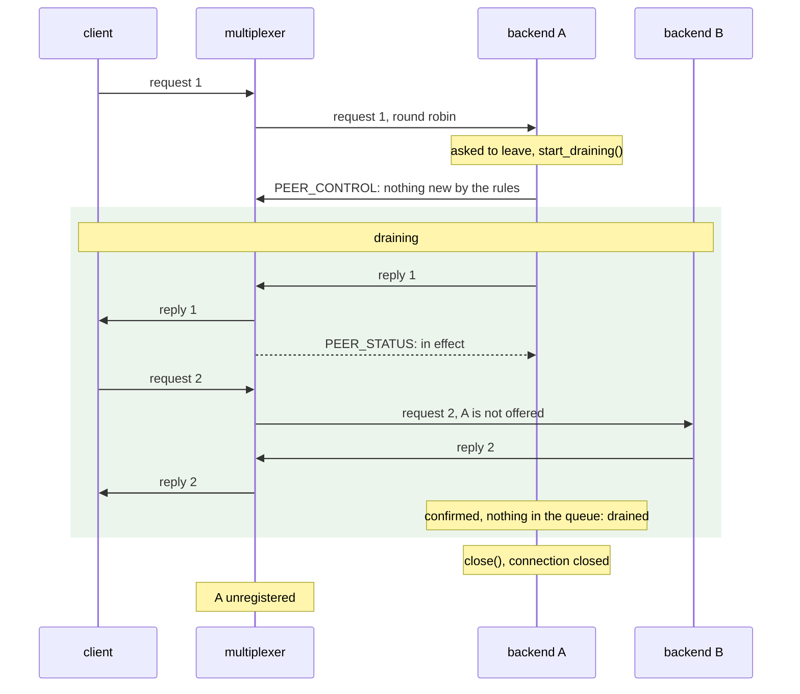
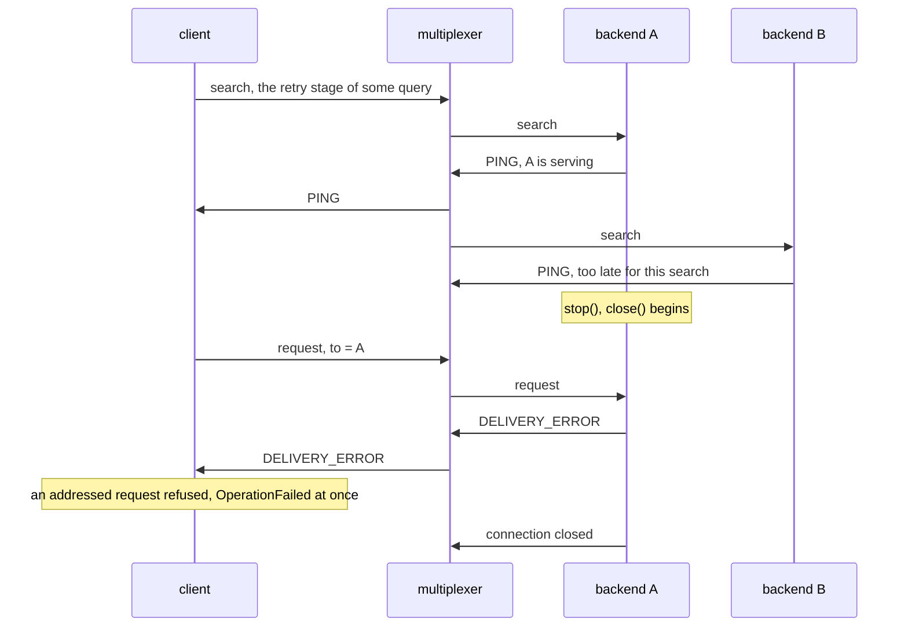
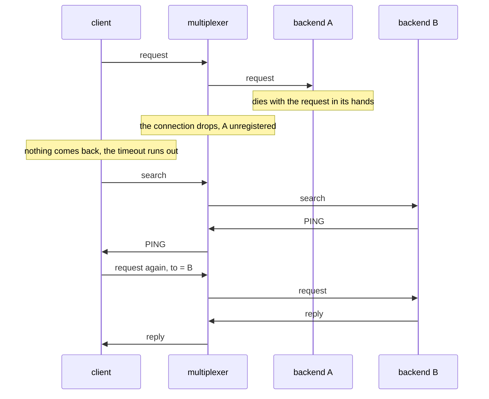

# How a backend leaves

A backend goes through three phases on its way out: serving, draining and
closing. Two kinds of message reach it while it serves: the requests the
multiplexer routes to it, round robin among the backends of its type, and
the searches clients send when a first attempt failed and they are looking
for a backend to retry with. What happens to each in the other two phases
decides what the leaving costs the callers.

| Phase | Requests the multiplexer routes to it | Searches | Ends when |
| --- | --- | --- | --- |
| serving | served | answered with a `PING` | `start_draining()`, `stop()`, or death |
| draining, after `start_draining()` | none new: the backend told every multiplexer to route it nothing by the rules, and serves what was already on its way | none: the multiplexers no longer offer it | `drained()`: every multiplexer confirmed and the work is done, or `drain_seconds` at the latest |
| closing, inside `close()` | the few routed before a multiplexer applied that, refused at once with `DELIVERY_ERROR`, so the caller retries elsewhere now | none | the queue is finished and the connections are closed |

A multiplexer routes to a backend until the backend tells it otherwise or
the connection goes. The telling is a `Routing` (Multiplexer.proto) in the
backend's welcome and in `PEER_CONTROL`: whether rules with `whom: ANY`
reach it, whether rules with `whom: ALL` do, and whether it is a last
resort for what it turned off; a message with `to` always arrives, so
replies, lanes and addressed queries never stop. `start_draining()` sends
the backend's `drain_routing`, by default `any` and `all` off, and every
multiplexer answers `PEER_STATUS` once the change is in effect. The answer
is queued after everything routed to the backend before the change, so
holding it from every multiplexer means nothing more is on its way by the
paths turned off; that, and an empty queue, is what ends a drain, with
`drain_seconds` as the cap for a multiplexer that never answers. The
routing travels in the welcome as well, so a backend that reconnects
during its drain, to a multiplexer that restarted, registers as draining
and gets nothing from that multiplexer's first message on.

## What a draining backend still takes

The `Routing` has three flags, and the drain is strict by default:

- `any` off, `all` off: nothing new by the rules; the default. A drain
  ends as soon as every multiplexer confirmed and the work is done.
- `all` kept on, `Routing(any=False)`: events keep arriving through the
  drain, for a backend that must hear them to the end; the drain then
  lasts its `drain_seconds`, since work keeps coming.
- `last_resort`: a path that is off still carries what nobody else of the
  type could take. A deployment with one backend of a type drains with
  `Routing(any=False, all=False, last_resort=True)` and is served through
  its drains as it used to be, for `drain_seconds`; without it a lone
  backend's drain fails every request at once with `OperationFailed`,
  which is what "nothing new" means.

The search follows `any`, although the multiplexer forwards it to every
peer of the type like a fan-out: a search exists to find a backend for a
request that will then be addressed to it, so a backend taking no new
requests is not offered, and a last resort is offered when nobody else is.
`set_routing()` on the client classes is the same call outside a drain, in
both directions: a saturated backend can step out of the round robin and
back in, and `routing_acknowledged()` says when the multiplexers have it.
The multiplexer logs every change, records it as a `ROUTING` peer event,
and marks a fan-out skipped for it as `NOT_ACCEPTED` in a recording.

## A drain, then the close: a rolling restart

The deployment asks the backend to leave, a preStop hook writing a file
that `periodic_task()` watches, for instance. The backend drains until the
multiplexers confirmed and its work is done, then `serve_forever()`
returns and `close()` runs. Backend B is another instance of the same
type.

Request 1 was routed before the change and served. Request 2 went to B
without a detour, no search, no retry, because the multiplexer had A's
routing by then; the confirmation is what tells A that nothing more is
coming, so its drain lasted as long as its work, a few milliseconds here,
not a guessed number of seconds. No caller waited for anything. The one
request that can still be refused is one routed in the moment between the
multiplexer applying the routing and A's `close()`, none here; a backend
built on `BaseThreadedMultiplexerServer` answers it with the delivery
error a multiplexer sends when nobody could take a message, and the
client, which treats a delivery error on its first attempt as the signal
to search, has B's answer a few milliseconds later. The inference
walkthrough measures exactly this, three hundred requests through a
rolling restart of two workers.

## `stop()` without a drain

A backend told to stop, or destroyed, closes without draining. `close()`
tells the multiplexers to route it nothing new and refuses what still
arrives, so the requests routed to it before they heard are retried at
once. What a drain would have avoided is the client whose search the
backend answered just before it began closing:

The client addressed its retry to the instance that answered, so a delivery
error for it means that instance is gone, and the query fails with
`OperationFailed` rather than being sent to B. That is still better than
before, when the request was dropped and the query timed out, but it is a
failure the application has to retry. A drain first makes it impossible:
by the time a drain ends, every multiplexer has stopped offering the
backend, and no client holds a fresh `PING` from it.

## Killed

A backend that dies, `kill -9`, a machine lost, takes the requests it holds
with it. Nothing tells the client; it waits out its timeout, searches, and
asks the backend it finds. [How a query is answered](query.md) draws the
same recovery.

One timeout per request the backend held, plus the round trip of the retry.
The timeout is the caller's own choice, so a caller that sets it to the
slowest acceptable answer pays no more than it would have accepted anyway.

## What stays

- A message the multiplexer had already written into the socket when the
  backend closed it is lost, and its caller pays a timeout as if the
  backend had died. That window is the time between the backend's last read
  and the multiplexer noticing the close: microseconds on one host, a
  network round trip between hosts.
- `BaseMultiplexerServer`, the plain backend class that runs its handler
  on the loop's thread, has the drain but not the refusal: what it had
  read when the drain ended is served before it closes, what arrives
  after its last read is lost the same way.
  `BaseThreadedMultiplexerServer` refuses because its io thread keeps
  reading while the workers finish. With a drain, next to nothing arrives
  then. Both classes write what they still hold, the last replies, before
  they close their sockets, for up to a second.
- The refusal is for what someone would retry. A message that answers
  another, one with `references` set, a reply or a `BACKEND_ERROR`, is
  dropped instead: nobody retries a reply, and refusing one could start a
  loop. A peer whose handler raises on a message it does not expect, one
  that takes every message for a request of its own, answers the refusal
  with `BACKEND_ERROR`, which is a reply; refused in turn, it would bring
  another `DELIVERY_ERROR`, and that another `BACKEND_ERROR`, back and
  forth until the close ended.
- A backend must tolerate a request twice, or make its work idempotent:
  every attempt is a new message with a new id, and a request the backend
  answered just before dying may be asked again of another one.

## When to use which

- A deploy, a scale-down, a node drain: ask the backend to drain, with
  `drain_seconds` shorter than the grace period, so that `close()` runs
  before the kill; the drain ends as soon as the multiplexers confirmed
  and the work is done, usually well before. Callers pay nothing.
- A process that must end now: `stop()`. Requests that reach it while it
  closes are retried at once; a client that had just found it pays an
  `OperationFailed`. Even a drain of a fraction of a second before the
  `stop()` removes that.
- A kill: one timeout per request the backend held. Set the timeout to what
  you would accept anyway, and let the client's search do the rest.

Where the pieces live: `start_draining()`, `drained()` and the
`drain_routing` in [threaded_server.py](../multiplexer/threaded_server.py)
and
[base_threaded_multiplexer_server.h](../multiplexer/backend/base_threaded_multiplexer_server.h),
the same on the plain classes; `set_routing()` and
`routing_acknowledged()` on every client class, `BasicClient::set_routing`
underneath, which puts the routing in the welcome and sends
`PEER_CONTROL`; `Server::send_to_one`, `send_to_all` and
`_handle_peer_control` in [server.cc](../multiplexer/server.cc) on the
multiplexer's side; the refusal in the threaded classes' `_on_message()`;
and the client's stages in [How a query is answered](query.md). `dropped`
counts the refusals and the dropped replies, and the backend logs each at
DEBUG verbosity LOW as "refused: leaving", or "dropped: leaving" for a
reply.
