# How a query is answered

A query is a request that expects exactly one answer: `Client.query()` in
Python, `Client::query()` in C++. Almost always it is one message out and one
message back. If the backend that took the request fails, the client finds
another one and asks again. The three pictures below show the normal case, the
recovery, and what happens when no backend of the right type exists at all.

The pictures use the healthy deployment: the client is connected to both
multiplexers, and so is every backend. Every arrow is drawn in every frame; the
red ones are the current step, and grey arrows labelled "connected" are links
that carry nothing in that picture.

## The fast path

Two multiplexers, two backends of the right type, everyone connected to
everyone. This is what nearly every query looks like.

### 1. The client sends the request through one connection

The client is connected to both multiplexers and picks one of them round robin, multiplexer 1 this time. It sends the request and waits for a message that references the request id, ignoring `REQUEST_RECEIVED` acknowledgements.

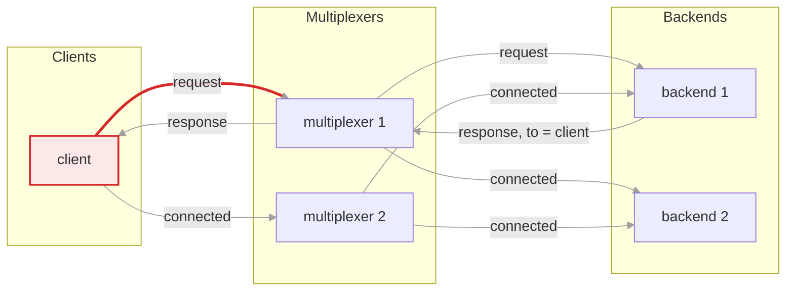

### 2. The multiplexer picks a backend

The rules file maps the request's type to the backend peer type with `whom: ANY`. Both backends are connected to multiplexer 1, so it hands the request to one of them round robin: backend 1 now, backend 2 for the next request of this type.

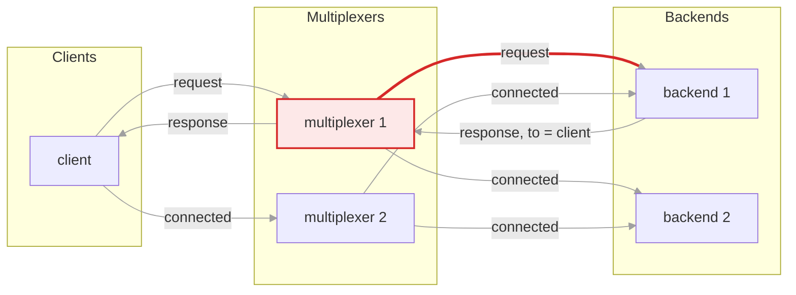

### 3. The backend answers

The reply sets `to` to the client's instance id and `references` to the request id, and goes back over the same connection it came in on. A message with `to` set is delivered to that peer without consulting the rules.

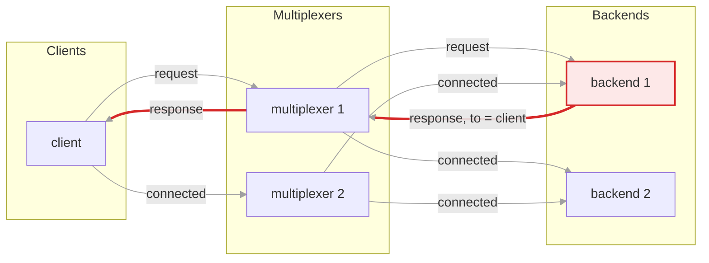

## When the backend that took the request fails

Three backends this time, all connected to both multiplexers. Backend 1 dies
after receiving the request. Each step has its own full `timeout`, so a
recovery like this one costs about one timeout on top of the normal round trip.

### 1. The client sends the request

As in the fast path: one connection, multiplexer 1 here.

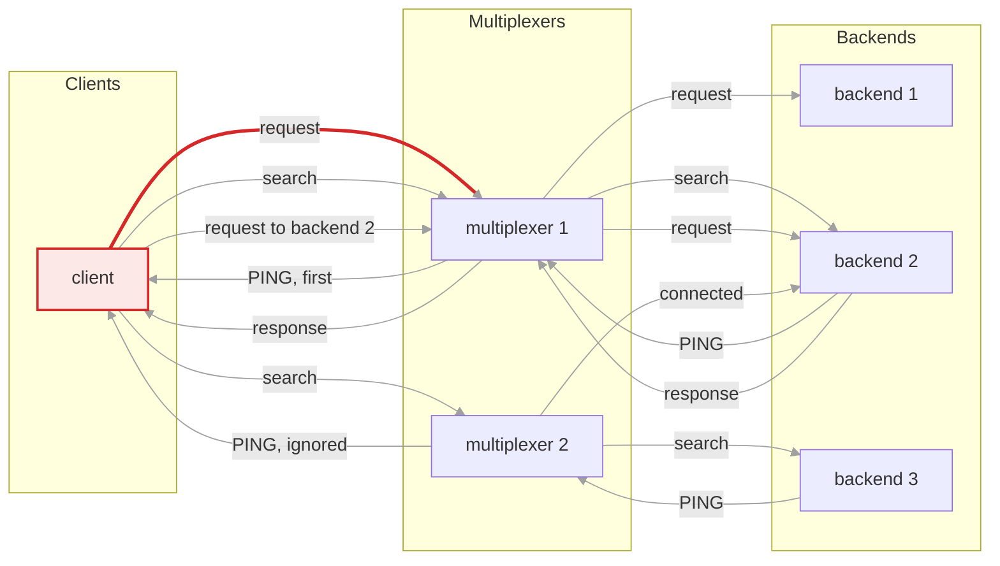

### 2. Multiplexer 1 hands it to backend 1

Round robin picked backend 1. The request is delivered; nothing has gone wrong yet.

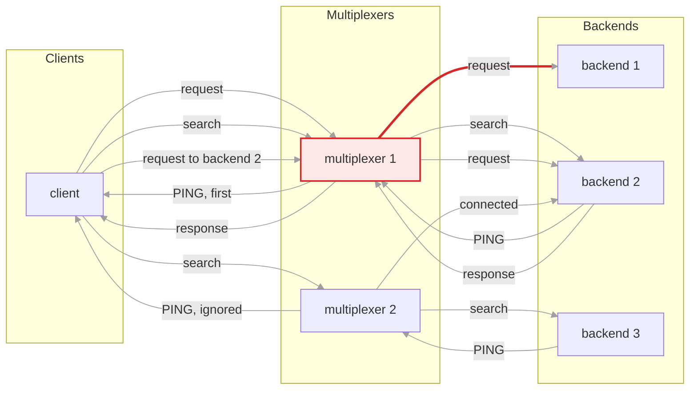

### 3. Backend 1 fails before answering

It crashes, hangs, or is killed. If the process is gone, both multiplexers see the closed socket and forget backend 1 at once, so no further request will be routed to it. The client, however, is still waiting for a reply that will never come, and gives up on this attempt when its `timeout` runs out.

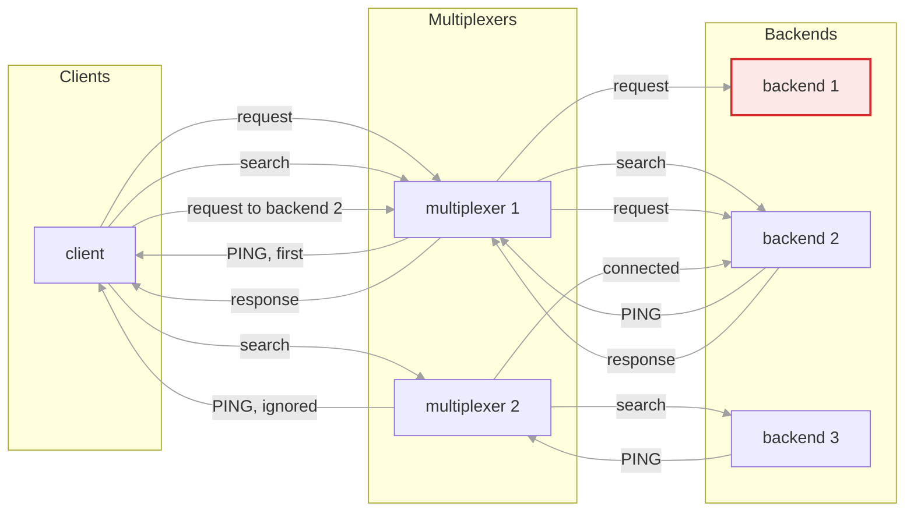

### 4. The client searches every connection

It sends `BACKEND_FOR_PACKET_SEARCH`, carrying the request's type, through all of its connections at once, and waits for the first `PING` back.

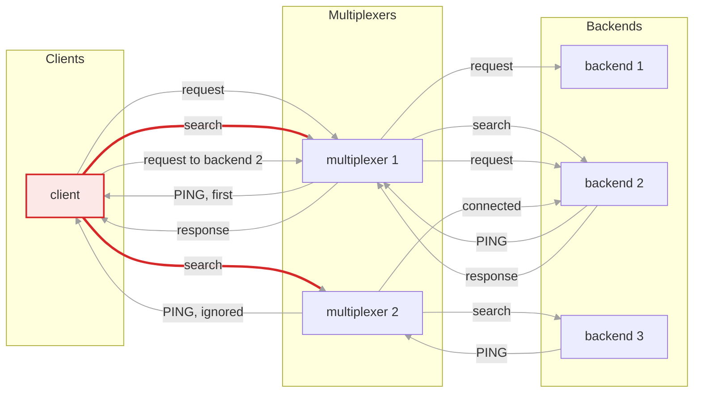

### 5. Each multiplexer asks a live backend, and each answers

A multiplexer routes the search with the request type's own rule, so with `whom: ANY` each forwards it to one live backend of the type, round robin. Multiplexer 1 picks backend 2 and multiplexer 2 picks backend 3; each answers with a `PING` that references the search. The client keeps the first `PING` to arrive, backend 2's via multiplexer 1 here, and ignores the later one. It now knows backend 2's instance id and a connection that leads to it.

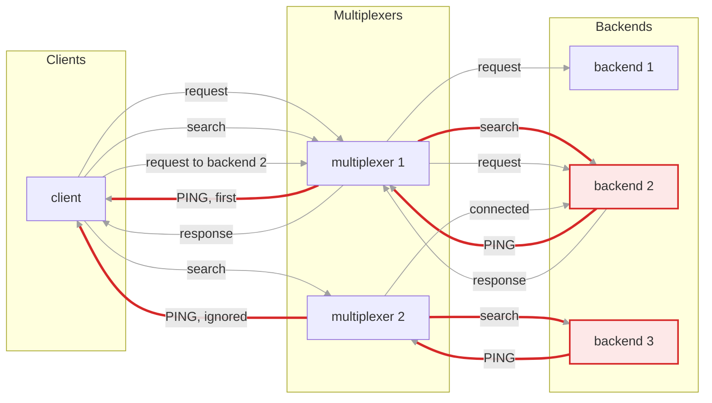

### 6. The client repeats the request directly

The same request goes out again as a new message, with a new `id`, `to` set to backend 2's id, and through the connection the first `PING` arrived on. Direct addressing bypasses the rules, so this cannot land on some other backend. The client accepts a reply to either id, so a late reply from backend 1 would still count.

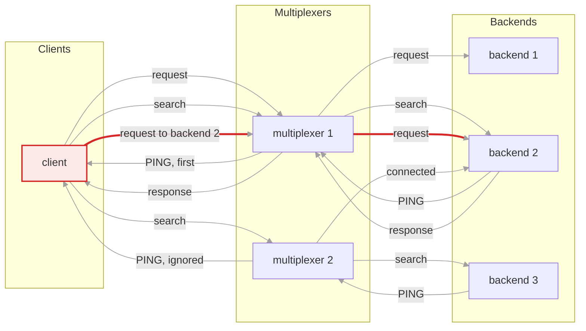

### 7. Backend 2 answers

The reply references the repeated request; the client accepts a reply to either the first or the repeated one, in case the original backend turns out to have answered late after all.

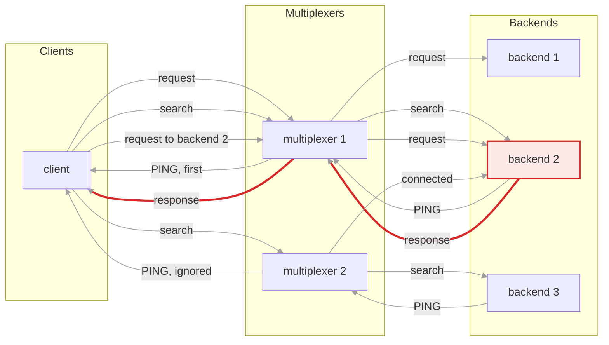

## When no backend of that type exists

The only backend anywhere is of another type. The query cannot succeed; this
picture shows how quickly the client finds that out. A type that has no
routing rule at all is quicker still: the multiplexer answers the request
itself with `DELIVERY_ERROR` marked `is_known_type`, and the client raises
`OperationFailed` without searching.

### 1. The client sends the request

One connection, as always.

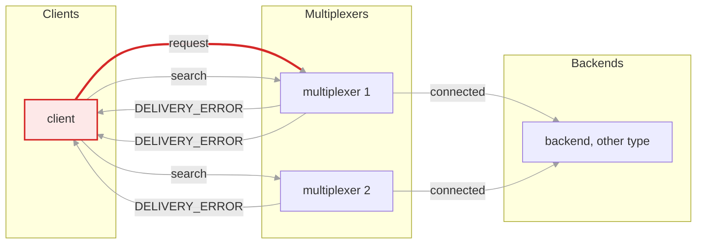

### 2. The multiplexer has nobody to give it to

No connected peer has the type the rule names, so multiplexer 1 answers at once with `DELIVERY_ERROR`. Requests ask for that report; without it the client would have had to wait out its timeout.

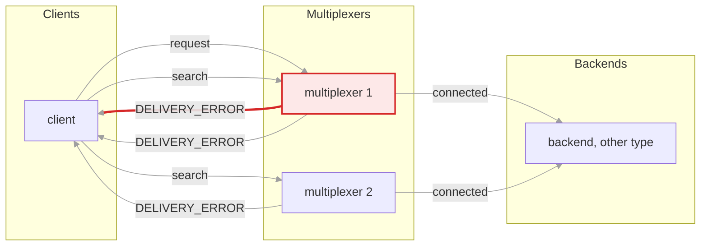

### 3. The client searches anyway

The search goes out on every connection, in case some other multiplexer has a backend of the type.

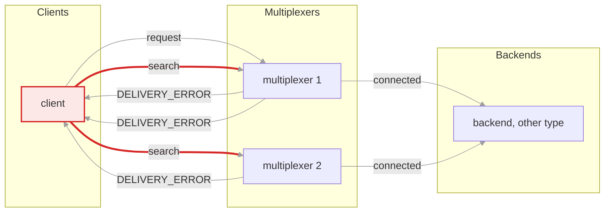

### 4. Every multiplexer says no

Each answers the search with `DELIVERY_ERROR`. Once every connection has failed, the query fails: `OperationFailed` in Python, right away rather than after a timeout. A multiplexer that has just restarted and has no backend of the type back yet says no the same way, which is why a restart of the only multiplexer can fail a request in flight, and a restart of one of several cannot.

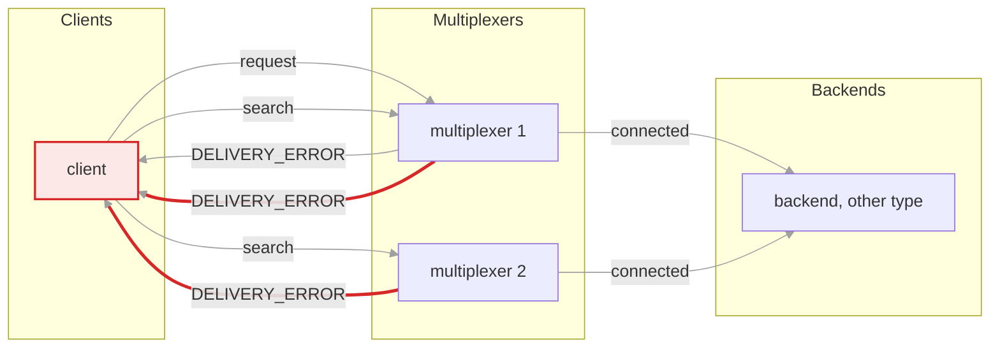

## An addressed query

A request with `to` set, the instance id of one peer, is an addressed query:
only that peer ever gets it, never another instance of its type. It has the
same three stages, with the middle one locating that instance instead of
searching for any backend, and one `timeout` covering all three. The
picture shows the moment that needs the middle stage: multiplexer 1 has
just restarted, the client is back on it, and the addressee is not yet.
Two instances of the type exist; the request is for instance 2.

### 1. The client sends the request through one connection

With `to` set and a delivery error requested, through the lane's connection when the call gave a lane, else any live one; here multiplexer 1. A reply would end the query here, as it does whenever the addressee is behind the multiplexer chosen.

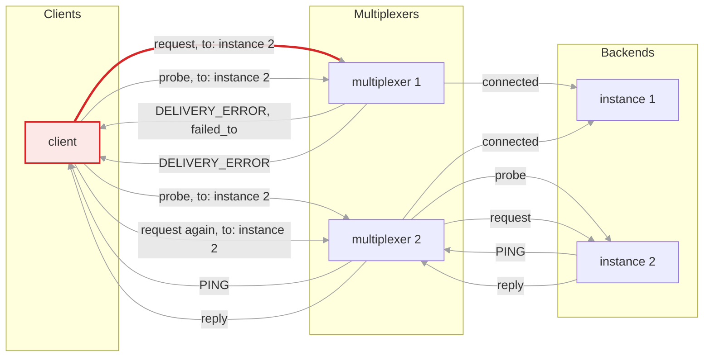

### 2. The multiplexer does not have the instance

Instance 2 has not reconnected to multiplexer 1 yet, so it answers at once with `DELIVERY_ERROR` naming the instance in `failed_to`. Instance 1, of the same type, is right there and does not get the request: an addressed query never takes a detour.

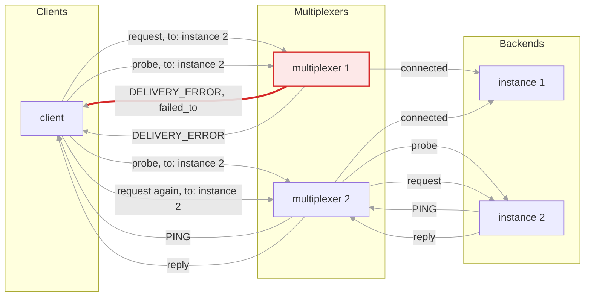

### 3. The client probes for the instance on every connection

The probe is a `BACKEND_FOR_PACKET_SEARCH` addressed to the instance, which a backend declines while it drains, or with `probe=PING` a `PING`, which a peer answers as long as it lives, for a request that must land even then. Delivery errors are requested, so a multiplexer without the instance says so. The connection dying under the first stage leads here too. A request that simply gets no answer within the timeout does not: a silent addressee is one the multiplexer still has, and a probe would find the same one.

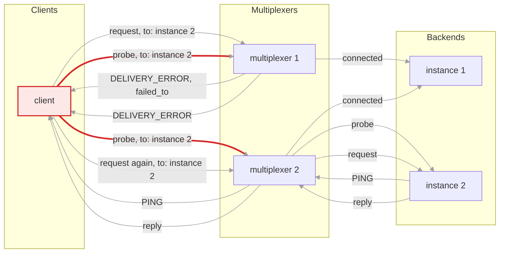

### 4. One multiplexer says no, the other delivers

Multiplexer 1 answers with `DELIVERY_ERROR`; multiplexer 2 hands the probe to instance 2. Every connection failing would end the query with `OperationFailed`, at once: the instance is gone.

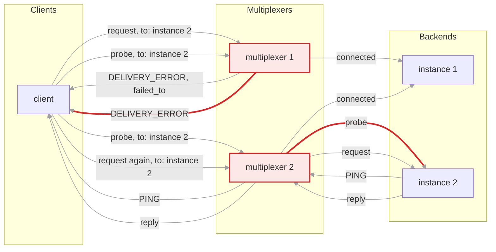

### 5. The instance answers with a PING

Through the multiplexer that has it, which the client now knows.

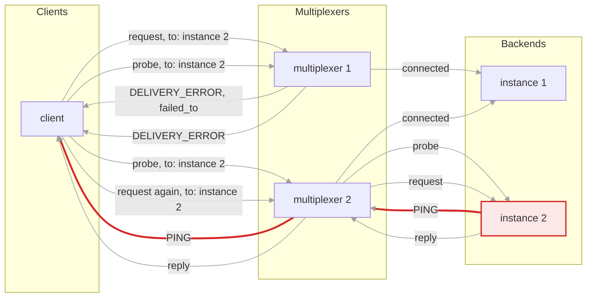

### 6. The client repeats the request through that connection

A fresh id, the same `to`, through the connection the `PING` came on. A lane given to the call adopts that connection, so what the caller sends next follows the query. A reply to the first attempt arriving late is accepted too, so a slow instance may see the request twice.

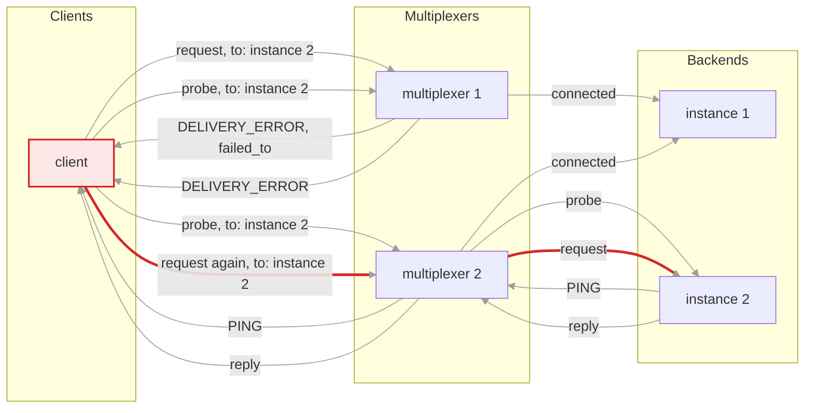

### 7. Instance 2 answers

The reply ends the query. Nothing within the timeout is `OperationTimedOut`; a `DELIVERY_ERROR` for the repeated request, the instance leaving between the probe and the request, is `OperationFailed`.

```mermaid
graph LR
  subgraph col0 [Clients]
    Q[client]
  end
  subgraph col1 [Multiplexers]
    M1[multiplexer 1]
    M2[multiplexer 2]
  end
  subgraph col2 [Backends]
    B1[instance 1]
    B2[instance 2]
  end
  Q -- "request, to: instance 2" --> M1
  M1 -- "DELIVERY_ERROR, failed_to" --> Q
  Q -- "probe, to: instance 2" --> M1
  Q -- "probe, to: instance 2" --> M2
  M1 -- "DELIVERY_ERROR" --> Q
  M2 -- "probe" --> B2
  B2 -- "PING" --> M2
  M2 -- "PING" --> Q
  Q -- "request again, to: instance 2" --> M2
  M2 -- "request" --> B2
  B2 -- "reply" --> M2
  M2 -- "reply" --> Q
  M1 -- "connected" --> B1
  M2 -- "connected" --> B1
  linkStyle default stroke:#a0a0a0,stroke-width:1px
  linkStyle 10,11 stroke:#d62828,stroke-width:3px
  style B2 fill:#fde8e8,stroke:#d62828,stroke-width:2px
```

Where this lives: `Client::_query` and `Client::_query_addressed` in
`multiplexer/client.cc`, `Client.query` in `multiplexer/mxclient.py`, and
the state machine of `multiplexer/threaded_client.cc` for the threaded and
asyncio clients; the search is routed in `Server::_handle_meta_message` in
`multiplexer/server.h`. Scenarios `query_one.py`, `round_robin.py`,
`backend_dies.py`, `two_mx_backends_on_each.py` and `unrouted_type.py`
under `tests/scenarios/` exercise the typed pictures;
`multiplexer/testing/lanes_test.py` and `multiplexer/threaded_lanes_test.py`
the addressed one.

<!-- generated by docs/diagrams/generate.py; edit that file, not this one -->
