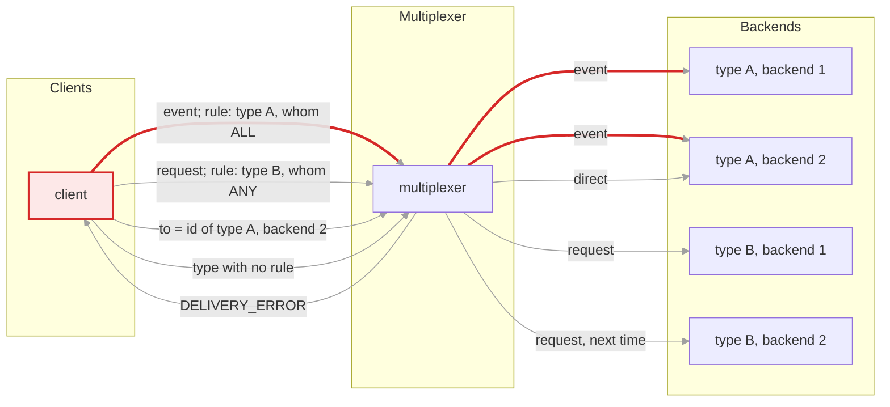
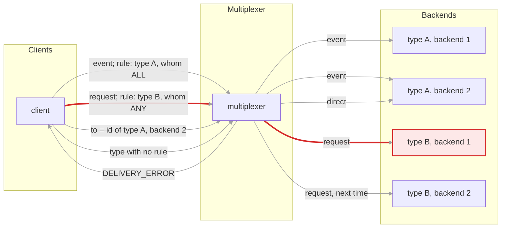
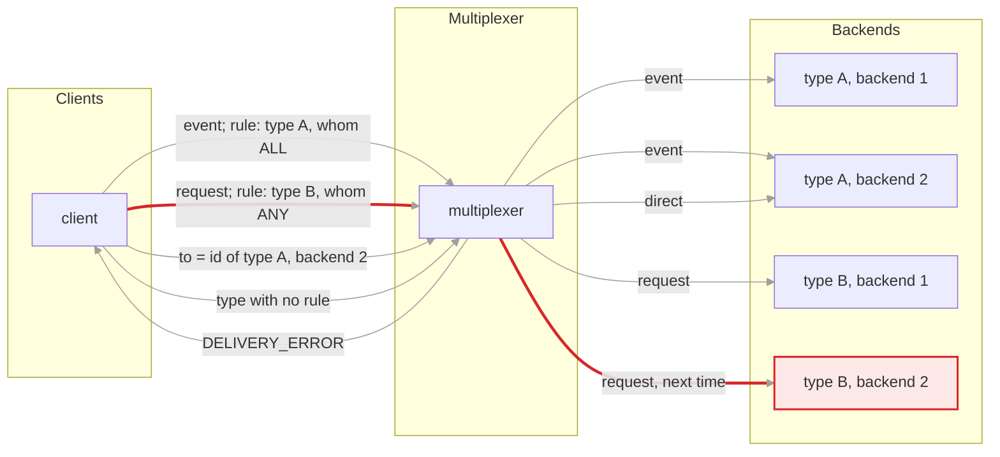
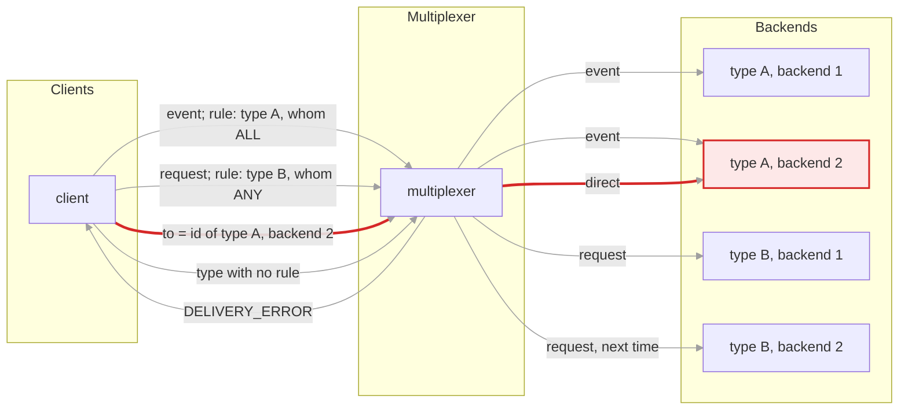
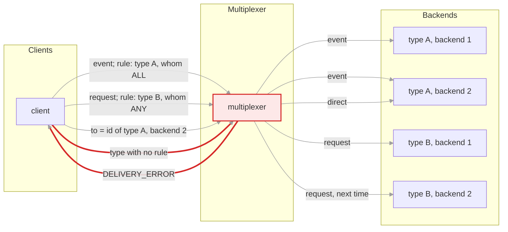

# How the multiplexer routes a message

Every message carries a type. The rules file maps each message type to one
peer type and says whether one peer of that type gets the message (`whom: ANY`,
round robin) or all of them (`whom: ALL`). A message may instead name a peer
directly by instance id, which wins over the rules. A message nobody can
receive is answered with `DELIVERY_ERROR` if the client asked for one.

Peer types are how you group backends. The picture has one client, one
multiplexer and two backend types, A and B, with two backends each. Type A
receives an event type under a `whom: ALL` rule; type B receives a request
type under a `whom: ANY` rule.

## Rules, direct addressing, delivery errors

### 1. whom: ALL

The rule for this message type names peer type A with `whom: ALL`, so every connected backend of type A gets a copy. This is how events are usually routed.

### 2. whom: ANY

The rule names peer type B with `whom: ANY`. One connected backend of type B gets the message, chosen round robin. This is how requests are usually routed: the backends of a type are interchangeable workers.

### 3. The next request, same rule

Round robin moves on to the other backend of type B. A backend that has dropped off is skipped.

### 4. A direct address

When `to` is set, the message goes to that instance id and the rules are not consulted. This is how a backend replies to the client that asked, and how a client repeats a request to the backend a search found.

### 5. Nobody can receive it

No rule for the type, or a rule whose peer type has no connected backend: the message is dropped, and the client gets `DELIVERY_ERROR` if it set `report_delivery_error`. A query's search relies on this.

Where this lives: `Server::handle_message` in `multiplexer/server.h`; the rules
file format is described in the root README. The `any_vs_all`,
`direct_addressing` and `unrouted_type` scenarios under `tests/scenarios/`
cover each case.

<!-- generated by docs/diagrams/generate.py; edit that file, not this one -->
