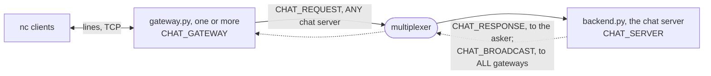

# aio

An asyncio program on the multiplexer: `gateway.py` is a TCP server that
turns every line a client sends into a request awaited on the event
loop, answers with the reply, and writes what the chat server broadcasts
to every client it holds; `backend.py` is that chat server, a backend
that upper-cases each line and, for a line starting with `shout `,
broadcasts the rest to every gateway. Two gateways on different ports
hold different clients and every shout reaches all of them, which is the
shape of a chat, a notification service, or any server that pushes to
sockets. `chat.rules` adds the two peer types and three message types;
`.bazelrc` points the build at it. [walkthrough.md](walkthrough.md)
builds it from nothing, the rules file, the chat server and the gateway
explained as they are added.

```
bazel test //...                                                       # the end-to-end test
bazel run @mx//mxcontrol -- run_multiplexer --address 127.0.0.1:1980 --rules $PWD/chat.rules
bazel run //:backend -- 127.0.0.1:1980                                 # in another terminal
bazel run //:gateway -- 127.0.0.1:1980 8765                            # and another
nc 127.0.0.1 8765                                                      # type lines; "shout hi" reaches everyone
```

A line typed into `nc` comes back upper-cased; `shout hi everyone` comes
back to everyone as `* HI EVERYONE`, then to the sender as its own
answer, `SHOUT HI EVERYONE`. The gateway prints `ready 8765` once it
listens.

## The peers

Gateways and a chat server, each connected to the multiplexer. A line
is a `CHAT_REQUEST` to `ANY` chat server, answered to the gateway that
asked; a shout is also a `CHAT_BROADCAST`, which the rule sends to `ALL`
gateways. The walkthrough draws a line and a shout, and what a gateway
does with them inside.



## What is what

- `chat.rules`: the system rules, then `CHAT_SERVER`, `CHAT_GATEWAY`,
  `CHAT_REQUEST` routed to any server, `CHAT_RESPONSE`, and
  `CHAT_BROADCAST` routed to all gateways.
- `gateway.py`: the TCP server on asyncio, one `AsyncClient` per process,
  an outbox and a writer task per client.
- `backend.py`: the chat server.
- `gateway_test.py`: the test; `WORKSPACE` and `BUILD` consume the
  multiplexer as `@mx`, as [examples/README.md](../README.md) describes.
