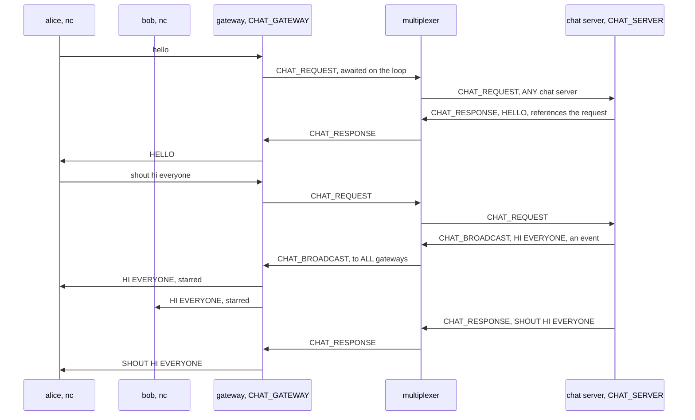
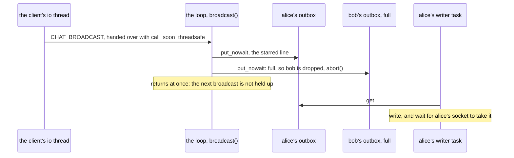

# Building the chat gateway, step by step

This page builds the example from nothing: the rules file, the chat
server, and the asyncio gateway, with every line of the three files
shown as it is added. Every code block is a piece of a file in this
directory, and `examples/check_walkthroughs.py` keeps them identical to
the files, so what you read here is what runs. [README.md](README.md)
is the front door: what the example is, a picture of its peers, and how
to run it. How a line and a shout go, drawn, the test and what the
example does not do are at the end of this page.

The idea in one sentence: a TCP server on asyncio holds its clients,
turns each line into a query awaited on the event loop, and delivers
what a backend broadcasts to every client it holds, through one
`AsyncClient` for the whole process. That client is what the
[channel layer](../channels/walkthrough.md) and the
[audio room](../audio/walkthrough.md) are built on too.

## 1. The rules file

A rules file starts from the system rules, the library's own
[multiplexer.rules](../../multiplexer.rules), which `bazel run
@mx//mxcontrol -- generate_rules $PWD/chat.rules` writes: the protocol's
types 1 to 99 and the six the libraries and `mxcontrol` use by name
([docs/rules.md](../../docs/rules.md)), which this workspace needs
because it builds `@mx//mxcontrol` with this file and the log commands
name `LOGS_STREAM` and its peers. They are left out here; the example's
own peers and messages follow them. A line from a client is a
`CHAT_REQUEST`, routed to `ANY` chat server; its reply is a
`CHAT_RESPONSE`, addressed by the library, so it needs no rule; and a
`CHAT_BROADCAST` is an event routed to `ALL` gateways, which is how one
shout reaches the clients of every gateway process. The gateway is an
active peer: its client's io thread heartbeats, so it is not marked
passive.

``` file=chat.rules from="# The chat example:"
# The chat example: gateways forward their clients' lines as requests to a
# chat server and receive what the server broadcasts.

peer {
    type: 201
    name: "CHAT_SERVER"
    comment: "the backend: answers CHAT_REQUEST, broadcasts CHAT_BROADCAST"
}

peer {
    type: 202
    name: "CHAT_GATEWAY"
    comment: "an asyncio server holding TCP clients; active, its io thread heartbeats"
}

type {
    type: 301
    name: "CHAT_REQUEST"
    comment: "a line from a client; the reply is CHAT_RESPONSE"
    to {
        peer: "CHAT_SERVER"
        whom: ANY
    }
}

type {
    type: 302
    name: "CHAT_RESPONSE"
}

type {
    type: 303
    name: "CHAT_BROADCAST"
    comment: "from the server to every gateway, for every client they hold"
    to {
        peer: "CHAT_GATEWAY"
        whom: ALL
    }
}
```

The build generates the constants from this file, `peers.CHAT_SERVER`,
`types.CHAT_REQUEST` and the rest, as `.bazelrc` arranges with
`--@mx//:multiplexer_rules=//:chat.rules`.

## 2. The chat server

`backend.py` is a `BaseMultiplexerServer`, the plain one: one thread,
one message at a time, which is all a chat needs.

```python file=backend.py
"""The chat server: a backend that answers each line and broadcasts the
ones that start with "shout " to every gateway.

    bazel run //:backend -- 127.0.0.1:1980
"""

import sys

from multiplexer.multiplexer_constants import peers, types
from multiplexer.servers import BaseMultiplexerServer


```

`handle_message()` gets every message that is not the protocol's own.
`send_message()` while handling one defaults to replying to it, so the
last line answers the request with its upper-cased text; the reply goes
back to the client that asked, whichever gateway holds it. A line that
starts with `shout ` also becomes a `CHAT_BROADCAST`, sent before the
reply with `to=0` and `references=0`, which clears the defaults: it is
not a reply to anyone, and the rule routes it to every gateway.

```python file=backend.py
class ChatServer(BaseMultiplexerServer):
    """Upper-cases what it is asked; a "shout" goes to everyone as well."""

    def handle_message(self, mxmsg):
        """The line upper-cased to its sender; after "shout ", the rest to every gateway first."""
        line = mxmsg.message.decode(errors="replace")
        if line.startswith("shout "):
            self.send_message(message=line[6:].upper().encode(), type=types.CHAT_BROADCAST, to=0, references=0)
        self.send_message(message=line.upper().encode(), type=types.CHAT_RESPONSE)


```

And `main`: the addresses from the command line, and `serve_forever()`,
which connects and serves until stopped.

```python file=backend.py
def main() -> None:
    """The multiplexers' addresses from the command line: serve until killed."""
    addresses = [(host, int(port)) for host, port in (address.rsplit(":", 1) for address in sys.argv[1:])]
    ChatServer(addresses, type=peers.CHAT_SERVER).serve_forever()


if __name__ == "__main__":
    main()
```

## 3. The gateway

`gateway.py` is the asyncio side. `MX` is the process's one
`AsyncClient`, from `AsyncClient.holder()`: nothing connects at import
time, the client is made on the running loop at first use and forgotten
in a forked child, which is the shape an ASGI server's worker needs.
The factory reads `ENDPOINTS`, filled in by `main` before the first use,
since the addresses come from the command line.

```python file=gateway.py
"""The gateway: an asyncio TCP server. Each line a client sends becomes a
request to the chat server, awaited on the event loop, and its reply goes
back to that client, or "! " and the error's name when there was none;
whatever the chat server broadcasts goes to every client of this gateway.
Each client has an outbox and a task writing it, so a client that reads
slowly or leaves holds up nobody else, and one that falls a thousand
lines behind is dropped. One AsyncClient per process, from a holder, the
shape an ASGI server's worker uses.

    bazel run //:gateway -- 127.0.0.1:1980 8765
"""

import asyncio
import sys

from multiplexer.aio import AsyncClient
from multiplexer.multiplexer_constants import peers, types
from multiplexer.mxclient import NotConnected, OperationFailed, OperationTimedOut
from multiplexer.threaded_client import BackendError

MX = AsyncClient.holder(peers.CHAT_GATEWAY, lambda: ENDPOINTS)
ENDPOINTS: list[tuple[str, int]] = []
LAST_WRITES = 10  # seconds a client that has sent its last line gets to read the answers it is owed


```

`Gateway` holds each client's outbox, a bounded queue of the lines on
their way to it, under the client's stream writer. `start()` listens,
and subscribes `broadcast` to every `CHAT_BROADCAST` for as long as the
server runs: `subscribe()` takes a message type and a function, called
on the loop for every such message that arrives, or a coroutine
function, scheduled as a task.

```python file=gateway.py
class Gateway:
    """The TCP side: the clients, and what reaches them."""

    def __init__(self, outbox: int = 1000) -> None:
        self.clients: dict[asyncio.StreamWriter, asyncio.Queue[bytes]] = {}  # each client's outbox
        self.outbox = outbox
        self.unsubscribe = None

    async def start(self, host: str, port: int) -> asyncio.Server:
        """Listen, and subscribe to broadcasts for as long as the server runs."""
        self.unsubscribe = MX.get().subscribe(types.CHAT_BROADCAST, self.broadcast)
        return await asyncio.start_server(self.serve, host, port)

```

The handler puts the broadcast, starred so that a line from someone else
looks different from an answer to one's own, into every client's outbox,
and waits for none of them: it is a plain function, which the client
calls on the loop in the order the broadcasts arrive, so one shout
reaches every outbox before the next does. A client whose outbox is
full, a thousand lines behind, is dropped at once, `abort()` rather
than `close()`, which would wait to send what it will never read.

```python file=gateway.py
    def broadcast(self, mxmsg) -> None:
        """A plain handler, called on the loop in the order the broadcasts
        arrive: the line into every client's outbox, waiting for none."""
        line = b"* " + mxmsg.message + b"\n"
        for writer, outbox in list(self.clients.items()):
            try:
                outbox.put_nowait(line)
            except asyncio.QueueFull:
                writer.transport.abort()  # too far behind: dropped at once, unsent lines and all; its serve() ends

```

`serve()` is one client for its whole connection: its outbox, the task
that writes it, and each line becoming a `query()`, a coroutine, so the
wait for the reply blocks this client and no other. The reply goes into
the same outbox, behind the broadcasts already there, and a query that
failed, no chat server or none in time, answers with `!` and the error's
name instead of ending the connection. Once the client has sent its last
line, it leaves the table, so no broadcast comes after that, and the
answers it is owed go out before the socket closes, within `LAST_WRITES`
seconds should it have stopped reading too: `printf 'hello\n' | nc -N
127.0.0.1 8765` gets its answer. That is a courtesy to plain TCP clients
such as `nc`; the multiplexer and the client libraries do the opposite,
since none of their peers closes one side of a connection: when the
other end stops sending, the connection is over at once and nothing more
is written to it ([failure
modes](../../docs/semantics.md#failure-modes)). When the connection
breaks, or the client sends a line longer than the reader's 64 KiB, the
client leaves the table and its writer task ends at once.

```python file=gateway.py
    async def serve(self, reader: asyncio.StreamReader, writer: asyncio.StreamWriter) -> None:
        """One client: forward each line as a request, answer with the reply;
        once it has sent its last line, the answers it is owed go out before
        the socket closes."""
        outbox: asyncio.Queue[bytes] = asyncio.Queue(self.outbox)
        self.clients[writer] = outbox
        sending = asyncio.ensure_future(self.send(writer, outbox))
        try:
            while line := await reader.readline():
                try:
                    reply = await MX.get().query(line.rstrip(b"\n"), types.CHAT_REQUEST, timeout=10)
                    answer = reply.message
                except (OperationFailed, OperationTimedOut, NotConnected, BackendError) as error:
                    answer = b"! " + type(error).__name__.encode()
                if not await self.enqueue(outbox, sending, answer + b"\n"):
                    return  # its writer ended: the client is gone
            del self.clients[writer]  # no broadcast after its last line
            await asyncio.wait_for(self.finish(outbox, sending), LAST_WRITES)
        except asyncio.TimeoutError:
            pass  # it stopped reading as well
        except (ConnectionError, ValueError):
            pass  # the client went, or sent a line longer than the reader's 64 KiB
        finally:
            self.clients.pop(writer, None)
            sending.cancel()
            writer.close()

```

An answer waits for room in a full outbox, as a client that reads slowly
should make it wait; but once the writer task has ended, its connection
broken, nothing takes from the outbox any more. So `enqueue()` waits
for whichever comes first, room or the writer's end, and tells `serve()`
which. `finish()` puts the empty line that ends the outbox behind what
is in it, and waits for the writer to get there.

```python file=gateway.py
    @staticmethod
    async def enqueue(outbox: "asyncio.Queue[bytes]", sending: "asyncio.Future[None]", data: bytes) -> bool:
        """Into the client's outbox, waiting while it is full; False when its
        writer has ended, since nothing would ever take from it then."""
        try:
            outbox.put_nowait(data)
            return True
        except asyncio.QueueFull:
            pass
        put = asyncio.ensure_future(outbox.put(data))
        try:
            await asyncio.wait((put, sending), return_when=asyncio.FIRST_COMPLETED)
            return put.done()
        finally:
            put.cancel()  # nothing once it is done; a put still waiting would never be taken

    async def finish(self, outbox: "asyncio.Queue[bytes]", sending: "asyncio.Future[None]") -> None:
        """The end of the outbox, after what is in it, and its writer done."""
        if await self.enqueue(outbox, sending, b""):
            await sending

```

The writer task is the only place a client's socket is written: its
outbox in order, each line awaited until the socket takes it, so a slow
reader slows only its own task, up to the empty line that ends it. A
connection that breaks ends the task and closes the writer, which
`serve()` sees as the end of its reader, or, while it waits for room in
the outbox, as the end of this task.

```python file=gateway.py
    async def send(self, writer: asyncio.StreamWriter, outbox: "asyncio.Queue[bytes]") -> None:
        """One client's writer: its outbox in order, at the pace its socket
        takes it, up to the empty line that ends it."""
        try:
            while data := await outbox.get():
                writer.write(data)
                await writer.drain()
        except ConnectionError:
            writer.close()  # gone: serve() sees the end of its reader, or of this task


```

And `main`: the multiplexers' addresses into `ENDPOINTS`, the server on
the port asked for, `ready` with that port for whoever is waiting, then
serving forever.

```python file=gateway.py
async def main(addresses: list[str], port: int) -> None:
    """The multiplexers' addresses, then the port: serve until interrupted."""
    ENDPOINTS[:] = [(host, int(mx_port)) for host, mx_port in (address.rsplit(":", 1) for address in addresses)]
    server = await Gateway().start("127.0.0.1", port)
    print("ready", server.sockets[0].getsockname()[1], flush=True)
    async with server:
        await server.serve_forever()


if __name__ == "__main__":
    asyncio.run(main(sys.argv[1:-1], int(sys.argv[-1])))
```

## 4. The build

Two binaries and the test, each depending on the library's targets from
`@mx`; `WORKSPACE` consumes the multiplexer the way
[examples/README.md](../README.md) describes.

```python file=BUILD
# The aio example: an asyncio TCP gateway in front of a chat backend.
exports_files(["chat.rules"])

py_binary(
    name = "backend",
    srcs = ["backend.py"],
    deps = [
        "@mx//multiplexer:multiplexer_constants",
        "@mx//multiplexer:servers",
    ],
)

py_binary(
    name = "gateway",
    srcs = ["gateway.py"],
    deps = [
        "@mx//multiplexer:aio",
        "@mx//multiplexer:multiplexer_constants",
    ],
)

py_test(
    name = "gateway_test",
    size = "medium",
    srcs = [
        "backend.py",
        "gateway.py",
        "gateway_test.py",
    ],
    deps = [
        "@mx//multiplexer:aio",
        "@mx//multiplexer:multiplexer_constants",
        "@mx//multiplexer:servers",
        "@mx//multiplexer/testing",
    ],
)
```

## 5. What is left

[gateway_test.py](gateway_test.py), below. The Django Channels version
of the gateway is in
[docs/recipes/async_web_server.md](../../docs/recipes/async_web_server.md).

## How it fits together

A line from one client, answered to it, and a shout, which the chat
server broadcasts to every gateway and answers to its sender as well:



Inside the gateway, every line to a client goes through that client's
outbox, and only its writer task touches its socket:



- **One client per process.** `MX` is an `AsyncClient` from
  `AsyncClient.holder()`, made on the loop at first use; every query is
  awaited, so a client waiting for its reply holds up no other.
- **The broadcast is routed, not looped over.** The chat server sends
  one `CHAT_BROADCAST`, and the rule sends it to `ALL` gateways; each
  gateway delivers it to the clients it holds, which is why a second
  gateway on another port needs nothing but the same rules file.
- **Every client has its own pace.** A client that reads slowly fills
  its own outbox and nobody else's; one a thousand lines behind is
  dropped, rather than holding the others' broadcasts or growing the
  gateway's memory without end.
- **A failed line is answered.** `OperationFailed` when no chat server
  is there, `OperationTimedOut` when none answered in ten seconds: the
  client reads `! ` and the name, and its next line is served as usual.

## Testing it with the harness

[gateway_test.py](gateway_test.py) runs the gateway on the test's own
loop against a `Cluster` of one real multiplexer, with the chat server
on a `BackendThread`, the way a program's own asyncio tests would:

- **A line and a shout**: two TCP clients, a line answered to the one
  that sent it, a shout reaching both, starred, and answered to its
  sender.
- **A client that stops reading**: one client with a small receive
  buffer that never reads, the gateway given an outbox of ten lines,
  and the other client sending sixty shouts of 60 kB, more than the
  stalled socket takes; the other client gets all sixty broadcasts and
  answers in order, and the stalled one is gone from the gateway's
  table.
- **A client that half-closes**: a line and the end of its writing at
  once, while the query is out; it reads the answer, then the end.
- **A client that resets with its outbox full**: a raw socket that asks
  twenty times and never reads, the gateway's side of it given a small
  send buffer and an outbox of two, until the outbox is full; then a
  reset, and `serve()` ends and the client leaves the table rather than
  waiting on the outbox for good.
- **A line nobody serves**: no chat server in the cluster, and a line
  answered with `! OperationFailed`, then another, the connection kept.

`bazel test //...` runs it, in a second or so.

## What it does not do

- Order across several multiplexers. The steps start one. The chat
  server sends each broadcast through the multiplexer its shout came
  through, so with several, two shouts that came through different ones
  can reach a gateway in either order, and one on a multiplexer that
  dies with it is lost: order holds per connection only
  ([docs/semantics.md](../../docs/semantics.md)). A chat that needs
  order numbers its lines and puts them back in order, as the
  [channel layer](../channels/walkthrough.md) does.
- Lines longer than 64 KiB, the stream reader's limit: such a client is
  disconnected.
- Anything a chat needs beyond the transport: names, rooms, history.
