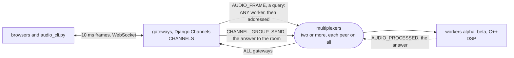

# audio

An audio room: the browser's microphone, 10 ms at a time, through a
Django Channels gateway to a C++ worker that applies an effect and
measures the spectrum, and back to everyone in the room. Each frame is
one query through the broker, answered in a fifth of a millisecond, and
the answer one event to every gateway process. It is the first example
of the second kind: not a building block like the [cache](../cache) or
the [channel layer](../channels), but something the broker's latency
makes possible: a hundred small requests per second per participant,
each a message on a connection that is already there, to a worker that
is chosen once and then addressed, and replaced under the stream when it
dies or is restarted.

The gateway is the channels example's layer under Channels, installed
with pip, which brings the multiplexer, `mxcontrol`, with it; the worker
is C++, a Bazel workspace consuming the multiplexer as `@mx`. [walkthrough.md](walkthrough.md) builds both from nothing,
every line of the rules file, the payloads, the signal processing, the
worker and the consumer explained as it is added. It ends with the measured
steps and a walk through its test, which runs the worker as a process
and the consumer through Channels' communicator.

```
bazel test //...                    # the worker and its DSP tests; the binary is bazel-bin/worker/worker
pip install -r requirements.txt
mxcontrol run_multiplexer --rules audio.rules --address 127.0.0.1:1980     # the package's mxcontrol
mxcontrol run_multiplexer --rules audio.rules --address 127.0.0.1:1981     # a second one, in another terminal
bazel-bin/worker/worker 127.0.0.1:1980,127.0.0.1:1981 alpha    # a worker; the name is what the page shows
bazel-bin/worker/worker 127.0.0.1:1980,127.0.0.1:1981 beta     # another
MX_ADDRESSES=127.0.0.1:1980,127.0.0.1:1981 python web/manage.py runserver 127.0.0.1:8000   # a gateway
MX_ADDRESSES=127.0.0.1:1980,127.0.0.1:1981 python web/manage.py runserver 127.0.0.1:8001   # another
```

Open http://127.0.0.1:8000/ in one browser and http://127.0.0.1:8001/ in
another, enter the same room, press Start and allow the microphone.
Each page hears everyone, with the effect each chose, draws everyone's
spectrum with the name of the worker that computed it, and shows three
numbers for its own frames: capture to arrival, of which the broker
round trip at the gateway, of which the worker. Headphones, or the room
hears itself. The page wants Chrome, Safari, or Firefox 148 or newer:
older Firefox, ESR 140 included, cannot connect a microphone to the
page's 48 kHz audio unless the audio device itself runs at 48 kHz.
`test.sh` builds the worker, makes a virtual environment and runs the
test against real multiplexers.

## The peers

Every process is a peer of every multiplexer: the gateways as the
channel layer's `CHANNELS`, the workers as `DSP`. A frame is a query to
`ANY` worker, then addressed to the one that answered; the answer goes
to `ALL` gateways as the layer's group send. The walkthrough draws each
exchange, a frame's round trip, a worker killed and a rolling restart.



## What is what

- `audio.rules`: the system rules, the two ordinary types the
  libraries use by name, the channel layer's peer and types, and the
  worker's; `multiplexer_constants.py` is what `mxcontrol
  generate_constants` wrote from it for the gateway, and the worker's
  build generates its header from the same file. `audio.proto` is the
  two payloads, compiled to `audio_pb2.py`.
- `WORKSPACE`, `.bazelrc`, `BUILD`, `worker/BUILD`: the worker's
  workspace, consuming the multiplexer as `@mx`.
- `worker/dsp.h`, `worker/dsp.cc`, `worker/dsp_test.cc`: the signal
  processing and its tests; `worker/worker.cc`: the backend around it.
- `web/`: the Django project; `room/consumers.py` is the consumer, and
  `room/static/room/` the page's script and the two audio worklets.
- `audio_cli.py`: the participant for the command line the steps use.
- `test.py`, `test.sh`: the test on the harness, and the script that
  builds the worker, makes a venv and runs it.
