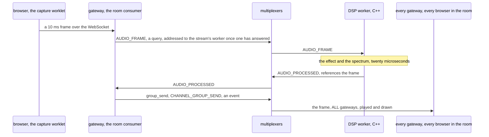
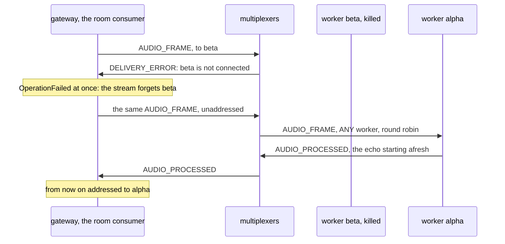
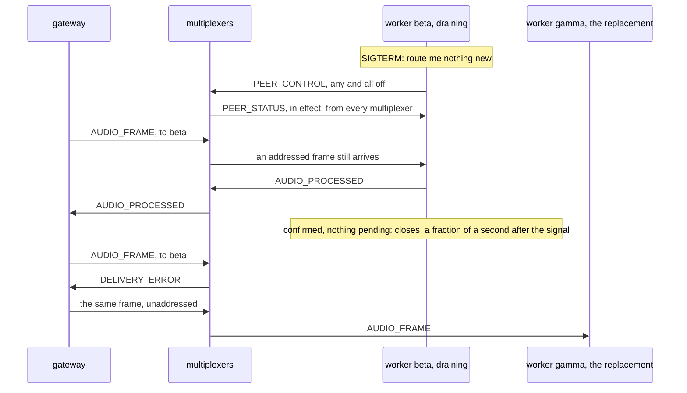

# Building the audio room, step by step

This page builds the example from nothing: the rules file, the payloads,
the worker's workspace, the signal processing, the worker, and the
gateway's consumer, with every line of those files shown as it is added.
Every code block is a piece of a file in this directory, and
`examples/check_walkthroughs.py` keeps them identical to the files, so
what you read here is what runs. [README.md](README.md) is the front
door: what the example is, a picture of its peers, and how to run it.
How the messages go, drawn, the measured steps, the test and what the
example does not do are at the end of this page.

The idea in one sentence: every 10 ms frame a browser sends is one query
through the broker to a C++ worker, and the worker's answer is one event
to every gateway process, so a room's audio never waits in a queue, and
a frame's trip through the broker and the worker takes a fifth of a
millisecond.

## 1. The rules file

The file opens with the system rules every rules file starts from, the
protocol's own types 1 to 99 and the six the libraries and `mxcontrol`
use by name ([docs/rules.md](../../docs/rules.md)), which `mxcontrol
generate_rules audio.rules` wrote; the worker, a C++ program built with
this file, needs every one of them. They are left out here. Then the
channel layer's peer and message
types, with the numbers the
[channels example](../channels/walkthrough.md#1-the-rules-file) gave
them, since the gateway runs that layer: a group send is an event to
every gateway process, `whom: ALL`, and a send to one channel is
addressed, so it needs no rule.

``` file=audio.rules from="# The channel layer's peer and messages"
# The channel layer's peer and messages, as in examples/channels.

peer {
    type: 201
    name: "CHANNELS"
    comment: "a gateway: a process of the Django Channels application, holding channels and groups of its own"
}

type {
    type: 301
    name: "CHANNEL_GROUP_SEND"
    comment: "a group_send, payload ChannelEnvelope; every gateway delivers it to the channels it holds in the group"
    to {
        peer: "CHANNELS"
        whom: ALL
    }
}

type {
    type: 302
    name: "CHANNEL_SEND"
    comment: "a send to a specific channel, payload ChannelEnvelope; addressed to the gateway that owns the channel, so it needs no rule"
}

```

And the worker's. A frame goes to `ANY` worker: the first frame of a
stream is a plain query, which the multiplexer gives to a worker round
robin; the answer is a reply, addressed by the library, so
`AUDIO_PROCESSED` has no rule either.

``` file=audio.rules
# The worker's.

peer {
    type: 202
    name: "DSP"
    comment: "an audio worker, C++: applies an effect to a frame and returns it with its spectrum; run as many as you like"
}

type {
    type: 303
    name: "AUDIO_FRAME"
    comment: "10 ms of a participant's audio, payload AudioFrame; any one worker answers with AUDIO_PROCESSED"
    to {
        peer: "DSP"
        whom: ANY
    }
}

type {
    type: 304
    name: "AUDIO_PROCESSED"
    comment: "the frame after the effect, with its spectrum, payload AudioProcessed"
}
```

The constants come from this file twice. `mxcontrol generate_constants
audio.rules --python multiplexer_constants.py --pyi
multiplexer_constants.pyi` wrote the module the gateway imports,
committed next to the rules; and the worker's Bazel build generates the
C++ header from the same file, as `.bazelrc` below arranges.

## 2. The payloads

Two protocol buffers, one each way, compiled for Python once with
`protoc --python_out=. --pyi_out=. audio.proto` and for C++ by the
worker's build. The frame carries its participant, since the worker
keeps state per participant; its sequence number, with which the page
plays each participant's frames in order and a missing one as silence;
the effect the participant chose, sent with every frame so that a worker
that has never seen the stream knows what to apply; the PCM; and the
browser's capture time, which comes back unchanged for the page's
latency meter. The answer carries the frame after the effect, the
spectrum as thirty-two bytes for drawing, which worker did it, and how
long it took, in microseconds because milliseconds would round to zero.

```protobuf file=audio.proto
// The payloads of the audio example, between the gateway and the worker.
// Compiled for Python once with `protoc --python_out=. --pyi_out=.
// audio.proto`, the generated audio_pb2.py committed next to it, and for
// C++ by the worker's Bazel build.
syntax = "proto3";

package audio;

// AUDIO_FRAME: 480 samples of 16-bit little-endian PCM at 48 kHz, 10 ms,
// from one participant, numbered so that the page plays each
// participant's frames in order and a missing one as silence; the effect
// the participant chose; and when the browser captured the frame, echoed
// back for the latency meter.
message AudioFrame {
  uint32 participant = 1;
  uint32 seq = 2;
  string effect = 3;
  bytes pcm = 4;
  double captured_at = 5;
}

// AUDIO_PROCESSED: the same frame after the effect, thirty-two spectrum
// bands from 60 Hz to 12 kHz as bytes for drawing, which worker did it
// and how long it took.
message AudioProcessed {
  uint32 participant = 1;
  uint32 seq = 2;
  bytes pcm = 3;
  bytes spectrum = 4;
  string worker = 5;
  uint32 micros = 6;
  double captured_at = 7;
}
```

## 3. The worker's workspace

The worker is C++, so it is a Bazel workspace consuming the multiplexer
as `@mx`, the way [examples/echo](../echo) does. Inside this repository
it points at the checkout; yours would pin a commit.

``` file=WORKSPACE
# The worker's workspace: it consumes the multiplexer as @mx, the way your
# own would. This example lives inside the multiplexer repository, so it
# points at the checkout it is in; your own workspace would pin a released
# commit with git_repository or http_archive, as examples/echo/WORKSPACE
# shows.
workspace(name = "audio_example")

local_repository(
    name = "mx",
    path = "../..",
)

load("@mx//bazel:deps.bzl", "mx_dependencies")

mx_dependencies()

load("@mx//bazel:setup.bzl", "mx_setup")

mx_setup()
```

The flags: C++17, an optimized build since the worker's time is one of
the numbers the page shows, and the rules file the constants are
generated from.

``` file=.bazelrc
# The example workspace's flags: C++17; optimized, since the worker is
# measured; and the rules file the constants are generated from, so every
# build of this workspace uses audio.rules.
build --cxxopt=-std=c++17
build -c opt
build --@mx//:multiplexer_rules=//:audio.rules
```

The payloads, compiled with the `protoc` the multiplexer's workspace
provides, so that the worker links the same protobuf runtime as the
library; a `genrule` rather than a `proto_library`, the way the
multiplexer's own protos are built.

```python file=BUILD
# The audio example's Bazel side: the rules file the constants come from,
# and the protocol buffer the worker and the gateway share, compiled the
# way the library compiles its own, with the protoc @mx points at. The
# worker is under worker/; the gateway is Python, installed with pip.
exports_files(["audio.rules"])

genrule(
    name = "audio_proto",
    srcs = ["audio.proto"],
    outs = [
        "audio.pb.cc",
        "audio.pb.h",
    ],
    cmd = "$(location @mx//:protoc) -I $$(dirname $(location audio.proto)) --cpp_out=$(RULEDIR) $(location audio.proto)",
    tools = ["@mx//:protoc"],
)

cc_library(
    name = "audio_cc_proto",
    srcs = ["audio.pb.cc"],
    hdrs = ["audio.pb.h"],
    visibility = ["//worker:__pkg__"],
    deps = ["@mx//:protobuf_runtime"],
)
```

And the worker's targets: the signal processing as a library of its own,
its tests, and the binary, which depends on the constants and the
threaded backend base class from `@mx`.

```python file=worker/BUILD
# The worker: the signal processing, its tests, and the backend around it.
cc_library(
    name = "dsp",
    srcs = ["dsp.cc"],
    hdrs = ["dsp.h"],
)

cc_test(
    name = "dsp_test",
    srcs = ["dsp_test.cc"],
    deps = [
        ":dsp",
        "@com_google_googletest//:gtest_main",
    ],
)

cc_binary(
    name = "worker",
    srcs = ["worker.cc"],
    visibility = ["//visibility:public"],
    deps = [
        ":dsp",
        "//:audio_cc_proto",
        "@mx//multiplexer:endpoint",
        "@mx//multiplexer:multiplexer_cc_constants",
        "@mx//multiplexer/backend:base_threaded_multiplexer_server",
    ],
)
```

`bazel test //...` in this directory builds all of it and runs the DSP
tests; `bazel-bin/worker/worker` is the binary.

## 4. The signal processing

`worker/dsp.h` is everything the worker does to a frame, and nothing
about the broker: 10 ms frames of 48 kHz PCM, an FFT, thirty-two
spectrum bands, and four effects. The standard library only, so that the
worker is the multiplexer library and this file.

```cpp file=worker/dsp.h
// The signal processing of the audio worker: 10 ms frames of 48 kHz PCM,
// a radix-2 FFT of its own, thirty-two spectrum bands for drawing, and
// four effects that keep state per stream. Nothing beyond the standard
// library, so that the worker is the library and this file.
#ifndef AUDIO_WORKER_DSP_H_
#define AUDIO_WORKER_DSP_H_

#include <array>
#include <complex>
#include <cstddef>
#include <cstdint>
#include <string>
#include <vector>

namespace audio {

constexpr int SAMPLE_RATE = 48000;
constexpr int FRAME = 480;     // samples per frame: 10 ms
constexpr int FFT_SIZE = 512;  // the frame, zero-padded to a power of two
constexpr int BANDS = 32;

typedef std::array<float, FRAME> Frame;            // samples in [-1, 1]
typedef std::array<std::uint8_t, BANDS> Spectrum;  // 0 to 255 per band

```

PCM is what the browser sends: 16-bit little-endian samples, decoded to
floats in [-1, 1] and encoded back at the same scale with clipping, so
that a frame nothing changed comes back exactly as it came. The FFT is a
plain radix-2 transform, in place, on 512 values, the frame zero-padded;
the spectrum is what the page draws.

```cpp file=worker/dsp.h
// 16-bit little-endian PCM to floats, and back with clipping; a frame
// nothing changed comes back as it came.
Frame decode(const std::string& pcm);
std::string encode(const Frame& frame);

// The fast Fourier transform, in place; values.size() must be a power of two.
void fft(std::vector<std::complex<float>>& values);

// The frame's magnitude spectrum for drawing: a Hann window, the FFT, and
// thirty-two bands spaced logarithmically from 60 Hz to 12 kHz, each the
// peak of the bins whose middle falls in the band, in decibels relative
// to a full-scale sine, -60 dB to 0 dB as 0 to 255. A low band that holds
// no bin's middle shows the bin nearest its own.
Spectrum spectrum(const Frame& frame);
// The band a frequency falls in.
int band_of(float hz);

```

Two of the effects need a filter. `Biquad` is one second-order section
from the RBJ cookbook, with its memory: two past inputs and two past
outputs.

```cpp file=worker/dsp.h
// A second-order filter section, the RBJ cookbook's, with its memory.
class Biquad {
 public:
  void high_pass(float hz);
  void low_pass(float hz);
  float apply(float x);

 private:
  float b0_ = 1, b1_ = 0, b2_ = 0, a1_ = 0, a2_ = 0;
  float x1_ = 0, x2_ = 0, y1_ = 0, y2_ = 0;
};

```

`Stream` is one participant's effect and everything it remembers between
frames, which is the reason a stream stays on one worker: the filters'
memory, the ring modulator's phase, and a quarter second of the past for
the echo. Move the stream to another worker and the effect starts afresh
there, which a listener can hear: the echo loses its tail, and a filter
starting from rest can click on its first frame.

```cpp file=worker/dsp.h
// One participant's effect and the state it keeps between frames, which
// is why a stream has to stay on one worker: the filters' memory, the
// modulator's phase, a quarter second of the past for the echo.
class Stream {
 public:
  explicit Stream(const std::string& effect = "none");
  const std::string& effect() const { return effect_; }
  void set_effect(const std::string& effect);  // starts the state afresh
  void apply(Frame& frame);

 private:
  std::string effect_;
  Biquad high_, low_;         // telephone: 300 Hz to 3400 Hz
  double phase_ = 0;          // robot: the modulator's phase
  std::vector<float> delay_;  // echo: 250 ms of what was heard
  std::size_t position_ = 0;
};

}  // namespace audio

#endif  // AUDIO_WORKER_DSP_H_
```

`worker/dsp.cc` implements it. The constants: 60 Hz times 200 is 12 kHz,
the range the bands cover logarithmically.

```cpp file=worker/dsp.cc
// The signal processing: see dsp.h.
#include "worker/dsp.h"

#include <algorithm>
#include <cmath>

namespace audio {

namespace {

constexpr float PI = 3.14159265358979f;
constexpr float LOWEST_HZ = 60.0f;
constexpr float SPAN = 200.0f;  // 60 Hz times 200 is 12 kHz: the bands cover that, logarithmically

}  // namespace

```

Decoding takes what is there, up to a frame, so a short frame is padded
with silence; encoding clips.

```cpp file=worker/dsp.cc
Frame decode(const std::string& pcm) {
  Frame frame{};
  const std::size_t samples = std::min<std::size_t>(FRAME, pcm.size() / 2);
  for (std::size_t i = 0; i < samples; ++i) {
    const int low = static_cast<unsigned char>(pcm[2 * i]);
    const int high = static_cast<unsigned char>(pcm[2 * i + 1]);
    frame[i] = static_cast<std::int16_t>(low | (high << 8)) / 32768.0f;
  }
  return frame;
}

std::string encode(const Frame& frame) {
  std::string pcm(FRAME * 2, '\0');
  for (int i = 0; i < FRAME; ++i) {
    // decode()'s scale, so that a frame nothing changed comes back as it came.
    const long scaled = std::lrint(frame[i] * 32768.0f);
    const std::int16_t sample = static_cast<std::int16_t>(std::max(-32768L, std::min(32767L, scaled)));
    pcm[2 * i] = static_cast<char>(sample & 0xff);
    pcm[2 * i + 1] = static_cast<char>((sample >> 8) & 0xff);
  }
  return pcm;
}

```

The FFT: the bit-reversal permutation, then the butterflies over
transforms of length 2, 4, and so on up to n.

```cpp file=worker/dsp.cc
void fft(std::vector<std::complex<float>>& values) {
  const std::size_t n = values.size();
  // The bit-reversal permutation: values[i] goes to the index with i's bits reversed.
  for (std::size_t i = 1, j = 0; i < n; ++i) {
    std::size_t bit = n >> 1;
    for (; j & bit; bit >>= 1) {
      j ^= bit;
    }
    j ^= bit;
    if (i < j) {
      std::swap(values[i], values[j]);
    }
  }
  // The butterflies, over transforms of length 2, 4, ..., n.
  for (std::size_t length = 2; length <= n; length <<= 1) {
    const float angle = -2 * PI / static_cast<float>(length);
    const std::complex<float> root(std::cos(angle), std::sin(angle));
    for (std::size_t start = 0; start < n; start += length) {
      std::complex<float> twiddle(1, 0);
      for (std::size_t k = 0; k < length / 2; ++k) {
        const std::complex<float> even = values[start + k];
        const std::complex<float> odd = values[start + k + length / 2] * twiddle;
        values[start + k] = even + odd;
        values[start + k + length / 2] = even - odd;
        twiddle *= root;
      }
    }
  }
}

```

The spectrum: a Hann window over the frame, the transform, and each bin
counted in the band its middle frequency falls in, the band's value its
loudest bin, in decibels relative to a full-scale sine, -60 dB to 0 dB
mapped to 0 to 255. A bin is 93.75 Hz wide, wider than the bands below
about 500 Hz, so a low band that holds no bin's middle shows the bin
nearest its own. `band_of` is the band formula, which the spectrum and
the tests share.

```cpp file=worker/dsp.cc
int band_of(float hz) {
  const float band = BANDS * std::log(hz / LOWEST_HZ) / std::log(SPAN);
  return std::max(0, std::min(BANDS - 1, static_cast<int>(band)));
}

Spectrum spectrum(const Frame& frame) {
  std::vector<std::complex<float>> values(FFT_SIZE);
  for (int i = 0; i < FRAME; ++i) {
    const float window = 0.5f - 0.5f * std::cos(2 * PI * i / (FRAME - 1));  // Hann
    values[i] = frame[i] * window;
  }
  fft(values);
  const float full_scale = FRAME / 4.0f;  // a full-scale sine under a Hann window peaks here
  const float bin_hz = static_cast<float>(SAMPLE_RATE) / FFT_SIZE;
  // Each bin counts in the band its middle frequency falls in; bin 0, the
  // constant part, is no tone.
  std::array<float, BANDS> peaks{};
  std::array<bool, BANDS> covered{};
  for (int bin = 1; bin <= FFT_SIZE / 2 && bin * bin_hz < LOWEST_HZ * SPAN; ++bin) {
    if (bin * bin_hz < LOWEST_HZ) {
      continue;
    }
    const int band = band_of(bin * bin_hz);
    peaks[band] = std::max(peaks[band], std::abs(values[bin]));
    covered[band] = true;
  }
  Spectrum bands{};
  for (int band = 0; band < BANDS; ++band) {
    float peak = peaks[band];
    if (!covered[band]) {  // narrower than a bin, at the low end: the bin nearest its middle
      const float middle = LOWEST_HZ * std::pow(SPAN, (band + 0.5f) / BANDS);
      peak = std::abs(values[std::max(1, static_cast<int>(std::lround(middle / bin_hz)))]);
    }
    const float db = 20 * std::log10(std::max(peak / full_scale, 1e-6f));
    bands[band] = static_cast<std::uint8_t>(std::max(0.0f, std::min(255.0f, (db + 60) / 60 * 255)));
  }
  return bands;
}

```

The filter coefficients are the cookbook's, for a Q of 1/√2; setting
them clears the memory.

```cpp file=worker/dsp.cc
void Biquad::high_pass(float hz) {
  const float w0 = 2 * PI * hz / SAMPLE_RATE, alpha = std::sin(w0) / (2 * 0.7071f), c = std::cos(w0);
  const float a0 = 1 + alpha;
  b0_ = (1 + c) / 2 / a0;
  b1_ = -(1 + c) / a0;
  b2_ = (1 + c) / 2 / a0;
  a1_ = -2 * c / a0;
  a2_ = (1 - alpha) / a0;
  x1_ = x2_ = y1_ = y2_ = 0;
}

void Biquad::low_pass(float hz) {
  const float w0 = 2 * PI * hz / SAMPLE_RATE, alpha = std::sin(w0) / (2 * 0.7071f), c = std::cos(w0);
  const float a0 = 1 + alpha;
  b0_ = (1 - c) / 2 / a0;
  b1_ = (1 - c) / a0;
  b2_ = (1 - c) / 2 / a0;
  a1_ = -2 * c / a0;
  a2_ = (1 - alpha) / a0;
  x1_ = x2_ = y1_ = y2_ = 0;
}

float Biquad::apply(float x) {
  const float y = b0_ * x + b1_ * x1_ + b2_ * x2_ - a1_ * y1_ - a2_ * y2_;
  x2_ = x1_;
  x1_ = x;
  y2_ = y1_;
  y1_ = y;
  return y;
}

```

The effects. Telephone is a 300 Hz to 3400 Hz band, the two filters in
series, with a little gain for what was cut. Robot is ring modulation
with a 50 Hz sine, the phase carried from frame to frame. Echo mixes in
what was heard a quarter second ago and writes back a little less than
that, so that the echo echoes, fading. "none", and any name the page
does not know, leaves the frame as it is.

```cpp file=worker/dsp.cc
Stream::Stream(const std::string& effect) { set_effect(effect); }

void Stream::set_effect(const std::string& effect) {
  effect_ = effect;
  high_ = Biquad();
  low_ = Biquad();
  high_.high_pass(300);
  low_.low_pass(3400);
  phase_ = 0;
  delay_.assign(SAMPLE_RATE / 4, 0.0f);
  position_ = 0;
}

void Stream::apply(Frame& frame) {
  if (effect_ == "telephone") {
    for (float& sample : frame) {
      sample = low_.apply(high_.apply(sample)) * 1.5f;
    }
  } else if (effect_ == "robot") {
    const double step = 2 * PI * 50 / SAMPLE_RATE;  // ring modulation with a 50 Hz sine
    for (float& sample : frame) {
      sample *= static_cast<float>(std::sin(phase_));
      phase_ += step;
      if (phase_ > 2 * PI) {
        phase_ -= 2 * PI;
      }
    }
  } else if (effect_ == "echo") {
    for (float& sample : frame) {
      const float delayed = delay_[position_];
      const float out = sample + 0.5f * delayed;
      delay_[position_] = sample + 0.45f * delayed;  // and the echo echoes, fading
      position_ = (position_ + 1) % delay_.size();
      sample = out;
    }
  }
  // "none", and any name the page does not know: the frame as it is.
}

}  // namespace audio
```

[worker/dsp_test.cc](worker/dsp_test.cc) checks all of it against known
signals: the FFT against the direct transform, a tone's band the
loudest, silence dark, PCM exactly through a round trip, and each effect
doing what its name says, the robot's modulator sample by sample across
frames. `bazel test //worker:dsp_test`.

## 5. The worker

`worker/worker.cc` is a `BaseThreadedMultiplexerServer`
([docs/api_cpp.md](../../docs/api_cpp.md#basethreadedmultiplexerserver)):
the io on the library's thread, which heartbeats and answers the
library's searches, and the handler on a worker thread. The signal
handler only sets a flag; the rest of the leaving is below.

```cpp file=worker/worker.cc
// The audio worker: a C++ backend on BaseThreadedMultiplexerServer that
// applies a participant's effect to every AUDIO_FRAME and answers with
// the frame and its spectrum, in tens of microseconds. State per stream,
// the filters' memory and the echo's quarter second, lives here, keyed by
// participant, which is why the gateway keeps a participant's frames on
// one worker.
//
// Usage: worker [host:port,host:port] [name]     (default 127.0.0.1:1980, host:pid)
//
// The page shows the name's first sixteen bytes; the default is the host
// name's last eight characters, where the pods of one deployment differ,
// and the pid, which tells two workers of one host apart.
//
// SIGTERM asks the worker to leave: the handler only sets a flag, which
// periodic_task() reads between polls; the worker then tells the
// multiplexers to route it nothing new, serves what was already on its
// way and what is still addressed to it, and exits once they have
// confirmed, three seconds at the latest. No new stream comes to it; a
// stream addressed to it moves when it closes, its next frame refused at
// once, and starts afresh on the next worker. A frame on its way at the
// moment it closes is lost to the gateway's timeout.
#include <unistd.h>

#include <chrono>
#include <csignal>
#include <iostream>
#include <map>
#include <mutex>
#include <string>
#include <vector>

#include "audio.pb.h"
#include "multiplexer/backend/base_threaded_multiplexer_server.h"
#include "multiplexer/endpoint.h"
#include "multiplexer/multiplexer.constants.h"  // generated from audio.rules
#include "worker/dsp.h"

using multiplexer::backend::BaseThreadedMultiplexerServer;
using multiplexer::backend::MultiplexerAddresses;
using multiplexer::backend::RequestPtr;

static volatile std::sig_atomic_t leave_requested = 0;

void on_signal(int) { leave_requested = 1; }

```

The class: the peer type is `DSP`, from the constants the build
generated, and the name is what the answers carry, so that the page can
say which worker it is hearing.

```cpp file=worker/worker.cc
class DspWorker : public BaseThreadedMultiplexerServer {
 public:
  DspWorker(const MultiplexerAddresses& addresses, const std::string& name)
      : BaseThreadedMultiplexerServer(addresses, multiplexer::peers::DSP), name_(name) {}

```

The handler: anything but a frame gets `no_response()`; a frame is
decoded, its stream's effect applied and its spectrum computed, and the
answer is `reply()`, which fills in `to`, `references` and the
connection the request came on. The stream is looked up under a mutex
because `periodic_task()` prunes the map from another thread. The state
starts afresh when the frame names another effect, or when the stream
was away for more than a tenth of a second, on another worker or silent:
what the worker holds is from another time then, and an echo from
seconds ago would play into the present. The time measured is the
handler's own, decode to reply.

```cpp file=worker/worker.cc
  // One frame: its stream's effect applied, the spectrum computed, both answered.
  void handle_message(const RequestPtr& request) override {
    if (request->mxmsg().type() != multiplexer::types::AUDIO_FRAME) {
      request->no_response();
      return;
    }
    const auto started = std::chrono::steady_clock::now();
    const audio::AudioFrame frame = request->parse_message<audio::AudioFrame>();
    audio::Frame samples = audio::decode(frame.pcm());
    {
      std::lock_guard<std::mutex> lock(mutex_);
      Held& held = streams_[frame.participant()];
      // A new effect, or a stream back after a tenth of a second away, on
      // another worker or silent: the state held is from another time.
      if (held.stream.effect() != frame.effect() || started - held.last > std::chrono::milliseconds(100)) {
        held.stream.set_effect(frame.effect());
      }
      held.stream.apply(samples);
      held.last = started;
    }
    const audio::Spectrum bands = audio::spectrum(samples);
    audio::AudioProcessed processed;
    processed.set_participant(frame.participant());
    processed.set_seq(frame.seq());
    processed.set_pcm(audio::encode(samples));
    processed.set_spectrum(std::string(bands.begin(), bands.end()));
    processed.set_worker(name_);
    processed.set_captured_at(frame.captured_at());
    processed.set_micros(static_cast<std::uint32_t>(
        std::chrono::duration_cast<std::chrono::microseconds>(std::chrono::steady_clock::now() - started).count()));
    request->reply(processed.SerializeAsString(), multiplexer::types::AUDIO_PROCESSED);
  }

```

`periodic_task()` runs on the serving thread between polls: it turns the
signal's flag into `start_draining()`, once, says `leaving` on its
output for whoever watches, and forgets streams that went quiet, so a
participant who left costs nothing after five seconds.

```cpp file=worker/worker.cc
  // Every poll: leave when asked, and forget streams that went quiet.
  void periodic_task() override {
    if (leave_requested && !draining()) {
      start_draining();
      std::cout << "leaving" << std::endl;  // for whoever watches the drain begin, the test included
    }
    const auto now = std::chrono::steady_clock::now();
    std::lock_guard<std::mutex> lock(mutex_);
    for (auto it = streams_.begin(); it != streams_.end();) {
      if (now - it->second.last > std::chrono::seconds(5)) {
        it = streams_.erase(it);
      } else {
        ++it;
      }
    }
  }

```
```cpp file=worker/worker.cc
 private:
  struct Held {
    audio::Stream stream;
    std::chrono::steady_clock::time_point last;
  };
  const std::string name_;
  std::mutex mutex_;  // handle_message() runs on a worker thread, periodic_task() on the serving thread
  std::map<std::uint32_t, Held> streams_;
};

```

The addresses, "host:port,host:port", as the library takes them.

```cpp file=worker/worker.cc
// "host:port,host:port", an IPv6 address as [address]:port, as the
// addresses the library takes.
MultiplexerAddresses parse_addresses(const std::string& text) {
  MultiplexerAddresses addresses;
  std::size_t start = 0;
  while (start <= text.size()) {
    std::size_t comma = text.find(',', start);
    if (comma == std::string::npos) {
      comma = text.size();
    }
    addresses.push_back(multiplexer::parse_endpoint(text.substr(start, comma - start)));
    start = comma + 1;
  }
  return addresses;
}

```

And `main`: the name defaults to the host name's last eight characters,
where the pods of one deployment differ, and the pid, since the page
shows sixteen bytes of it, both signals ask to leave, and
`serve_forever(0.1f, 3.0f)` polls every 100 ms and, once draining,
leaves as soon as every multiplexer has confirmed that it routes the
worker nothing new and the worker's queue is empty, three seconds at the
latest. No new stream comes to it from the moment it asked; the frames
addressed to it keep arriving until it closes, since an addressed
message always does, and then the next frame of each of those streams
fails at once, with the multiplexer's delivery error, and the gateway
sends it again unaddressed, to a worker the multiplexer picks
([docs/leaving.md](../../docs/leaving.md)). A frame on its way at the
moment the worker closes is lost to the gateway's timeout. The
constructor only makes the instance id, which the "ready" line carries
for the test, and `serve_forever()` connects; the test waits for the
worker on the multiplexers, so nothing here needs the line to mean
reachable, and nothing calls `connect()`.

```cpp file=worker/worker.cc
int main(int argc, char** argv) {
  const std::string addresses = argc > 1 ? argv[1] : "127.0.0.1:1980";
  char hostname[256] = "worker";
  gethostname(hostname, sizeof(hostname));
  const std::string host(hostname);
  const std::string name =
      argc > 2 ? argv[2] : host.substr(host.size() > 8 ? host.size() - 8 : 0) + ":" + std::to_string(getpid());
  std::signal(SIGTERM, on_signal);
  std::signal(SIGINT, on_signal);
  DspWorker worker(parse_addresses(addresses), name);
  // The line carries the instance id for the test, which waits for the
  // worker on the multiplexers; serve_forever() connects.
  std::cout << "ready: worker " << name << ", instance " << worker.instance_id() << std::endl;
  worker.serve_forever(0.1f, 3.0f);
  std::cout << "left" << std::endl;
  return 0;
}
```

## 6. The gateway's consumer

The gateway is the [channels example](../channels)'s layer under a
Django Channels application, so `web/webapp/settings.py` names the
multiplexers once, and every process of the application reaches every
other through them. A socket's channel holds a thousand events, a
second of a room of ten, where Channels' default of a hundred would
drop a run of everyone's frames at the first stall of a consumer:

```python file=web/webapp/settings.py
"""The smallest Django settings that serve the room: Channels with the
multiplexers named in the environment as its channel layer, the static
files of the page, and no database."""

import os

SECRET_KEY = "an example; not a secret"
DEBUG = True
ALLOWED_HOSTS = ["*"]
INSTALLED_APPS = ["daphne", "channels", "django.contrib.staticfiles", "room"]
MIDDLEWARE = ["django.middleware.common.CommonMiddleware"]
ROOT_URLCONF = "webapp.urls"
TEMPLATES = [{"BACKEND": "django.template.backends.django.DjangoTemplates", "APP_DIRS": True}]
DATABASES: dict[str, dict] = {}
USE_TZ = True
STATIC_URL = "static/"
ASGI_APPLICATION = "webapp.asgi.application"

# The channel layer is the multiplexer, from the channels example; the
# same connections carry the frames to the workers. A socket in a room of
# N takes N*100 frames a second, so a capacity of 1000 lets its consumer
# stall for 1000/(N*100) seconds, a second in a room of ten, before the
# layer drops frames for it, counted and logged; Channels' default of 100
# would be a tenth of that.
CHANNEL_LAYERS = {
    "default": {
        "BACKEND": "mxchannels.MultiplexerChannelLayer",
        "CONFIG": {"addresses": os.environ.get("MX_ADDRESSES", "127.0.0.1:1980"), "capacity": 1000},
    }
}

# What a stream lost, when its socket closes, and the layer's warnings.
LOGGING = {
    "version": 1,
    "disable_existing_loggers": False,
    "handlers": {"console": {"class": "logging.StreamHandler"}},
    "loggers": {"room": {"handlers": ["console"], "level": "INFO"}, "mxchannels": {"handlers": ["console"]}},
}
```

`web/room/consumers.py` is one consumer per socket, one participant per
consumer. Its docstring is the contract, and the two frame layouts,
packed with `struct`, are what the page's script writes and reads.

```python file=web/room/consumers.py
"""The room consumer: one socket, one participant. Every 10 ms frame the
socket sends goes through the multiplexers to a worker as a query, and
the worker's answer, the frame with the effect applied and its spectrum,
goes to the room's group, which every gateway process delivers to its
sockets in that room, this one included. The browser mixes what it
receives and draws it.

A stream sticks to one worker: the effects keep state per stream, so
after the first answer the frames are addressed to the worker that gave
it. When it is gone the addressed query fails at once, the same frame
goes again unaddressed, the multiplexer gives it to a worker round
robin, and the effect starts afresh there. A frame that times out is
lost, and the stream stays: a worker that answers in microseconds and
missed one frame is still the stream's, until three in a row say it is
stuck.

A frame that waited in front of the consumer, behind a slow moment, is
dropped rather than sent to the room late: the page would skip it
anyway, and every hop would carry it first.

The frames are binary. Up: seq (uint32) and the browser's capture time
in ms (float64), then 960 bytes of PCM. Down: participant, seq, capture
time, the gateway's round trip through the broker in microseconds, the
worker's microseconds, the worker's name, its first 16 bytes, then 32
bytes of spectrum and the PCM; all little-endian. A text message sets
the effect."""

import json
import logging
import os
import random
import struct
import time
from typing import Any, cast

from channels.generic.websocket import AsyncWebsocketConsumer
from multiplexer.aio import AsyncClient
from multiplexer.mxclient import NotConnected, OperationFailed, OperationTimedOut
from multiplexer.threaded_client import BackendError

from audio_pb2 import AudioFrame, AudioProcessed
from multiplexer_constants import types
from mxchannels import MultiplexerChannelLayer

UP = struct.Struct("<Id")  # seq, captured_at
DOWN = struct.Struct("<IIdII16s")  # participant, seq, captured_at, gateway_us, worker_us, worker
FRAME_BYTES = 960  # 480 samples of 16-bit PCM: 10 ms at 48 kHz
EFFECTS = ["none", "telephone", "robot", "echo"]
QUERY_TIMEOUT = 0.05  # per attempt; a frame lost with its worker costs at most three of these
STUCK = 3  # timeouts in a row after which the stream leaves its worker
STALE_MS = 60  # later than the fastest frame by this much: the page's six frames of buffer, dropped here
CATCH_UP_MS = 0.01  # per frame, the most the fastest may drift up: clocks of two machines run apart

log = logging.getLogger("room")


```

Connecting joins the room's group and tells the page who it is: a
random participant id, the process's pid for the meter, and the effects
to offer. `self.worker` is the stream's affinity, zero until a worker
has answered; `self.fastest` is what the stale frames are measured
against, below. Leaving says what the stream lost, in the gateway's log.

```python file=web/room/consumers.py
class AudioConsumer(AsyncWebsocketConsumer):
    """One participant's frames out to a worker and into the room."""

    async def connect(self):
        """Join the room, and tell the page who it is here."""
        self.room_name = cast(dict[str, Any], self.scope)["url_route"]["kwargs"]["room_name"]
        self.group = f"audio.{self.room_name}"
        self.participant = random.getrandbits(32)
        self.effect = "none"
        self.worker = 0  # the instance id of the worker this stream sticks to, once one answered
        self.timeouts = 0  # in a row, on that worker
        self.fastest: float | None = None  # the least our clock minus the capture time, in ms
        self.lost = self.stale = 0
        await self.channel_layer.group_add(self.group, self.channel_name)
        await self.accept()
        await self.send(
            text_data=json.dumps({"participant": self.participant, "gateway": os.getpid(), "effects": EFFECTS})
        )

    async def disconnect(self, code):
        """Leave the room, and say what the stream lost."""
        await self.channel_layer.group_discard(self.group, self.channel_name)
        if self.lost or self.stale:
            log.info(
                "participant %d left: %d frames lost, %d dropped as stale", self.participant, self.lost, self.stale
            )

```

Receiving: a text message sets the effect; a binary one is a frame. A
frame that waited too long in front of the consumer is dropped; the
others become an `AudioFrame` and goes to a worker through the layer's
own client, `get_client()`, so the same connections carry the layer and
the frames. The answer's `sender` is the worker to address from now on,
and the processed frame goes to the room's group, which the layer
delivers in memory to this process's members and as one event to every
other gateway. The round trip measured is the query's, from the
gateway's point of view.

```python file=web/room/consumers.py
    async def receive(self, text_data=None, bytes_data=None):
        """A frame to the worker and into the room; or a setting."""
        if text_data is not None:
            effect = json.loads(text_data).get("effect")
            if effect in EFFECTS:
                self.effect = effect
            return
        if bytes_data is None or len(bytes_data) < UP.size + FRAME_BYTES:
            return
        seq, captured_at = UP.unpack_from(bytes_data)
        if self._stale(captured_at):
            self.stale += 1
            return
        frame = AudioFrame(
            participant=self.participant,
            seq=seq,
            effect=self.effect,
            pcm=bytes_data[UP.size : UP.size + FRAME_BYTES],
            captured_at=captured_at,
        )
        layer = self.channel_layer
        assert isinstance(layer, MultiplexerChannelLayer)
        client = await layer.get_client()  # the layer's own client: the same connections carry the frames
        started = time.perf_counter()
        reply = await self._ask(client, frame.SerializeToString())
        if reply is None:
            self.lost += 1
            return
        gateway_us = int((time.perf_counter() - started) * 1e6)
        self.worker = reply.sender
        self.timeouts = 0
        processed = AudioProcessed.FromString(reply.message)
        await layer.group_send(
            self.group,
            {
                "type": "audio.frame",
                "participant": processed.participant,
                "seq": processed.seq,
                "captured_at": processed.captured_at,
                "gateway_us": gateway_us,
                "worker_us": processed.micros,
                "worker": processed.worker,
                "spectrum": processed.spectrum,
                "pcm": processed.pcm,
            },
        )

```

`_stale` compares each frame's capture time, on the browser's clock,
with the gateway's clock: the difference is the clocks' offset plus how
long the frame took to get here, and the least of it seen, the fastest
frame, is the offset alone. A frame later than that by 60 ms, the six
frames the page would buffer at most, waited behind a slow moment, a
stalled worker or a busy process, and would be skipped by the page
anyway, after the worker and every socket had carried it; it is dropped
here. The fastest may drift up by a hundredth of a millisecond a frame,
since two machines' clocks run apart.

`_ask` is the affinity. While a worker is known, the query is addressed
to it with `to=`. `OperationFailed` means the multiplexers report it
gone, at once and not after the timeout, so the worker is forgotten and
the same frame goes out unaddressed, to a worker the multiplexer picks
round robin, and the effect starts afresh there. A timeout costs the
frame, and the stream stays: a worker that answers in microseconds and
missed one frame is still the stream's, and three timeouts in a row say
it is stuck, when the next frame goes to another. A lost connection or a
worker's error costs the frame. The timeout is 50 ms per attempt: a
frame that takes longer than that is not worth having in a live room.

```python file=web/room/consumers.py
    def _stale(self, captured_at: float) -> bool:
        """Whether the frame waited long enough in front of the consumer
        to be worth nothing: later, against the capture time, than the
        fastest frame of the stream by more than the page would buffer."""
        behind = time.monotonic() * 1000 - captured_at  # the clocks' difference, plus the wait
        self.fastest = behind if self.fastest is None else min(self.fastest + CATCH_UP_MS, behind)
        return behind - self.fastest > STALE_MS

    async def _ask(self, client: AsyncClient, payload: bytes):
        """The worker's answer: from the stream's worker while it lives, from any worker after it is gone."""
        if self.worker:
            try:
                return await client.query(payload, type=types.AUDIO_FRAME, timeout=QUERY_TIMEOUT, to=self.worker)
            except OperationFailed:
                self.worker = 0  # gone: this frame again, to a worker the multiplexer picks, afresh there
            except OperationTimedOut:
                self.timeouts += 1
                if self.timeouts >= STUCK:
                    self.worker = 0  # stuck: the next frame to another; the worker starts afresh if it comes back
                return None
            except (NotConnected, BackendError):
                return None
        try:
            return await client.query(payload, type=types.AUDIO_FRAME, timeout=QUERY_TIMEOUT)
        except (OperationFailed, OperationTimedOut, NotConnected, BackendError):
            return None

```

And the group's handler, `audio_frame`, which the layer calls with every
processed frame of the room, this participant's included: the event
packed and sent to the socket.

```python file=web/room/consumers.py
    async def audio_frame(self, event):
        """A frame from the room, anyone's: to the socket, packed."""
        header = DOWN.pack(
            event["participant"],
            event["seq"],
            event["captured_at"],
            event["gateway_us"],
            event["worker_us"],
            event["worker"].encode()[:16],
        )
        await self.send(bytes_data=header + event["spectrum"] + event["pcm"])
```

## 7. What is left

The page: [room.html](web/room/templates/room/room.html) with the canvas
and the meter; [room.js](web/room/static/room/room.js), which sets up
the `AudioContext` and the microphone and then opens the socket, and
draws a row of spectrum per participant; and the two worklets,
[capture.js](web/room/static/room/capture.js), which gathers the
microphone's 128-sample renders into frames of 480 and posts each, and
[playback.js](web/room/static/room/playback.js), a queue per participant
with a jitter buffer of two frames, kept in order by the frames'
numbers, a missing frame played as silence, summed into the output. The
route in [web/room/routing.py](web/room/routing.py), the ASGI
application in [web/webapp/asgi.py](web/webapp/asgi.py), two views, and
[audio_cli.py](audio_cli.py), the participant for the command line the
steps below use, which streams a tone and reports what came back.
[test.py](test.py) runs the worker and the gateway against real
multiplexers; "Testing it with the harness" below walks through it.

## How it fits together

A frame's round trip: from the browser to the gateway, a query through
the broker to the stream's worker, and the answer to everyone in the
room as one group send.



The stream's worker dies: the addressed query fails at once with the
multiplexer's delivery error, and the same frame goes again unaddressed,
to a worker the multiplexer picks, where the effect starts afresh.



A rolling restart: the replacement starts first, then the old worker
gets `SIGTERM` and drains. New streams stop coming to it at once; the
streams addressed to it keep their frames until it closes, and then move
as after a kill.



In short:

- **A frame is a query.** The consumer in
  [web/room/consumers.py](web/room/consumers.py) turns every binary
  message from the socket into an `AudioFrame` and queries a worker
  through the channel layer's own client, the same connections that
  carry the layer. The first frame of a stream goes unaddressed, and the
  multiplexer gives it to a worker round robin by the `ANY` rule; from
  then on every frame is addressed to that worker with `to=`, because
  the effects keep state per stream: a filter's memory, a modulator's
  phase, a quarter second of the past for the echo. The library
  searches for a backend only after a delivery error or a timeout.
- **The worker is built on the threaded server class.**
  [worker/worker.cc](worker/worker.cc) is a
  `BaseThreadedMultiplexerServer`: the library's io thread
  heartbeats and answers the library's searches, the handler runs on a
  worker thread, and its whole job is [worker/dsp.h](worker/dsp.h):
  decode, the effect, a 512-point FFT into thirty-two bands, encode, in
  about twenty microseconds.
- **The answer is a group send.** The processed frame goes to the room's
  group, which the layer delivers in memory to this process's sockets
  and as one event, `whom: ALL`, to every other gateway process, whose
  consumers deliver it to theirs. Nothing is stored anywhere. A frame
  that waited in front of the consumer longer than the page would buffer
  is dropped there, and the page's jitter buffer of two frames covers
  the jitter there is.
- **A dead worker costs its state.** An addressed query to an instance
  that is gone fails at once, with the multiplexer's delivery error
  rather than a timeout, so the consumer forgets the worker and sends
  the same frame again unaddressed; the effect starts afresh on the
  worker that takes it. A frame that times out is lost, and the stream
  stays with its worker unless three in a row do.
- **A restart drains.** `SIGTERM` makes the worker tell the multiplexers
  to route it nothing new, serve what was already on its way and what is
  still addressed to it, and leave once they have confirmed, three
  seconds at the latest ([docs/leaving.md](../../docs/leaving.md)). No
  new stream comes to it; each of its streams moves when it closes, its
  next frame refused at once, and starts afresh on the next worker, as
  after a kill. A frame on its way at the moment it closes is lost to
  the gateway's timeout.
- **Why not an HTTP service per frame.** A hundred requests per second
  per participant would each cost a connection or a keep-alive round
  trip and a server's request handling; here a frame is one message on
  a connection that is already there, the worker is found once, and the
  worker is C++ because the work is signal processing at a rate where a
  Python handler would be the bottleneck.

## The steps

Two multiplexers on 1980 and 1981, two workers named alpha and beta, two
gateway processes on 8000 and 8001, and [audio_cli.py](audio_cli.py), a
participant for the command line: it joins a room, streams a tone as
10 ms frames at the real pace, says which worker answers and when that
changes, and prints what came back, with the round trips as medians and
99th percentiles. Each output is what the last run printed, all on one
machine, with the package installed with pip and an optimized
multiplexer, both built from this repository's tree, so the numbers are
localhost's; the broker round trip at the gateway and the
worker's own time are what a deployment adds to its network.

**1. Two participants on different gateways.** Alice on 8000 with the
telephone effect for five seconds; Bob on 8001, half a second later, for
four. Each hears the other: Bob got 430 of Alice's frames, the ones sent
while he was in the room, and Alice all 400 of Bob's.

```
$ python audio_cli.py 127.0.0.1:8000 studio --seconds 5 --effect telephone
participant 3653361251 on gateway 2538746, effect telephone
frame 0: back via beta
500 frames sent, 500 came back, by beta
capture to arrival: median 0.9 ms, p99 1.8 ms; broker round trip at the gateway: median 0.20 ms, p99 0.41 ms; the worker: median 0.026 ms
heard participant 2123552106: 400 frames

$ python audio_cli.py 127.0.0.1:8001 studio --seconds 4
participant 2123552106 on gateway 2538747, effect none
frame 0: back via alpha
400 frames sent, 400 came back, by alpha
capture to arrival: median 0.9 ms, p99 1.5 ms; broker round trip at the gateway: median 0.21 ms, p99 0.36 ms; the worker: median 0.019 ms
heard participant 3653361251: 430 frames
```

A frame's whole trip, from the participant's clock back to it, takes
under a millisecond, of which the broker round trip at the gateway, the
query to the worker and back, is a fifth, and the worker's own work
twenty-odd microseconds; the rest is the two WebSocket hops and the
Python on each side. The next frame is captured 10 ms after this one,
so every frame is back long before the next one leaves.

**2. A worker killed mid-stream.** Alice streams for six seconds with
the echo effect; two seconds in, her worker is killed with `kill -9`.

```
$ python audio_cli.py 127.0.0.1:8000 studio --seconds 6 --effect echo
participant 4190763119 on gateway 2538746, effect echo
frame 0: back via beta
frame 206: back via alpha
600 frames sent, 600 came back, by alpha, beta
capture to arrival: median 1.0 ms, p99 2.8 ms; broker round trip at the gateway: median 0.27 ms, p99 0.79 ms; the worker: median 0.027 ms
```

Frame 206 is the first after the kill, and it came back via alpha: the
addressed query to the dead beta failed at once, the consumer sent the
frame again unaddressed, and the multiplexer gave it to alpha, all
within the frame's 10 ms. Nothing was lost; the echo started afresh on
alpha, which is the one thing a listener could notice. Beta was started
again afterwards, under the same name.

**3. A rolling restart.** Alice streams for six seconds again; a third
worker, gamma, is started as the replacement, and then beta, the worker
her stream is on, gets `SIGTERM` two seconds in.

```
$ python audio_cli.py 127.0.0.1:8000 studio --seconds 6 --effect echo
participant 4203346604 on gateway 2538746, effect echo
frame 0: back via beta
frame 221: back via gamma
600 frames sent, 600 came back, by beta, gamma
capture to arrival: median 1.3 ms, p99 3.0 ms; broker round trip at the gateway: median 0.30 ms, p99 1.10 ms; the worker: median 0.022 ms
```

Beta told both multiplexers to route it nothing new, served the frames
still addressed to it while they confirmed, and left 142 ms after the
signal, its output ending with `left`; frame 221, its stream's next,
failed at once and went to gamma. Nothing was lost, and the drain took
a fraction of the three seconds it was allowed: a stream is addressed,
so it moves when the worker closes, as after the kill.

**4. A multiplexer killed mid-stream.** Alice streams for six seconds;
the multiplexer on 1980 is killed with `kill -9` after two and a half
seconds and started again two seconds later.

```
$ python audio_cli.py 127.0.0.1:8000 studio --seconds 6
participant 1989857079 on gateway 2538746, effect none
frame 0: back via gamma
600 frames sent, 600 came back, by gamma
capture to arrival: median 1.0 ms, p99 2.7 ms; broker round trip at the gateway: median 0.23 ms, p99 1.01 ms; the worker: median 0.019 ms
```

Nothing shows it: every peer is connected to both multiplexers, a query
goes through one of them and its reply comes back the same way, and
when that connection is gone the next query goes through the other. The
gateways and the workers were back on the restarted multiplexer within
about three seconds, on their own. A multiplexer that freezes instead,
its connections open, costs frames; the last section says how many.

**5. Ten participants in one room.** Five on each gateway, five seconds
each: a thousand frames per second through the workers, alpha and gamma,
and every gateway delivering ten streams to each of its five sockets.

| participant | gateway | worker | capture to arrival, median / p99 | broker round trip, median / p99 | the worker, median |
|---|---|---|---|---|---|
| 1221095065 | 2538746 | gamma | 4.3 / 6.5 ms | 0.62 / 1.62 ms | 9 µs |
| 2346320078 | 2538746 | alpha | 3.9 / 6.0 ms | 0.51 / 1.25 ms | 9 µs |
| 4165499693 | 2538746 | alpha | 2.7 / 5.7 ms | 0.39 / 1.45 ms | 12 µs |
| 4239638590 | 2538746 | gamma | 2.2 / 5.7 ms | 0.36 / 1.29 ms | 16 µs |
| 2761334605 | 2538746 | gamma | 4.1 / 6.4 ms | 0.54 / 1.49 ms | 9 µs |
| 212531781 | 2538747 | alpha | 3.7 / 6.4 ms | 0.56 / 1.65 ms | 9 µs |
| 1594855487 | 2538747 | gamma | 3.6 / 6.2 ms | 0.54 / 1.51 ms | 12 µs |
| 1780580611 | 2538747 | alpha | 2.8 / 5.7 ms | 0.44 / 1.67 ms | 15 µs |
| 3774754802 | 2538747 | alpha | 2.9 / 5.7 ms | 0.45 / 1.40 ms | 15 µs |
| 1095427526 | 2538747 | gamma | 3.2 / 5.8 ms | 0.49 / 1.35 ms | 14 µs |

Every participant got all 500 of its own frames back and all 4500 of the
others'. The workers took nine to sixteen microseconds a frame, less
than alone, busy and with their caches warm; the broker round trip's
median grew from a fifth of a millisecond to about half, its 99th
percentile to about one and a half, and the whole trip's median to
two to four, on a machine that was also running the ten participants.
The time went to the gateways: each socket in a room of N takes N
frames every 10 ms, and a gateway's Python delivers them one by one.
More gateways share the sockets; what one socket's consumer may fall
behind by is its channel's capacity, a thousand events here, a second
of a room of ten, whatever the number of gateways.

## Testing it with the harness

[test.py](test.py) tests the worker and the gateway against real
multiplexers, with the worker as the process it is, and is a template
for testing a C++ backend from Python. `multiplexer.testing` is what
this repository's own tests run on, listed in
[docs/api_python.md](../../docs/api_python.md#testing). What the test
uses:

- **`Cluster(2, rules=RULES)`** starts two multiplexers on ports the
  system picked, from the `mxcontrol` the package installed, or the
  binary `MXCONTROL` names, reading the example's rules file; `cluster.endpoints` becomes the workers'
  argument and the gateway's setting.
- **The worker as a process.** `Worker` starts `bazel-bin/worker/worker`
  with the endpoints and a name, in a process group of its own, and
  reads its `ready` line for the instance id, which is what a client
  addresses; `kill()` is a crash and `drain()` a `SIGTERM`, each to the
  group. Where util-linux's `setpriv` is installed, the worker also dies
  with the test process however that ends, since a worker left behind
  reconnects to its ports for good. `cluster.wait_for_peer(peers.DSP,
  count=2)` waits until both multiplexers list both workers. The
  cluster and the workers are class cleanups, which run when a step of
  the setup fails too.
- **A `ThreadedClient` asking directly**, the way the gateway does: a
  synthetic tone through a worker comes back with its samples unchanged
  under "none", at full scale too, and its spectrum peaking in the
  tone's band, and an effect changes it.
- **Affinity and the move.** Frames addressed with `to=` all come back
  from that worker; after `kill()`, `wait_until` on `connected_peers()`
  sees it gone from both multiplexers, the next addressed query raises
  `OperationFailed` at once, and an unaddressed one is answered by the
  other worker.
- **A drain under a stream.** A third worker takes a stream of frames
  addressed to it, then gets `SIGTERM`: it says `leaving` once the drain
  has begun, frames are answered after that, and it exits 0 with `left`
  well within a second and a half, ended by the multiplexers'
  confirmation and not by its three seconds, and the stream's next frame
  is refused at once, after at most one frame that was on its way at the
  close and timed out.
- **Django against the cluster**: the endpoints go into the environment
  the settings read, then `django.setup()`, and the consumer is driven
  by Channels' `WebsocketCommunicator`, two sockets in one room, with the
  origin header a browser would send. A frame from one comes back to
  both, with its participant, sequence number and capture time, the
  worker's name and its microseconds, thirty-two bytes of spectrum and
  the PCM; a frame captured 300 ms before it arrived is dropped, and the
  next one on time goes through.

The test needs the worker built and about a second. Run it with
`test.sh`, or by hand:

```
AUDIO_WORKER=bazel-bin/worker/worker python -m unittest -v test
```

## What it does not do

- A codec. Frames are PCM, 96 kB/s per participant each way, which is
  fine on a LAN and the wrong choice for the internet; Opus in the
  worklets would cut it twentyfold, and the worker would decode and
  encode at a cost still far below the frame's 10 ms.
- Mixing on the server. Every participant's frames reach every socket
  and the browser sums them, so a room of N costs each socket N streams
  down; a mixer would be a second worker type that the gateway asks
  once per 10 ms per room.
- Delivery guarantees beyond at most once. A lost frame is 10 ms of
  silence in its place. A frame refused by a worker that is gone is
  sent once more, to another; one that timed out, or waited too long at
  the gateway, is not, since a frame that is late is worth less than
  nothing. A consumer that stalls for longer than its channel holds, a
  second in a room of ten, loses a run of everyone's frames, which the
  layer counts and logs.
- Noticing a multiplexer that freezes with its connections open, as a
  hung machine's do. Nothing closes them, so the frames the round robin
  sends through it, about half with two multiplexers, time out after
  their 50 ms and are lost, while the others are answered and the stream
  stays with its worker. The heartbeats drop the frozen multiplexer's
  connections about a minute and a half later, and from then on it is
  step 4.
- Moving a stream without a seam. Its state stays with the worker it
  was on, so the echo loses its tail at a move and a filter can click on
  its first frame; handing the state over would be a message of its
  own.
- WebRTC. The socket is the one the page already has, so the latency
  budget is the server's round trip rather than a peer-to-peer one, and
  the effects and the spectrum are computed once, on the server, for
  everyone.
