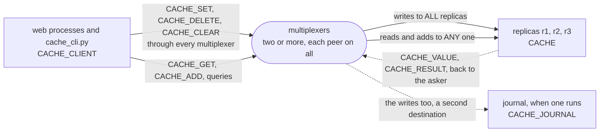

# cache

A replicated cache, and Django's cache API on top of it. Several replicas
each hold the whole cache in memory. A write, a delete or a clear is an
event routed to `ALL` replicas, and stamped, so that a copy arriving late
or twice changes nothing; a read is a query routed to `ANY` one of them,
round robin. That is the whole example, and the two rules in
[cache.rules](cache.rules) are the whole of the routing; a journal of
every write joined later, by a change to that file under the running
multiplexers, which nothing had to be restarted for. On top sits
`mxcache.backend.MultiplexerCache`, a Django cache backend: one line in a
settings file, and every web process shares one cache, however many
there are and whatever server runs them, which locmem never gives.

The example is installed with pip, the way a Django project is:
`mx-multiplexer` from PyPI, which brings the multiplexer, `mxcontrol`,
with it.
[walkthrough.md](walkthrough.md) builds it from nothing, every line of
the rules file, the payloads, the client, the replica, the Django
backend and the journal explained as it is added. It ends with the
measured steps and a walk through its test, which is also a walk
through testing a backend of your own with the library's harness.

```
pip install -r requirements.txt
mxcontrol run_multiplexer --rules cache.rules --address 127.0.0.1:1980     # the package's mxcontrol
mxcontrol run_multiplexer --rules cache.rules --address 127.0.0.1:1981     # a second one, in another terminal
python replica.py 127.0.0.1:1980,127.0.0.1:1981 --name r1                  # a replica; run r2 and r3 the same way
python cache_cli.py 127.0.0.1:1980,127.0.0.1:1981 set greeting hello
python cache_cli.py 127.0.0.1:1980,127.0.0.1:1981 get greeting
python journal.py 127.0.0.1:1980,127.0.0.1:1981 --file writes.log       # a journal of every write, optional
MX_ADDRESSES=127.0.0.1:1980,127.0.0.1:1981 python web/manage.py runserver  # the Django app on http://127.0.0.1:8000
```

`test.sh` runs the test in a virtual environment against real multiplexers.
The one line a Django project adds:

```python
CACHES = {
    "default": {
        "BACKEND": "mxcache.backend.MultiplexerCache",
        "LOCATION": "10.0.0.1:1980,10.0.0.2:1980",   # every multiplexer
    }
}
```

## The peers

Every peer connects to every multiplexer. Two rules route the cache: a
write to `ALL` replicas, and to the journal when one runs, a read or an
`add` to `ANY` one replica; the answers go back to whoever asked. The
walkthrough draws each exchange, step by step.



## What is what

- `cache.rules`: the system rules, then `CACHE_CLIENT`, `CACHE`,
  `CACHE_JOURNAL`, and the message types with their `ANY` and `ALL`
  rules; `multiplexer_constants.py`
  is what `mxcontrol generate_constants` wrote from it, and `cache.proto`
  the payloads, compiled to `cache_pb2.py`; `before.rules` is
  `cache.rules` before the journal, what step 8 starts from.
- `replica.py`: the replica, a plain `BaseMultiplexerServer`; `journal.py`:
  the journal, another, added while the cache ran.
- `mxcache/client.py`: `Cache`, the client; `mxcache/backend.py`: the
  Django cache backend on it.
- `cache_cli.py`: the command line the walkthrough's steps use.
- `web/`: the Django project with its four views.
- `test.py`, `test.sh`: the test on the harness, and the script that
  makes a venv and runs it.
