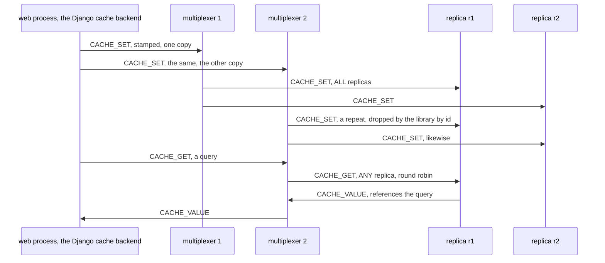
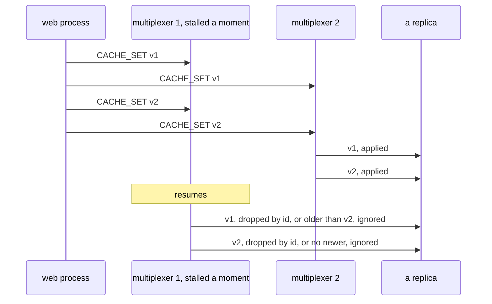
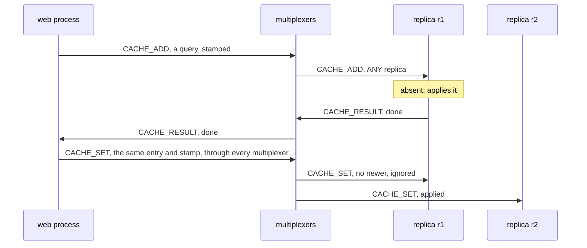
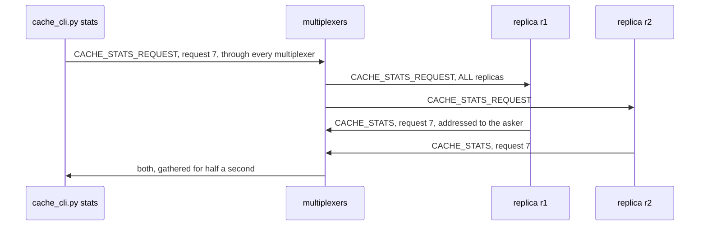

# Building the cache, step by step

This page builds the example from nothing: the rules file, the payloads,
the client, the replica, the Django cache backend, and a journal that
joins the cache while it runs, in that order, with every line of the six
files shown as it is added. Every code block
is a piece of a file in this directory, and `examples/check_walkthroughs.py`
keeps them identical to the files, so what you read here is what runs.
[README.md](README.md) is the front door: what the example is, a
picture of its peers, and how to run it. How the messages go, drawn,
the measured steps, the test and what the example does not do are at
the end of this page.

The idea in one sentence: several replicas each hold the whole cache,
a write is an event routed to every replica, a read is a query routed to
any one of them, and the multiplexer does the routing.

## 1. The rules file

Every multiplexer reads a rules file at start: the peer types it will
see, the message types, and where each message type goes. The file opens
with the system rules every rules file starts from, the protocol's own
types 1 to 99 and the six the libraries and `mxcontrol` use by name
([docs/rules.md](../../docs/rules.md)), which `mxcontrol generate_rules
cache.rules` wrote; they are left out here, and what follows is the
example's. Three peer types: `CACHE_CLIENT` for whoever reads and writes,
the web processes and the command line, and `CACHE` for the replicas.
Numbers from 100 up are yours, apart from the six the system rules hold
there; 201 and 202 here. The third, `CACHE_JOURNAL`, is
section 6's: it went into the file while the cache ran, and the
multiplexers put it in use without a restart.

```protobuf file=cache.rules from="# The example's peers and messages."
# The example's peers and messages.

peer {
    type: 201
    name: "CACHE_CLIENT"
    comment: "whoever reads and writes: the web processes, and the command line"
}

peer {
    type: 202
    name: "CACHE"
    comment: "a replica of the cache; every one holds the whole cache, run as many as you like"
}

peer {
    type: 203
    name: "CACHE_JOURNAL"
    comment: "a journal of every write, added while the cache ran; run one, or none"
}

```

A read: `CACHE_GET` goes to `ANY` one replica, round robin over the
replicas connected to the multiplexer that got it, and `CACHE_VALUE` is
the answer. A reply needs no `to` block: it is addressed to the peer that
asked, by instance id, which wins over the rules.

```protobuf file=cache.rules
type {
    type: 301
    name: "CACHE_GET"
    comment: "a read, payload CacheKey; any one replica answers with CACHE_VALUE"
    to {
        peer: "CACHE"
        whom: ANY
    }
}

type {
    type: 302
    name: "CACHE_VALUE"
    comment: "the answer to CACHE_GET, payload CacheValue"
}

```

The writes: `ALL` means every replica of the type gets a copy. Nothing
answers them; they are events. That is the whole of the replication: the
multiplexer copies the message, and every replica applies it. Each of
the three has a second destination, the journal of section 6, with
`report_delivery_error: false`: a journal may be absent, and a write
must not look lost to its sender for that. With the replicas alone the
default would do, since a write that no replica received is a write to
report.

```protobuf file=cache.rules
type {
    type: 303
    name: "CACHE_SET"
    comment: "a write, payload CacheEntry; every replica applies it, the journal writes it down, nobody answers"
    to {
        peer: "CACHE"
        whom: ALL
    }
    to {
        peer: "CACHE_JOURNAL"
        whom: ALL
        report_delivery_error: false
    }
}

type {
    type: 304
    name: "CACHE_DELETE"
    comment: "payload CacheKey; every replica drops the key, the journal writes it down"
    to {
        peer: "CACHE"
        whom: ALL
    }
    to {
        peer: "CACHE_JOURNAL"
        whom: ALL
        report_delivery_error: false
    }
}

type {
    type: 305
    name: "CACHE_CLEAR"
    comment: "payload CacheClear, its stamp; every replica drops everything written before it, the journal writes it down"
    to {
        peer: "CACHE"
        whom: ALL
    }
    to {
        peer: "CACHE_JOURNAL"
        whom: ALL
        report_delivery_error: false
    }
}

```

`add` is "set unless present", which needs one decision for all
replicas, so it is a query to `ANY` one: the replica that gets it
decides and answers with a `CACHE_RESULT`, and on a yes the caller sends
the entry to every replica as a `CACHE_SET`, the way its writes go.

```protobuf file=cache.rules
type {
    type: 306
    name: "CACHE_ADD"
    comment: "set unless present, payload CacheEntry; one replica decides, applies it and answers with CACHE_RESULT, and on a yes the caller sends it to every replica as a CACHE_SET"
    to {
        peer: "CACHE"
        whom: ANY
    }
}

type {
    type: 307
    name: "CACHE_RESULT"
    comment: "the answer to CACHE_ADD, payload CacheResult"
}

```

Last, a way to ask every replica what it holds: a request to `ALL`, and
answers that are not replies, since a query expects one reply and here
there are as many as replicas. `CACHE_STATS` therefore has no `to` block
either: each replica addresses its answer to the asker.

```protobuf file=cache.rules
type {
    type: 308
    name: "CACHE_STATS_REQUEST"
    comment: "payload CacheStatsRequest; every replica answers with a CACHE_STATS addressed to the asker"
    to {
        peer: "CACHE"
        whom: ALL
    }
}

type {
    type: 309
    name: "CACHE_STATS"
    comment: "one replica's numbers, payload CacheStats, addressed to whoever asked; not a reply, so it carries no references"
}
```

With the file written, `mxcontrol generate_constants cache.rules --python
multiplexer_constants.py --pyi multiplexer_constants.pyi` writes the
module the code below imports, so that it says `types.CACHE_GET` rather
than 301.

## 2. The payloads

A message's payload is bytes; the example uses protocol buffers for its
own, one per message type, compiled once with `protoc --python_out=.
--pyi_out=. cache.proto`. Values are bytes too: the replicas store what
they are given and never look inside.

```protobuf file=cache.proto
// The payloads of the cache example. Compiled once with `protoc
// --python_out=. --pyi_out=. cache.proto`; the generated cache_pb2.py is
// committed next to it. Values are bytes: the replicas store what they
// are given, and the Django backend pickles on its side.
syntax = "proto3";

package cache;

// CACHE_GET and CACHE_DELETE: the key; a delete carries its stamp, as a
// write does.
message CacheKey {
  string key = 1;
  uint64 version = 2;
  uint64 writer = 3;
}

```

Every write carries a stamp: the writer's clock in nanoseconds, larger
for each of its writes than for the one before, and the writer's
instance id for a tie between two writers. A replica applies a write
only when its stamp is newer than what it holds for the key, so a copy
that arrives twice, or late, changes nothing. Late happens: a write goes
through every multiplexer, and a multiplexer that stalls for a moment
delivers its copies after the other one delivered newer writes, past
the window of ids the receiving library remembers to drop repeats. An
entry also carries when it expires, as unix time, 0 for never. A clear
carries a stamp as well: every write stamped before it is gone, even
one that arrives after it.

```protobuf file=cache.proto
// CACHE_SET and CACHE_ADD: a key, its value, when it expires as unix time,
// 0 for never, and the write's stamp: the writer's clock in nanoseconds,
// larger for each of its writes than for the one before, and the writer's
// instance id for a tie. A replica applies a write only when its stamp is
// newer than what the replica holds, so a copy that arrives late, however
// late, never undoes a newer write; and a CACHE_ADD sent again by the
// library, the same stamp, is known as the same add.
message CacheEntry {
  string key = 1;
  bytes value = 2;
  double expires = 3;
  uint64 version = 4;
  uint64 writer = 5;
}

// CACHE_CLEAR: its stamp; every write stamped before it is gone, even one
// that arrives after it.
message CacheClear {
  uint64 version = 1;
  uint64 writer = 2;
}

```

The answer to a read says which replica answered, which the steps below
use to show the round robin.

```protobuf file=cache.proto
// CACHE_VALUE: what a replica found, and which replica it was.
message CacheValue {
  bool found = 1;
  bytes value = 2;
  string replica = 3;
}

```

The rest: the answer to an `add`, the request for numbers, and one
replica's numbers, with the request's id in the payload, since the
answer is not a reply.

```protobuf file=cache.proto
// CACHE_RESULT: whether the replica that decided a CACHE_ADD applied it.
message CacheResult {
  bool done = 1;
  string replica = 2;
}

// CACHE_STATS_REQUEST: an id the answers carry, since they are not replies.
message CacheStatsRequest {
  uint64 request_id = 1;
}

// CACHE_STATS: one replica's numbers.
message CacheStats {
  uint64 request_id = 1;
  string replica = 2;
  uint64 instance_id = 3;
  uint64 entries = 4;
  uint64 writes = 5;
  uint64 reads = 6;
  uint64 hits = 7;
}
```

## 3. The client

The client comes before the replica, because the replica is easier to
read once the questions it answers are clear. `mxcache/client.py` holds
one `ThreadedClient`, connected to every multiplexer, whose io thread
heartbeats and reconnects on its own; every method is safe from any
thread, which is what a web process's threads need.

```python file=mxcache/client.py
"""Cache: the client of the replicated cache. A read is a query to any one
replica; a write, a delete or a clear is an event to every replica, sent
through every multiplexer unless told otherwise, and stamped, so that a
replica applies only what is newer than what it holds; `add` is a query
that one replica decides, and on a yes this client sends the entry to
every replica, the way its other writes go. A read that fails for want of
a replica or a multiplexer is a miss: a cache that cannot be reached is an
empty one, which is what a caller of a cache expects, and the count of
those is kept for whoever wants to know."""

import collections
import random
import threading
import time

from multiplexer.mxclient import MultiplexerClientError
from multiplexer.threaded_client import BackendError, ThreadedClient

from cache_pb2 import CacheClear, CacheEntry, CacheKey, CacheResult, CacheStats, CacheStatsRequest, CacheValue
from multiplexer_constants import peers, types

WRITES_REMEMBERED = 4096  # writes whose delivery errors are counted; older ones are forgotten


def parse_addresses(text: str) -> list[tuple[str, int]]:
    """ "host:port,host:port" as the list the library takes."""
    return [(host, int(port)) for host, port in (item.rsplit(":", 1) for item in text.split(","))]


```

`writes_through` is the one choice in this class. `ALL` sends every
write through every multiplexer, one copy each; a replica connected to
both gets two, applies the first, and its library drops the second by
its id; the stamp catches a copy that comes after the library forgot the
first.
That costs a copy per multiplexer and buys two things: a multiplexer
dying at that moment loses nothing, and a read after one's own write is
never stale, because the read follows the write's copy on whichever
connection it takes. `ONE` exists for the ordering step below, which
measures what happens without that. The counters say what a cache's
caller may want to know and nobody else will tell them; the ordered
dictionary behind `lost_writes` remembers the last few thousand writes
and how many multiplexers have refused each so far.

```python file=mxcache/client.py
class Cache:
    """One ThreadedClient connected to every multiplexer; every method is safe from any thread."""

    ALL = ThreadedClient.ALL  # writes through every multiplexer: each replica gets one copy per multiplexer
    ONE = ThreadedClient.ONE  # writes through one multiplexer, round robin: the walkthrough's ordering step

    def __init__(
        self, addresses: list[tuple[str, int]], writes_through: int = ThreadedClient.ALL, timeout: float = 5.0
    ):
        self.writes_through = writes_through
        self.timeout = timeout
        self.unavailable = 0  # reads answered as misses because no replica or no multiplexer could be reached
        self.lost_writes = 0  # writes each multiplexer named said it could deliver to no replica
        self._gathers: dict[int, list[CacheStats]] = {}
        self._refusals: collections.OrderedDict[int, int] = collections.OrderedDict()  # write id: delivery errors
        self._multiplexers = len(addresses)
        self._version = 0
        self._lock = threading.Lock()
        self._client = ThreadedClient(addresses, type=peers.CACHE_CLIENT, on_message=self._on_message)

```

A read is a `query()`: the request goes through one connection, the
multiplexer hands it to one replica, and the reply comes back
referencing the request's id. Everything the library can raise, no
multiplexer, no replica, a timeout, a replica's own failure, becomes a
miss, since a cache that cannot be reached is an empty one; `lookup()`
keeps the whole answer for the command line, `get()` is what a cache's
caller wants.

```python file=mxcache/client.py
    def lookup(self, key: str) -> CacheValue | None:
        """One read: the replica's answer, with which replica it was; None when none could be asked."""
        try:
            reply = self._client.query(CacheKey(key=key), type=types.CACHE_GET, timeout=self.timeout)
        except (MultiplexerClientError, BackendError):
            self.unavailable += 1
            return None
        value = CacheValue()
        value.ParseFromString(reply.message)
        return value

    def get(self, key: str) -> bytes | None:
        """The value, or None for a miss of any kind."""
        value = self.lookup(key)
        return value.value if value is not None and value.found else None

```

The writes are `send_message()` with `multiplexer=self.writes_through`,
each stamped: the call returns as soon as the io thread has the message,
and nothing comes back.

```python file=mxcache/client.py
    def set(self, key: str, value: bytes, expires: float = 0.0) -> None:
        """Write to every replica; `expires` is unix time, 0 for never."""
        self._write(self._entry(key, value, expires), types.CACHE_SET)

    def delete(self, key: str) -> None:
        """Drop the key on every replica."""
        version, writer = self._stamp()
        self._write(CacheKey(key=key, version=version, writer=writer), types.CACHE_DELETE)

    def clear(self) -> None:
        """Drop everything on every replica."""
        version, writer = self._stamp()
        self._write(CacheClear(version=version, writer=writer), types.CACHE_CLEAR)

```

`add()` is a query, so it has an answer: whether the replica that
decided applied it. On a yes the entry goes to every replica from here,
through the same connections as this client's next reads and writes,
so neither can overtake it; a copy from the deciding replica, through
the one multiplexer the query came by, could be overtaken by either. A
failure to reach anyone is `False`, the safe answer for "set unless
present".

```python file=mxcache/client.py
    def add(self, key: str, value: bytes, expires: float = 0.0) -> bool:
        """Set unless present, decided by one replica; False when it was present, or when nobody could decide.
        On a yes, the entry goes to every replica from here, in order with this client's later reads and
        writes, which a copy from the deciding replica, through one multiplexer, would not be."""
        entry = self._entry(key, value, expires)
        try:
            reply = self._client.query(entry, type=types.CACHE_ADD, timeout=self.timeout)
        except (MultiplexerClientError, BackendError):
            self.unavailable += 1
            return False
        result = CacheResult()
        result.ParseFromString(reply.message)
        if result.done:
            self._write(entry, types.CACHE_SET)
        return result.done

```

`stats()` shows the other shape of fan-out. The request is one event
routed to every replica, sent through every multiplexer, so that a
replica connected to only one of them, just after a restart, is asked
too; the answers are events addressed to this client, one per replica,
with the request's id in the payload. So the method registers the id,
sends, waits a moment, and collects whatever came, sorted by replica
name.

```python file=mxcache/client.py
    def stats(self, wait: float = 0.5) -> list[CacheStats]:
        """Every replica's numbers: one request to all of them, through every multiplexer so that a
        replica that is on one only is asked too, and whatever answered within `wait` seconds."""
        request_id = random.getrandbits(63)
        with self._lock:
            self._gathers[request_id] = []
        self._client.send_message(
            CacheStatsRequest(request_id=request_id), type=types.CACHE_STATS_REQUEST, multiplexer=ThreadedClient.ALL
        )
        time.sleep(wait)
        with self._lock:
            return sorted(self._gathers.pop(request_id), key=lambda stats: stats.replica)

    def close(self) -> None:
        """Shut the client down; the object is done."""
        self._client.shutdown()

```

The stamp: the clock in nanoseconds, or one more than the last stamp
when the clock has not moved on, or went back, so that this client's
writes are ordered among themselves whatever the clock does. Every write
goes out through `_write()`, which notes how many copies left.

```python file=mxcache/client.py
    def _stamp(self) -> tuple[int, int]:
        """A stamp newer than every one this client made before: the clock in nanoseconds, one more when
        it has not moved on, or went back; this client's instance id for a tie with another writer."""
        with self._lock:
            self._version = max(time.time_ns(), self._version + 1)
            return self._version, self._client.instance_id

    def _entry(self, key: str, value: bytes, expires: float) -> CacheEntry:
        """A stamped entry."""
        version, writer = self._stamp()
        return CacheEntry(key=key, value=value, expires=expires, version=version, writer=writer)

    def _write(self, message, kind: int) -> None:
        """An event to every replica, its id remembered for the delivery errors it may bring."""
        mxmsg_id = self._client.send_message(message, type=kind, multiplexer=self.writes_through)
        with self._lock:
            self._refusals[mxmsg_id] = 0
            while len(self._refusals) > WRITES_REMEMBERED:
                self._refusals.popitem(last=False)

```

The answers arrive on the client's io thread, in `on_message`, the
callback given at construction for every message that is not a reply to
a query. Two kinds come: a replica's numbers, kept if a `stats()` call
is waiting for that request id, and a multiplexer's delivery error,
which the rules make it send when a write reached no replica. A write
counts as lost once each multiplexer the client names said so, both of
them for a write through every multiplexer: one multiplexer without
replicas while the other delivered is not a loss. A multiplexer that is
down says nothing, so a write the other could deliver to no replica
while it is goes uncounted: the library does not tell the sender how
many copies went out.

```python file=mxcache/client.py
    def _on_message(self, mxmsg) -> None:
        """On the io thread: a replica's numbers, or a multiplexer saying a message reached nobody. A write
        is lost once each multiplexer this client names said so, one for a write through one; one that is
        down says nothing, so a write lost while it is goes uncounted. A stats request is not a write."""
        if mxmsg.type == types.CACHE_STATS:
            stats = CacheStats()
            stats.ParseFromString(mxmsg.message)
            with self._lock:
                gather = self._gathers.get(stats.request_id)
                # A replica answers the request's second copy only when its library forgot the first.
                if gather is not None and all(held.instance_id != stats.instance_id for held in gather):
                    gather.append(stats)
        elif mxmsg.type == types.DELIVERY_ERROR:
            copies = self._multiplexers if self.writes_through == ThreadedClient.ALL else 1
            with self._lock:
                refused = self._refusals.get(mxmsg.references)
                if refused is None:
                    return
                if refused + 1 < copies:
                    self._refusals[mxmsg.references] = refused + 1
                    return
                del self._refusals[mxmsg.references]
                self.lost_writes += 1
```

## 4. The replica

`replica.py` is a `BaseMultiplexerServer`, the plain server class: the
loop that talks to the multiplexers is the loop that serves, and
`handle_message()` runs on it. A dictionary operation takes
microseconds, so nothing here needs a worker thread; the inference
example's worker is the threaded one, which lets several requests run
at once on one loaded model. The docstring is the program's help.

```python file=replica.py
"""A replica of the cache: a backend on `BaseMultiplexerServer` that holds
the whole cache in memory. A write, a delete or a clear reaches every
replica as an event and is applied; a read is answered by whichever replica
the multiplexer picked.

    python replica.py [ADDRESSES] [--name NAME] [--drain-file PATH]

ADDRESSES is host:port of every multiplexer, comma-separated, default
127.0.0.1:1980. The replica is a BaseMultiplexerServer, the plain one: a
dictionary operation takes microseconds, so nothing here needs a worker
thread, and the loop that talks to the multiplexers is the loop that
serves. Every write carries a stamp, and a replica applies only what is
newer than what it holds, so copies arriving late or twice change nothing.
A replica starts empty and warms as keys are written again: the
multiplexer replays nothing, and the walkthrough says why that is the
honest cache. Creating --drain-file asks the replica to leave the way a
deployment's rolling restart would."""

import argparse
import os
import socket
import time

from multiplexer.servers import BaseMultiplexerServer

from cache_pb2 import CacheClear, CacheEntry, CacheKey, CacheResult, CacheStats, CacheStatsRequest, CacheValue
from multiplexer_constants import peers, types
from mxcache.client import parse_addresses

```

The class names its peer type for the base class, and holds the cache:
value, expiry and stamp per key; the stamps of recent deletes, kept five
minutes against a late copy of an older write, far longer than a
multiplexer can stall before its peers drop it; the stamp of the last
clear; three counters; and the times of the last sweep and the last
look for the drain file.

```python file=replica.py
PURGE_EVERY = 5.0  # seconds between sweeps of expired entries and old deletes
KEEP_DELETES = 300.0  # seconds a delete's stamp is kept, against a late copy of an older write
DRAIN_CHECK_EVERY = 0.5  # seconds between looks for the drain file

Stamp = tuple[int, int]  # a write's (version, writer); larger is newer


class Replica(BaseMultiplexerServer):
    """The cache, and the handler for each of its messages."""

    multiplexer_client_type = peers.CACHE

    def __init__(self, addresses: list[tuple[str, int]], name: str | None = None, drain_file: str | None = None):
        super().__init__(addresses)
        self.name = name or f"{socket.gethostname()}:{os.getpid()}"
        self.drain_file = drain_file
        self.entries: dict[str, tuple[bytes, float, Stamp]] = {}  # key: (value, expires, 0 for never; stamp)
        self.deleted: dict[str, tuple[Stamp, float]] = {}  # key: (the delete's stamp, when to forget it)
        self.cleared: Stamp = (0, 0)  # the last clear's stamp: every write stamped before it is gone
        self.writes = 0  # CACHE_SET, CACHE_DELETE and CACHE_CLEAR applied, and CACHE_ADD decided yes here
        self.reads = 0
        self.hits = 0
        self._purged_at = time.time()
        self._drain_checked_at = 0.0

```

`handle_message()` gets every message the multiplexer routes here, and
dispatches on its type. A read: parse the key, look it up, and answer
with `send_message()`, which the base class addresses to the requester
and marks as the reply to the request, since it references the
request's id.

```python file=replica.py
    def handle_message(self, mxmsg) -> None:
        """A read answered, a write applied, a question about this replica answered."""
        kind = mxmsg.type
        if kind == types.CACHE_GET:
            key = self.parse_message(CacheKey).key
            self.reads += 1
            held = self._live(key)
            if held is not None:
                self.hits += 1
            self.send_message(
                message=CacheValue(found=held is not None, value=held[0] if held else b"", replica=self.name),
                type=types.CACHE_VALUE,
            )
```

The writes, each applied only when its stamp is newer than what the
replica knows of the key: its entry, a delete of it, a clear. Then
`no_response()`, which tells the base class that an event needed no
answer; without that it would log a warning for a request left
unanswered.

```python file=replica.py
        elif kind == types.CACHE_SET:
            self._set(self.parse_message(CacheEntry))
            self.no_response()
        elif kind == types.CACHE_DELETE:
            key = self.parse_message(CacheKey)
            stamp = (key.version, key.writer)
            if self._newer(key.key, stamp):
                self.entries.pop(key.key, None)
                self.deleted[key.key] = (stamp, time.time() + KEEP_DELETES)
                self.writes += 1
            self.no_response()
        elif kind == types.CACHE_CLEAR:
            clear = self.parse_message(CacheClear)
            stamp = (clear.version, clear.writer)
            if stamp > self.cleared:
                self.cleared = stamp
                self.entries = {key: held for key, held in self.entries.items() if held[2] > stamp}
                self.deleted = {key: gone for key, gone in self.deleted.items() if gone[0] > stamp}
                self.writes += 1
            self.no_response()
```

`add` is where one replica decides. The multiplexer picked this one, so
this one looks: absent, it applies the entry and answers yes, and the
client sends the entry to every replica; present with the add's own
stamp, it is this very add sent a second time, which the client's
library does with a new message id when a connection dies under the
query, and the answer is yes again. The stamp is what tells the repeat
from a second add, since the message id cannot
([docs/semantics.md](../../docs/semantics.md)).

```python file=replica.py
        elif kind == types.CACHE_ADD:
            # One replica decides: this one, since the multiplexer picked it.
            # Absent, the entry is applied here and the answer is yes; the
            # client then sends it to every replica. Present with the add's
            # own stamp, it is this add again, sent a second time by the
            # client's library after a lost connection: yes again.
            entry = self.parse_message(CacheEntry)
            stamp = (entry.version, entry.writer)
            held = self._live(entry.key)
            if held is None:
                done = self._set(entry)
            else:
                done = held[2] == stamp
            self.send_message(message=CacheResult(done=done, replica=self.name), type=types.CACHE_RESULT)
```

The numbers, addressed to the asker with `references=0`, so that the
asker's client sees an event and not a reply. Any other type is
dropped with `no_response()`.

```python file=replica.py
        elif kind == types.CACHE_STATS_REQUEST:
            # Not a reply: every replica answers the same request, so the
            # answer is addressed to the asker and carries the request's id
            # in its payload, and references nothing.
            request = self.parse_message(CacheStatsRequest)
            self.send_message(
                message=CacheStats(
                    request_id=request.request_id,
                    replica=self.name,
                    instance_id=self.conn.instance_id,
                    entries=len(self.entries),
                    writes=self.writes,
                    reads=self.reads,
                    hits=self.hits,
                ),
                type=types.CACHE_STATS,
                references=0,
            )
        else:
            self.no_response()

```

`periodic_task()` runs after every message and after every poll of the
loop, half a second here; it looks for the drain file, the way a
deployment asks a backend to leave ([docs/leaving.md](../../docs/leaving.md)),
twice a second rather than on every message, and sweeps expired entries
and old deletes every few seconds.

```python file=replica.py
    def periodic_task(self) -> None:
        """After every message and every poll: leave once the drain file exists, looked for twice a second
        rather than on every message, and sweep expired entries and old deletes now and then."""
        now = time.time()
        if self.drain_file and now - self._drain_checked_at >= DRAIN_CHECK_EVERY:
            self._drain_checked_at = now
            if os.path.exists(self.drain_file):
                self.start_draining()
        if now - self._purged_at >= PURGE_EVERY:
            self._purged_at = now
            for key in [key for key, (_, expires, _) in self.entries.items() if expires and expires <= now]:
                del self.entries[key]
            for key in [key for key, (_, forget) in self.deleted.items() if forget <= now]:
                del self.deleted[key]

```

The helpers: a read that lets an expired entry go, the one rule of
newer, and a write.

```python file=replica.py
    def _live(self, key: str) -> tuple[bytes, float, Stamp] | None:
        """The live entry, or None; an expired entry goes on the way."""
        held = self.entries.get(key)
        if held is None:
            return None
        if held[1] and held[1] <= time.time():
            del self.entries[key]
            return None
        return held

    def _newer(self, key: str, stamp: Stamp) -> bool:
        """Whether a write stamped `stamp` is newer than all this replica knows of `key`: its entry, a
        delete of it, a clear. A copy that arrives late, or twice, is not."""
        if stamp <= self.cleared:
            return False
        held = self.entries.get(key)
        if held is not None and held[2] >= stamp:
            return False
        gone = self.deleted.get(key)
        return gone is None or gone[0] < stamp

    def _set(self, entry: CacheEntry) -> bool:
        """Apply a write when it is newer than what is held; whether it was."""
        stamp = (entry.version, entry.writer)
        if not self._newer(entry.key, stamp):
            return False
        self.entries[entry.key] = (entry.value, entry.expires, stamp)
        self.deleted.pop(entry.key, None)
        self.writes += 1
        return True


```

And the program: parse the addresses, build the replica, say `ready`,
and serve until asked to leave, with a drain of five seconds at most:
the multiplexers route it nothing new, and it leaves once they have
confirmed. The constructor
only makes the instance id, and `serve_forever()` connects; the line is
for the person running the steps. A program whose line something waits
for before sending, the echo backend's `ready`, which its test reads and
then queries at once, calls `connect()` before printing, so that the line
means reachable.

```python file=replica.py
def main() -> None:
    """Serve until asked to leave."""
    parser = argparse.ArgumentParser(description=(__doc__ or "").split("\n\n")[0])
    parser.add_argument(
        "addresses", nargs="?", default="127.0.0.1:1980", help="host:port of every multiplexer, comma-separated"
    )
    parser.add_argument("--name", help="how this replica signs its answers; default host:pid")
    parser.add_argument("--drain-file", help="creating this file asks the replica to leave gracefully")
    args = parser.parse_args()
    replica = Replica(parse_addresses(args.addresses), args.name, args.drain_file)
    # The line is for whoever runs the steps; nothing waits for it, and serve_forever() connects.
    print(f"ready: replica {replica.name}, instance {replica.conn.instance_id}", flush=True)
    replica.serve_forever(poll=0.5, drain_seconds=5)
    print(
        f"left with {len(replica.entries)} entries after {replica.writes} writes and {replica.reads} reads", flush=True
    )


if __name__ == "__main__":
    main()
```

That is a complete backend: under two hundred lines, none of them
about connections, heartbeats, retries or threads.

## 5. The Django cache backend

`mxcache/backend.py` puts Django's cache API on the client. Django
makes one backend instance per thread, so the client, which is safe from
any thread and holds the connections, is shared per process: made on
the first cache call, and forgotten in a forked child. A server that
forks its workers from a parent that already used the cache, as
gunicorn with `--preload` can when the application touches the cache
while it loads, must not leave a child the parent's connections.

```python file=mxcache/backend.py
"""The Django cache backend over the replicas:

    CACHES = {
        "default": {
            "BACKEND": "mxcache.backend.MultiplexerCache",
            "LOCATION": "10.0.0.1:1980,10.0.0.2:1980",   # every multiplexer
        }
    }

Every web process then shares one cache, whatever server runs them and
however many there are, which locmem never gives. One threaded client per
process, made on first use and forgotten in a forked child, serves every
thread's backend instance, since Django makes one per thread. Values are
pickled here; the replicas store bytes."""

import os
import pickle
import threading
import time

from django.core.cache.backends.base import DEFAULT_TIMEOUT, BaseCache

from mxcache.client import Cache, parse_addresses

```

```python file=mxcache/backend.py
_clients: dict[tuple[tuple[str, int], ...], Cache] = {}
_lock = threading.Lock()


def _forget_in_child() -> None:
    """The child of a fork must not touch the parent's clients."""
    _clients.clear()


os.register_at_fork(after_in_child=_forget_in_child)


def shared_cache(addresses: list[tuple[str, int]]) -> Cache:
    """The process's one client for these multiplexers, made on the first call."""
    key = tuple(addresses)
    with _lock:
        if key not in _clients:
            _clients[key] = Cache(list(key))
        return _clients[key]


```

`BaseCache` wants `get`, `set`, `add`, `touch`, `delete` and `clear`,
and derives `get_many`, `get_or_set`, `incr` and the rest from those.
`LOCATION` is the multiplexers, and Django's timeout, seconds from now
or `None` for never, becomes the replicas' absolute time, 0 for never.

```python file=mxcache/backend.py
class MultiplexerCache(BaseCache):
    """Django's cache API: get, set, add, touch, delete, clear here; the base class derives the rest."""

    def __init__(self, location: str, params: dict):
        super().__init__(params)
        self._addresses = parse_addresses(location)

    @property
    def cache(self) -> Cache:
        """The shared client."""
        return shared_cache(self._addresses)

    def _expires(self, timeout) -> float:
        """Django's timeout as the replicas' absolute time, 0 for never."""
        when = self.get_backend_timeout(timeout)
        return 0.0 if when is None else when

```

Values are pickled here, as Django's own backends do; a `set` with a
timeout of 0, which Django defines as "expire at once", is a delete.

```python file=mxcache/backend.py
    def get(self, key, default=None, version=None):
        """The value from any one replica, `default` when it has none."""
        raw = self.cache.get(self.make_and_validate_key(key, version=version))
        return default if raw is None else pickle.loads(raw)

    def set(self, key, value, timeout=DEFAULT_TIMEOUT, version=None):
        """The value to every replica, pickled; a timeout of 0 deletes the key instead."""
        key = self.make_and_validate_key(key, version=version)
        expires = self._expires(timeout)
        if expires and expires <= time.time():  # a timeout of 0: expire at once
            self.cache.delete(key)
            return
        self.cache.set(key, pickle.dumps(value, pickle.HIGHEST_PROTOCOL), expires)

    def add(self, key, value, timeout=DEFAULT_TIMEOUT, version=None):
        """Set unless present, as one replica decides; whether it was set."""
        key = self.make_and_validate_key(key, version=version)
        expires = self._expires(timeout)
        if expires and expires <= time.time():
            return False
        return self.cache.add(key, pickle.dumps(value, pickle.HIGHEST_PROTOCOL), expires)

```

`touch` is a read then a write, not one operation, and `delete` cannot
say whether the key existed, since it is an event; "What it does not
do" below says so. `close()` does nothing: the client is the
process's, not the request's.

```python file=mxcache/backend.py
    def touch(self, key, timeout=DEFAULT_TIMEOUT, version=None):
        """A new timeout for the key, whether it was there. A read and a write,
        not one operation: a write that lands between them is undone by this
        one, which writes back the value it read."""
        key = self.make_and_validate_key(key, version=version)
        raw = self.cache.get(key)
        if raw is None:
            return False
        self.cache.set(key, raw, self._expires(timeout))
        return True

    def delete(self, key, version=None):
        """The key gone from every replica. An event: whether it existed is not asked, so this returns True."""
        self.cache.delete(self.make_and_validate_key(key, version=version))
        return True

    def clear(self):
        """Everything gone from every replica."""
        self.cache.clear()

    def close(self, **kwargs):
        """Nothing: the client is the process's, not the request's."""
```

One setting, and every web process shares one cache:

```python
CACHES = {
    "default": {
        "BACKEND": "mxcache.backend.MultiplexerCache",
        "LOCATION": "10.0.0.1:1980,10.0.0.2:1980",
    }
}
```

## 6. A journal, added while it runs

The multiplexers read their rules file again every two seconds, on
`SIGHUP`, and on `mxcontrol rules reload`, and put a changed file in use
whole, between two messages, once two reads in a row have seen the same
new bytes, so that a file caught in the middle of being written is never
applied
([changing the rules](../../docs/operations.md#changing-the-rules)). So
a running cache can grow a consumer that none of its programs know
about. This section adds a journal of every write: the peer type
`CACHE_JOURNAL` and the second destination on `CACHE_SET`,
`CACHE_DELETE` and `CACHE_CLEAR`, the lines section 1 showed, go into
the file while everything runs. Nothing else changes: the replicas, the
client and the web app keep running, and the constants they were built
from are still right, since a peer type was added and no number moved.

`journal.py` is the smallest backend there is: it receives the three
events, as the replicas do, and writes one line of JSON per event.

```python file=journal.py
"""A journal of the cache's writes: a backend that receives every
CACHE_SET, CACHE_DELETE and CACHE_CLEAR, as the replicas do, and writes
one line of JSON per event, so that the cache's history can be read. It
joins a running cache: its peer type and a second destination on the
three events went into the rules file while the multiplexers, the
replicas and the web app ran, which the walkthrough's section 6 shows.

    python journal.py [ADDRESSES] [--file PATH]

ADDRESSES is host:port of every multiplexer, comma-separated, default
127.0.0.1:1980; the lines go to PATH, journal.log by default."""

import argparse
import json
import time
from typing import TextIO

from multiplexer.servers import BaseMultiplexerServer

from cache_pb2 import CacheEntry, CacheKey
from multiplexer_constants import peers, types
from mxcache.client import parse_addresses


```

The class: the peer type the multiplexers accept once the new file is
in use, the file the lines go to, and a count.

```python file=journal.py
class Journal(BaseMultiplexerServer):
    """One line per write, delete or clear: the event, when, and from whom."""

    multiplexer_client_type = peers.CACHE_JOURNAL

    def __init__(self, addresses: list[tuple[str, int]], out: TextIO):
        super().__init__(addresses)
        self.out = out
        self.lines = 0

```

The handler: a line per event, nothing answered, since an event has no
answer, and anything else ignored.

```python file=journal.py
    def handle_message(self, mxmsg) -> None:
        """An event written down; anything else ignored. Nothing is answered."""
        kind = mxmsg.type
        line: dict[str, str | int | float]
        if kind == types.CACHE_SET:
            entry = self.parse_message(CacheEntry)
            line = {"event": "set", "key": entry.key, "bytes": len(entry.value), "expires": entry.expires}
        elif kind == types.CACHE_DELETE:
            line = {"event": "delete", "key": self.parse_message(CacheKey).key}
        elif kind == types.CACHE_CLEAR:
            line = {"event": "clear"}
        else:
            self.no_response()
            return
        line["at"] = round(time.time(), 3)
        line["from"] = mxmsg.from_
        self.out.write(json.dumps(line) + "\n")
        self.out.flush()
        self.lines += 1
        self.no_response()


```

And `main`: `serve_forever()` connects and serves until the process is
stopped.

```python file=journal.py
def main() -> None:
    """Write the journal until stopped."""
    parser = argparse.ArgumentParser(description=(__doc__ or "").split("\n\n")[0])
    parser.add_argument(
        "addresses", nargs="?", default="127.0.0.1:1980", help="host:port of every multiplexer, comma-separated"
    )
    parser.add_argument("--file", default="journal.log", help="where the lines go, appended")
    args = parser.parse_args()
    with open(args.file, "a") as out:
        journal = Journal(parse_addresses(args.addresses), out)
        print(f"ready: journal to {args.file}, instance {journal.conn.instance_id}", flush=True)
        journal.serve_forever(poll=0.5)
        print(f"left after {journal.lines} lines", flush=True)


if __name__ == "__main__":
    main()
```

Adding it to the running cache, in order: the three blocks go into the
rules file the multiplexers read; within four seconds, two checks,
each logs `rules reloaded from` with the new fingerprint, and
`mxcontrol rules status`
shows every multiplexer on it, the fingerprint the regenerated
constants carry; then the journal starts, connects as the type the
multiplexers now accept, and every write from then on reaches it as
well as the replicas. Step 8 below does exactly that and shows what
each side printed, and the test at the end does it under the harness,
with the file edited under a `Cluster` started with
`rules_check_interval=0.2`.

## 7. What is left

The command line, [cache_cli.py](cache_cli.py), is the `Cache` class
with an argument parser; the Django project under [web/](web/) has four
views that know only `django.core.cache`; and [test.py](test.py) runs
all of it against real multiplexers, which "Testing it with the
harness" below walks through. The steps below show the round robin, a
restarted replica warming up, a multiplexer killed under load, the
ordering rule measured, and the journal joining while the cache runs.

## How it fits together

A write goes to every replica, through every multiplexer, and a read to
any one replica, through one multiplexer; the rules file says so and
nobody else does. Each replica gets one copy of a write per
multiplexer and applies the first; its library drops the second by id.



The read follows the write's copy on the connection it takes, so a read
after one's own write is never stale. A copy that comes late, from a
multiplexer that stalled while the other delivered newer writes,
changes nothing: the replica's library drops it by its id while it
remembers the first copy, and past that the replica ignores it for its
stamp, older than what every replica holds by then:



`add` is decided by one replica, the one the multiplexer picked, and
the client that asked sends the entry to every replica on a yes, in
order with its own next reads and writes:



`stats()` is the other shape of fan-out: one request to every replica,
and every replica's answer addressed back to the asker, not as a reply,
since a query has one, but as an event with the request's id in its
payload.



The replica, [replica.py](replica.py), is a `BaseMultiplexerServer`, the
plain one: a dictionary operation takes microseconds, so nothing here
needs a worker thread, and the loop that talks to the multiplexers is
the loop that serves. The client, [mxcache/client.py](mxcache/client.py),
holds one `ThreadedClient` connected to every multiplexer and is safe
from any thread; a read that fails for want of a replica or a
multiplexer is a miss, since a cache that cannot be reached is an empty
one, and `unavailable` counts those. The Django backend,
[mxcache/backend.py](mxcache/backend.py), is a `BaseCache` with `get`,
`set`, `add`, `touch`, `delete` and `clear`; Django makes one backend
instance per thread, so the client is shared per process, made on first
use and forgotten in a forked child, the holder from
[the web server recipe](../../docs/recipes/web_server.md). Values are
pickled there; the replicas never look inside them.

## The steps

Two multiplexers on ports 1980 and 1981, three replicas r1, r2 and r3,
started from the example's directory with their logs and process ids in
files, so that the steps can stop them. Each command's output is what
the last run printed; the library's own INFO lines about connections go
to stderr and are left out.

```
$ mxcontrol run_multiplexer --rules cache.rules --address 127.0.0.1:1980 > mx1.log 2>&1 & echo $! > mx1.pid
$ mxcontrol run_multiplexer --rules cache.rules --address 127.0.0.1:1981 > mx2.log 2>&1 & echo $! > mx2.pid
$ python replica.py 127.0.0.1:1980,127.0.0.1:1981 --name r1 > r1.log 2>&1 & echo $! > r1.pid
$ python replica.py 127.0.0.1:1980,127.0.0.1:1981 --name r2 > r2.log 2>&1 & echo $! > r2.pid
$ python replica.py 127.0.0.1:1980,127.0.0.1:1981 --name r3 > r3.log 2>&1 & echo $! > r3.pid
$ cat r1.log
ready: replica r1, instance 8744604571593024697
```

**1. A write reaches every replica, a read any one of them.**

```
$ python cache_cli.py 127.0.0.1:1980,127.0.0.1:1981 set greeting hello
greeting set

$ python cache_cli.py 127.0.0.1:1980,127.0.0.1:1981 get greeting --repeat 4
greeting = hello  (replica r3)
greeting = hello  (replica r3)
greeting = hello  (replica r2)
greeting = hello  (replica r2)

$ python cache_cli.py 127.0.0.1:1980,127.0.0.1:1981 stats
replica r1 (instance 8744604571593024697): 1 entries, 1 writes, 0 reads, 0 hits
replica r2 (instance 2891011210130110831): 1 entries, 1 writes, 2 reads, 2 hits
replica r3 (instance 17012848459393614777): 1 entries, 1 writes, 2 reads, 2 hits
```

Each read went through the next multiplexer, and each multiplexer handed
it to its next replica: that is the round robin, and every replica has
the key.

**2. A replica started again starts empty.** Stop r1 and start it again.
The multiplexer replays nothing, so the new r1 misses until the keys are
written again, which a cache's callers do on a miss anyway; every other
replica keeps answering meanwhile.

```
$ kill $(cat r1.pid)
$ python replica.py 127.0.0.1:1980,127.0.0.1:1981 --name r1 > r1.log 2>&1 & echo $! > r1.pid

$ python cache_cli.py 127.0.0.1:1980,127.0.0.1:1981 stats
replica r1 (instance 4457096789636140875): 0 entries, 0 writes, 0 reads, 0 hits
replica r2 (instance 2891011210130110831): 1 entries, 1 writes, 2 reads, 2 hits
replica r3 (instance 17012848459393614777): 1 entries, 1 writes, 2 reads, 2 hits

$ python cache_cli.py 127.0.0.1:1980,127.0.0.1:1981 get greeting --repeat 6
greeting: miss  (replica r1)
greeting: miss  (replica r1)
greeting = hello  (replica r3)
greeting = hello  (replica r3)
greeting = hello  (replica r2)
greeting = hello  (replica r2)

$ python cache_cli.py 127.0.0.1:1980,127.0.0.1:1981 set greeting hello
greeting set

$ python cache_cli.py 127.0.0.1:1980,127.0.0.1:1981 get greeting --repeat 6
greeting = hello  (replica r1)
greeting = hello  (replica r1)
greeting = hello  (replica r3)
greeting = hello  (replica r3)
greeting = hello  (replica r2)
greeting = hello  (replica r2)
```

**3. A multiplexer dies under writes and reads.** A loop of write-then-
read pairs for four seconds, and a second and a half in, the first
multiplexer is killed with `kill -9`.

```
$ python cache_cli.py 127.0.0.1:1980,127.0.0.1:1981 loop --seconds 4 &
$ kill -9 $(cat mx1.pid)   # a second and a half in
69965 write-then-read pairs in 4.0 s, writes through every multiplexer: 0 stale reads, 0 misses, of which 0 with no replica reachable
```

Nothing a caller could notice. The write's copy through the dead
multiplexer was lost, the copy through the other one arrived; the read
that was in flight through the dead one went out again through the other
at once. Start the multiplexer again, as at the start, and every peer is
back on it within about three seconds.

**4. Writes through every multiplexer are handled once per replica.**
`fill` sets a hundred keys, each sent through both multiplexers, two
hundred copies in all; each replica's `writes` goes up by exactly a
hundred. The library on the receiving side remembers the ids of the last
messages it saw and drops a repeat; a repeat it no longer remembers,
from a multiplexer that fell behind, has a stamp no newer than the
entry's, and the replica ignores it.

```
$ python cache_cli.py 127.0.0.1:1980,127.0.0.1:1981 clear
cleared

$ python cache_cli.py 127.0.0.1:1980,127.0.0.1:1981 stats
replica r1 (instance 4457096789636140875): 0 entries, 69967 writes, 23326 reads, 23324 hits
replica r2 (instance 2891011210130110831): 0 entries, 69968 writes, 23327 reads, 23327 hits
replica r3 (instance 17012848459393614777): 0 entries, 69968 writes, 23328 reads, 23328 hits

$ python cache_cli.py 127.0.0.1:1980,127.0.0.1:1981 fill 100
100 keys set, one write each, sent through every multiplexer

$ python cache_cli.py 127.0.0.1:1980,127.0.0.1:1981 stats
replica r1 (instance 4457096789636140875): 100 entries, 70067 writes, 23326 reads, 23324 hits
replica r2 (instance 2891011210130110831): 100 entries, 70068 writes, 23327 reads, 23327 hits
replica r3 (instance 17012848459393614777): 100 entries, 70068 writes, 23328 reads, 23328 hits
```

**5. The ordering rule, made visible.** Order holds per connection only
([semantics](../../docs/semantics.md#delivery)): two messages from one
peer through one multiplexer arrive in the order they were sent, and
through two multiplexers there is no order. With writes through every
multiplexer, a read after one's own write is never stale, because the
read follows the write's copy on whichever connection it takes. With
writes through one multiplexer at a time, the writes and the reads take
the two connections in turn, so every read goes through the other
multiplexer than the write before it, and races it.

```
$ python cache_cli.py 127.0.0.1:1980,127.0.0.1:1981 loop --pairs 10000
10000 write-then-read pairs in 0.6 s, writes through every multiplexer: 0 stale reads, 0 misses, of which 0 with no replica reachable

$ python cache_cli.py 127.0.0.1:1980,127.0.0.1:1981 --writes-through one loop --pairs 10000
10000 write-then-read pairs in 0.4 s, writes through one multiplexer at a time: 5087 stale reads, 0 misses, of which 0 with no replica reachable
```

About half the reads win the race, two paths of about the same length.
This is why `Cache` writes through every multiplexer by default, and why
a program that writes through one and reads through another must not
expect to read what it just wrote. The stamps do not help here: the
read comes before the write, not the other way round.

**6. Nobody there.** With every replica stopped, a read fails at once
rather than by timeout: the multiplexer has nobody of the type and says
so, the client's query raises `OperationFailed`, and `Cache` turns that
into a miss. A write reaches nobody and, since the rules say to report
that, each multiplexer says so; the client counts the write as lost once
both have.

```
$ kill $(cat r1.pid) $(cat r2.pid) $(cat r3.pid)

$ python cache_cli.py 127.0.0.1:1980,127.0.0.1:1981 get greeting
greeting: miss, no replica reachable

$ python cache_cli.py 127.0.0.1:1980,127.0.0.1:1981 set greeting hello
greeting set
1 write(s) reached no replica, as a multiplexer reported
```

**7. The Django app.** The replicas again, and the web app. `/slow` does
half a second of work under `cache_page`; the second request, from any
web process, is the cached page and comes back in a few milliseconds;
`/counter` counts in the cache; `/clear` invalidates everything, on
every replica.

```
$ MX_ADDRESSES=127.0.0.1:1980,127.0.0.1:1981 python web/manage.py runserver --noreload 127.0.0.1:8000 &
$ curl -s http://127.0.0.1:8000/slow
computed at 12:30:57.950192 by pid 2490108

$ curl -s http://127.0.0.1:8000/slow
computed at 12:30:57.950192 by pid 2490108

$ curl -s http://127.0.0.1:8000/counter
1

$ curl -s http://127.0.0.1:8000/counter
2

$ curl -s http://127.0.0.1:8000/clear
cleared

$ curl -s http://127.0.0.1:8000/slow
computed at 12:30:58.479318 by pid 2490108

$ python cache_cli.py 127.0.0.1:1980,127.0.0.1:1981 stats
replica r1 (instance 16532346245292159287): 2 entries, 8 writes, 1 reads, 1 hits
replica r2 (instance 14171544401926667711): 2 entries, 8 writes, 1 reads, 1 hits
replica r3 (instance 1653081969385347212): 2 entries, 8 writes, 4 reads, 2 hits
```

The two entries are `cache_page`'s: the page, and the header key it
looks up first.

**8. A journal joins while the cache runs.** The rules file changes under
the running multiplexers ([changing the
rules](../../docs/operations.md#changing-the-rules)): section 6's lines go
in, the multiplexers put the file in use within two of their checks,
and a journal starts and receives every write from then on. Everything
starts again here on `live.rules`, a copy of `before.rules`, which is
`cache.rules` with the journal's peer and its three destinations taken
out; the replicas and the client are the committed programs, and know
nothing of a journal. The times the multiplexers print are left out.

```
$ kill $(cat mx1.pid) $(cat mx2.pid) $(cat r1.pid) $(cat r2.pid) $(cat r3.pid)
$ cp before.rules live.rules
$ mxcontrol run_multiplexer --rules live.rules --address 127.0.0.1:1980 > mx1.log 2>&1 & echo $! > mx1.pid
$ mxcontrol run_multiplexer --rules live.rules --address 127.0.0.1:1981 > mx2.log 2>&1 & echo $! > mx2.pid
$ # and the three replicas, as at the start

$ python cache_cli.py 127.0.0.1:1980,127.0.0.1:1981 set greeting hello
greeting set

$ mxcontrol rules status -M 127.0.0.1:1980 -M 127.0.0.1:1981
multiplexer 3607001466710964060: rules dfc5cd4f (26 message types, 7 peer types) from live.rules, loaded …
multiplexer 5088910084581933156: rules dfc5cd4f (26 message types, 7 peer types) from live.rules, loaded …

$ cp cache.rules live.rules      # the journal's peer and its three destinations go in; nothing is restarted
$ mxcontrol rules status -M 127.0.0.1:1980 -M 127.0.0.1:1981
multiplexer 3607001466710964060: rules 53ef8d3d (26 message types, 8 peer types) from live.rules, loaded …
multiplexer 5088910084581933156: rules 53ef8d3d (26 message types, 8 peer types) from live.rules, loaded …

$ grep -o "rules reloaded from.*peer types" mx1.log
rules reloaded from live.rules: dfc5cd4f -> 53ef8d3d, 26 message types, 8 peer types

$ grep RULES_FINGERPRINT multiplexer_constants.py
RULES_FINGERPRINT = "53ef8d3d"
```

Four seconds after the copy, two checks two seconds apart having read
the same new file, both multiplexers report the new fingerprint and one
more peer type, and it is the fingerprint the committed constants
carry, so the programs and the multiplexers are known to agree on the
file. The write before the change went to the replicas alone and was
not reported lost; neither will one while the journal is absent be, since
its destination says `report_delivery_error: false`.

```
$ python journal.py 127.0.0.1:1980,127.0.0.1:1981 --file writes.log &
ready: journal to writes.log, instance 3799266908895384488
$ python cache_cli.py 127.0.0.1:1980,127.0.0.1:1981 set greeting hello
greeting set
$ python cache_cli.py 127.0.0.1:1980,127.0.0.1:1981 set answer 42 --ttl 60
answer set
$ python cache_cli.py 127.0.0.1:1980,127.0.0.1:1981 delete greeting
greeting deleted
$ python cache_cli.py 127.0.0.1:1980,127.0.0.1:1981 clear
cleared
$ cat writes.log
{"event": "set", "key": "greeting", "bytes": 5, "expires": 0.0, "at": …, "from": 5596910290308431892}
{"event": "set", "key": "answer", "bytes": 2, "expires": …, "at": …, "from": 6756297022533607443}
{"event": "delete", "key": "greeting", "at": …, "from": 2771026124039467330}
{"event": "clear", "at": …, "from": 12072260541693382596}

$ python cache_cli.py 127.0.0.1:1980,127.0.0.1:1981 get answer
answer: miss  (replica r3)
```

The journal connected as a type the multiplexers accept now and got every
event the replicas got, from four clients, one command each; the replicas
got them too, and after the clear `answer` is a miss. The times on its
lines, when each event came and when `answer` expires, are left out here. `SIGHUP` and
`mxcontrol rules reload` put the file in use at once rather than at the
second check; the test at the end does all of this under the harness.

## Testing it with the harness

[test.py](test.py) is the example's test and a template for testing a
backend of your own; `multiplexer.testing` is what this repository's own
tests run on, and [docs/api_python.md](../../docs/api_python.md#testing)
lists all of it. What the test uses, in the order it appears:

- **`Cluster(2, rules=RULES)`** starts two real multiplexers, each on a
  port the system picked, from the `mxcontrol` the package installed, or
  the binary `MXCONTROL` names, reading the example's rules file; `cluster.endpoints` is the list of
  `(host, port)` a client connects to, and leaving the `with` block, or
  `__exit__()` in `tearDownClass`, stops everything. Every test here
  runs against real multiplexers, not a fake.
- **`BackendThread(factory).start()`** builds a replica on a thread of its
  own by calling `factory()` there, serves it with `serve_forever()`, and
  returns once it is connected. `stop()` asks the backend to leave, joins
  the thread and re-raises anything serving raised, so a handler that
  raised fails the test rather than being lost in a thread. The factory
  is a lambda so that each replica gets its own name.
- **`cluster.wait_for_peer(peers.CACHE, count=3)`** blocks until every
  multiplexer's peers file lists three replicas, which is the moment the
  test may send. Registration is asynchronous, and the peers file, which
  the harness has the multiplexers write, is the only true record of it.
- **`mx.connected_peers()`** is that file for one multiplexer, a list of
  `(id, name, number)`; the restart test polls it with **`wait_until()`**
  to know when the stopped replica is gone before starting its
  replacement, and `wait_for_peer_gone()` would do for the last one.
- **`cluster.mx[0].pause()`** freezes a multiplexer mid-loop, SIGSTOP,
  so that the reads the round robin gives it wait inside it, and
  **`kill()`**, from a `threading.Timer` half a second later, sends it
  SIGKILL with a read in flight; the test asserts that one was, and that
  every read still came back right. After the loop **`start()`** brings
  it back on the same port, and the test waits for the replicas and the
  client to reappear in its peers file, which they do on their own within
  about three seconds. `restart()` is the gentle kind, a SIGTERM and a
  start, for a test of a planned restart.
- The client under test is the example's own `Cache`, so the test sees
  what production sees. A plain `ThreadedClient` beside it sends what no
  `Cache` would: a write with an old stamp, as a multiplexer that fell
  behind delivers it, and the same `add` twice, as the library sends it
  again after a lost connection; every replica must answer the same, which
  `answers_from_every_replica()` reads until each one has.
  `TestClient` and `ThreadedTestClient` are there for tests that send
  raw messages and want to look at what comes back.
- **Django** is configured against the cluster by putting the endpoints
  into the environment the settings read, then `django.setup()`; from
  there `django.core.cache.cache` and `django.test.Client` are the usual
  ones, and the shared client is closed in `tearDownClass` so the
  process exits.

The test needs about ten seconds. Run it with `test.sh`, or by hand:

```
python -m unittest -v test
```

- **A rules change under the cluster.** `JournalTest` writes `cache.rules`
  without the journal's lines to a temporary file, starts `Cluster(2,
  rules=path, rules_check_interval=0.2)`, one replica and a client, writes
  once, then puts the committed file at that path and waits for each
  multiplexer's `log_contains("rules reloaded from")`; a `Journal` on a
  `BackendThread` then receives a set, a delete and a clear, and
  `lost_writes` stayed zero throughout. Another test checks that
  `before.rules`, what step 8 starts from, is still `cache.rules` without
  the journal.

What to copy for a backend of your own: the class-level cluster with the
backends on threads, `wait_for_peer` before the first message, a kill
under traffic for anything that claims to survive one, and assertions on
the peers file rather than sleeps.

## What it does not do

- Replay. A replica that starts, or comes back, has nothing until keys
  are written again; a cache is the one place that is right.
- Atomic `add` across callers. One replica decides each `add`, so two
  callers racing on different replicas can both win, and the later stamp
  is what every replica ends up holding; `incr` is Django's default, a
  read then a write. A lock or a counter that must be exact belongs in a
  database, not here.
- A clock shared by the writers. Two writers' stamps compare by their
  clocks, so between two web hosts whose clocks disagree by more than the
  time between their writes to one key, the one ahead wins, whichever
  wrote last. A single writer's stamps are always in order.
- `delete()` cannot say whether the key existed, since it is an event;
  it returns `True`. `touch()` is a read then a write.
- Persistence, eviction and memory limits: every replica holds every
  entry until it expires. The journal is a record of the writes, not a
  store: a replica that starts still starts empty.
