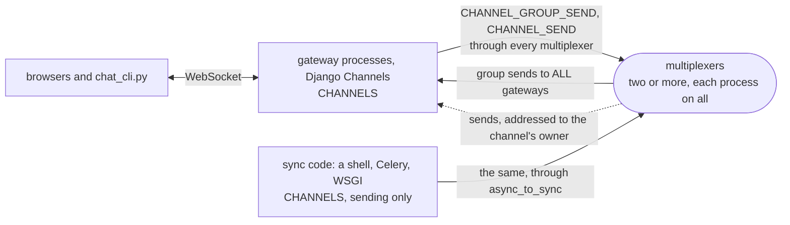

# channels

A Django Channels channel layer on the multiplexer, and the Channels
tutorial's chat running on it. The layer is one setting: where a Channels
application names Redis, it names the multiplexers instead, and every
process of the application then reaches every other through the broker
it may already run for its backends.

The example is installed with pip, the way a Django project is:
`mx-multiplexer` from PyPI, which brings the multiplexer, `mxcontrol`,
with it, and `channels` with `daphne`. [walkthrough.md](walkthrough.md) builds it from nothing,
every line of the rules file, the envelope, the layer and the consumer
explained as it is added. It ends with the measured steps and a walk
through its test, which is also a walk through testing a Channels
application with the library's harness.

```
pip install -r requirements.txt
mxcontrol run_multiplexer --rules channels.rules --address 127.0.0.1:1980     # the package's mxcontrol
mxcontrol run_multiplexer --rules channels.rules --address 127.0.0.1:1981     # a second one, in another terminal
MX_ADDRESSES=127.0.0.1:1980,127.0.0.1:1981 python web/manage.py runserver 127.0.0.1:8000   # a gateway
MX_ADDRESSES=127.0.0.1:1980,127.0.0.1:1981 python web/manage.py runserver 127.0.0.1:8001   # another
```

Open http://127.0.0.1:8000/ and http://127.0.0.1:8001/ in two browsers,
enter the same room, and talk: each line says which gateway process
received it. `test.sh` runs the test in a virtual environment against
real multiplexers. The one setting a Channels project changes:

```python
CHANNEL_LAYERS = {
    "default": {
        "BACKEND": "mxchannels.MultiplexerChannelLayer",
        "CONFIG": {"addresses": "10.0.0.1:1980,10.0.0.2:1980"},   # every multiplexer
    }
}
```

Sync code sends through it as Channels teaches,
`async_to_sync(channel_layer.group_send)(...)` from a Celery task, a
management command or a WSGI view. A process that sends and exits, a
management command say, ends with `async_to_sync(channel_layer.close)()`,
which writes every multiplexer's copy first: nothing else closes the
layer's client.

## The peers

Every process of the application is a `CHANNELS` peer on every
multiplexer, gateways and sync code alike; there is no other kind. A
group send is routed to `ALL` of them, a send to one channel is
addressed to the process that owns it, and both go through every
multiplexer. The walkthrough draws each exchange, step by step.



## What is what

- `channels.rules`: the system rules, then `CHANNELS` and the two message
  types; `multiplexer_constants.py` is what `mxcontrol generate_constants`
  wrote from it, and `channels.proto` the envelope, compiled to
  `channels_pb2.py`.
- `mxchannels/layer.py`: the layer.
- `web/`: the Django project, the tutorial's chat app, the ASGI routing.
- `chat_cli.py`: the command-line client the walkthrough's steps use.
- `test.py`, `test.sh`: the test on the harness, and the script that
  makes a venv and runs it.
