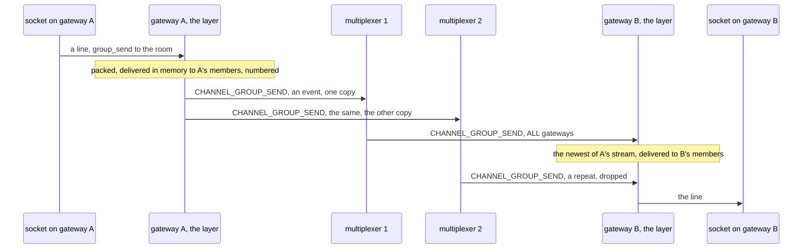
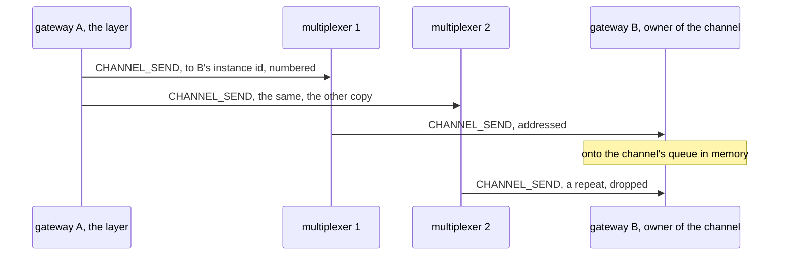
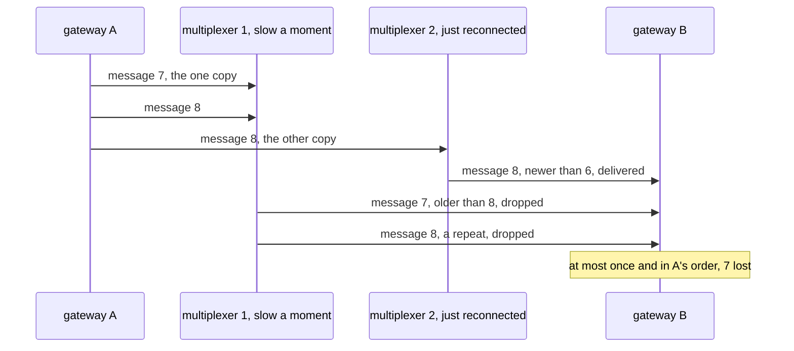
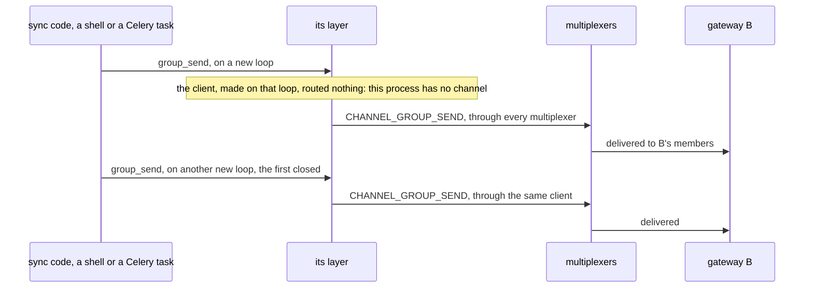

# Building the channel layer, step by step

This page builds the example from nothing: the rules file, the envelope,
the channel layer, and the chat consumer, with every line of the four
files shown as it is added. Every code block is a piece of a file in this
directory, and `examples/check_walkthroughs.py` keeps them identical to
the files, so what you read here is what runs. [README.md](README.md) is
the front door: what the example is, a picture of its peers, and how to
run it. How the messages go, drawn, the measured steps, the test and what
the example does not do are at the end of this page.

The idea in one sentence: Channels' in-memory layer in every process,
and the multiplexer between the processes, a group send being an event
to every process and a send to a channel a message addressed to the
process that owns it.

## 1. The rules file

The file opens with the system rules every rules file starts from, the
protocol's own types 1 to 99 and the six the libraries and `mxcontrol`
use by name ([docs/rules.md](../../docs/rules.md)), which `mxcontrol
generate_rules channels.rules` wrote; they are left out here. Then one
peer type, since every process of a Channels
application is the same kind of peer, and two message types.
`CHANNEL_GROUP_SEND` is routed to `ALL` processes: that is a
`group_send`. `CHANNEL_SEND` has no `to` block, since a send to a
specific channel is addressed by instance id to the one process that
owns the channel, and addressing wins over the rules.

```protobuf file=channels.rules from="# The example's peer and messages."
# The example's peer and messages.

peer {
    type: 201
    name: "CHANNELS"
    comment: "a process of the Django Channels application; every one holds channels and groups of its own"
}

type {
    type: 301
    name: "CHANNEL_GROUP_SEND"
    comment: "a group_send, payload ChannelEnvelope; every process delivers it to the channels it holds in the group"
    to {
        peer: "CHANNELS"
        whom: ALL
    }
}

type {
    type: 302
    name: "CHANNEL_SEND"
    comment: "a send to a specific channel, payload ChannelEnvelope; addressed to the process that owns the channel, so it needs no rule"
}
```

`mxcontrol generate_constants channels.rules --python multiplexer_constants.py
--pyi multiplexer_constants.pyi` then writes the module the layer
imports.

## 2. The envelope

A Channels message is a dict that may hold bytes, so it travels as
msgpack, as in channels_redis. The layer's own envelope around it is a
small protocol buffer naming the channel or the group and numbering the
message, compiled once with `protoc --python_out=. --pyi_out=.
channels.proto`. The numbers are section 3's: they keep a sender's
messages in its order when two multiplexers deliver them.

```protobuf file=channels.proto
// The one payload of the channel layer. Compiled once with `protoc
// --python_out=. --pyi_out=. channels.proto`; the generated channels_pb2.py
// is committed next to it. The message itself, a dict as Channels defines
// it, is msgpack inside, as channels_redis carries it.
syntax = "proto3";

package mxchannels;

// CHANNEL_SEND carries the channel, CHANNEL_GROUP_SEND the group. `seq`
// numbers what one event loop of a process sends to the others, both
// kinds, from 1, and `stream` tells that loop's numbers from another's: a
// receiver delivers a stream's messages only in that order, so a repeat,
// or a message a later one overtook at a multiplexer failing, is dropped.
message ChannelEnvelope {
  string channel = 1;
  string group = 2;
  bytes payload = 3;
  uint64 stream = 4;
  uint64 seq = 5;
}
```

## 3. The layer

`mxchannels/layer.py` is Channels' `InMemoryChannelLayer`, queues per
channel and a group table that stays with the process, plus one
`AsyncClient` per process. The docstring is the layer's contract, and it
is short because most of the contract is the in-memory layer's.

```python file=mxchannels/layer.py
"""A Django Channels channel layer on the multiplexer: the in-memory layer
in every process, and the multiplexer between the processes.

    CHANNEL_LAYERS = {
        "default": {
            "BACKEND": "mxchannels.MultiplexerChannelLayer",
            "CONFIG": {"addresses": "10.0.0.1:1980,10.0.0.2:1980"},   # every multiplexer
        }
    }

group_send() delivers to this process's members of the group and sends
one event, routed to every process, which delivers to its own members.
Membership is kept by the process that called group_add(), which is the
one that owns the channel when consumers call it, as they do. send() to a
specific channel of another process is addressed to that process, whose
instance id the channel name carries, the way channels_redis embeds a
prefix in it; a channel of this process is delivered in memory. Both go
through every multiplexer, so one dying loses nothing. What one event
loop sends is numbered: a receiver takes it in that order, each message
once, and drops one that a later one overtook when a multiplexer failed.
receive() is the in-memory queue.

Normal channels, the ones `runworker` consumes, are not routed: send() to
one raises NotImplementedError, since a backend on the multiplexer is the
better worker. Capacity and expiry are the in-memory layer's: at most
once, ChannelFull from send() when a channel of this process is full,
and anything else for a full channel dropped by the process that holds
it, with a warning.

The layer works from any event loop: sync code calling it through
async_to_sync, a new loop each call, sends through the same client. The
client is routed no group event until the process makes a channel, so a
process that only sends, a Celery worker or a WSGI server, never carries
the application's traffic. What arrives is delivered on the loop the
client was made on; new_channel() makes a new client on the running loop
when that one has closed."""

import asyncio
import itertools
import logging
import random
import string
import time
import weakref

import msgpack
from channels.exceptions import ChannelFull
from channels.layers import InMemoryChannelLayer
from multiplexer.aio import AsyncClient
from multiplexer.endpoints import parse_endpoint
from multiplexer.Multiplexer_pb2 import Routing
from multiplexer.threaded_client import ThreadedClient

from channels_pb2 import ChannelEnvelope
from multiplexer_constants import peers, types

log = logging.getLogger("mxchannels")

FORGET_STREAM = 300  # seconds of silence after which a stream's last number is forgotten


```

```python file=mxchannels/layer.py
def parse_addresses(addresses) -> list[tuple[str, int]]:
    """ "host:port,host:port", an IPv6 address as [address]:port, or a list of
    (host, port), as the list the library takes."""
    if isinstance(addresses, str):
        return [parse_endpoint(item) for item in addresses.split(",")]
    return [(host, int(port)) for host, port in addresses]


```

The class takes the multiplexers' addresses, the `CONFIG` of the
settings, and hands everything else to the in-memory layer: capacity,
expiry, group expiry. The client comes from `AsyncClient.holder()`, one
per process, made on a thread at first use so that the loop does not
wait for the handshakes, and forgotten in a forked child, since ASGI
servers fork their workers before the loop runs. The first use of each
client subscribes the two handlers at the bottom of the file, and
`get_client()` is also how a consumer gets the client for a backend of
its own to query.

The client sends and queries from any event loop, which is what sync
code needs: Channels' way to send from a Celery task, a management
command or a WSGI view is `async_to_sync(channel_layer.group_send)(...)`,
and asgiref runs each such call on a new loop, closed after it. What
arrives is delivered on the loop the client was made on, though, so a
client made by such a call receives nothing once its loop is gone. A
new client is therefore routed nothing by the rules,
`Routing(any=False, all=False)`, as a draining backend is, until the
process makes its first channel: a process that only sends, a Celery
worker or a WSGI server, never has the application's group events come
to it, to be dropped there.

```python file=mxchannels/layer.py
class MultiplexerChannelLayer(InMemoryChannelLayer):
    """Channels' layer API; the in-memory layer for this process, the multiplexer for the others."""

    def __init__(self, addresses, timeout: float = 10, **kwargs):
        super().__init__(**kwargs)
        self.timeout = timeout
        self._holder = AsyncClient.holder(peers.CHANNELS, parse_addresses(addresses), timeout=timeout)
        self._subscribed: AsyncClient | None = None  # the client whose messages this layer already takes
        self._receiving: AsyncClient | None = None  # the client routed the group events, once a channel was made
        # Sending: each loop's stream, [its id, the last number sent]. Only
        # on one loop is the order of the numbers the order of the sends.
        self._streams: weakref.WeakKeyDictionary[asyncio.AbstractEventLoop, list[int]] = weakref.WeakKeyDictionary()
        self._stream_ids = itertools.count(1)
        # Receiving: (sender, stream) -> (the last number delivered, when).
        self._last: dict[tuple[int, int], tuple[int, float]] = {}
        self._swept = time.monotonic()
        self.dropped = 0  # messages for a full channel of this process, from group sends and other processes

    async def get_client(self) -> AsyncClient:
        """The process's client, connected on first use; for a consumer
        that queries a backend too. It sends and queries from any loop. A
        new one is routed nothing by the rules: no group event comes to a
        process before it has a channel for one to go to."""
        client = await self._holder.aget()
        if client is not self._subscribed:
            client.set_routing(Routing(any=False, all=False))
            client.subscribe(types.CHANNEL_GROUP_SEND, self._on_group_send)
            client.subscribe(types.CHANNEL_SEND, self._on_send)
            self._subscribed = client
        return client

```

Names. A specific channel, the kind every consumer owns, is named by
the process that owns it, so the name carries that process's instance
id: `specific.mx<instance id, 16 hex digits>!<random>`, the way
channels_redis puts a process prefix in front of the `!`. The prefix may
come with its dot or without, as the other layers take it; `owner_of()`
reads the id back, and refuses a name whose last part before the `!` is
not this layer's. A channel needs a client whose loop delivers, so
`new_channel()` replaces a client whose loop has closed with one on the
running loop, and the first channel asks the multiplexers for the group
events, `Routing()`, every path again.

```python file=mxchannels/layer.py
    # Names: a specific channel carries the instance id of the process that owns it.

    async def new_channel(self, prefix="specific."):
        """A channel of this process: the prefix, `mx` and this client's
        instance id in 16 hex digits, `!`, a random suffix. The first asks
        the multiplexers for the group events, which a channel can take."""
        client = await self.get_client()
        if client.loop.is_closed():
            await self._holder.aclose()  # a channel needs a client whose loop delivers
            client = await self.get_client()
        if client is not self._receiving:
            client.set_routing(Routing())  # the group events, from now on
            self._receiving = client
        suffix = "".join(random.choice(string.ascii_letters) for _ in range(12))
        return f"{prefix.rstrip('.')}.mx{client.instance_id:016x}!{suffix}"

    @staticmethod
    def owner_of(channel: str) -> int | None:
        """The instance id a specific channel's name carries; None for a name this layer did not make."""
        if "!" not in channel:
            return None
        node = channel.split("!", 1)[0].rsplit(".", 1)[-1]
        if len(node) != 18 or not node.startswith("mx"):
            return None
        try:
            return int(node[2:], 16)
        except ValueError:
            return None

```

`send()`. A normal channel, one without `!`, is refused: those are
what `runworker` consumes, and a worker on this broker is a backend a
consumer queries, not a channel. A channel of this process goes through
the in-memory layer. A channel of another process goes as a
`CHANNEL_SEND` addressed with `to` to that process, the message packed
and unpacked once first, so that one its owner could not unpack is
refused here.

```python file=mxchannels/layer.py
    # The layer API.

    async def send(self, channel, message):
        """In memory for a channel of this process, addressed to its process for any other."""
        assert isinstance(message, dict), "message is not a dict"
        self.require_valid_channel_name(channel)
        if "!" not in channel:
            raise NotImplementedError(
                f"{channel!r} is a normal channel, which this layer does not route: consumers use specific channels"
                " and groups, and a worker is a backend on the multiplexer that a consumer queries"
            )
        owner = self.owner_of(channel)
        if owner is None:
            raise ValueError(f"{channel!r} is not a channel this layer named")
        client = await self.get_client()
        if owner == client.instance_id:
            await super().send(channel, message)
            return
        payload = msgpack.packb(message, use_bin_type=True)
        msgpack.unpackb(payload, raw=False)  # a message its owner could not unpack is refused here
        await self._send_to_others(client, ChannelEnvelope(channel=channel, payload=payload), types.CHANNEL_SEND, owner)

```

`group_send()` packs the message first, and unpacks it again, so that
this process's members get what the others will, a tuple as a list for
instance, and a message msgpack cannot carry, or one whose keys the
other processes would refuse, raises here before anyone gets it. Then
this process's members get it in memory, and one event goes to `ALL`
processes. Group membership is never sent anywhere: each process
delivers to its own members.

Both kinds leave through `_send_to_others()`, through every multiplexer,
one copy each, so that a multiplexer dying loses nothing, nor one that
the owner of the channel is not connected to yet, which drops what is
addressed to it; a send through one multiplexer would lose both. Before
it goes, the envelope is numbered. A multiplexer keeps order per
connection only, so two messages through two of them can arrive in
either order, and the receiving library drops a repeat only among the
last 2048 messages it saw, which a multiplexer frozen for longer
outlasts. The numbers make the order the sender's: each event loop that
sends has a stream, numbered from 1 in the order its messages are sent,
since nothing between taking the number and writing the message lets
another send of that loop in. Two loops are two writers, with no order
between them to keep.

```python file=mxchannels/layer.py
    async def group_send(self, group, message):
        """This process's members now, every other process's through one event to all of them."""
        assert isinstance(message, dict), "Message is not a dict"
        self.require_valid_group_name(group)
        # Packed before anyone gets it, and unpacked again: every member,
        # here and elsewhere, gets the same, and a message the other
        # processes could not unpack is refused here, for everyone.
        payload = msgpack.packb(message, use_bin_type=True)
        await self._to_members(group, msgpack.unpackb(payload, raw=False))
        client = await self.get_client()
        await self._send_to_others(client, ChannelEnvelope(group=group, payload=payload), types.CHANNEL_GROUP_SEND)

    async def _send_to_others(self, client: AsyncClient, envelope: ChannelEnvelope, type: int, to: int = 0) -> None:
        """Number the envelope in the running loop's stream and send it
        through every multiplexer; nothing between the number and the send
        lets another send of this loop in."""
        stream = self._streams.get(asyncio.get_running_loop())
        if stream is None:
            stream = self._streams[asyncio.get_running_loop()] = [next(self._stream_ids), 0]
        stream[1] += 1
        envelope.stream, envelope.seq = stream
        await client.send_message(
            envelope.SerializeToString(),
            type=type,
            to=to,
            multiplexer=ThreadedClient.ALL,
            flush=True,  # written, the first copy, or an exception: what the awaiting caller learns
            timeout=self.timeout,
        )

```

```python file=mxchannels/layer.py
    async def close(self):
        """Close the process's client; the in-memory part needs nothing."""
        await self._holder.aclose()
        self._subscribed = self._receiving = None

```

And the receiving side, two handlers the client runs on its loop. A
group send from another process goes to this process's members; the
process's own event comes back too, and is skipped, since it was
delivered already. A send to one of this process's channels goes onto
that channel's queue.

```python file=mxchannels/layer.py
    # What the other processes send, delivered on the client's loop.

    async def _on_group_send(self, mxmsg) -> None:
        """Another process's group_send: this process's members of the group get it."""
        client = self._subscribed
        if client is None or mxmsg.sender == client.instance_id:
            return  # this process's own send, delivered already
        envelope = ChannelEnvelope()
        envelope.ParseFromString(mxmsg.message)
        if self._in_order(mxmsg.sender, envelope):
            await self._to_members(envelope.group, msgpack.unpackb(envelope.payload, raw=False))

    async def _on_send(self, mxmsg) -> None:
        """Another process's send to a channel of this one."""
        envelope = ChannelEnvelope()
        envelope.ParseFromString(mxmsg.message)
        if self._in_order(mxmsg.sender, envelope):
            await self._to_channel(envelope.channel, msgpack.unpackb(envelope.payload, raw=False))

```

`_in_order()` is the other half of the numbers: for every sender and
stream, the last number delivered, and anything not newer is dropped.
That is a repeat, or a message that a later one overtook. The first copy
of every message arrives in the sender's order, except when a
multiplexer fails: a message that went out through it alone, while the
connection to the other was down, can arrive after one sent later
through both. Channels promises at most once and the order of one
writer, and dropping that message keeps both. A stream silent for five
minutes is forgotten, which bounds the table; no copy is on its way that
long, since the heartbeats drop a frozen multiplexer's connections
within about a minute and a half.

```python file=mxchannels/layer.py
    def _in_order(self, sender: int, envelope: ChannelEnvelope) -> bool:
        """Whether the envelope is the newest of its stream yet, which it
        then is; an older one is a repeat, or was overtaken, and is dropped."""
        now = time.monotonic()
        key = (sender, envelope.stream)
        last = self._last.get(key)
        if last is not None and envelope.seq <= last[0]:
            return False
        self._last[key] = (envelope.seq, now)
        if now - self._swept > FORGET_STREAM:
            # A stream silent that long has ended, and no copy of it can
            # still be on its way: forgetting it bounds the map.
            self._swept = now
            self._last = {key: value for key, value in self._last.items() if now - value[1] < FORGET_STREAM}
        return True

```

Last, the delivery, the in-memory layer's `send()` per member. A full
channel, its consumer having fallen behind, drops the message. `send()`
raises `ChannelFull` for a channel of this process, as the in-memory
layer does, but a group send, or a message from another process, has
nobody to raise to: it is counted in `dropped` and logged, the first,
second, fourth, eighth time and so on, so that a stuck consumer shows
without flooding the log.

```python file=mxchannels/layer.py
    async def _to_members(self, group: str, message: dict) -> None:
        """Every channel of this process in the group; a full one drops it,
        with a warning. Expired messages and memberships go at receive(), as
        in the in-memory layer, not on this path, once per message."""
        for channel in list(self.groups.get(group, ())):
            await self._to_channel(channel, message)

    async def _to_channel(self, channel: str, message: dict) -> None:
        """A channel of this process; a full one drops it, with a warning."""
        try:
            await InMemoryChannelLayer.send(self, channel, message)
        except ChannelFull:
            self.dropped += 1
            if self.dropped & (self.dropped - 1) == 0:  # the 1st, 2nd, 4th, 8th...: a trickle, not a flood
                log.warning("channel %s is full: a message dropped, %d so far", channel, self.dropped)
```

That is the whole layer: about two hundred lines on top of Channels'
own, and the setting that enables it:

```python
CHANNEL_LAYERS = {
    "default": {
        "BACKEND": "mxchannels.MultiplexerChannelLayer",
        "CONFIG": {"addresses": "10.0.0.1:1980,10.0.0.2:1980"},
    }
}
```

## 4. The chat consumer

`web/chat/consumers.py` is the Channels tutorial's consumer, and it
knows nothing of the broker: it joins its room's group, sends every line
to the group, and forwards what the group receives to its socket. The
one addition is the pid of the process that received each line, so that
a line relayed from another process shows as such.

```python file=web/chat/consumers.py
"""The chat consumer, as in the Channels tutorial: a socket joins its
room's group, every line it sends goes to the group, and every member's
consumer forwards what the group receives to its socket. Nothing here
knows about the multiplexer; the channel layer is the multiplexer. Each
line carries the pid of the process that received it, so that a line
relayed from another process shows as such."""

import json
import os
from typing import Any, cast

from channels.generic.websocket import AsyncWebsocketConsumer


```

```python file=web/chat/consumers.py
class ChatConsumer(AsyncWebsocketConsumer):
    """One socket in one room."""

    async def connect(self):
        """Join the room's group, then say which process this socket landed on."""
        self.room_name = cast(dict[str, Any], self.scope)["url_route"]["kwargs"]["room_name"]
        self.group = f"chat.{self.room_name}"
        await self.channel_layer.group_add(self.group, self.channel_name)
        await self.accept()
        await self.send(
            text_data=json.dumps({"message": f"connected to gateway {os.getpid()}", "gateway": os.getpid()})
        )

```

```python file=web/chat/consumers.py
    async def disconnect(self, code):
        """Leave the group."""
        await self.channel_layer.group_discard(self.group, self.channel_name)

    async def receive(self, text_data=None, bytes_data=None):
        """A line from the socket: to everyone in the room, through every process."""
        message = json.loads(text_data or "{}")["message"]
        await self.channel_layer.group_send(
            self.group, {"type": "chat.message", "message": message, "gateway": os.getpid()}
        )

    async def chat_message(self, event):
        """A line from the group: to the socket."""
        await self.send(text_data=json.dumps({"message": event["message"], "gateway": event["gateway"]}))
```

## 5. What is left

The route in [web/chat/routing.py](web/chat/routing.py), the ASGI
application in [web/webapp/asgi.py](web/webapp/asgi.py), the settings
in [web/webapp/settings.py](web/webapp/settings.py) with the one setting
above, two pages, and [chat_cli.py](chat_cli.py), the command-line client
the steps below use. [test.py](test.py) runs the layer and the chat
against real multiplexers, two layers on one cluster standing in for two
processes; "Testing it with the harness" below walks through it.

## How it fits together

[mxchannels/layer.py](mxchannels/layer.py) is Channels' own in-memory
layer, queues per channel and a group table local to the process, plus
one `AsyncClient` per process that carries messages between processes.
The layer's API maps onto the broker's two routing modes and its
addressing, and nothing else. A line said on one gateway, to the
sockets of the room on another:



A send to one channel of another process is addressed to it, since the
name carries its owner's instance id, and needs no rule:



The numbers at work: gateway A sent message 7 while its connection to
the second multiplexer was down, so through the first alone, and 8
through both once it was back. The first multiplexer is slow a moment,
and 8 overtakes 7:



And sync code, through `async_to_sync`, a new loop each call:



In short:

- `group_send(group, message)` delivers to this process's members of the
  group in memory, then sends one event routed to `ALL` processes; every
  other process delivers it to its own members. There is no shared table
  anywhere, and nothing is lost when a process or a multiplexer goes.
- `send(channel, message)` to a specific channel, the kind every consumer
  owns, is addressed: `new_channel()` puts the process's instance id into
  the name, `specific.mx<instance id>!<random>`, the way channels_redis
  embeds a process prefix, and `send` reads it back and sets `to`. A
  channel of this process is delivered in memory.
- Both go through every multiplexer, numbered per event loop; a receiver
  takes each sender's messages in that order, each once.
- `receive(channel)` is the in-memory queue, fed by the client's
  callback on the client's loop.
- Group membership is kept by the process that calls `group_add()`,
  which for a consumer is the process that owns its channel.
- Capacity and expiry are the in-memory layer's: at most once, and
  `ChannelFull` from `send()` when a channel of this process is full. A
  group send, or a message from another process, for a full channel is
  dropped there, counted and logged, since the sender cannot know.
- Normal channels, the ones `runworker` consumes, are not routed:
  `send()` to one raises `NotImplementedError` saying so. A worker on
  this broker is a backend that a consumer queries, which the
  [inference example](../inference) shows, and the layer's client is
  yours for that: `await channel_layer.get_client()`.
- Messages are dicts that may hold bytes, so they travel as msgpack,
  as in channels_redis, inside a small protobuf envelope naming the
  channel or the group and numbering the message.

The chat, under [web/](web/), is the tutorial's: a consumer that joins
its room's group on connect, sends every line to the group, and forwards
what the group receives to its socket. Nothing in it knows about the
broker; it only carries the pid of the process that received each line,
so that a line relayed from another process shows as such.

## The steps

Two multiplexers on 1980 and 1981 and two gateway processes on 8000 and
8001, started from the example's directory, the multiplexers' process
ids in files so that step 2 can kill one, and
[chat_cli.py](chat_cli.py), a command-line client that joins a room,
says its lines a second apart, and prints what the room receives with
the gateway that received it. Each output is what the last run printed;
the library's own lines about connections go to stderr and are left out.

```
$ mxcontrol run_multiplexer --rules channels.rules --address 127.0.0.1:1980 > mx1.log 2>&1 & echo $! > mx1.pid
$ mxcontrol run_multiplexer --rules channels.rules --address 127.0.0.1:1981 > mx2.log 2>&1 & echo $! > mx2.pid
$ MX_ADDRESSES=127.0.0.1:1980,127.0.0.1:1981 python web/manage.py runserver 127.0.0.1:8000 > gw1.log 2>&1 &
$ MX_ADDRESSES=127.0.0.1:1980,127.0.0.1:1981 python web/manage.py runserver 127.0.0.1:8001 > gw2.log 2>&1 &
```

**1. Two clients on different gateways, one room.** Alice on 8000 says
two lines, Bob on 8001 says one between them. Bob connected after
Alice's first line and did not get it: a chat has no history, and
neither does the broker, which replays nothing.

```
$ python chat_cli.py 127.0.0.1:8000 lobby --say "hello from alice" --say "anyone on the other gateway?"
connected to gateway 2500303   [via gateway 2500303]
hello from alice   [via gateway 2500303]
bob here, on the other one   [via gateway 2500410]
anyone on the other gateway?   [via gateway 2500303]

$ python chat_cli.py 127.0.0.1:8001 lobby --say "bob here, on the other one"
connected to gateway 2500410   [via gateway 2500410]
bob here, on the other one   [via gateway 2500410]
anyone on the other gateway?   [via gateway 2500303]
```

Bob's line reached Alice's socket on the other gateway: her gateway
received the group event and delivered it to its member. Every line also
comes back to the process that sent it, in memory, before any broker
hop.

**2. A multiplexer killed.** The first multiplexer is killed with
`kill -9`, then a client on 8001 listens while one on 8000 says a line.
Nothing shows the kill: the gateways go on through the multiplexer
left. A multiplexer dying while messages are inside it is the test's
case, below, where sending through every multiplexer is what saves
them.

```
$ kill -9 $(cat mx1.pid)

$ python chat_cli.py 127.0.0.1:8001 lobby --listen 3 &
$ python chat_cli.py 127.0.0.1:8000 lobby --say "still here, one multiplexer down" --listen 0
connected to gateway 2500303   [via gateway 2500303]
still here, one multiplexer down   [via gateway 2500303]

(the listener on 8001)
connected to gateway 2500410   [via gateway 2500410]
still here, one multiplexer down   [via gateway 2500303]
```

**3. Back up, and a line from sync code.** The first multiplexer is
started again, and both gateways are back on it within about three
seconds, on their own. Then a management shell, sync code as a Celery
task or a WSGI view is, sends two lines to the room through
`async_to_sync`, each call on a new event loop, and closes the layer,
which writes every multiplexer's copy before the shell exits; the
listener on 8001 hears both. The consumer prints the event's `gateway`,
here the word the shell put in it.

```
$ mxcontrol run_multiplexer --rules channels.rules --address 127.0.0.1:1980 > mx1.log 2>&1 & echo $! > mx1.pid
$ python chat_cli.py 127.0.0.1:8001 lobby --listen 4 &
$ MX_ADDRESSES=127.0.0.1:1980,127.0.0.1:1981 python web/manage.py shell -c '
from asgiref.sync import async_to_sync
from channels.layers import get_channel_layer
layer = get_channel_layer()
for n in (1, 2):
    async_to_sync(layer.group_send)("chat.lobby", {"type": "chat.message", "message": f"announcement {n}", "gateway": "shell"})
async_to_sync(layer.close)()'

(the listener on 8001)
connected to gateway 2500410   [via gateway 2500410]
announcement 1   [via gateway shell]
announcement 2   [via gateway shell]
```

## Testing it with the harness

[test.py](test.py) tests the layer and the chat against real
multiplexers, and is a template for testing a Channels application of
your own. `multiplexer.testing` is what this repository's own tests run
on, listed in [docs/api_python.md](../../docs/api_python.md#testing).
What the test uses:

- **`Cluster(2, rules=RULES)`** starts two multiplexers on ports the
  system picked, from the `mxcontrol` the package installed, or the
  binary `MXCONTROL` names, reading the example's rules file; `cluster.endpoints` is what the layers connect to.
- **Two `MultiplexerChannelLayer` instances on one cluster** stand in for
  two gateway processes: each has its own client and instance id, so a
  group send from one is a real broker hop to the other, and a send to
  the other's channel is a real addressed message. The tests are
  `IsolatedAsyncioTestCase`s, which make a loop per test, and what
  arrives is delivered on the loop the client was made on, so
  `asyncSetUp` makes a fresh pair and `asyncTearDown` closes it.
- **`cluster.wait_for_peer(peers.CHANNELS, 2)`**, run in a thread with
  `asyncio.to_thread` since it blocks, waits until both multiplexers'
  peers files list both clients, which is when a send can be expected
  to arrive.
- **`cluster.mx[0].pause()`, then `kill()`**, in the middle of two
  hundred group sends and two hundred sends to a channel of the other
  process: the first multiplexer freezes, holding every copy that went
  through it, and is then killed, and the other process still receives
  all four hundred in order. Sent through one multiplexer at a time, the
  ones the frozen multiplexer held would be lost, and the test fails.
  A cleanup registered with `addCleanup` starts it again however the
  test ends, and the next test's setup waits for both clients on it.
- **Out of order and repeated**: a plain `AsyncClient` of the `CHANNELS`
  type sends envelopes numbered 1, 3, 2, 3, 4 through one lane, as a
  failing multiplexer can let them come, and the other layer delivers 1,
  3 and 4.
- **Sync code**: a third layer used only through `async_to_sync` from a
  thread, a new loop each call, as a Django shell or a Celery task uses
  it: after its first call no group event comes to it, counted where
  its client's io thread tests the subscriptions; its group sends and
  sends arrive; and `new_channel()` gives it a client on a loop that
  delivers.
- **Django against the cluster**: the endpoints go into the environment
  the settings read, then `django.setup()`, and the consumer is driven
  by Channels' own `WebsocketCommunicator`, three sockets in two rooms,
  with the origin header a browser would send, since the ASGI app runs
  the origin validator. `get_channel_layer().close()` after each test,
  for the same reason as the fresh pair above.

The test needs about six seconds. Run it with `test.sh`, or by hand:

```
python -m unittest -v test
```

## What it does not do

- Normal channels and `runworker`; see above.
- Delivery guarantees beyond at most once: a message for a process that
  is gone is dropped by the multiplexer, one for a full channel by the
  receiving process, and one that a later message overtook when a
  multiplexer failed by the receiving layer. Same as channels_redis,
  without the persistence in between.
- Order across event loops of one process: each loop that sends is a
  stream of its own, as two writers are.
- `group_add()` and `group_discard()` of a channel from a process other
  than its owner: membership is kept by the process that calls them, so
  the owner's group sends do not see it. Consumers call them for their
  own channel, which is always right.
- Receiving on more than one loop per process: what arrives is delivered
  on the loop the client was made on, the ASGI server's in a gateway.
- Messages over the broker's 128 MiB: the library refuses one at the
  send, before anything goes out.
