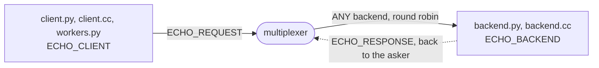

# echo

The smallest program on the multiplexer, in both languages: a backend
that upper-cases whatever it is asked, and a client that asks.
`backend.py` and `backend.cc` are the same backend, `client.py` and
`client.cc` the same client, and any pair works, since the wire is the
same. `workers.py` is the shape most programs have instead of a client
per thread: several threads sharing one `ThreadedClient`, each getting
its own replies. `echo.rules` adds the two peer types and two message
types the example uses; `.bazelrc` points the build at it, so the
generated constants carry `peers.ECHO_BACKEND`, `peers.ECHO_CLIENT`,
`types.ECHO_REQUEST` and `types.ECHO_RESPONSE`.
[walkthrough.md](walkthrough.md) runs it, reads what each side prints,
and walks through its tests.

```
bazel test //...                    # the end-to-end test and harness_test.py; walkthrough.md walks through both
bazel run @mx//mxcontrol -- run_multiplexer --address 127.0.0.1:1980 --rules $PWD/echo.rules
bazel run //:backend_py         # or //:backend_cc, in another terminal
bazel run //:client_py -- 127.0.0.1:1980 "hello multiplexer"     # or //:client_cc
bazel run //:workers -- 127.0.0.1:1980 3 4                         # 3 threads, 4 jobs each
```

The backend prints `ready` once it is connected, the client prints the
answer, `HELLO MULTIPLEXER`, and the workers print one line per job,
`worker-1: W1 JOB 2`. Asked to leave, `SIGTERM` for the C++ backend and
for the Python one its drain file, `/tmp/echo-backend-leave-` and its
pid unless given, which it prints, the backend drains for five seconds
as the last resort of its type ([how a backend
leaves](../../docs/leaving.md#what-a-draining-backend-still-takes)):
beside another backend the multiplexers route it nothing new, and alone
it keeps serving to the end, so a rolling restart costs no client a
request either way.

## The peers

A client and a backend, each connected to the multiplexer; one rule in
`echo.rules` sends every `ECHO_REQUEST` to `ANY` backend, round robin,
and the reply goes back to the client that asked. The walkthrough draws
the exchange.



## What is what

- `echo.rules`: the system rules, then `ECHO_BACKEND`, `ECHO_CLIENT`,
  `ECHO_REQUEST` routed to any backend, and `ECHO_RESPONSE`; `.bazelrc`
  points the build at it.
- `backend.py`, `backend.cc`: the backend, a `BaseMultiplexerServer` in
  each language, with the five-second drain.
- `client.py`, `client.cc`: the client, one `query()`.
- `workers.py`: threads sharing one `ThreadedClient`.
- `echo_test.py`, `harness_test.py`: the tests above; `WORKSPACE` and
  `BUILD` consume the multiplexer as `@mx`, as
  [examples/README.md](../README.md) describes.
