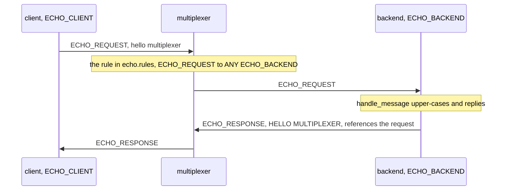

# Running the echo example, step by step

This page runs one multiplexer, one backend and one client on your machine
and shows what each of them prints, then reads how the pieces fit and how
the tests drive them. Everything is in this directory, a separate Bazel
workspace that consumes the multiplexer the way your own project would;
[README.md](README.md) is the front door.

You need Bazel 6.2 (through Bazelisk), a C++17 compiler,
`protobuf-compiler`, `libprotobuf-dev`, Python 3.10 or newer with
`python3-dev` and `python3-protobuf`; [building.md](../../docs/building.md) has the
exact packages. Asio and pybind11 are fetched by Bazel on the first build,
which takes a few minutes; every later build is quick.

Open three terminals in `examples/echo`.

## Terminal 1: the multiplexer

```
bazel run @mx//mxcontrol -- run_multiplexer --address 127.0.0.1:1980 --rules $PWD/echo.rules
```

The multiplexer reads the rules file and starts listening. Its log goes to
stderr, one line per entry: the rules it loaded, with their fingerprint
and how many types they name, then the address. The time, the host's
name that starts the context and the checkout's path are left out.

```
[INFO]  ts=…  pid=233871  ctx=….mxcontrol.run_multiplexer.multiplexer.server  flw=""  txt="rules loaded from …/examples/echo/echo.rules: 38ec58cc, 19 message types, 7 peer types"  from=external/mx/multiplexer/server.cc:618
[INFO]  ts=…  pid=233871  ctx=….mxcontrol.run_multiplexer  flw=""  txt="starting MX server on 127.0.0.1:1980"  from=external/mx/mxcontrol/start_multiplexer_server.cc:128
```

Leave it running.

## Terminal 2: a backend

```
bazel run //:backend_py
```

The backend connects, completes the handshake and prints `ready`, and on
stderr, among its library's log, the file that asks it to leave:
`drain file: /tmp/echo-backend-leave-233876`, its pid at the end.
Terminal 1 shows the other side of that handshake, with the backend's own
instance id and its peer type from the rules file:

```
[INFO]  ...  txt="registered connection id=9739080862895800978 type=300 ('ECHO_BACKEND')"  ...
```

`bazel run //:backend_cc` starts the same backend written in C++; either one
will do, and you can run both.

## Terminal 3: a client

```
bazel run //:client_py -- 127.0.0.1:1980 "hello multiplexer"
```

The client connects, sends one `ECHO_REQUEST`, waits for the reply and prints
it. The lines in brackets are its library's log on stderr, its INFO lines
here and the DEBUG ones about each connection's life left out; the answer is
the line on stdout, and the connection's end follows it as the client shuts
down:

```
[INFO]  ...  txt="connecting to 127.0.0.1:1980"  ...
[INFO]  ...  txt="registered connection id=10174158592712911242 type=1 ('MULTIPLEXER')"  ...
HELLO MULTIPLEXER
[INFO]  ...  txt="unregistered connection id=10174158592712911242 type=1 ('MULTIPLEXER')"  ...
```

The `registered connection` line names the multiplexer's instance id.
The multiplexer tells it to anyone who asks which rules it has in use,
with the fingerprint terminal 1 printed; `rules status` logs its own
connection's start and end around that line, left out here:

```
$ bazel run @mx//mxcontrol -- rules status -M 127.0.0.1:1980
multiplexer 10174158592712911242: rules 38ec58cc (19 message types, 7 peer types) from …/examples/echo/echo.rules, loaded …
```

`bazel run //:client_cc -- 127.0.0.1:1980 "hello multiplexer"` does the
same from C++.

## What just happened



1. The client's `query()` wrapped the text in a message of type `ECHO_REQUEST`
   and sent it to the multiplexer.
2. The rules file says `ECHO_REQUEST` goes to one `ECHO_BACKEND`, so the
   multiplexer forwarded it to the backend.
3. The backend's `handle_message` upper-cased the payload and called
   `send_message`, which addressed the reply to the client's instance id and
   made it reference the request's id.
4. The multiplexer delivered the reply straight to the client, and `query()`
   returned it because the id matched.

[How a query is answered](../../docs/query.md) draws these steps; [routing](../../docs/routing.md)
explains the rule.

## Things to try

- **Two backends.** Start `backend_cc` in a fourth terminal and run the client
  a few times. Terminal 1 logs a second `ECHO_BACKEND`; requests alternate
  between the two, round robin. Stop one of them and the client keeps working.
- **A rolling restart.** With two backends running, `touch` the drain
  file the Python one printed. It tells the multiplexer to route it
  nothing new, as the last resort of its type, removes the file, and
  leaves five seconds later; the client keeps getting answers from the
  other backend throughout, and would from this one if it were alone.
  `SIGTERM` does the same for the C++ backend.
- **No backend.** Stop both backends and run the client. It fails at once with
  `OperationFailed`: the multiplexer reported that nobody could take the
  request, the client searched for a backend, and nobody answered. Nothing
  waits for a timeout.
- **No multiplexer.** Stop the multiplexer and run the client. The connect
  attempt does not fail on its own; the query keeps trying to reconnect for
  its timeout, 10 s, and then fails with `NotConnected`. Start the
  multiplexer again within those seconds and the query goes through. A real
  client lists several multiplexers, so one that is down costs nothing.
- **A rule of your own.** Add a peer type and a message type to `echo.rules`,
  as described in [the rules file](../../docs/rules.md), rebuild, and the generated
  constants carry your names in both languages. The running multiplexer
  puts the edited file in use on its own, once two of its checks, two
  seconds apart, have read the same new file, no restart;
  `bazel run @mx//mxcontrol -- rules status -M 127.0.0.1:1980` shows the
  fingerprint it has, the one the constants carry
  ([changing the rules](../../docs/operations.md#changing-the-rules)).

## How it fits together

The backend is a `BaseMultiplexerServer`, the plain one: `serve_forever()`
connects, then reads one message at a time and calls `handle_message()`
with each, and the reply goes back the way the request came, addressed
to the client and referencing the request's id, which is how the client
knows the answer to its question. The client's `query()` sends the
request and waits for that reference; the multiplexer picks the backend
by the rule, round robin when there are several, and the client finds
another through its search when the chosen one is gone
([docs/query.md](../../docs/query.md)). The workers program shares one
`ThreadedClient` between threads: the client's io thread receives every
reply and hands each to the thread whose query it answers, so the
threads never touch a socket.

## Testing it with the harness

[echo_test.py](echo_test.py) runs the binaries against a multiplexer
started from `@mx//mxcontrol`: the Python and C++ backends with the
Python and C++ clients, and the workers program, reading `ready` before
it asks. [harness_test.py](harness_test.py) tests the same exchange
without the binaries, with the multiplexer's own test infrastructure:
`mx_integration_test` in `BUILD` (from
`@mx//multiplexer/testing:defs.bzl`) starts the test with this
workspace's rules file, and the test opens a `Cluster` of real
multiplexers, scripts a `FakePeer` as the backend and asks it with a
`TestClient`. Its other tests are the shapes a program's tests need
most: a multiplexer restart under a live client, a raising handler seen
as `BackendError`, and a recording read back; each test names the rules
file it runs with, `Cluster(1, rules=runfile("echo.rules"))`. See
[docs/api_python.md](../../docs/api_python.md#testing).

## What it does not do

- Several multiplexers. Each program here takes one address; a client
  or a backend given several connects to all of them, and one that is
  down costs nothing ([operations](../../docs/operations.md)).
- Signals in Python. The library handles none, so the Python backend is
  asked to leave through its drain file; the C++ one turns `SIGTERM`
  into the same drain.
- Work. The handler upper-cases a few bytes, so what the client waits
  for is the broker and the two hops; the other examples do something
  between the request and the reply.

## Where to go next

- [The rules file](../../docs/rules.md): every field, what the reserved ranges are for.
- [Using the Python library](../../docs/api_python.md) and
  [Using the C++ library](../../docs/api_cpp.md): the calls the example used and the
  rest of them.
- [Operations](../../docs/operations.md): several multiplexers, restarts, logs.
