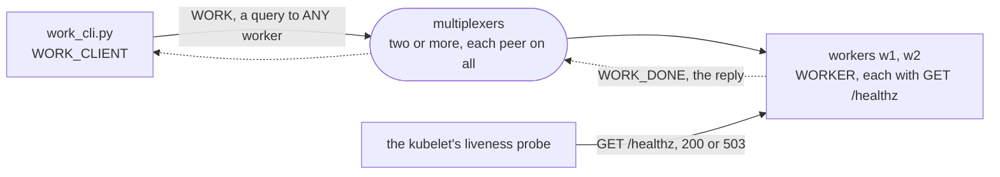

# health

A backend's health check that sees its serve loop, not only its process.
A worker is a backend on `BaseMultiplexerServer` that answers `WORK`, a
request routed to `ANY` one worker. Beside it, on a thread of its own,
an HTTP endpoint for a Kubernetes liveness probe, `GET /healthz`,
answers 200 while the loop comes round and 503 once it has not for
`--stale-seconds`: `serve_forever()` calls `periodic_task()` after every
message and every poll, and the worker writes down the time there. A
thread of its own answers whatever the loop does, and the multiplexers
route the worker its share for as long as its connection is up, so that
time is what tells a worker whose handler never returns from one that
serves. The manifest runs the workers on Kubernetes beside the
multiplexers of [docs/operations.md](../../docs/operations.md#on-kubernetes),
the liveness probe on the endpoint and the drain on a preStop hook.

The example is installed with pip: `mx-multiplexer` from PyPI, which
brings the multiplexer, `mxcontrol`, with it.
[walkthrough.md](walkthrough.md) builds it from nothing, every line of
the rules file, the worker, its endpoint, the command line and the
manifest explained as it is added. It ends with the measured steps, a
handler held past the limit, then past the multiplexers' drop interval,
and the drain the preStop hook asks for, and a walk through its test.
[The recipe](../../docs/recipes/check_backend_health.md) says why a
health thread or a TCP probe cannot see a stuck loop, and what to do for
the threaded server classes.

```
pip install -r requirements.txt
mxcontrol run_multiplexer --rules health.rules --address 127.0.0.1:1980     # the package's mxcontrol
mxcontrol run_multiplexer --rules health.rules --address 127.0.0.1:1981     # a second one, in another terminal
python backend.py 127.0.0.1:1980,127.0.0.1:1981 --name w1 --health-port 8081 --stale-seconds 5   # a worker; w2 on 8082
curl -s -w '%{http_code}\n' http://127.0.0.1:8081/healthz                   # ok: the loop came round 0.1 s ago, 200
python work_cli.py 127.0.0.1:1980,127.0.0.1:1981 --seconds 30                # work that holds a handler for 30 s
```

While the last command waits, the worker that took the request answers
503 at its `/healthz` from five seconds on, and 200 again once its
handler returned. `test.sh` runs the test in a virtual environment
against real multiplexers.

## The peers

Every peer connects to every multiplexer. The one rule routes `WORK` to
`ANY` worker; the reply goes back to whoever asked. The probe is not a
peer: it asks each worker's endpoint, on a port of the worker's own.



## What is what

- `health.rules`: the system rules, then `WORK_CLIENT`, `WORKER`, `WORK`
  with its `ANY` rule, and `WORK_DONE`, its reply;
  `multiplexer_constants.py` is what `mxcontrol generate_constants`
  wrote from it.
- `backend.py`: `Worker`, a `BaseMultiplexerServer` that writes down in
  `periodic_task()` when its loop came round, and `HealthEndpoint`,
  `GET /healthz` on the standard library's `http.server`, on a thread of
  its own.
- `work_cli.py`: the command line the steps use.
- `deployment.yaml`: the workers' Deployment, the liveness probe on the
  endpoint and the drain on a preStop hook.
- `test.py`, `test.sh`: the test on the harness, and the script that
  makes a venv and runs it.
