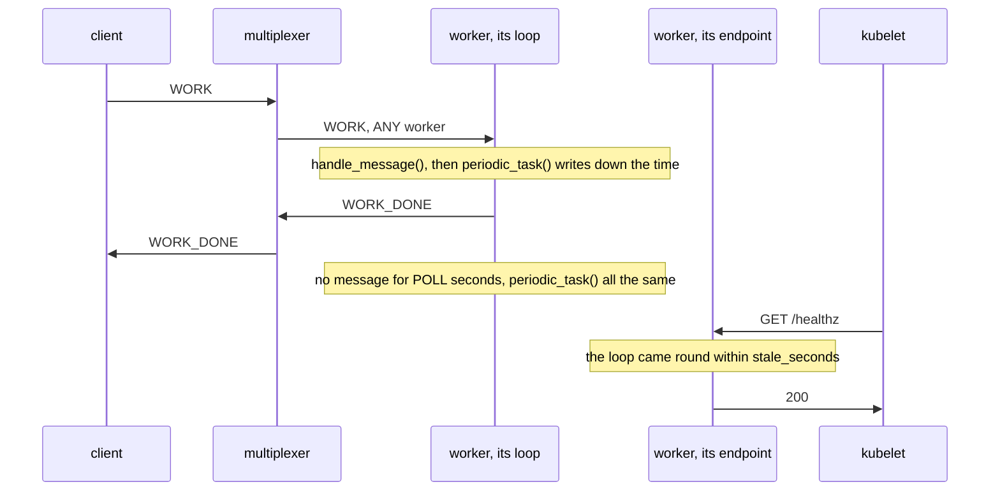
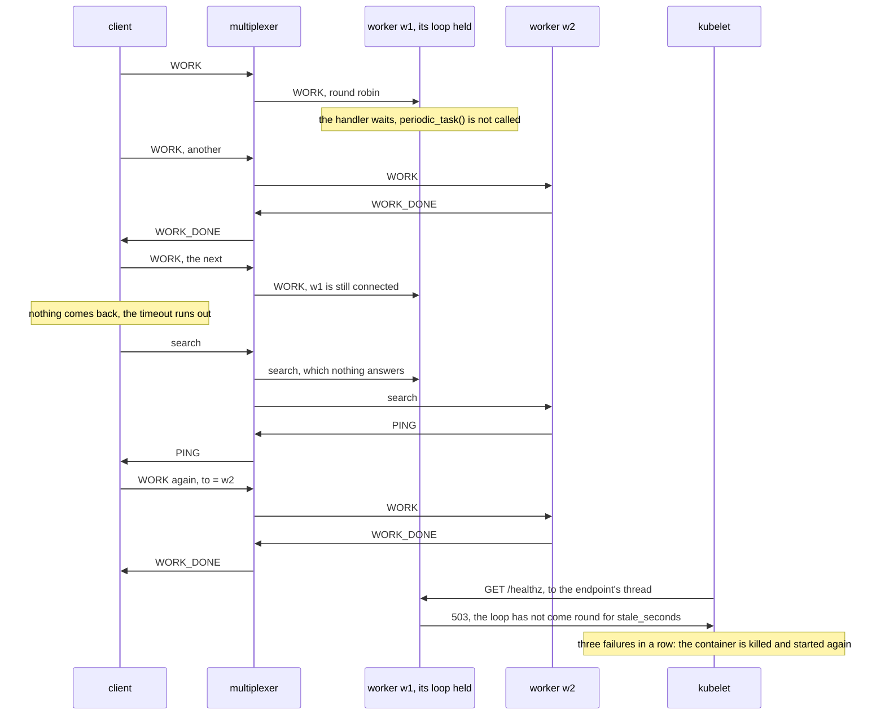
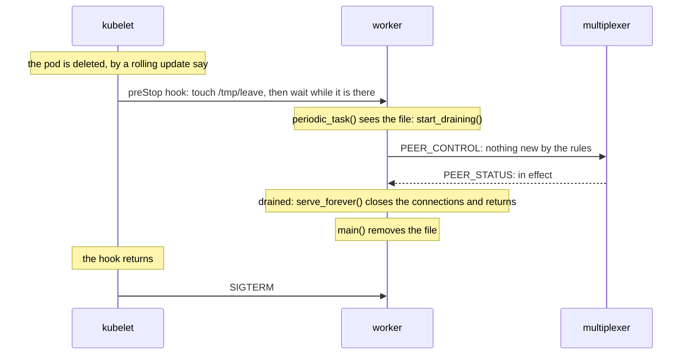

# Building the health check, step by step

This page builds the example from nothing: the rules file, the worker,
its health endpoint, the program around the two, the command line and
the manifest, in that order, with every line of those files shown as it
is added. Every code block is a piece of a file in this directory, and
`examples/check_walkthroughs.py` keeps them identical to the files, so
what you read here is what runs. [README.md](README.md) is the front
door: what the example is, a picture of its peers, and how to run it.
How the messages go, drawn, the measured steps, the test and what the
example does not do are at the end of this page.

The idea in one sentence: a backend is alive while its serve loop comes
round, so the loop writes down the time whenever it does, and the health
endpoint, on a thread of its own, answers from that time rather than
from the fact that the process runs.
[The recipe](../../docs/recipes/check_backend_health.md) says why
nothing else sees a loop that stopped: not the multiplexers, which route
to a connection, not a health thread, which answers for the process, and
not a TCP probe, which the kernel answers.

## 1. The rules file

The file opens with the system rules every rules file starts from, the
protocol's own types 1 to 99 and the six the libraries and `mxcontrol`
use by name ([docs/rules.md](../../docs/rules.md)), which `mxcontrol
generate_rules health.rules` wrote; they are left out here. Then the
example's two peer types: `WORK_CLIENT` for whoever asks for work, the
command line here, and `WORKER` for the workers. Neither is marked
`is_passive`: the command line is built on `ThreadedClient`, whose io
thread runs the library's loop all the time, and the worker on a server
class, which runs it between its handlers. A multiplexer drops a peer of
a type that is not passive once it has heard nothing from it for 90 s,
which step 4 below shows: a handler that never returns is that silence.

```protobuf file=health.rules from="# The example's peers and messages."
# The example's peers and messages.

peer {
    type: 201
    name: "WORK_CLIENT"
    comment: "whoever asks for work: the command line"
}

peer {
    type: 202
    name: "WORKER"
    comment: "a backend on BaseMultiplexerServer with a health endpoint that watches its serve loop; run as many as you like"
}

```

`WORK` is the request, routed to `ANY` one worker, round robin over the
workers connected to the multiplexer that got it. Its payload is how
many seconds the work takes, as text, since the work here is a
stand-in. `WORK_DONE` is the reply and needs no rule: a reply is
addressed to the peer that asked.

```protobuf file=health.rules
type {
    type: 301
    name: "WORK"
    comment: "a request, payload the seconds the work takes, as text; any one worker answers with WORK_DONE"
    to {
        peer: "WORKER"
        whom: ANY
    }
}

type {
    type: 302
    name: "WORK_DONE"
    comment: "the reply to WORK, payload what was done and by whom, as text"
}
```

With the file written, `mxcontrol generate_constants health.rules
--python multiplexer_constants.py --pyi multiplexer_constants.pyi`
writes the module the code below imports, so that it says `types.WORK`
rather than 301.

## 2. The worker

[backend.py](backend.py) holds the worker, its endpoint and the program
that runs the two. It opens with what it is and the numbers the rest
uses: `POLL`, the longest the serve loop waits for a message before it
comes round all the same; `DRAIN_SECONDS`, the most a drain takes,
under the manifest's grace period; how often the drain file is looked
for; and the probe's path.

```python file=backend.py
"""A worker whose health check watches its serve loop: a backend on
`BaseMultiplexerServer` that answers `WORK`, and an HTTP endpoint on a
thread of its own, `GET /healthz`, for a Kubernetes liveness probe.

    python backend.py [ADDRESSES] [--name NAME] [--health-port PORT]
                      [--stale-seconds S] [--stall-seconds S] [--drain-file PATH]

ADDRESSES is host:port of every multiplexer, comma-separated, default
127.0.0.1:1980. serve_forever() calls periodic_task() after every message
and after every poll that found none, and the worker records the time
there. The endpoint answers 200 while that time is recent, and 503 once
the loop has not come round for --stale-seconds: a thread of its own
answers whatever the loop does, so the time is the only thing it can know
the loop by. --stall-seconds dumps every thread's stack to stderr when one
message's handling takes longer, so that the log says where the loop
stopped before the probe has the worker restarted. Creating --drain-file
asks the worker to leave, as the manifest's preStop hook does; the worker
removes the file once it has left, which is what the hook waits for."""

import argparse
import contextlib
import http.server
import os
import socket
import threading
import time

from multiplexer.endpoints import parse_endpoint
from multiplexer.servers import BaseMultiplexerServer

from multiplexer_constants import peers, types

POLL = 1.0  # seconds serve_forever() waits for a message before it calls periodic_task() all the same
DRAIN_SECONDS = 20.0  # the most a drain takes; the manifest's grace period of 30 s leaves room for the close
DRAIN_CHECK_EVERY = 0.5  # seconds between looks for the drain file
HEALTH_PATH = "/healthz"


```

The worker is a `BaseMultiplexerServer`, the plain class: one thread
runs the loop, which reads a message, calls the handler, then calls
`periodic_task()`, and goes round again. `loop_alive_at` is when the loop
last came round, by `time.monotonic()`, which never jumps with the wall
clock. The constructor sets it, so that a worker counts as alive from
its start to its first turn. The loop's thread writes it and the
endpoint's thread reads it: one float attribute, replaced whole, which
needs no lock.

```python file=backend.py
class Worker(BaseMultiplexerServer):
    """Answers every WORK request, and records when its loop last came round."""

    multiplexer_client_type = peers.WORKER

    def __init__(self, addresses: list[tuple[str, int]], name: str | None = None, drain_file: str | None = None):
        super().__init__(addresses)
        self.name = name or f"{socket.gethostname()}:{os.getpid()}"
        self.drain_file = drain_file
        self.served = 0
        # time.monotonic() at the loop's last turn, written by the loop and
        # read by the health endpoint's thread; a float is replaced whole.
        self.loop_alive_at = time.monotonic()
        self._drain_checked_at = 0.0

```

The handler does the work and replies. `work()` stands in for the real
thing: it sleeps as long as the request says, so that a request can hold
a handler for as long as a call to a database that stopped answering
would. The test replaces it with a wait that the test releases.

```python file=backend.py
    def handle_message(self, mxmsg) -> None:
        """Do the work a request asks for and say so; anything else needs no answer."""
        if mxmsg.type != types.WORK:
            self.no_response()
            return
        seconds = float(mxmsg.message)
        self.work(seconds)
        self.served += 1
        self.send_message(message=f"worked {seconds:g} s, by {self.name}", type=types.WORK_DONE)

    def work(self, seconds: float) -> None:
        """The work, a stand-in that takes as long as the request says; a
        real handler calls a database or another service here, and that is
        where one hangs."""
        time.sleep(seconds)

```

`periodic_task()` is the whole of the check on the worker's side.
`serve_forever()` calls it after every turn of its loop: after each
message, the protocol's own included, and after each wait of `POLL`
seconds that found none. So it runs at least once a second on an idle
worker, after every request on a busy one, and not at all while a
handler holds the loop. The same method looks for the drain file, twice
a second at most, which is how the manifest's preStop hook asks the
worker to leave ([how a backend leaves](../../docs/leaving.md)).

```python file=backend.py
    def periodic_task(self) -> None:
        """After every message and every poll: record that the loop came
        round, then leave once the drain file exists, looked for twice a
        second rather than after every message."""
        super().periodic_task()
        now = time.monotonic()
        self.loop_alive_at = now
        if self.drain_file and now - self._drain_checked_at >= DRAIN_CHECK_EVERY:
            self._drain_checked_at = now
            if os.path.exists(self.drain_file):
                self.start_draining()


```

## 3. The health endpoint

The endpoint is the standard library's `http.server` on a thread of its
own. `ThreadingHTTPServer` gives each request a thread too, so that a
connection that never sends its request, which `timeout` ends after ten
seconds, holds up no probe. Anything but `GET /healthz` is a 404, and
the server logs nothing, since a probe every ten seconds would be a line
every ten seconds.

```python file=backend.py
class HealthEndpoint:
    """`GET /healthz` on a thread of its own: 200 while the worker's loop
    came round within `stale_seconds`, 503 once it has not. Each request
    gets a thread of its own too, so that a connection that never sends
    its request holds up no probe."""

    def __init__(self, worker: Worker, port: int, stale_seconds: float):
        self.worker = worker
        self.stale_seconds = stale_seconds
        verdict = self.verdict

        class Handler(http.server.BaseHTTPRequestHandler):
            """One request: the verdict on /healthz, 404 elsewhere."""

            timeout = 10  # seconds a connection may take to send its request

            def do_GET(self) -> None:
                """The verdict as the status, and why as the text."""
                if self.path != HEALTH_PATH:
                    self.send_error(404)
                    return
                status, text = verdict()
                body = (text + "\n").encode()
                self.send_response(status)
                self.send_header("Content-Type", "text/plain; charset=utf-8")
                self.send_header("Content-Length", str(len(body)))
                self.end_headers()
                self.wfile.write(body)

            def log_message(self, format: str, *args: object) -> None:
                """Nothing: a probe every few seconds is not worth a line each."""

        # On every address, the pod's among them, which the kubelet probes.
        self.server = http.server.ThreadingHTTPServer(("", port), Handler)
        self.thread = threading.Thread(target=self.server.serve_forever, name="health", daemon=True)

```

The verdict compares the worker's time with now: 200 while the loop came
round within `stale_seconds`, 503 once it has not, with the age in the
text for whoever reads it with `curl`. The thread is a daemon one, so
it never keeps the process alive once the worker has left; `close()` is
for the test, which starts and stops endpoints.

```python file=backend.py
    @property
    def port(self) -> int:
        """The port it listens on, the one the system picked for 0."""
        return self.server.server_address[1]

    def verdict(self) -> tuple[int, str]:
        """The status for the probe, and the text that says why."""
        since = time.monotonic() - self.worker.loop_alive_at
        if since > self.stale_seconds:
            return 503, f"stale: the loop has not come round for {since:.1f} s, more than {self.stale_seconds:g} s"
        return 200, f"ok: the loop came round {since:.1f} s ago"

    def start(self) -> "HealthEndpoint":
        """Serve on the endpoint's thread, a daemon one, which ends with the process."""
        self.thread.start()
        return self

    def close(self) -> None:
        """Stop serving and close the port, for a program that goes on without it, a test."""
        self.server.shutdown()
        self.server.server_close()


```

## 4. The program

`main()` puts the two together: the worker, then its endpoint, then the
loop. `--stale-seconds` is the endpoint's limit, 30 s by default, which
is longer than `POLL` and the slowest handler this worker should ever
take together, with room. `--stall-seconds` is `serve_forever()`'s
`stall_seconds`, 20 s by default, below the limit: a message whose
handling takes longer gets every thread's stack written to stderr, so
that the log says where the loop stopped before the probe has the
worker restarted; step 3 shows one. Once `serve_forever()` returns,
after a drain, with the connections closed, the worker removes the
drain file, which is what the manifest's preStop hook waits for.

```python file=backend.py
def main() -> None:
    """Serve until asked to leave, the endpoint beside the loop."""
    parser = argparse.ArgumentParser(description=(__doc__ or "").split("\n\n")[0])
    parser.add_argument(
        "addresses", nargs="?", default="127.0.0.1:1980", help="host:port of every multiplexer, comma-separated"
    )
    parser.add_argument("--name", help="how this worker signs its answers; default host:pid")
    parser.add_argument("--health-port", type=int, default=8080, help="the port of GET /healthz; 0 picks a free one")
    parser.add_argument(
        "--stale-seconds", type=float, default=30.0, help="seconds without the loop coming round before a 503"
    )
    parser.add_argument(
        "--stall-seconds", type=float, default=20.0, help="a message handled for longer dumps every stack; 0 for never"
    )
    parser.add_argument("--drain-file", help="creating this file asks the worker to leave; it is removed once it has")
    args = parser.parse_args()
    worker = Worker([parse_endpoint(text) for text in args.addresses.split(",")], args.name, args.drain_file)
    health = HealthEndpoint(worker, args.health_port, args.stale_seconds).start()
    # For whoever runs the steps, and the test reads the port; it does not mean connected: serve_forever() connects.
    print(f"ready: worker {worker.name}, instance {worker.conn.instance_id}, health on port {health.port}", flush=True)
    worker.serve_forever(poll=POLL, drain_seconds=DRAIN_SECONDS, stall_seconds=args.stall_seconds)
    # Left, the connections closed: the preStop hook that wrote the file waits for it to go.
    if args.drain_file:
        with contextlib.suppress(FileNotFoundError):
            os.remove(args.drain_file)
    print(f"left after {worker.served} requests", flush=True)


if __name__ == "__main__":
    main()
```

## 5. The command line

[work_cli.py](work_cli.py) is what the steps below ask for work with: a
`ThreadedClient`, one query after another, and a line for each answer
with the worker that gave it and how long it took. `--timeout` is each
stage's: when it runs out, the client searches for a worker through
every multiplexer and sends the request again to the first that answers
([how a query is answered](../../docs/query.md)), which step 3 shows.

```python file=work_cli.py
"""The command line the steps use: asks the workers for work, one request
after another, and prints who answered and how long the answer took.

    python work_cli.py ADDRESSES [--seconds S] [--repeat N] [--timeout T]

ADDRESSES is host:port of every multiplexer, comma-separated. Each request
asks for S seconds of work; T is each stage's timeout, after which the
client searches for another worker and sends the request again there."""

import argparse
import time

from multiplexer.endpoints import parse_endpoint
from multiplexer.mxclient import MultiplexerClientError
from multiplexer.threaded_client import BackendError, ThreadedClient

from multiplexer_constants import peers, types


```

```python file=work_cli.py
def main() -> None:
    """Ask for work N times, one request after another."""
    parser = argparse.ArgumentParser(description=(__doc__ or "").split("\n\n")[0])
    parser.add_argument("addresses", help="host:port of every multiplexer, comma-separated")
    parser.add_argument("--seconds", type=float, default=0.1, help="how long each request's work takes")
    parser.add_argument("--repeat", type=int, default=1, help="how many requests, one after another")
    parser.add_argument("--timeout", type=float, default=10.0, help="each stage's timeout, in seconds")
    args = parser.parse_args()
    addresses = [parse_endpoint(text) for text in args.addresses.split(",")]
    with ThreadedClient(addresses, type=peers.WORK_CLIENT) as client:
        for _ in range(args.repeat):
            started = time.monotonic()
            try:
                reply = client.query(f"{args.seconds:g}", type=types.WORK, timeout=args.timeout)
                answer = reply.message.decode()
            except (MultiplexerClientError, BackendError) as error:
                answer = f"failed: {type(error).__name__}"
            print(f"{answer}, in {time.monotonic() - started:.1f} s", flush=True)


if __name__ == "__main__":
    main()
```

## 6. The manifest

[deployment.yaml](deployment.yaml) runs the workers on Kubernetes beside
the multiplexers of
[docs/operations.md](../../docs/operations.md#on-kubernetes), whose
StatefulSet behind a headless Service gives each multiplexer a name of
its own, `mx-0.mx` and so on. It is one Deployment of two workers. The
grace period counts from before the preStop hook runs to the `SIGKILL`,
and it is longer than the drain and the close after it.

```yaml file=deployment.yaml
# The workers on Kubernetes, beside the multiplexers of docs/operations.md
# ("On Kubernetes"): a StatefulSet named mx behind a headless Service, so
# every worker is given each multiplexer's name. The image is Python, with
# requirements.txt installed and this directory as its working directory,
# as examples/inference/Dockerfile builds one.
apiVersion: apps/v1
kind: Deployment
metadata: {name: worker}
spec:
  replicas: 2
  selector: {matchLabels: {app: worker}}
  template:
    metadata: {labels: {app: worker}}
    spec:
      terminationGracePeriodSeconds: 30  # the drain's 20 s at most, the close's 2 s, and room
```

The container runs the program with the multiplexers' names and the
production numbers: the endpoint on port 8080, named `health` for the
probe, a limit of 30 s and the stacks written at 20 s.

```yaml file=deployment.yaml
      containers:
        - name: worker
          image: <registry>/health-worker:<version>
          command: [python, backend.py, "mx-0.mx:1980,mx-1.mx:1980,mx-2.mx:1980",
                    --health-port, "8080", --stale-seconds, "30", --stall-seconds, "20", --drain-file, /tmp/leave]
          ports: [{name: health, containerPort: 8080}]
```

The liveness probe asks the endpoint every ten seconds, and three
failures in a row, so 20 s to 30 s after the endpoint turned unhealthy,
have the kubelet kill the container and start it again, with fresh
connections. The kubelet runs the preStop hook before a kill it
decides on itself as well, but a stuck loop never reads the drain file,
so the probe's own `terminationGracePeriodSeconds` gives that kill 5 s
rather than the pod's 30.

```yaml file=deployment.yaml
          # 503 once the serve loop has not come round for 30 s; three in a
          # row, 10 s apart, and the container is killed and started again.
          # A container the probe kills has a stuck loop, which no drain
          # can end, so it is given 5 s rather than the pod's 30.
          livenessProbe:
            httpGet: {path: /healthz, port: health}
            periodSeconds: 10
            failureThreshold: 3
            terminationGracePeriodSeconds: 5
```

The preStop hook is the drain [operations.md](../../docs/operations.md#restarting-backends)
describes: it writes the file `periodic_task()` looks for, and the worker
tells every multiplexer to route it nothing new, serves what was on its
way, closes its connections once every multiplexer confirmed and its
work is done, and removes the file. The hook waits for that: the
kubelet sends `SIGTERM` as soon as the hook returns, and the worker, like
the library, handles no signal, so the signal's default would cut its
drain short (unless the worker is the container's first process, to
which the kernel delivers no `SIGTERM` it has no handler for).

```yaml file=deployment.yaml
          # The drain: the file asks the worker to leave, and the worker
          # removes it once it has left, its connections closed. The hook
          # waits for that, so that the SIGTERM the kubelet sends once the
          # hook returns finds the worker gone.
          lifecycle:
            preStop:
              exec:
                command: [sh, -c, "touch /tmp/leave; while [ -e /tmp/leave ]; do sleep 0.5; done"]
```

## 7. What is left

[test.py](test.py) runs all of it against real multiplexers, which
"Testing it with the harness" below walks through. The image the
manifest names is yours to build: Python, `pip install -r
requirements.txt` and this directory as the working directory, as
[examples/inference/Dockerfile](../inference/Dockerfile) builds one.
The steps below hold a handler past the endpoint's limit, then past the
multiplexers' patience, and drain a worker the way the hook does.

## How it fits together

A request is routed to any one worker; the worker's loop handles it,
then calls `periodic_task()`, which writes down the time. The probe never
reaches the loop: it asks the endpoint's thread, which compares that
time with now.



When a handler does not return, the multiplexers do not know: the
worker's connections are up, so the round robin gives it its share, and
every request it gets waits out its caller's timeout, after which the
caller's search finds a worker whose loop answers. The endpoint answers
too, but 503, once the loop has not come round for `stale_seconds`, and
three such answers have the container killed and started again.



A drain, the preStop hook's, ends with the file gone, and the hook
returns only then: the `SIGTERM` that follows finds the worker gone or
going.



## The steps

Two multiplexers on ports 1980 and 1981, and two workers, w1 with its
endpoint on port 8081 and w2 on 8082, all on one machine, with the
package installed with pip and a multiplexer, both built from this
repository's tree. The workers run with `--stale-seconds 5
--stall-seconds 3`, so that a held handler shows within seconds; the
defaults, 30 s and 20 s, are the production numbers. Each command's
output is what the last run printed; the library's own log lines go to
stderr and are left out, and so is the checkout's path in the stack in
step 3.

```
$ mxcontrol run_multiplexer --rules health.rules --address 127.0.0.1:1980 > mx1.log 2>&1 & echo $! > mx1.pid
$ mxcontrol run_multiplexer --rules health.rules --address 127.0.0.1:1981 > mx2.log 2>&1 & echo $! > mx2.pid
$ python backend.py 127.0.0.1:1980,127.0.0.1:1981 --name w1 --health-port 8081 --stale-seconds 5 --stall-seconds 3 --drain-file /tmp/w1.leave > w1.log 2>&1 & echo $! > w1.pid
$ python backend.py 127.0.0.1:1980,127.0.0.1:1981 --name w2 --health-port 8082 --stale-seconds 5 --stall-seconds 3 --drain-file /tmp/w2.leave > w2.log 2>&1 & echo $! > w2.pid
$ grep ready w1.log w2.log
w1.log:ready: worker w1, instance 15860272765522123343, health on port 8081
w2.log:ready: worker w2, instance 1101586392702033673, health on port 8082
```

**1. Both healthy.** Each endpoint answers 200, its loop having come
round a tenth of a second before: an idle worker's loop comes round once
a second, at every `POLL`.

```
$ curl -s -w '%{http_code}\n' http://127.0.0.1:8081/healthz
ok: the loop came round 0.1 s ago
200
$ curl -s -w '%{http_code}\n' http://127.0.0.1:8082/healthz
ok: the loop came round 0.1 s ago
200
```

**2. Work, round robin.** Four requests one after another, each through
the next multiplexer, and each multiplexer hands it to its next worker.

```
$ python work_cli.py 127.0.0.1:1980,127.0.0.1:1981 --seconds 0.5 --repeat 4 2> /dev/null
worked 0.5 s, by w2, in 0.5 s
worked 0.5 s, by w2, in 0.5 s
worked 0.5 s, by w1, in 0.5 s
worked 0.5 s, by w1, in 0.5 s
```

**3. A handler that does not come back.** A request for thirty seconds
of work, in the background, lands on w2. Seven seconds later w2's
endpoint says 503, its loop not having come round since the handler
began, and w1's says 200. Four more requests meanwhile, with a timeout
of two seconds: the multiplexers still have w2, its connections up, so
the round robin gives it its share. Two of the four went there, waited
out their two seconds, and the search that followed found w1, the one
worker whose loop answered it.

```
$ python work_cli.py 127.0.0.1:1980,127.0.0.1:1981 --seconds 30 --timeout 60 2> /dev/null > held.out &
$ curl -s -w '%{http_code}\n' http://127.0.0.1:8081/healthz      # seven seconds later
ok: the loop came round 0.0 s ago
200
$ curl -s -w '%{http_code}\n' http://127.0.0.1:8082/healthz
stale: the loop has not come round for 7.0 s, more than 5 s
503
$ python work_cli.py 127.0.0.1:1980,127.0.0.1:1981 --seconds 0.1 --repeat 4 --timeout 2 2> /dev/null
worked 0.1 s, by w1, in 0.1 s
worked 0.1 s, by w1, in 2.1 s
worked 0.1 s, by w1, in 2.1 s
worked 0.1 s, by w1, in 0.1 s
```

Three seconds into the handler, `stall_seconds` had w2 write every
thread's stack to its log: the endpoint's thread waiting for a
connection, and the loop's thread in `work()`, under `handle_message()`
and `serve_forever()`. In production this is the end of the log of a
container the probe restarted, which `kubectl logs --previous` shows.

```
$ sed -n '/Timeout (/,/<module>/p' w2.log
Timeout (0:00:03)!
Thread 0x00007f04e5eff6c0 (most recent call first):
  File "/usr/lib/python3.13/selectors.py", line 398 in select
  File "/usr/lib/python3.13/socketserver.py", line 235 in serve_forever
  File "/usr/lib/python3.13/threading.py", line 994 in run
  File "/usr/lib/python3.13/threading.py", line 1043 in _bootstrap_inner
  File "/usr/lib/python3.13/threading.py", line 1014 in _bootstrap

Thread 0x00007f04e7fb0780 (most recent call first):
  File "…/examples/health/backend.py", line 68 in work
  File "…/examples/health/backend.py", line 60 in handle_message
  File "…/multiplexer/servers.py", line 400 in __handle_message
  File "…/multiplexer/mxlog/__init__.py", line 221 in wrapper
  File "…/multiplexer/servers.py", line 325 in __handle_received
  File "…/multiplexer/servers.py", line 276 in serve_forever
  File "…/examples/health/backend.py", line 162 in main
  File "…/examples/health/backend.py", line 171 in <module>
```

Once the thirty seconds are up, the request is answered and w2 is
healthy again. The two requests that waited in w2 meanwhile were served
there too, and the two searches answered: four answers to a client that
had exited, which the multiplexers logged as `message to
1463899607014424902 which is not connected; dropping`. Those two
requests were each served twice, by w1 and by w2, which a backend must
tolerate ([semantics](../../docs/semantics.md)).

```
$ cat held.out
worked 30 s, by w2, in 30.0 s
$ curl -s -w '%{http_code}\n' http://127.0.0.1:8082/healthz
ok: the loop came round 0.0 s ago
200
```

**4. Held past the multiplexers' patience.** A request for a hundred
seconds lands on w1. A held `BaseMultiplexerServer` sends nothing, its
heartbeats included, and a multiplexer drops a peer of a type that is
not passive 90 s after its last frame: 95 seconds in, w1's endpoint has
said 503 for 90 s, the first multiplexer has unregistered w1, and so has
the second, so the requests in between go to w2 at once. Nothing brings
w1 back while its handler holds, since its loop is what reconnects; the
process lives on, and without the probe it would serve nobody until the
handler returned, which a call that hangs never does.

```
$ python work_cli.py 127.0.0.1:1980,127.0.0.1:1981 --seconds 100 --timeout 200 2> /dev/null > held.out &
$ curl -s -w '%{http_code}\n' http://127.0.0.1:8081/healthz      # 95 seconds later
stale: the loop has not come round for 95.6 s, more than 5 s
503
$ grep -o '[a-z]*registered connection id=[0-9]* type=202' mx1.log
registered connection id=15860272765522123343 type=202
registered connection id=1101586392702033673 type=202
unregistered connection id=15860272765522123343 type=202
$ python work_cli.py 127.0.0.1:1980,127.0.0.1:1981 --seconds 0.1 --repeat 4 --timeout 2 2> /dev/null
worked 0.1 s, by w2, in 0.1 s
worked 0.1 s, by w2, in 0.1 s
worked 0.1 s, by w2, in 0.1 s
worked 0.1 s, by w2, in 0.1 s
```

This handler does return, after a hundred seconds. Its reply was for a
connection that is gone, so it waits for the next one, which the loop
makes three seconds later, and the worker is registered again.

```
$ cat held.out
worked 100 s, by w1, in 103.0 s
$ grep -o '[a-z]*registered connection id=[0-9]* type=202' mx1.log      # four seconds later
registered connection id=15860272765522123343 type=202
registered connection id=1101586392702033673 type=202
unregistered connection id=15860272765522123343 type=202
registered connection id=15860272765522123343 type=202
$ curl -s -w '%{http_code}\n' http://127.0.0.1:8081/healthz
ok: the loop came round 0.0 s ago
200
```

**5. The drain the preStop hook asks for.** The manifest's hook, run by
hand for w1, with w1's file: it writes the file and waits until it is
gone. w1 sees it within a second, at its loop's next turn, tells both
multiplexers to route it nothing new, leaves once both have confirmed, closes its connections
and removes the file. The hook took two seconds, and the requests after
it all go to w2, none of them waiting.

```
$ time sh -c "touch /tmp/w1.leave; while [ -e /tmp/w1.leave ]; do sleep 0.5; done"

real	0m2.004s
user	0m0.055s
sys	0m0.027s
$ grep left w1.log
left after 7 requests
$ python work_cli.py 127.0.0.1:1980,127.0.0.1:1981 --seconds 0.1 --repeat 4 2> /dev/null
worked 0.1 s, by w2, in 0.1 s
worked 0.1 s, by w2, in 0.1 s
worked 0.1 s, by w2, in 0.1 s
worked 0.1 s, by w2, in 0.1 s
```

## Testing it with the harness

[test.py](test.py) is the example's test and a template for testing a
health check of your own; `multiplexer.testing` is what this
repository's own tests run on, and
[docs/api_python.md](../../docs/api_python.md#testing) lists all of it.
What the test uses, in the order it appears:

- **`Cluster(1, rules=RULES)`** starts a real multiplexer on a port the
  system picked, from the `mxcontrol` the package installed, or the
  binary `MXCONTROL` names, reading the example's rules file. Cleanups,
  `addCleanup`, stop what was started even when a setup fails, in the
  reverse order: the held handler is released before its thread is
  stopped.
- **`BackendThread(lambda: HeldWorker(...)).start()`** builds the worker
  on a thread of its own, serves it there, and returns once it is
  connected. `HeldWorker` is the example's `Worker` with `work()`
  replaced by a wait on an event, `release`, which the test sets, and
  `holding` set when a handler is in it: the test holds and releases the
  handler, and no sleep and no timeout of the test's drives what
  happens.
- **`HealthEndpoint(worker, 0, STALE_SECONDS)`** is the example's
  endpoint on a port the system picked, with a limit of one second;
  the worker's loop, which `BackendThread` serves with a poll of
  0.05 s, comes round twenty times a second while it is idle.
- **`wait_until(predicate, timeout, what)`** waits for each state in
  turn, asking the endpoint as a probe does: 200 first; then, once
  `holding` says the handler holds, 503, one second later; then, after
  the release, 200 again, and the reply. The waits allow fifteen seconds
  for what takes a fraction of one, so that a loaded machine is no
  reason to fail. While the endpoint says 503,
  **`cluster.mx[0].connected_peers()`**, the multiplexer's peers file,
  still lists the worker: the multiplexer would route it its share.
- **The manifest.** `ProgramTest` reads `deployment.yaml` with PyYAML
  and runs the container's command as it is, but for the test's two
  multiplexers in place of the cluster's names, port 0 and a file of
  the test's own. It checks that the probe asks the port the worker is
  told, that the probe's path answers 200, and that the preStop hook's
  command, run as it is but for the file, returns only once the worker
  has removed the file; the worker then exits 0 with its last line, and
  **`wait_for_peer_gone()`** sees it gone from both multiplexers.
- **The constants.** `ConstantsTest` runs `mxcontrol generate_constants`
  on the rules file and compares what it writes with the committed
  `multiplexer_constants.py` and `.pyi`.

Taking the stamp out of `periodic_task()`, answering 200 whatever the
time, or a hook that only writes the file each fail the test. It takes
about four seconds. Run it with `test.sh`, or by hand:

```
python -m unittest -v test
```

What to copy for a backend of your own: the handler held by an event
the test owns, the endpoint asked as the probe asks it, a wait for each
state rather than a sleep, and the manifest run as it is.

## What it does not do

- A loop that only slows down. A loop that still comes round within
  `--stale-seconds` passes, however slowly it serves; its requests wait
  in its client's queue, 1024 at most, beyond which the client drops
  what arrives, and their callers wait out their timeouts. That is a
  question of capacity, for more workers, not of a restart.
- The threaded server classes. A `BaseThreadedMultiplexerServer` calls
  `periodic_task()` from a thread that only polls, whatever its workers
  do; [the recipe](../../docs/recipes/check_backend_health.md#the-threaded-server-classes)
  says what to watch there instead.
- A worker that reaches no multiplexer. Its loop goes on coming round,
  reconnecting every 3 s, and the endpoint says 200.
- The image, and the multiplexers' own manifest, which
  [docs/operations.md](../../docs/operations.md#on-kubernetes) has. The
  endpoint listens on every IPv4 address, not on IPv6 ones.
- Keep a request that a stuck worker held. A container the probe kills
  takes them with it, and their callers wait out a timeout each and
  search, as for a worker that dies ([how a backend
  leaves](../../docs/leaving.md#killed)).
