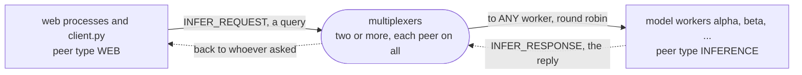

# inference

A web app that asks a pool of model workers: a Django view takes an
uploaded image, sends it through the multiplexers as an `INFER_REQUEST`,
and a worker holding a PyTorch model answers with the digit it reads.
Round robin over the workers, a worker killed mid-request costs the caller
a retry rather than an error, a rolling restart of the workers costs nobody
anything, and a multiplexer killed costs the requests caught in it one
extra turn and nothing else.
[walkthrough.ipynb](walkthrough.ipynb) builds it up step by step and shows
each of those happen; this directory is the finished example.

The example is installed with pip, the way a Django project is:
`mx-multiplexer` from PyPI, which brings the multiplexer, `mxcontrol`,
with it.

```
pip install -r requirements.txt                                  # torch from its CPU index, a 200 MB download
mxcontrol run_multiplexer --rules inference.rules --address 127.0.0.1:1980    # the package's mxcontrol
python backend.py 127.0.0.1:1980 --name alpha                    # a worker; run another with another name
python client.py 127.0.0.1:1980 samples/*.png                    # asks; --repeat 200 for the numbers
MX_ADDRESSES=127.0.0.1:1980 python web/manage.py runserver       # the web app on http://127.0.0.1:8000
curl -F image=@samples/7.png http://127.0.0.1:8000/classify      # {"label": 7, "worker": "alpha", ...}
```

`docker compose up` runs two multiplexers from the release image, and two
workers and the web app built from this directory, all amd64 as the
wheels on PyPI are, so under emulation on an arm64 machine.

## The peers

Every peer connects to every multiplexer; the one rule of the rules file
sends each request to any one worker, round robin, and the reply goes
back to whoever asked. The notebook draws a request, a worker killed
under one and a rolling restart, step by step.



## What is what

- `inference.rules`: the system rules, then `WEB`, `INFERENCE`,
  `INFER_REQUEST` routed to any worker, `INFER_RESPONSE`;
  `multiplexer_constants.py` is what `mxcontrol generate_constants` wrote
  from it, and `inference.proto` the payloads, compiled to `inference_pb2.py`.
- `model.py` and `weights.pt`: a small convolutional network and its
  weights, trained by `train.py` on MNIST in seconds; `samples/` holds one
  image per digit for the client to send.
- `backend.py`: the worker, a `BaseThreadedMultiplexerServer` that loads the
  model once and answers each request; `--slow` makes it slow on purpose,
  SIGTERM or `--drain-file` asks it to leave.
- `client.py`: the command-line client, with `--repeat` for latency and
  who-answered counts.
- `web/`: the Django project, one app, no database; `classify/mx.py` is the
  one `ThreadedClient` per process from
  [the recipe](../../docs/recipes/web_server.md), `classify/views.py` the
  view and the JSON endpoint, each library exception a status code.
- `diagrams/`: the notebook's pictures, each an SVG rendered from the
  Mermaid source beside it by `docs/check_mermaid.py --write`, since
  GitHub shows a notebook's Markdown without rendering Mermaid.
