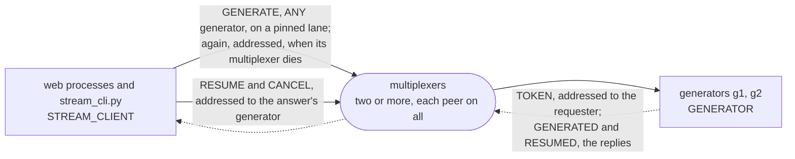

# stream

An answer that arrives in pieces, the way a language model's does. A
generator is a backend that answers a prompt token by token. The request
is one query, `GENERATE`, routed to any one generator, and the answer
comes back as follow-ups: one `TOKEN` per piece, addressed to the
requester while its request waits, then `GENERATED`, the reply that ends
it, after the last piece. The request goes through a pinned lane, so the
tokens, which the generator sends back the way the request came, arrive
in order while that multiplexer lives. When it dies under an answer, the
requester sends the request again through the other, with the number of
the token due, addressed with `to` to the generator of the answer once a
token has named it; the generator joins it to the answer under way and
sends again what died with the connection. A token lost on the way shows
as a number skipped, and the requester asks the generator for it; a
consumer that stops early and closes its stream tells the generator to
stop; a generator asked to leave finishes its answers. The web side is a
FastAPI endpoint that forwards an answer as Server-Sent Events, so `curl
-N` shows the tokens arrive. There is no model in it: the generator
reads words from a fixed text at a steady rate, since the point is the
transport.

The example is installed with pip, the way a web service is:
`mx-multiplexer` from PyPI, which brings the multiplexer, `mxcontrol`,
with it.
[walkthrough.md](walkthrough.md) builds it from nothing, every line of
the rules file, the payloads, the generator, the requester's client
and the web app explained as it is added, and says why a stream on this
broker looks like this: one reply per request, follow-ups addressed and
numbered, order held per connection only. It ends with the measured
steps, a multiplexer and a generator killed under an answer and a
rolling restart among them, and a walk through its test.

```
pip install -r requirements.txt
mxcontrol run_multiplexer --rules stream.rules --address 127.0.0.1:1980     # the package's mxcontrol
mxcontrol run_multiplexer --rules stream.rules --address 127.0.0.1:1981     # a second one, in another terminal
python generator.py 127.0.0.1:1980,127.0.0.1:1981 --name g1                 # a generator; run g2 the same way
python stream_cli.py 127.0.0.1:1980,127.0.0.1:1981 "what is a multiplexer" --tokens 60
cd web && MX_ADDRESSES=127.0.0.1:1980,127.0.0.1:1981 uvicorn app:app --port 8000   # the page on http://127.0.0.1:8000
curl -N 'http://127.0.0.1:8000/generate?prompt=hello&tokens=20'             # the answer as Server-Sent Events
```

`test.sh` runs the test in a virtual environment against real multiplexers.

## The peers

Requesters and generators, each connected to every multiplexer. The
request is the one message with a rule, `GENERATE` to `ANY` generator;
everything else is addressed with `to` or is a reply. The walkthrough
draws an answer, a multiplexer dying under one, a gap filled, a
consumer stopping early and a generator leaving.



## What is what

- `stream.rules`: the system rules, then `STREAM_CLIENT`, `GENERATOR`,
  and the message types: `GENERATE` with its `ANY` rule, and the four
  that are addressed or replies and need none; `multiplexer_constants.py`
  is what `mxcontrol generate_constants` wrote from it, and
  `stream.proto` the payloads, compiled to `stream_pb2.py`.
- `generator.py`: the generator, a `BaseThreadedMultiplexerServer`
  whose answers run on a pool of their own, eight at once.
- `mxstream/client.py`: `Streams` and `Stream`, the requester's side: an
  answer as an async iterator of its tokens, in order, with what a dead
  connection lost asked for again.
- `stream_cli.py`: the command line the steps use.
- `web/app.py`: the FastAPI app: `/generate` as Server-Sent Events, and
  the page that shows an answer appear.
- `test.py`, `test.sh`: the test on the harness, and the script that
  makes a venv and runs it.
