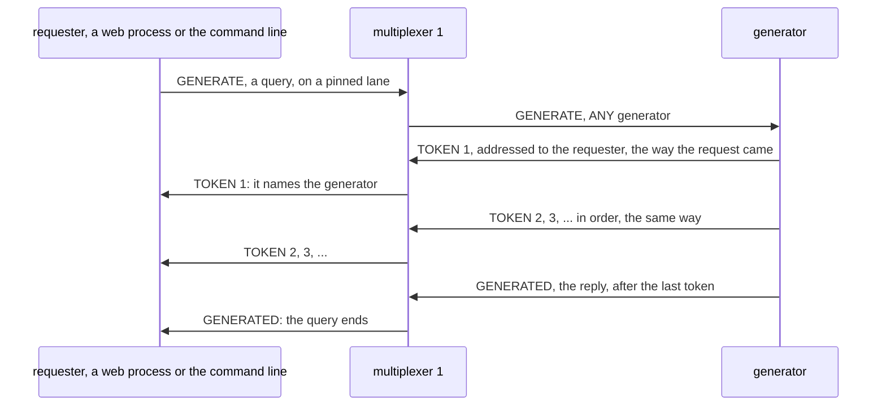
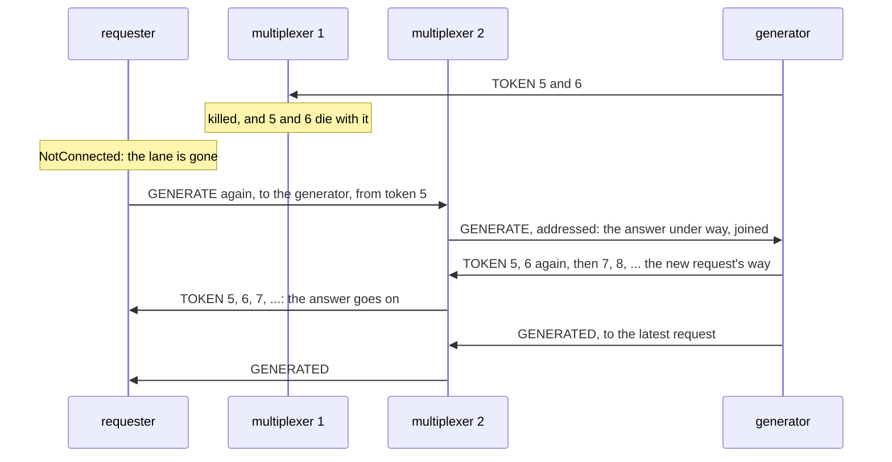
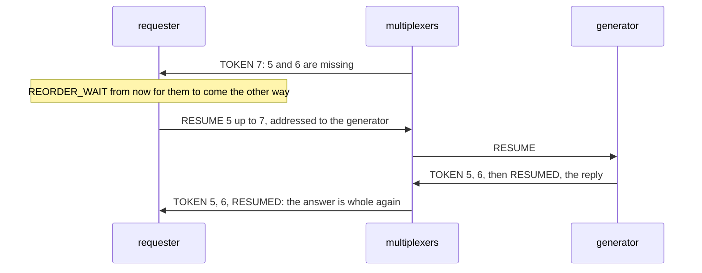
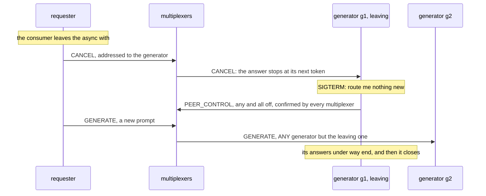

# Building the streaming answers, step by step

This page builds the example from nothing: the rules file, the payloads,
the generator, the requester's client and the web app, in that order,
with every line of those files shown as it is added. Every code block
is a piece of a file in this directory, and `examples/check_walkthroughs.py`
keeps them identical to the files, so what you read here is what runs.
[README.md](README.md) is the front door: what the example is, a picture
of its peers, and how to run it. How the messages go, drawn, the
measured steps, the test and what the example does not do are at the
end of this page.

The idea in one sentence: an answer that takes seconds is one request
and one reply on this broker, and the pieces in between are follow-ups,
each addressed to the requester and numbered, so that they arrive in
order through one multiplexer while it lives, and can be put in order
and asked for again when it dies.

## 1. The rules file

The file opens with the system rules every rules file starts from, the
protocol's own types 1 to 99 and the six the libraries and `mxcontrol`
use by name ([docs/rules.md](../../docs/rules.md)), which `mxcontrol
generate_rules stream.rules` wrote; they are left out here. Then the
example's two peer types and its six message
types. Only one has a rule: `GENERATE`, the request, routed to `ANY` one
generator, round robin over those connected. The other five need none.
`TOKEN`, `RESUME` and `CANCEL` are addressed, sent with `to`, and an
addressed message goes where `to` says whatever the rules; `GENERATED`
and `RESUMED` are replies, which go back to whoever asked. A type in the
file with no rule is a type nobody routes by, which is what these are.

```protobuf file=stream.rules from="# The example's peers and messages."
# The example's peers and messages.

peer {
    type: 201
    name: "STREAM_CLIENT"
    comment: "whoever asks: the web app's processes, and the command line"
}

peer {
    type: 202
    name: "GENERATOR"
    comment: "a worker that answers a prompt token by token; run as many as you like"
}

type {
    type: 301
    name: "GENERATE"
    comment: "a request, payload Prompt; any one generator streams TOKENs to the requester and ends with GENERATED"
    to {
        peer: "GENERATOR"
        whom: ANY
    }
}

type {
    type: 302
    name: "TOKEN"
    comment: "one piece of the answer, payload Token; addressed to the requester, so it needs no rule, and not a reply, so it references nothing"
}

type {
    type: 303
    name: "GENERATED"
    comment: "the reply to GENERATE, payload Generated, sent after the last token"
}

type {
    type: 304
    name: "RESUME"
    comment: "a request addressed to the generator of a stream, payload Resume: send the tokens from a number on again"
}

type {
    type: 305
    name: "RESUMED"
    comment: "the reply to RESUME, payload Resumed"
}

type {
    type: 306
    name: "CANCEL"
    comment: "an event addressed to the generator of a stream, payload Cancel: stop the answer, nobody reads it"
}
```

With the file written, `mxcontrol generate_constants stream.rules --python
multiplexer_constants.py --pyi multiplexer_constants.pyi` writes the
module the code below imports, so that it says `types.GENERATE` rather
than 301.

## 2. The payloads

One message per type, in [stream.proto](stream.proto). `Prompt` carries
`stream_id`, the requester's own random number for the answer: every
token carries it back, so that two answers arriving in one process are
told apart, and the generator uses it to recognise the request when it
comes again, with `from_seq`, after the requester's connection died
under the answer. `Token` carries the answer's number and its own,
`seq`, counted from 1, and `last` on the final one. `Generated` is the
reply that ends the request. `Resume` and `Resumed` are the question a
requester asks when tokens are missing, and its answer; `Cancel` tells
a generator to stop.

```protobuf file=stream.proto
// The payloads of the streaming example. Compiled once with `protoc
// --python_out=. --pyi_out=. stream.proto`; the generated stream_pb2.py is
// committed next to it.
syntax = "proto3";

package stream;

// GENERATE: what to answer and how many tokens. `stream_id` is the
// requester's own number for the answer: the tokens carry it, so that two
// answers to one process are told apart. The requester sends it again
// when its connection died under the answer, addressed to the generator
// of the answer once a token has named it: the generator joins it to the
// answer under way, sends the tokens from `from_seq` on again, and the
// rest, and the reply, the new request's way.
message Prompt {
  uint64 stream_id = 1;
  string prompt = 2;
  uint32 tokens = 3;
  uint32 from_seq = 4;
}

// TOKEN: one piece of the answer, addressed to the requester while its
// request waits: not a reply, so it references nothing; the stream it
// belongs to and its number, from 1, so that a gap shows and order can be
// restored.
message Token {
  uint64 stream_id = 1;
  uint32 seq = 2;
  string text = 3;
  bool last = 4;
}

// GENERATED: the reply that ends the request, sent after the last token,
// or `cancelled` after a CANCEL stopped the answer; `resent` counts the
// tokens of the answer sent again, to a request that joined it or for a
// RESUME.
message Generated {
  uint64 stream_id = 1;
  uint32 tokens = 2;
  double seconds = 3;
  string worker = 4;
  bool cancelled = 5;
  uint32 resent = 6;
}

// RESUME: a requester that saw a gap asks the generator of the stream,
// addressed, for the tokens from `from_seq` up to `until_seq` again, or
// to the last it has when `until_seq` is 0; RESUMED answers with how many
// it sent, after sending them.
message Resume {
  uint64 stream_id = 1;
  uint32 from_seq = 2;
  uint32 until_seq = 3;
}

message Resumed {
  uint64 stream_id = 1;
  uint32 resent = 2;
  bool done = 3;
}

// CANCEL: an event addressed to a generator: stop the answer, whose
// requester reads no more of it.
message Cancel {
  uint64 stream_id = 1;
}
```

`protoc --python_out=. --pyi_out=. stream.proto` compiles it to
`stream_pb2.py`, committed next to it.

## 3. The generator

The generator, [generator.py](generator.py), is a backend that answers
a prompt token by token. There is no model in it: the answer is words
of a fixed text, read from the place the prompt's checksum picks and
wrapping round, at a steady rate, so that the test knows what to expect
and the numbers below measure the transport and nothing else. `leaving`
is the flag the signals set, below.

```python file=generator.py
"""A generator: a worker that answers a prompt token by token, the way a
language model serves an answer, without the model. The answer is words
of a fixed text, from a place the prompt picks, at a steady rate; the
point is the transport: one request, its tokens as follow-ups addressed
to the requester while the request waits, one reply at the end, and a
requester that asks again for what a dead connection lost.

    python generator.py [ADDRESSES] [--name NAME] [--tokens-per-second N] [--answers N]

ADDRESSES is host:port of every multiplexer, comma-separated, default
127.0.0.1:1980. The generator is a BaseThreadedMultiplexerServer whose
workers only take the messages in: every answer runs on a thread of its
own, from a pool of `--answers`, so that a request joining an answer, a
resend or a cancel is served at once however many answers are under
way. SIGTERM or Ctrl-C asks it to leave: the multiplexers route it no
new prompt, the answers under way end, and then it closes."""

import argparse
import logging
import os
import signal
import socket
import threading
import time
import zlib
from concurrent.futures import ThreadPoolExecutor
from typing import Callable

from multiplexer.mxclient import CLOSE_FLUSH_SECONDS
from multiplexer.threaded_server import BaseThreadedMultiplexerServer, Request

from multiplexer_constants import peers, types
from mxstream.client import MAX_TOKENS, parse_addresses
from stream_pb2 import Cancel, Generated, Prompt, Resume, Resumed, Token

# The text the answers are made of: a prompt picks where to start reading.
TEXT = """The multiplexer is a message broker for a datacenter, one binary, that
routes typed messages between the programs connected to it by the rules in
one file. A request goes to any one backend of its type and comes back
answered; an event goes to every peer of its type; a message addressed to
an instance goes there and nowhere else. Several multiplexers run side by
side and every peer connects to all of them, so a multiplexer may die and
nothing is lost but the messages it held. A backend leaves by telling the
multiplexers to route it nothing new, serving what was on its way, and
closing; a client finds a live backend on its own. Nothing is persisted and
nothing is queued beyond a socket, which is what makes it simple to run
and fast enough to carry a stream of ten millisecond frames."""
WORDS = TEXT.split()
FORGET_AFTER = 60.0  # seconds a finished answer's tokens are kept, for a late resend
LEAVE_SECONDS = 60.0  # the longest a leave waits for the answers under way
LINGER = 1.0  # seconds a leaving generator stays after its last answer ended, for a late request for its tail

log = logging.getLogger("generator")
leaving = threading.Event()  # set by SIGTERM and SIGINT


def answer_words(prompt: str, count: int) -> list[str]:
    """The answer to `prompt`, `count` words from the text, read from the
    place the prompt's checksum picks and wrapping round; deterministic, so
    that a test knows what to expect."""
    start = zlib.crc32(prompt.encode()) % len(WORDS)
    return [WORDS[(start + index) % len(WORDS)] for index in range(count)]


```

An answer is an `Answer`: its tokens so far, whether it ended and how,
and the requests asking for it. There is usually one; there are two
when the requester's connection to this generator died under the
answer, since the requester then sends the request again through
another multiplexer, addressed here, with a new message id, as every
attempt has ([docs/semantics.md](../../docs/semantics.md)). The
generator cannot tell the attempts apart by their ids, so it recognises
the answer by `stream_id`, which is the rule there: deduplicate on the
payload, never on the message id. `requester` is who may cancel it.

```python file=generator.py
class Answer:
    """One answer: its tokens so far, the requests that asked for it, and
    whether it ended. More than one request asks for the same answer when
    the requester's connection to this generator died under it: it sends
    the request again, addressed here, with the same stream_id, and the
    answer goes on the new request's way."""

    def __init__(self, request: Request, prompt: Prompt):
        self.prompt = prompt
        self.requester = request.mxmsg.sender
        self.requests = [request]
        self.tokens: list[Token] = []
        self.done = False  # ended: whole, cancelled or failed
        self.cancelled = False
        self.failed = ""  # what went wrong, for an answer that failed
        self.resent = 0  # tokens sent again, to a request that joined or for a RESUME
        self.finished_at = 0.0
        self.seconds = 0.0


```

The class is a `BaseThreadedMultiplexerServer`, the threaded backend
class, but its two workers only take the messages in: each answer runs
on a thread of its own, from a pool of `answers`, eight by default, how
many answers at once. An answer takes seconds, sleeping between tokens,
and on a worker it would hold that worker the whole time; a `RESUME`
would then wait behind every answer under way, and with as many answers
as workers, until one ended, so the one message a stream in trouble
needs at once would come last. `handle_message()` runs on the workers
and the answers on the pool, so what they share is under a lock.

```python file=generator.py
class Generator(BaseThreadedMultiplexerServer):
    """Answers GENERATE token by token, RESUME with tokens sent again, CANCEL by stopping."""

    multiplexer_client_type = peers.GENERATOR

    def __init__(
        self,
        addresses: list[tuple[str, int]],
        name: str | None = None,
        tokens_per_second: float = 20.0,
        answers: int = 8,
    ):
        super().__init__(addresses, workers=2)  # the workers only take messages in; the answers have their own threads
        self.name = name or f"{socket.gethostname()}:{os.getpid()}"
        self.tokens_per_second = tokens_per_second
        self.answers: dict[int, Answer] = {}
        self.lock = threading.Lock()  # the workers and the answers' threads share the answers
        self.pool = ThreadPoolExecutor(answers, thread_name_prefix="answer")
        self.started = 0  # answers started here, the joins not counted
        self.answered = 0  # answers that ended whole
        self.leave_started = 0.0

    def handle_message(self, request: Request) -> None:
        """A prompt, a resend or a cancel; anything else dropped."""
        kind = request.mxmsg.type
        if kind == types.GENERATE:
            self._generate(request)
        elif kind == types.RESUME:
            self._resume(request)
        elif kind == types.CANCEL:
            self._cancel(request)
        else:
            request.no_response()

```

A `GENERATE` for a new `stream_id` starts an answer on the pool. One for
an answer under way here is its requester's request again: it joins the
answer, the tokens from its `from_seq` on go to it again, since the ones
that were inside the dead multiplexer never arrived, and from then on
the tokens and the reply go its way. One for an answer that ended gets
the tokens it asks for and the reply at once.

```python file=generator.py
    def _generate(self, request: Request) -> None:
        """A new answer, started on a thread of the pool. Or the requester's
        request again, for an answer under way here, after its connection
        died: it joins the answer, the tokens from `from_seq` on go again,
        and the rest, and the reply, go its way."""
        prompt = request.parse_message(Prompt)
        with self.lock:
            answer = self.answers.get(prompt.stream_id)
            if answer is None:
                answer = self.answers[prompt.stream_id] = Answer(request, prompt)
                self.started += 1
                again, done = None, False
            else:
                done = answer.done
                if not done:
                    answer.requests.append(request)
                again = [token for token in answer.tokens if token.seq >= prompt.from_seq] if prompt.from_seq else []
                answer.resent += len(again)
        if again is None:
            self.pool.submit(self._answer, answer)
            return
        for token in again:
            self._send_token(request, token)
        if done and answer.failed:
            request.report_error(answer.failed)
        elif done:
            request.reply(self._generated(answer), type=types.GENERATED)

```

The heart of it. Each token is sent with `send_message()`, not
`reply()`, and that is the whole pattern. `to=request.mxmsg.sender`
addresses it to the requester; `multiplexer=request.connection` sends
it back through the multiplexer the latest request came from, so that
the tokens take the same path as each other and arrive in order, and
through another when that one is gone; and nothing sets `references`,
because a message that references a request is its reply, and a query
has one. A cancel stops the answer at its next token. After the last,
`_end()` marks the answer ended and `reply()` sends `GENERATED`, which
ends the requester's query: the latest request gets it, and the ones it
superseded `no_response()`, one reply per answer. An error in the loop,
which a real model's call can raise, ends the answer too, with
`BACKEND_ERROR` to the requester, so that no answer is ever left open
for a request that joins it to wait on, and a request that joins it
later gets the same error; only whole answers count in `answered`.

```python file=generator.py
    def _answer(self, answer: Answer) -> None:
        """On a thread of the pool: the tokens, each to the latest request,
        then the reply. A cancel stops it at the next token; an error, as a
        real model's call can raise, ends it with BACKEND_ERROR to the
        requester. Either way the answer is never left open."""
        prompt = answer.prompt
        count = max(1, min(prompt.tokens or 40, MAX_TOKENS))
        started = time.monotonic()
        try:
            for seq, text in enumerate(answer_words(prompt.prompt, count), start=1):
                token = Token(stream_id=prompt.stream_id, seq=seq, text=text, last=seq == count)
                with self.lock:
                    if answer.cancelled:
                        break
                    answer.tokens.append(token)
                    latest = answer.requests[-1]
                self._send_token(latest, token)
                time.sleep(1.0 / self.tokens_per_second)
        except Exception as error:
            log.exception("answer %d failed", prompt.stream_id)
            self._end(
                answer, started, lambda request, error=error: request.report_error(repr(error)), failed=repr(error)
            )
            return
        self._end(answer, started, lambda request: request.reply(self._generated(answer), type=types.GENERATED))

    def _end(self, answer: Answer, started: float, reply: Callable[[Request], object], failed: str = "") -> None:
        """The answer marked ended, whole unless cancelled or `failed`, its
        latest request answered with `reply`, the ones that request
        superseded declared done: one reply per answer."""
        with self.lock:
            answer.done = True
            answer.failed = failed
            answer.finished_at = time.time()
            answer.seconds = time.monotonic() - started
            if not answer.cancelled and not failed:
                self.answered += 1
            requests = list(answer.requests)
        for earlier in requests[:-1]:
            earlier.no_response()
        try:
            reply(requests[-1])
        except Exception:  # closed under a leave that ran out of time: nobody to tell
            requests[-1].no_response()
            log.warning("the reply to answer %d could not be sent", answer.prompt.stream_id)

    def _send_token(self, request: Request, token: Token) -> None:
        """A follow-up, not a reply: addressed to the requester, referencing
        nothing, on the connection the request came through, so that the
        tokens arrive in order, and on another when that one is gone."""
        self.send_message(token, type=types.TOKEN, to=request.mxmsg.sender, multiplexer=request.connection)

    def _generated(self, answer: Answer) -> Generated:
        """The reply: how long the answer was, how long it took, who made it, whether it was stopped."""
        return Generated(
            stream_id=answer.prompt.stream_id,
            tokens=len(answer.tokens),
            seconds=answer.seconds,
            worker=self.name,
            cancelled=answer.cancelled,
            resent=answer.resent,
        )

```

`RESUME` sends the tokens asked for again, from a number up to another,
to whoever asks, the same way a token is sent the first time, then
replies with how many. An unknown answer gets none and `done`, so the
asker knows to stop. `CANCEL` marks the answer to stop, when it comes
from the answer's own requester.

```python file=generator.py
    def _resume(self, request: Request) -> None:
        """The tokens asked for, sent again to whoever asks, then the reply
        saying how many; an unknown stream gets none and `done`."""
        resume = request.parse_message(Resume)
        until = resume.until_seq or MAX_TOKENS + 1
        with self.lock:
            answer = self.answers.get(resume.stream_id)
            tokens = [token for token in answer.tokens if resume.from_seq <= token.seq < until] if answer else []
            done = answer.done if answer else True
            if answer is not None:
                answer.resent += len(tokens)
        for token in tokens:
            self._send_token(request, token)
        request.reply(Resumed(stream_id=resume.stream_id, resent=len(tokens), done=done), type=types.RESUMED)

    def _cancel(self, request: Request) -> None:
        """Stop an answer at its next token, when its own requester asks."""
        cancel = request.parse_message(Cancel)
        with self.lock:
            answer = self.answers.get(cancel.stream_id)
            if answer is not None and answer.requester == request.mxmsg.sender:
                answer.cancelled = True
        request.no_response()

```

`periodic_task()`, which `serve_forever()` calls every poll on its own
thread, forgets answers a minute after they end; until then a late
resend still works. It also starts the leave, once a signal set the
flag: `start_draining()` tells the multiplexers to route the generator
nothing new, so a new prompt goes to another generator, while messages
addressed here, a join, a `RESUME`, a `CANCEL`, still arrive, as an
addressed message always does. `drained()` keeps the drain going until
the multiplexers have confirmed and every answer under way has ended,
and a second longer, a minute at most: a leaving generator finishes
what it started, and a request for an answer's tail that a dead
connection lost still finds it. `close()` then closes the pool too
([docs/leaving.md](../../docs/leaving.md)).

```python file=generator.py
    def periodic_task(self) -> None:
        """Every poll, on serve_forever()'s thread: start leaving when a
        signal asked, and forget answers finished a minute ago."""
        now = time.time()
        with self.lock:
            under_way = sum(not answer.done for answer in self.answers.values())
            old = [
                key for key, answer in self.answers.items() if answer.done and now - answer.finished_at > FORGET_AFTER
            ]
            for key in old:
                del self.answers[key]
        if leaving.is_set() and not self.draining:
            print(f"leaving, answers under way: {under_way}", flush=True)
            self.leave_started = time.monotonic()
            self.start_draining()

    def drained(self) -> bool:
        """The library's drain, confirmed by the multiplexers, and every
        answer under way ended LINGER ago, or LEAVE_SECONDS gone: a leaving
        generator finishes what it started, and stays a moment for a
        request for an answer's tail that a dead connection lost."""
        if not super().drained():
            return False
        if time.monotonic() - self.leave_started >= LEAVE_SECONDS:
            return True
        with self.lock:
            under_way = any(not answer.done for answer in self.answers.values())
            ended = max((answer.finished_at for answer in self.answers.values() if answer.done), default=0.0)
        return not under_way and time.time() - ended >= LINGER

    def close(self, timeout: float = CLOSE_FLUSH_SECONDS) -> None:
        """The library's close; an answer still under way ends at its next token, which cannot be sent."""
        super().close(timeout)
        self.pool.shutdown(wait=False, cancel_futures=True)


```

`main()` is the usual: the addresses, a name for the summary lines, the
rate and the number of answers, `SIGTERM` and `SIGINT` setting the
flag, then `serve_forever()`, which connects, and a line on the way out.

```python file=generator.py
def main() -> None:
    """Answer until asked to leave."""
    parser = argparse.ArgumentParser(description=(__doc__ or "").split("\n\n")[0])
    parser.add_argument(
        "addresses", nargs="?", default="127.0.0.1:1980", help="host:port of every multiplexer, comma-separated"
    )
    parser.add_argument("--name", help="how this generator signs its answers; default host:pid")
    parser.add_argument("--tokens-per-second", type=float, default=20.0, help="the rate of an answer")
    parser.add_argument("--answers", type=int, default=8, help="answers under way at once")
    args = parser.parse_args()
    for signum in (signal.SIGTERM, signal.SIGINT):
        signal.signal(signum, lambda *_: leaving.set())
    generator = Generator(parse_addresses(args.addresses), args.name, args.tokens_per_second, args.answers)
    # The line is for whoever runs the steps; nothing waits for it, and serve_forever() connects.
    print(f"ready: generator {generator.name}, instance {generator.instance_id}", flush=True)
    generator.serve_forever(poll=0.2, drain_seconds=LEAVE_SECONDS)
    print(f"left, answers finished: {generator.answered}", flush=True)


if __name__ == "__main__":
    main()
```

## 4. The requester's client

The requester's side, [mxstream/client.py](mxstream/client.py), turns an
answer into an async iterator of its tokens on an `AsyncClient`, the
[asyncio client](../../docs/api_python.md#asyncclient). The numbers at
the top: the longest answer, how long a missing token gets to arrive
the other way before it is asked for, how long a request whose
multiplexer died waits for a token to name its generator, how long
without any token before the generator is asked whether it is still
there, the timeout of that question, and how much longer than the
answer's own deadline the library's timeout of the request is.

```python file=mxstream/client.py
"""The requester's side: an answer as an async iterator of its tokens.

`Streams` holds the answers a process has open and one subscription to
TOKEN on its AsyncClient, handing each token to the answer it belongs to
by `stream_id`. `Stream`, what `Streams.open()` returns, sends the request
as a query on a pinned lane, so that the tokens, which the generator
sends back the way the request came, arrive in order while that way
lives. The first token names the answer's generator, and a token from
any other is refused and its sender told to stop. Tokens are yielded in
order, one that came early held back; when the one due is missing, what
a dead connection lost, the generator of the answer is asked, addressed
with `to`, for the tokens missing. When the lane's multiplexer dies, the
request goes again through another, addressed to that generator once a
token has named it, and the generator joins it to the answer under way.
The query's reply ends the answer.
With `pinned=True` an answer whose multiplexer dies ends with
NotConnected instead, for a caller that would rather start over."""

import asyncio
import random
import time
from typing import AsyncIterator

from multiplexer.aio import AsyncClient
from multiplexer.endpoints import parse_endpoint
from multiplexer.Multiplexer_pb2 import MultiplexerMessage
from multiplexer.mxclient import NotConnected, OperationTimedOut

from multiplexer_constants import types
from stream_pb2 import Cancel, Generated, Prompt, Resume, Resumed, Token

MAX_TOKENS = 1000  # the longest answer a generator gives
REORDER_WAIT = 0.05  # seconds a missing token gets, from when a later one showed it missing, before it is asked for
NAME_WAIT = 0.5  # seconds a request whose multiplexer died waits for a token naming its generator, then any takes it
STALL = 5.0  # seconds without a token, once the generator is known, before it is asked whether it is still there
RESUME_TIMEOUT = 10.0
MARGIN = 5.0  # the library's own timeout of the request is the answer's and this: the answer's deadline comes first


class Incomplete(Exception):
    """The generator has no more of an answer that is missing tokens."""


def parse_addresses(text: str) -> list[tuple[str, int]]:
    """ "host:port,host:port", an IPv6 address as [address]:port, as the list the library takes."""
    return [parse_endpoint(item) for item in text.split(",")]


```

`Streams` is one per process: it holds the answers open and one
subscription to `TOKEN`, and hands each token to the answer it belongs
to by `stream_id`. `open()` starts an answer. A token for an answer no
longer open, one abandoned, tells its generator to stop, once: that is
how a generator nobody could name when the answer was abandoned, before
its first token came, learns that nobody reads.

```python file=mxstream/client.py
class Streams:
    """The answers a process has open, fed by one subscription to TOKEN."""

    def __init__(self, client: AsyncClient, stall: float = STALL):
        self.client = client
        self.stall = stall
        self._open: dict[int, "Stream"] = {}
        self._cancelled: set[tuple[int, int]] = set()  # (stream_id, generator) told to stop, so that it is told once
        self._cancelling: set[asyncio.Task] = set()  # the CANCELs on their way: the loop keeps only weak references
        self._unsubscribe = client.subscribe(types.TOKEN, self._on_token)

    def open(self, prompt: str, tokens: int = 40, *, timeout: float = 60.0, pinned: bool = False) -> "Stream":
        """Ask, and get the answer's tokens as they come:
        `async with streams.open(...) as stream: async for text in stream`.
        `timeout` bounds the whole answer; `pinned` ends it with
        NotConnected when its multiplexer dies, rather than going on
        through another."""
        stream = Stream(self, prompt, tokens, timeout, pinned)
        self._open[stream.stream_id] = stream
        return stream

    def _on_token(self, mxmsg: MultiplexerMessage) -> None:
        """On the loop, for every TOKEN: to the answer it belongs to, while
        it is open; the generator of one nobody reads any more is told to stop."""
        token = Token()
        token.ParseFromString(mxmsg.message)
        stream = self._open.get(token.stream_id)
        if stream is not None:
            stream._arrived(token, mxmsg.sender)
        else:
            self._cancel(token.stream_id, mxmsg.sender)

    def _cancel(self, stream_id: int, generator: int) -> None:
        """Tell `generator` to stop the answer, once; an event, not awaited by anyone."""
        if (stream_id, generator) in self._cancelled:
            return
        if len(self._cancelled) > 10000:
            self._cancelled.clear()  # a bound; a generator told twice is no harm
        self._cancelled.add((stream_id, generator))
        task = asyncio.ensure_future(self._send_cancel(stream_id, generator))
        self._cancelling.add(task)
        task.add_done_callback(self._cancelling.discard)

    async def _send_cancel(self, stream_id: int, generator: int) -> None:
        """The CANCEL itself, held a second while no connection is live, then
        given up on: the generator then finishes the answer to nobody."""
        try:
            await self.client.send_message(Cancel(stream_id=stream_id), type=types.CANCEL, to=generator, timeout=1.0)
        except Exception:  # the client closed meanwhile; the generator finishes likewise
            pass

    def _forget(self, stream: "Stream") -> None:
        """A stream that ended: its tokens are not taken any more."""
        self._open.pop(stream.stream_id, None)

    def close(self) -> None:
        """End the subscription; the client is the caller's."""
        self._unsubscribe()


```

`Stream` is one answer. Its request is a query on a pinned lane,
`client.lane(pinned=True)`: the lane is pinned, late, to whichever
connection the library sends the request through, and the generator
answers through that same multiplexer, so the tokens arrive in the
order they were sent while it lives. The query runs as a task, since
its reply comes after the last token and the iterator must yield tokens
meanwhile; tokens arrive through the subscription and go on a queue.

When the lane's multiplexer dies, the query raises `NotConnected`, and
`_ask()` sends the request again itself, on a new lane, with the number
of the token due, addressed with `to` to the answer's generator, so
that the generator joins it to the answer and the answer goes on. It
does not leave that to the library, which, its connection lost, sends
the request again unchanged to whichever generator answers its search
first, which would start the answer over while the first went on. The
first token names the generator, `worker`, and a token from any other is refused and its
sender told to stop; a reply from any generator but the named one, one
told to stop, sends the request to the answer's own. When the
multiplexer dies before any token has named the generator, the request
waits `NAME_WAIT` for one, since the generator that had the request may
have started it; with none, it goes to any generator, and should a
token name one after all, the request follows it there. `pinned=True`
ends the answer with `NotConnected` instead, for a caller that would
rather start over. The library's own timeout of the request is the
answer's and a margin, so that the answer's deadline comes first: past
its timeout the library would send the request to another generator
too.

```python file=mxstream/client.py
class Stream:
    """One answer: its tokens in order, the count of what was lost and
    asked for again, and the reply's summary once it ended. An async
    context manager: leaving it, or aclose(), before the end abandons the
    answer: its generator told to stop, its reply no longer waited for."""

    def __init__(self, streams: Streams, prompt: str, tokens: int, timeout: float, pinned: bool):
        self.streams = streams
        self.stream_id = random.getrandbits(63)  # the requester's own number for the answer
        self.prompt = Prompt(stream_id=self.stream_id, prompt=prompt, tokens=tokens)
        self.pinned = pinned
        self.lane = streams.client.lane(pinned=True)  # the request's connection, which the tokens come back on
        self.worker = 0  # the answer's generator, from its first token
        self.next_seq = 1  # the token due
        self.received = 0
        self.gaps = 0  # times a missing token was asked for
        self.resent = 0  # tokens the generator sent again for this requester's RESUMEs
        self.reattached = 0  # times the request went again, its multiplexer dead
        self.drop = 0  # a test's knob: the next tokens to drop on arrival, as a dead connection would
        self.answer: Generated | None = None  # the reply, once the answer ended
        self.started = time.monotonic()
        self.deadline = self.started + timeout
        self.seconds = 0.0
        self._early: dict[int, Token] = {}  # arrived before their turn, by number
        self._queue: asyncio.Queue[Token] = asyncio.Queue()
        self._last_seen = False
        self._missing_since: float | None = None  # when the token due was first seen missing
        self._named = asyncio.Event()  # set once a token or the reply names the answer's generator
        self._resent_after_end = 0  # tokens sent again for a RESUME the generator served after the answer ended
        self._task = asyncio.ensure_future(self._ask(timeout))

    async def _ask(self, timeout: float) -> Generated:
        """The request, and the reply that ends the answer. When the lane's
        multiplexer dies under it, the request goes again through another,
        with the number of the token due, addressed to the answer's
        generator, which joins it to the answer and sends the answer on
        from that token. With no token yet to name the generator, the
        request waits NAME_WAIT for one; with none, it goes to any
        generator, and follows the generator a token names after all. A
        reply from any generator but the answer's, one told to stop, sends
        the request to the answer's own."""
        prompt = Prompt()
        prompt.CopyFrom(self.prompt)
        client = self.streams.client
        while True:
            target = self.worker
            query = asyncio.ensure_future(
                client.query(prompt, types.GENERATE, timeout=timeout + MARGIN, to=target, multiplexer=self.lane)
            )
            waiting = {query}
            if not target and prompt.from_seq:  # sent again to any generator: it follows the one a token names
                waiting.add(asyncio.ensure_future(self._named.wait()))
            try:
                done, _ = await asyncio.wait(waiting, return_when=asyncio.FIRST_COMPLETED)
            except asyncio.CancelledError:
                for task in waiting:
                    task.cancel()
                raise
            for task in waiting - done:
                task.cancel()  # a generator the request left, if it starts, is told to stop by its first token
            if query not in done:
                prompt.from_seq = self.next_seq
                continue
            try:
                reply = query.result()
            except NotConnected:
                if self.pinned or time.monotonic() >= self.deadline:
                    raise
                await asyncio.sleep(REORDER_WAIT)  # a moment for the library to see which connections live
                self.lane = client.lane(pinned=True)
                self.reattached += 1
                prompt.from_seq = self.next_seq
                if not self.worker:
                    try:
                        await asyncio.wait_for(self._named.wait(), NAME_WAIT)
                    except asyncio.TimeoutError:
                        pass  # nobody named: the request may have died with the multiplexer
                continue
            generated = Generated()
            generated.ParseFromString(reply.message)
            if self.worker and reply.sender != self.worker:
                prompt.from_seq = self.next_seq
                continue
            if not self.worker:
                self.worker = reply.sender
                self._named.set()
            return generated

    def _arrived(self, token: Token, sender: int) -> None:
        """On the loop: a token, in whatever order it came; the first names
        the answer's generator, and another's is refused."""
        if self.drop:
            self.drop -= 1
            return
        if not self.worker:
            self.worker = sender
            self._named.set()
        elif sender != self.worker:
            self.streams._cancel(self.stream_id, sender)
            return
        self._queue.put_nowait(token)

```

The iterator. A failure abandons the answer; so does leaving it early,
which is why a `Stream` is an async context manager, and `aclose()`
does the same by hand: `break` out of an `async for` calls nothing on
the iterator, and an answer nobody closed would stay open, its query
waiting and its generator going on.

```python file=mxstream/client.py
    def __aiter__(self) -> AsyncIterator[str]:
        """The stream itself: `async for text in stream`."""
        return self

    async def __anext__(self) -> str:
        """The next token in order, or StopAsyncIteration after the last;
        an answer that fails is abandoned: its generator told to stop, and
        the wait for its reply given up, though the library keeps the
        request itself until its timeout."""
        try:
            return await self._next()
        except StopAsyncIteration:
            raise
        except BaseException:
            self._abandon()
            raise

    async def __aenter__(self) -> "Stream":
        return self

    async def __aexit__(self, *exc: object) -> None:
        await self.aclose()

    async def aclose(self) -> None:
        """Abandon the answer, unless it ended: a consumer that stops early closes its stream."""
        self._abandon()

```

The iterator is a sequencer. It yields the token due, `next_seq`, and
holds back any that came before their turn. When a later one is here
and the one due is not, or the reply is in and the answer is not whole,
the one due gets `REORDER_WAIT` to arrive the other way, counted from
when it was first seen missing, whatever arrives meanwhile; then it is
asked for, with a `RESUME` for exactly the tokens missing, up to the
first one here. When nothing at all comes for the stall, the generator
is asked too, which is how a dead generator is found out; but only once
a token has named it, since before that the request may be waiting in
a busy generator's pool, and there is nobody to ask; a question that
brings tokens counts as a gap. The whole answer has its deadline.
`_abandon()` forgets the answer, stops waiting for its reply and tells
its generator to stop; the library keeps the request itself until its
timeout, and a generator it reaches after that is told to stop by its
first token.

```python file=mxstream/client.py
    async def _next(self) -> str:
        """The token due, once it arrived. One missing while a later one, or
        the reply, is in gets REORDER_WAIT to come the other way, from when
        that was seen, and is then asked for. Nothing at all for `stall`,
        once the generator is known, is a question to it; before the first
        token nothing is asked, since the request may wait in a busy
        generator's queue. The whole answer has its deadline."""
        while True:
            token = self._early.pop(self.next_seq, None)
            if token is not None:
                self.next_seq += 1
                self.received += 1
                self._missing_since = None
                if token.last:
                    self._last_seen = True
                return token.text
            if self._last_seen:
                await self._finish()
                raise StopAsyncIteration
            if self._task.done() and self._task.exception() is not None:
                error = self._task.exception()
                assert error is not None
                raise error  # no generator, a pinned lane's connection gone
            now = time.monotonic()
            if now >= self.deadline:
                raise OperationTimedOut(f"the answer took longer than its {self.deadline - self.started:.0f} s")
            if self._early or self._task.done():
                if self._missing_since is None:
                    self._missing_since = now
                wait = self._missing_since + REORDER_WAIT - now
                if wait > 0:
                    await self._next_arrival(min(wait, self.deadline - now))
                else:
                    self.gaps += 1
                    self._missing_since = None
                    await self._resume(min(self._early, default=0))
            elif not self.worker:
                await self._next_arrival(self.deadline - now)
            elif not await self._next_arrival(min(self.streams.stall, self.deadline - now)):
                # A stall: what came since, a gap when it is anything, or
                # OperationFailed when its generator is gone.
                if time.monotonic() < self.deadline and await self._resume(0):
                    self.gaps += 1

    def _abandon(self) -> None:
        """Forget the answer, stop waiting for its reply and tell its
        generator to stop; nothing, once the answer ended. The library
        keeps the request until its timeout, and a generator it reaches
        after that is told to stop by its first token."""
        if self.answer is not None:
            return
        self.streams._forget(self)
        if not self._task.done():
            self._task.cancel()
        if self.worker:
            self.streams._cancel(self.stream_id, self.worker)

```

`_next_arrival()` waits for a token or the reply, and then takes every
queued token; a token sent again that was seen already is dropped
there. `_resume()` is the question: a `RESUME` addressed to the
generator with `to`, the instance id its tokens carry as their `sender`.
The tokens come through the subscription ahead of the reply, so by the
time the reply is in they are all queued; a generator that is gone
makes the query `OperationFailed` at once, as any addressed query to a
peer nobody has. The question waits no longer than the answer may.

```python file=mxstream/client.py
    async def _next_arrival(self, timeout: float | None) -> bool:
        """Wait for a token, or for the reply while it is not in, at most
        `timeout`; then keep every queued token. Whether anything came."""
        get = asyncio.ensure_future(self._queue.get())
        waiting = {get} if self._task.done() else {get, self._task}
        try:
            done, _ = await asyncio.wait(waiting, timeout=timeout, return_when=asyncio.FIRST_COMPLETED)
        finally:
            if not get.done():
                get.cancel()
        if get.done() and not get.cancelled():
            self._keep(get.result())
        self._keep_queued()
        return bool(done)

    def _keep(self, token: Token) -> None:
        """A token for its turn; one sent again and seen already is dropped."""
        if token.seq >= self.next_seq:
            self._early[token.seq] = token

    def _keep_queued(self) -> None:
        """Every token that has arrived, each for its turn."""
        while not self._queue.empty():
            self._keep(self._queue.get_nowait())

    async def _resume(self, until: int) -> int:
        """Ask the generator of this answer, addressed, for the tokens from
        the one due up to `until`, the first one here already, or on to the
        last it has; they come through the subscription ahead of the reply,
        so they are all queued once it is in. How many came again. A
        generator that is gone makes this OperationFailed at once, as any
        addressed query; the question waits no longer than the answer may."""
        resume = Resume(stream_id=self.stream_id, from_seq=self.next_seq, until_seq=until)
        timeout = max(0.01, min(RESUME_TIMEOUT, self.deadline - time.monotonic()))
        reply = await self.streams.client.query(resume, types.RESUME, timeout=timeout, to=self.worker)
        resumed = Resumed()
        resumed.ParseFromString(reply.message)
        self.resent += resumed.resent
        if resumed.done:
            self._resent_after_end += resumed.resent  # after the reply's count was made
        self._keep_queued()
        if resumed.resent == 0 and resumed.done and self.next_seq not in self._early:
            raise Incomplete(f"the generator has nothing from token {self.next_seq} on")
        return resumed.resent

```

`_finish()` awaits the reply once the last token was yielded, within the
answer's deadline, and `summary()` is what the command line and the web
page show, with the reply's count of the tokens sent again, which takes
in the ones a request that joined the answer got, and the ones a
`RESUME` got after the answer ended.

```python file=mxstream/client.py
    async def _finish(self) -> None:
        """The reply, once the last token was yielded; it may be in already,
        and it comes within the answer's deadline or not at all."""
        try:
            self.answer = await asyncio.wait_for(asyncio.shield(self._task), max(0.0, self.deadline - time.monotonic()))
        except asyncio.TimeoutError:
            raise OperationTimedOut(f"the answer took longer than its {self.deadline - self.started:.0f} s") from None
        self.seconds = time.monotonic() - self.started
        self.streams._forget(self)

    @property
    def tokens_per_second(self) -> float:
        """The answer's tokens over its seconds; 0 until its reply came."""
        return self.received / self.seconds if self.seconds else 0.0

    def summary(self) -> dict[str, str | int | float]:
        """What the answer cost, for a meter or a log line."""
        return {
            "tokens": self.received,
            "seconds": round(self.seconds, 3),
            "tokens_per_second": round(self.tokens_per_second, 1),
            "worker": self.answer.worker if self.answer else "",
            "gaps": self.gaps,
            # The reply's count takes in the joins too, but not a RESUME served after the answer ended.
            "resent": self.answer.resent + self._resent_after_end if self.answer else self.resent,
            "reattached": self.reattached,
        }
```

The package's `__init__.py` re-exports the four names.

```python file=mxstream/__init__.py
"""The requester's side of the streaming example: `Streams`, one
subscription to the tokens over an `AsyncClient`, and the `Stream` it
opens, an async iterator of an answer's tokens in order, with what a dead
connection lost asked for again."""

from mxstream.client import Incomplete, Stream, Streams, parse_addresses

__all__ = ["Incomplete", "Stream", "Streams", "parse_addresses"]
```

## 5. The web app

The web side, [web/app.py](web/app.py), is a FastAPI app. One
`AsyncClient` per process, from a holder, as [the async web server
recipe](../../docs/recipes/async_web_server.md) has it, made on a
thread at the first request with `aget()`, so that the loop never waits
for the handshakes; and one `Streams` on it.

```python file=web/app.py
"""The web side: a FastAPI app whose /generate streams an answer as
Server-Sent Events, one event per token as the generator produces it,
and a page that shows the tokens appear. One AsyncClient per process,
from a holder, as the async web server recipe has it; the answer's tokens
reach the socket as they reach the process, with nothing buffered between.

    MX_ADDRESSES=127.0.0.1:1980,127.0.0.1:1981 uvicorn app:app --port 8000
    curl -N 'http://127.0.0.1:8000/generate?prompt=hello&tokens=20'
"""

import json
import os
import sys

# The example's directory, for its constants, payloads and client.
sys.path.insert(0, os.path.dirname(os.path.dirname(os.path.abspath(__file__))))

from fastapi import FastAPI, Query
from fastapi.responses import HTMLResponse, StreamingResponse
from multiplexer.aio import AsyncClient

from multiplexer_constants import peers
from mxstream import Streams, parse_addresses
from mxstream.client import MAX_TOKENS

ENDPOINTS = parse_addresses(os.environ.get("MX_ADDRESSES", "127.0.0.1:1980"))
MX = AsyncClient.holder(peers.STREAM_CLIENT, lambda: ENDPOINTS)
app = FastAPI(title="stream")
_streams: Streams | None = None


async def streams() -> Streams:
    """The process's Streams over the holder's client, made on first use,
    on a thread, so that the loop never waits for the handshakes."""
    global _streams
    client = await MX.aget()
    if _streams is None or _streams.client is not client:
        _streams = Streams(client)
    return _streams


```

`/generate` is the answer as Server-Sent Events: a `StreamingResponse`
over an async generator that yields one `data` event per token as the
iterator yields it, then a `done` event with the summary, or an `error`
event with the exception's name. Nothing buffers in between: a token
reaches the socket as it reaches the process. The `async with` closes
the answer however the generator ends, a browser gone while it waits at
a `yield` included, which cancels the answer at the generator too.
FastAPI refuses a count of tokens out of range with 422 before anything
streams.

```python file=web/app.py
@app.get("/generate")
async def generate(prompt: str, tokens: int = Query(40, ge=1, le=MAX_TOKENS)) -> StreamingResponse:
    """The answer as Server-Sent Events: `data` per token, `done` with the summary, or `error`."""

    async def events():
        """The answer's tokens as Server-Sent Events, then its summary, or the error that ended it."""
        try:
            # Closed however events() ends, a browser gone at a yield included: the answer abandoned, its
            # generator told to stop.
            async with (await streams()).open(prompt, tokens) as stream:
                async for text in stream:
                    yield f"data: {json.dumps(text)}\n\n"
                yield f"event: done\ndata: {json.dumps(stream.summary())}\n\n"
        except Exception as error:  # no generator, a timeout: the client gets a name rather than a cut
            yield f"event: error\ndata: {json.dumps(type(error).__name__)}\n\n"

    return StreamingResponse(events(), media_type="text/event-stream")


```

The page is an `EventSource` on that endpoint, and a meter under the
answer.

```python file=web/app.py
@app.get("/", response_class=HTMLResponse)
async def index() -> str:
    """A prompt, and the answer appearing token by token."""
    return PAGE


PAGE = """<!doctype html>
<title>Streaming answers</title>
<style>
  body { font-family: sans-serif; margin: 1em; max-width: 50em; }
  #answer { border: 1px solid #ccc; min-height: 6em; padding: 0.5em; margin: 0.5em 0; line-height: 1.5; }
  #meter { font-family: monospace; white-space: pre; }
</style>
<h1>Streaming answers</h1>
<p><input id="prompt" size="40" value="what is a multiplexer"> tokens <input id="tokens" size="4" value="60">
<button id="ask">Ask</button></p>
<div id="answer"></div>
<div id="meter"></div>
<script>
  const answer = document.querySelector("#answer"), meter = document.querySelector("#meter");
  let source = null;
  document.querySelector("#ask").onclick = () => {
    if (source) source.close();
    answer.textContent = ""; meter.textContent = "asking";
    const started = performance.now();
    let count = 0, first = 0;
    const query = new URLSearchParams({prompt: document.querySelector("#prompt").value, tokens: document.querySelector("#tokens").value});
    source = new EventSource("/generate?" + query);
    source.onmessage = (event) => {
      if (!count) first = performance.now() - started;
      count++;
      answer.textContent += (count > 1 ? " " : "") + JSON.parse(event.data);
      meter.textContent = count + " tokens, the first after " + first.toFixed(0) + " ms";
    };
    source.addEventListener("done", (event) => {
      const s = JSON.parse(event.data);
      meter.textContent = s.tokens + " tokens in " + s.seconds + " s, " + s.tokens_per_second + " tokens/s, by " + s.worker +
        ", the first after " + first.toFixed(0) + " ms" + (s.reattached ? ", asked again through another multiplexer" : "") +
        (s.gaps ? ", " + s.gaps + " gap(s) asked for" : "") + (s.resent ? ", " + s.resent + " tokens sent again" : "");
      source.close();
    });
    source.addEventListener("error", (event) => {
      meter.textContent = "failed: " + (event.data ? JSON.parse(event.data) : "the connection");
      source.close();
    });
  };
</script>
"""
```

## 6. What is left

The command line, [stream_cli.py](stream_cli.py), is `Streams` with an
argument parser: an answer printed as it comes, with a `via` line first
naming the multiplexer the lane took, then the summary; `--at-once N`
asks N times at once and prints a line per answer, a failed one as
`failed:` and the error's name; `--pinned` ends an answer with
`NotConnected` when its multiplexer dies. [test.py](test.py) runs all of
it against real multiplexers, which "Testing it with the harness" below
walks through. The steps below show an answer, the same through the web
app, four at once over two generators, a multiplexer killed under an
answer three ways, the generator killed under one, and a rolling
restart of the generators.

## How it fits together

An answer: one request, the tokens addressed to the requester while it
waits, and the one reply.



The lane's multiplexer dies under the answer: the requester sends the
request again itself, through the other, addressed to the generator and
with the number of the token due; the generator joins it to the answer,
sends again what died with the connection, and goes on that way.



A token lost on the way with no connection dying, or in the moment
before one is known dead: a later one shows the gap, and the missing
ones are asked for.



A consumer that stops early, and a generator asked to leave:



**One request, one reply, and the pieces between them are not replies.**
A client matches replies to its queries by the id they reference, and a
threaded or asyncio client drops what references a query it has seen
answered, since a repeated query's second reply must not reach the
program as a stray. So a stream of results that follows a request must
not reference it: the tokens are addressed to the requester with `to`,
which reaches an instance whatever the rules say, and correlated in
the payload, by the answer's `stream_id` and the token's `seq`. The one
reply, `GENERATED`, comes after the last token and ends the query. That
is [the rule in docs/semantics.md](../../docs/semantics.md), and this
example is what it looks like in code.

**Order holds per connection only, so the requester keeps order itself.**
Two messages through one multiplexer arrive in the order they were
sent; through two multiplexers there is no order. The request goes
through a pinned lane and the generator answers the way the request
came, so while that multiplexer lives every token takes the same path
and the order needs no help. But the moment more than one multiplexer
can carry pieces of one answer, and it can, after a failover, and again
when the tokens sent again come another way, nothing orders them, and a
client that needs order needs a sequencer of its own: the number in the
payload is what makes one possible, and `_early`, the tokens held back
until their turn, is the whole of it here. This is the general shape of
any client of several multiplexers that cares about order, not
something particular to streams.

**A request sent again goes to the generator that has the answer.** The
library sends a query whose connection died again, unchanged, to
whichever generator answers its search first, which would start the
answer over while the first went on through its fallback connection, the
answer made twice. So the request
goes on a pinned lane, which hands the failure to the requester, and
the requester sends it again addressed to the generator its first token
named, with the token due; before any token, it waits a moment for one,
then goes to any generator and follows the one a token names. The steps below kill a multiplexer outright,
freeze one first, and pin an answer so that it ends instead. [The lanes
section of the Python API](../../docs/api_python.md#lanes-pinning-and-addressed-queries)
has the two pins side by side.

**The question to the generator doubles as a liveness check.** `RESUME`
is addressed to the generator's instance, so it reaches that generator
wherever it is, through whichever multiplexer, and fails at once with
`OperationFailed` when nobody has it. Nothing else tells a requester
that the backend serving its request died: the multiplexer keeps no
record of requests, and the request's own timeout would be the first
sign. So an answer that stalls for `STALL` seconds asks, once its
generator is known, and gets either the tokens since or the failure. A
leaving generator still takes the question until it closes, since an
addressed message arrives however the routing is set.

**Why the answers have threads of their own.** An answer takes seconds,
and the plain `BaseMultiplexerServer` serves from the loop that talks to
the multiplexers, which would stop heartbeating while a handler sleeps;
the threaded one keeps the io thread free and runs handlers on workers.
But an answer on a worker holds it for seconds, and the short messages,
a join, a `RESUME`, a `CANCEL`, would wait behind the answers; so the
workers only take messages in and the answers run on a pool. The cache
example's replica is the plain one, since a dictionary operation takes
microseconds.

## The steps

Two multiplexers on ports 1980 and 1981, two generators g1 and g2, and
the web app from `web/` on port 8000, all on one machine, with the
package installed with pip and a multiplexer, both built from this
repository's tree. Each command's output is
what the last run printed; the library's own INFO lines about
connections go to stderr and are left out, and the tokens, which are
the text at the top of generator.py, are cut short here.

**1. An answer, token by token.** The `via` line names the multiplexer
the lane took; the tokens follow at twenty a second, which is the
generator's rate, and the summary is the reply's: how many, how long,
from whom.

```
$ python stream_cli.py 127.0.0.1:1980,127.0.0.1:1981 "what is a multiplexer" --tokens 60
via 127.0.0.1:1981
side by side and every peer connects to all of them, so a multiplexer may die and nothing is lost but the messages it held. A backend ...
60 tokens in 3.026 s, 19.8 tokens/s, by g2
```

**2. The same through the web app, as Server-Sent Events.** `curl -N`
prints the events as they come; piped through a loop that stamps each
line, they are fifty milliseconds apart, the generator's rate, with
nothing buffered on the way. The `done` event carries the summary. The
page at http://127.0.0.1:8000/ shows the same with an `EventSource`.

```
$ curl -sN 'http://127.0.0.1:8000/generate?prompt=hello&tokens=8' | while IFS= read -r line; do printf '%s  %s\n' "$(date +%T.%N | cut -c1-12)" "$line"; done
22:22:21.591  data: "the"
22:22:21.593
22:22:21.642  data: "programs"
22:22:21.644
22:22:21.692  data: "connected"
22:22:21.694
22:22:21.743  data: "to"
22:22:21.744
22:22:21.793  data: "it"
22:22:21.795
22:22:21.843  data: "by"
22:22:21.844
22:22:21.894  data: "the"
22:22:21.895
22:22:21.944  data: "rules"
22:22:21.945
22:22:21.993  event: done
22:22:21.994  data: {"tokens": 8, "seconds": 0.404, "tokens_per_second": 19.8, "worker": "g1", "gaps": 0, "resent": 0, "reattached": 0}
22:22:21.995
```

**3. Four at once, over two generators.** Four answers from one process,
each on a lane of its own, told apart by their `stream_id`; `GENERATE`
is routed `ANY`, so they land on g1 and g2 in turn, and each takes the
two seconds forty tokens take, not eight.

```
$ python stream_cli.py 127.0.0.1:1980,127.0.0.1:1981 "what is a multiplexer" --tokens 40 --at-once 4
40 tokens in 2.015 s, 19.8 tokens/s, by g2
40 tokens in 2.015 s, 19.9 tokens/s, by g1
40 tokens in 2.015 s, 19.9 tokens/s, by g1
40 tokens in 2.015 s, 19.9 tokens/s, by g2
```

**4. A multiplexer killed under an answer, three ways.** Each run is a
400-token answer, twenty seconds, and five seconds in the multiplexer
the `via` line names is killed with `SIGKILL`, the way a machine dies.
First, killed outright: the requester sees `NotConnected` on the lane
and sends the request again through 1980, addressed to g2 with the
token due; g2 joins it to the answer and goes on, and nothing was
inside the dead multiplexer to send again, since at twenty tokens a
second a token is in it for a fraction of a millisecond in every fifty.

```
$ python stream_cli.py 127.0.0.1:1980,127.0.0.1:1981 "what happens when a multiplexer dies" --tokens 400
via 127.0.0.1:1981
file. A request goes to any one backend of its type and comes back answered; an event goes to every peer of its type; a message addressed ...
400 tokens in 20.147 s, 19.9 tokens/s, by g2; asked again through another multiplexer 1 time(s)

$ kill -9 2602411      # the multiplexer on 1981, five seconds in, in another terminal
```

Second, frozen first: `SIGSTOP` for two seconds, then `SIGKILL`, which
is what a machine that hangs and then dies does. The frozen multiplexer
took the forty-odd tokens the generator sent meanwhile and never
forwarded them; once it is killed, the request goes again through 1980,
from the token due, and g2 sends those again and goes on. The answer is
whole, in order, and took no longer, since the generator never stopped.

```
$ python stream_cli.py 127.0.0.1:1980,127.0.0.1:1981 "what happens when a multiplexer dies" --tokens 400
via 127.0.0.1:1981
file. A request goes to any one backend of its type and comes back answered; an event goes to every peer of its type; a message addressed ...
400 tokens in 20.144 s, 19.9 tokens/s, by g2; asked again through another multiplexer 1 time(s); 41 tokens sent again

$ kill -STOP 2602553   # the multiplexer on 1981, five seconds in
$ kill -9 2602553      # two seconds later
```

Third, `--pinned`, and the same `SIGKILL` five seconds in ends the
answer with `NotConnected`, at once, and nothing goes the other way.

```
$ python stream_cli.py 127.0.0.1:1980,127.0.0.1:1981 "what happens when a multiplexer dies" --tokens 400 --pinned
via 127.0.0.1:1981
file. A request goes to any one backend of its type and comes back answered; an event goes to every peer of its type; a message addressed ...
failed: NotConnected

$ kill -9 2602602      # the multiplexer on 1981, five seconds in
```

After each run the multiplexer is started again on its port, and the
generators and the web app reconnect to it within three seconds on
their own.

**5. The generator killed under an answer.** With g2 stopped so that g1
must get the request, g1 is killed with `SIGKILL` five seconds in. The
tokens stop; nothing tells the requester why; five seconds later, the
stall, the requester asks g1 for the tokens since, addressed, and the
multiplexers answer at once that nobody has that instance:
`OperationFailed`, five seconds after the kill rather than the
two-minute timeout of the request. A caller asks again and the
generator that gets the new request starts over.

```
$ python stream_cli.py 127.0.0.1:1980,127.0.0.1:1981 "what happens when the generator dies" --tokens 400
via 127.0.0.1:1981
is what makes it simple to run and fast enough to carry a stream of ten millisecond frames. The multiplexer is a message broker for a ...
failed: OperationFailed

$ kill -9 2602416      # g1, five seconds in
```

**6. A rolling restart.** Both generators started again; g2 is asked to
leave first, with `SIGTERM`, and with nothing under way it prints
`leaving, answers under way: 0` and `left, answers finished: 0` and
exits. An answer goes to g1, the only one; half a second later g2 is
started again, the replacement, and five seconds in g1 gets `SIGTERM`.
A new prompt a moment later goes to g2, since g1 has told the
multiplexers to route it nothing new; g1 finishes the answer it has,
whole, and then closes.

```
$ python stream_cli.py 127.0.0.1:1980,127.0.0.1:1981 "what happens when a generator leaves" --tokens 400
via 127.0.0.1:1981
it simple to run and fast enough to carry a stream of ten millisecond frames. The multiplexer is a message broker for a datacenter, one ...
400 tokens in 20.15 s, 19.9 tokens/s, by g1

$ kill -TERM 2602662   # g1, five seconds in, g2 started again meanwhile
$ python stream_cli.py 127.0.0.1:1980,127.0.0.1:1981 "and meanwhile" --tokens 20
via 127.0.0.1:1981
event goes to every peer of its type; a message addressed to an instance goes there and nowhere else. Several
20 tokens in 1.012 s, 19.8 tokens/s, by g2
```

What g1 printed:

```
ready: generator g1, instance 2135144366304369098
leaving, answers under way: 1
left, answers finished: 1
```

## Testing it with the harness

[test.py](test.py) is the example's test and a template for testing a
streaming backend of your own; `multiplexer.testing` is what this
repository's own tests run on, and [docs/api_python.md](../../docs/api_python.md#testing)
lists all of it. What the test uses, in the order it appears:

- **`Cluster(2, rules=RULES)`** starts two real multiplexers, each on a
  port the system picked, from the `mxcontrol` the package installed, or
  the binary `MXCONTROL` names, reading the example's rules file; `cluster.endpoints` is the list of
  `(host, port)` a client connects to. Every test here runs against real
  multiplexers, not a fake. Cleanups, `addClassCleanup` and
  `addCleanup`, stop what was started even when a setup fails.
- **`BackendThread(factory).start()`** builds a generator on a thread of
  its own, serves it, and returns once it is connected; `stop()` asks it
  to leave, and `backend` is the instance, whose `answers` a test reads.
  The generators run at 200 tokens a second in the tests, so that a
  400-token answer takes two seconds.
- **`unittest.IsolatedAsyncioTestCase`** makes a loop per test, and what
  arrives is delivered on the loop an `AsyncClient` was made on, so the
  client and its `Streams` are made in `asyncSetUp()` and closed in
  `asyncTearDown()`.
- **`answer_words()`** is what the generator answers, so every test
  asserts the whole answer, in order: the first checks one answer and
  its reply, the second two at once told apart by `stream_id`.
- **`stream.drop = 5`** is the client's one knob for tests: the next five
  tokens to arrive are dropped on arrival, as a dead connection would
  drop them; the next token is yielded within half a second, not at the
  end, and the answer comes out whole, with one gap and exactly five
  tokens sent again.
- **`cluster.multiplexer_at(stream.lane.connection.endpoint)`** finds the
  `Mx` the lane took once the request went, and `kill()` kills it under
  the answer, with two generators behind the multiplexers: the answer is
  complete and in order, the request went again once, only one of the
  two generators ever had the answer and it started the answer once,
  and it took no longer than the answer does; after `start()` brings the multiplexer back,
  `wait_for_peer()` sees the generators and the client on it again. With
  `pinned=True` the same kill raises `NotConnected`.
- **A consumer that stops early** leaves `async with` after three
  tokens: the answer is forgotten, and the generator's answer ends
  cancelled within a few tokens.
- **`httpx.ASGITransport(app=app.app)`** drives the FastAPI app in
  process, no server needed: the response is `text/event-stream`, its
  lines are one `data` event per token and the `done` event, and a
  count of tokens out of range gets 422.
- **A generator with one answer at a time**, and a short stall: a second
  answer waits its turn in the pool, longer than the stall, and still
  comes whole, since nothing is asked before a first token; and a gap in
  the answer under way is filled while the pool's one thread is busy.
  With two multiplexers, the multiplexer of an answer waiting in the
  pool is killed before any token: the request waits for a token to name
  the generator, goes again, joins the answer waiting, and both answers
  come whole, the generator having started two, not three.
- **A generator as a process**, started with `subprocess` and read until
  its `ready` line, is what a test kills or asks to leave: killed, the
  answer fails with `OperationFailed` within the stall plus a little;
  sent `SIGTERM`, it finishes the answer it has, a new prompt meanwhile
  fails for want of a generator that takes new ones, and it exits 0
  with its two lines. Where util-linux's `setpriv` is installed, the
  process dies with the test however that ends.
- **A cluster with no generator** makes the request `OperationFailed`
  within a second: a delivery error, then a search that nobody answers.

`test.sh` makes a virtual environment with the requirements and runs
the test on the `mxcontrol` the package installed, or the binary
`MXCONTROL` names.

## What it does not do

- A model. The generator reads a text at a fixed rate; a real one would
  put the model's call where `answer_words()` is and keep everything
  else, since the transport does not care what a token costs. A call
  that raises ends the answer with `BACKEND_ERROR`.
- Move an answer to another generator. When the generator dies after
  its first token, the answer fails after the stall; before it, at the
  answer's deadline, since until a token names the generator there is
  nobody to ask. The caller asks again, with a new `stream_id`, and
  starts over on whichever generator gets it.
- Keep answers. A finished answer's tokens are kept a minute for a late
  resend, then forgotten; a resend asked for after that is `Incomplete`.
- Slow readers. Nothing pushes back on the generator: a reader that
  falls behind loses nothing, but its tokens queue without bound in its
  process; a real service would bound the queue, or have the generator
  wait on a window, which is a `Resume` with a different meaning.
- A multiplexer that freezes with its connections open. The tokens sent
  through it wait in it until it dies, as in step 4, or until the
  heartbeats drop it, about a minute and a half; the stall's question
  may wait in it too.
