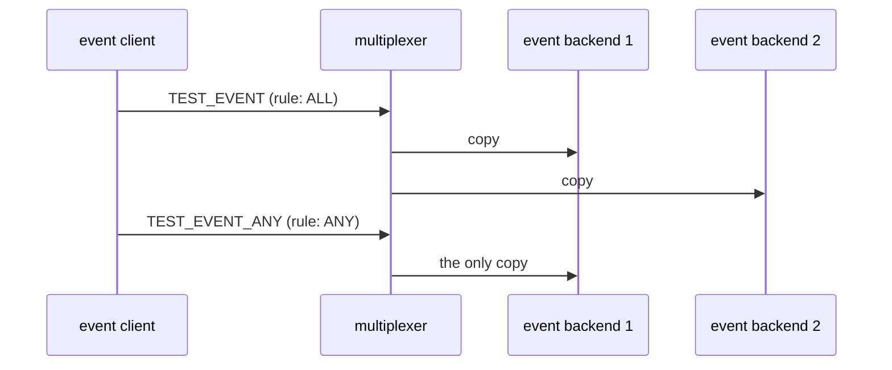

# Any vs all

Whom: ALL reaches every backend, whom: ANY reaches exactly one.

## What happens



## What is checked

- `whom: ALL` events reach every backend; `whom: ANY` events reach exactly one, and all backends together saw each exactly once.

## Run

```
bazel test //tests/scenarios:any_vs_all_py_py
```

The two suffixes are the languages of the roles, first the event backend's
and then the event client's.

The scenario is [any_vs_all.py](any_vs_all.py); the roles it spawns are described in
[tests/README.md](../../README.md).
