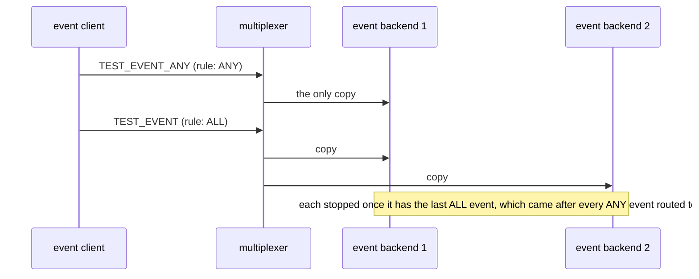

# Any vs all

Whom: ALL reaches every backend, whom: ANY reaches exactly one.

## What happens


```mermaid
sequenceDiagram
    participant S as event client
    participant M as multiplexer
    participant L1 as event backend 1
    participant L2 as event backend 2
    S->>M: TEST_EVENT_ANY (rule: ANY)
    M->>L1: the only copy
    S->>M: TEST_EVENT (rule: ALL)
    M->>L1: copy
    M->>L2: copy
    Note over L1,L2: each stopped once it has the last ALL event, which came after every ANY event routed to it
```

## What is checked

- `whom: ALL` events reach every backend; `whom: ANY` events reach exactly one, and all backends together saw each exactly once.

The ANY events go first and the multiplexer forwards the client's events in
order, so a backend that has the last ALL event has every event routed to
it, a copy of an ANY event routed by mistake included. Each backend is
stopped then, not after a fixed time, which a loaded machine can outlast.

## Run

```
bazel test //tests/scenarios:any_vs_all_py_py
```

The two suffixes are the languages of the roles, first the event backend's
and then the event client's.

The scenario is [any_vs_all.py](any_vs_all.py); the roles it spawns are described in
[tests/README.md](../../README.md).
