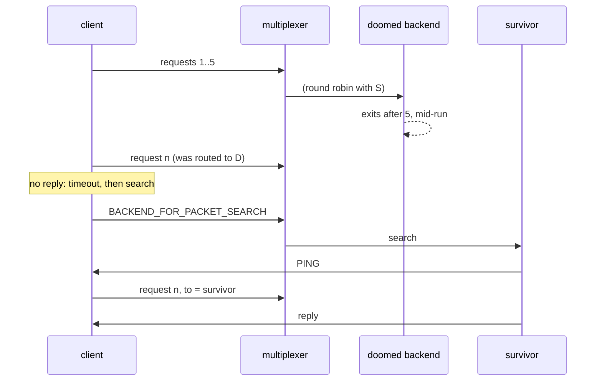

# Backend dies

One of two backends crashes mid-run; the survivor takes over.

## What happens



## What is checked

- All 20 queries are answered, none fails.
- The doomed backend exited with 3 after 5 requests; the survivor answered the rest, including the one found again through the search.

## Run

```
bazel test //tests/scenarios:backend_dies_py
```

The suffix is the client's language: `_py` a Python client, `_cc` a C++
one; the backend is the Python one.

The scenario is [backend_dies.py](backend_dies.py); the roles it spawns are described in
[tests/README.md](../../README.md).
