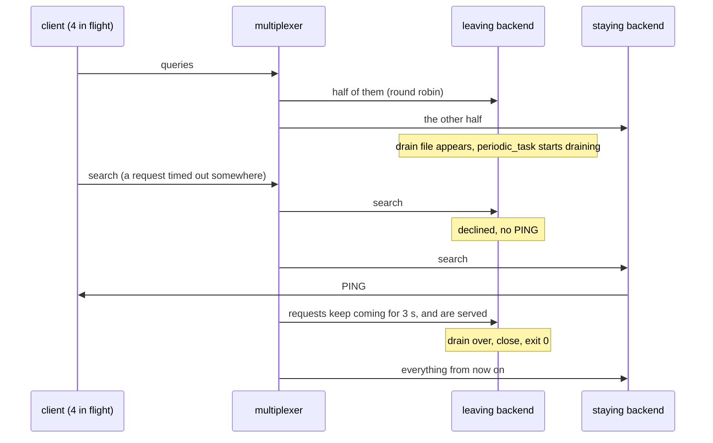

# Backend drains

A backend asked to leave drains: it declines searches, serves what arrives, then exits.

Two backends share the requests of a client. One is asked to leave, the
way a preStop hook asks, by a file its periodic_task() notices, and it has a
drain period: from then on it does not answer the search clients use to
find a backend, so no retried request is sent to it, but it keeps serving
the requests the multiplexer still routes to it until the period ends and
it exits. This is the graceful shape of a backend restart.

## What happens



## What is checked

- The leaving backend exits with 0 once drained, and served requests after it started draining.
- Every query is answered, none fails, and none took anywhere near a timeout: the restart was invisible to the client.

## Run

```
bazel test //tests/scenarios:backend_drains_py_py
```

The two suffixes are the languages of the roles, first the backend's and
then the client's.
