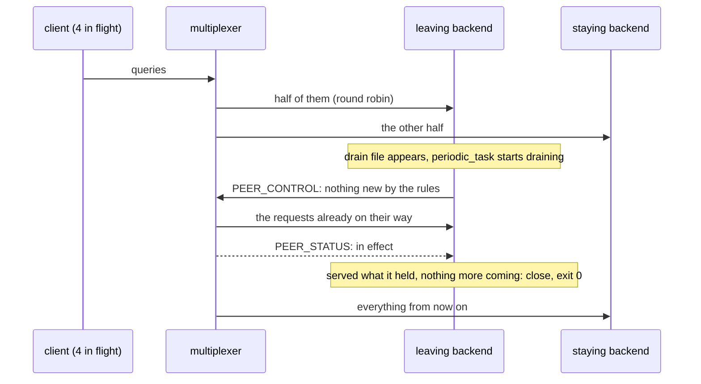

# Backend drains

A backend asked to leave drains: the multiplexer routes it nothing new, it serves what it holds, then exits.

Two backends share the requests of a client. One is asked to leave, the
way a preStop hook asks, by a file its periodic_task() notices, and it has
a drain period: it tells the multiplexer to route it nothing new by the
rules, the multiplexer confirms, and from that moment every request goes
to the other backend. The leaving one serves what was already on its way,
refuses nothing, and exits as soon as its work is done, long before the
period is up. Every query is answered and the client never waited for a
timeout: the graceful shape of a backend restart.

## What happens


```mermaid
sequenceDiagram
    participant C as client (4 in flight)
    participant M as multiplexer
    participant L as leaving backend
    participant S as staying backend
    C->>M: queries
    M->>L: half of them (round robin)
    M->>S: the other half
    Note over L: drain file appears, periodic_task starts draining
    L->>M: PEER_CONTROL: nothing new by the rules
    M->>L: the requests already on their way
    M-->>L: PEER_STATUS: in effect
    Note over L: served what it held, nothing more coming: close, exit 0
    M->>S: everything from now on
```

## What is checked

- The leaving backend exits with 0 well before its 10 s period, once the multiplexer confirmed and its work was done, and no request reached it after the confirmation.
- Every query is answered, none fails, and none took anywhere near a timeout: the restart was invisible to the client.

## Run

```
bazel test //tests/scenarios:backend_drains_py_py
```

The two suffixes are the languages of the roles, first the backend's and
then the client's.
