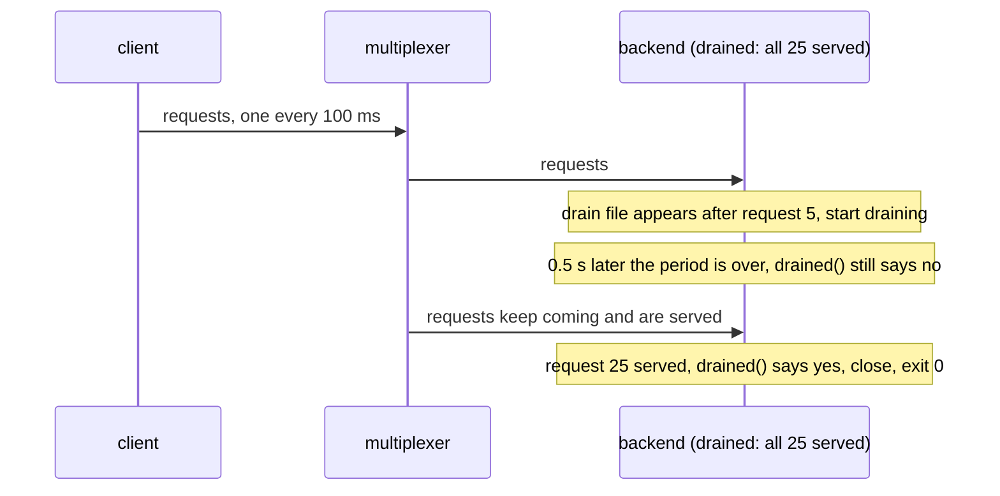

# Backend drains until done

A backend decides for itself when its drain is over, by overriding drained().

The only backend is asked to leave after a few requests, with a drain period
of half a second but a rule of its own: it refuses to leave before it has
served every request of the run. The drain lasts as long as the rule says,
the backend serves everything, and exits cleanly only then.

## What happens



## What is checked

- Every query is answered; none fails.
- The backend served all 25 and exited with 0 only then, well past its half-second drain period.

## Run

```
bazel test //tests/scenarios:backend_drains_until_done_py_py
```

The two suffixes are the languages of the roles, first the backend's and
then the client's.
