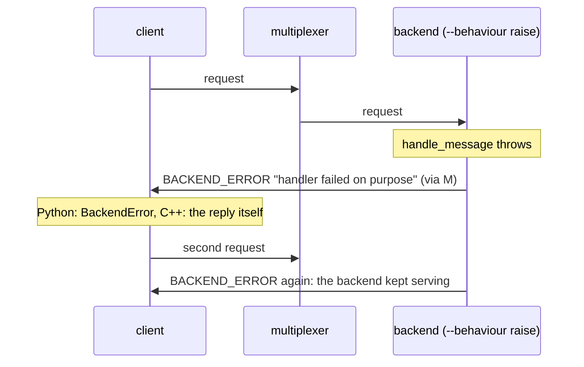

# Backend raises

A backend whose handler throws answers with BACKEND_ERROR, at once, and keeps serving.

A Python client raises BackendError; a C++ client gets the BACKEND_ERROR
message back from query(). Either way nobody waits for a timeout.

## What happens



## What is checked

- Both queries end within 2 s with a backend error, never a timeout.
- The backend served both and still exits cleanly.
- A second run starts the backend with `--exit-on-exception`, whose `on_handler_exception()` returns false: the requester is still told at once, and the process ends with status 4 after the exception left `serve_forever()`.

## Run

```
bazel test //tests/scenarios:backend_raises_py_py
```

The two suffixes are the languages of the roles, first the backend's and
then the client's: `_py_py` runs it with both in Python, `_cc_py` with a C++
backend and a Python client, and so on; `bazel query 'tests/scenarios:all'`
lists every combination.

The scenario is [backend_raises.py](backend_raises.py); the roles it spawns are described in
[tests/README.md](../../README.md).
