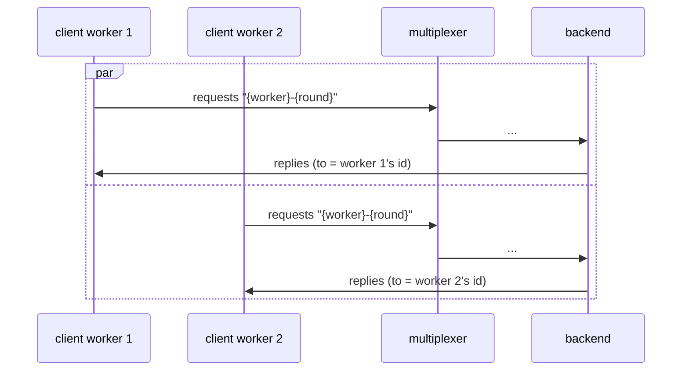

# Concurrent clients

Several clients query one backend at the same time without cross-talk.

## What happens



## What is checked

- Every worker gets exactly its own replies: the payload names the worker, and no reply crosses over.
- The backend handled every request.

## Run

```
bazel test //tests/scenarios:concurrent_clients_py_py
```

The two suffixes are the languages of the roles, first the backend's and
then the client's: `_py_py` runs it with both in Python, `_cc_py` with a C++
backend and a Python client, and so on; `bazel query 'tests/scenarios:all'`
lists every combination.

The scenario is [concurrent_clients.py](concurrent_clients.py); the roles it spawns are described in
[tests/README.md](../../README.md).
