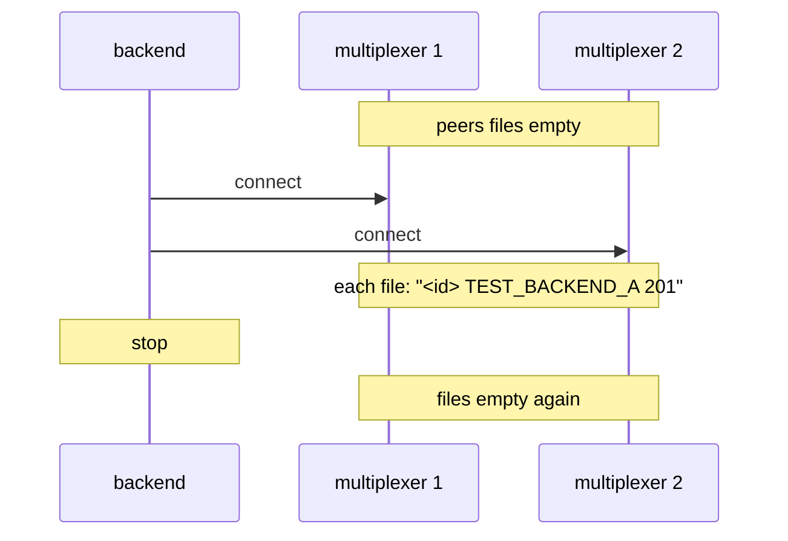

# Connected peers

The multiplexer's peers file lists who is connected, rewritten on every change.

Two multiplexers each keep a `--peers-file`. A backend connecting to both
appears in each file with its instance id and type name; the harness's
`wait_for_peer` waits on exactly that; when the backend leaves, both files
drop it and `wait_for_peer_gone` returns.

## What happens



## What is checked

- Both files are empty before, list the backend by id and type name while it is connected, and are empty after it leaves.
- `wait_for_peer` returns for the type by name and by number, and times out for a type nobody has; `wait_for_peer_gone` returns once the stopped backend is out of both files.

## Run

```
bazel test //tests/scenarios:connected_peers_py
```
