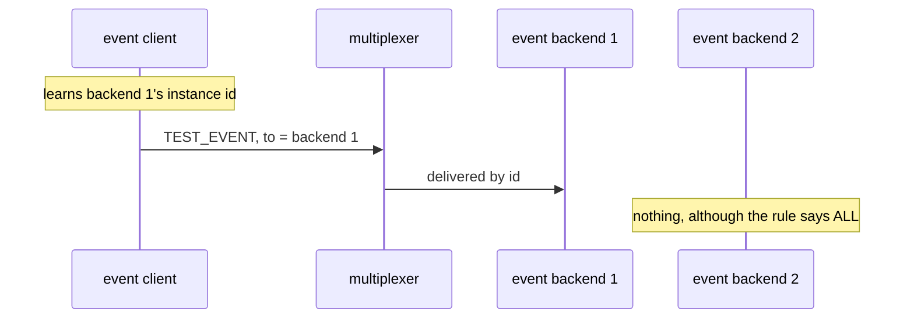

# Direct addressing

A message with `to` set reaches only that instance, whatever the rules say.

## What happens



## What is checked

- Only the addressed backend received the message; the routing rule was not consulted.

## Run

```
bazel test //tests/scenarios:direct_addressing_py
```

The suffix is the client's language: `_py` a Python client, `_cc` a C++
one; the backend is the Python one.

The scenario is [direct_addressing.py](direct_addressing.py); the roles it spawns are described in
[tests/README.md](../../README.md).
