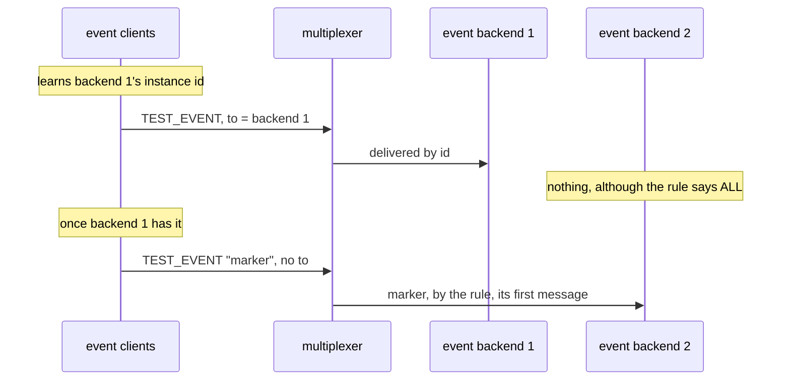

# Direct addressing

A message with `to` set reaches only that instance, whatever the rules say.

## What happens


```mermaid
sequenceDiagram
    participant S as event clients
    participant M as multiplexer
    participant L1 as event backend 1
    participant L2 as event backend 2
    Note over S: learns backend 1's instance id
    S->>M: TEST_EVENT, to = backend 1
    M->>L1: delivered by id
    Note over L2: nothing, although the rule says ALL
    Note over S: once backend 1 has it
    S->>M: TEST_EVENT "marker", no to
    M->>L2: marker, by the rule, its first message
```

## What is checked

- Only the addressed backend received the message; the routing rule was not consulted.

Each backend leaves after its first message. The other backend's is a
marker sent by the rule once the addressed message is in: a copy of the
addressed message routed to it by mistake would have come before the
marker. A backend that left after a fixed time could leave before its
message arrives, on a loaded machine.

## Run

```
bazel test //tests/scenarios:direct_addressing_py
```

The suffix is the language of both roles, the event backends and the
event clients.

The scenario is [direct_addressing.py](direct_addressing.py); the roles it spawns are described in
[tests/README.md](../../README.md).
