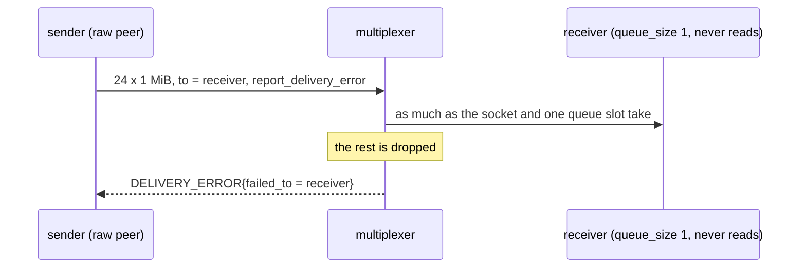

# Direct queue full

A directly addressed message dropped for a full queue is reported as a delivery error.

A receiver of a peer type with queue_size 1 never reads. A sender addresses
it by instance id with report_delivery_error set and pushes far more than
the socket buffers hold; the multiplexer drops what it cannot queue and
sends the sender a DELIVERY_ERROR naming the receiver, the same as for an
absent peer.

## What happens



## What is checked

- At least one DELIVERY_ERROR arrives naming the receiver: a full queue is reported like an absent peer.

## Run

```
bazel test //tests/scenarios:direct_queue_full_test
```

This scenario spawns no roles, so it has one configuration.

The scenario is [direct_queue_full.py](direct_queue_full.py); the roles it spawns are described in
[tests/README.md](../../README.md).
