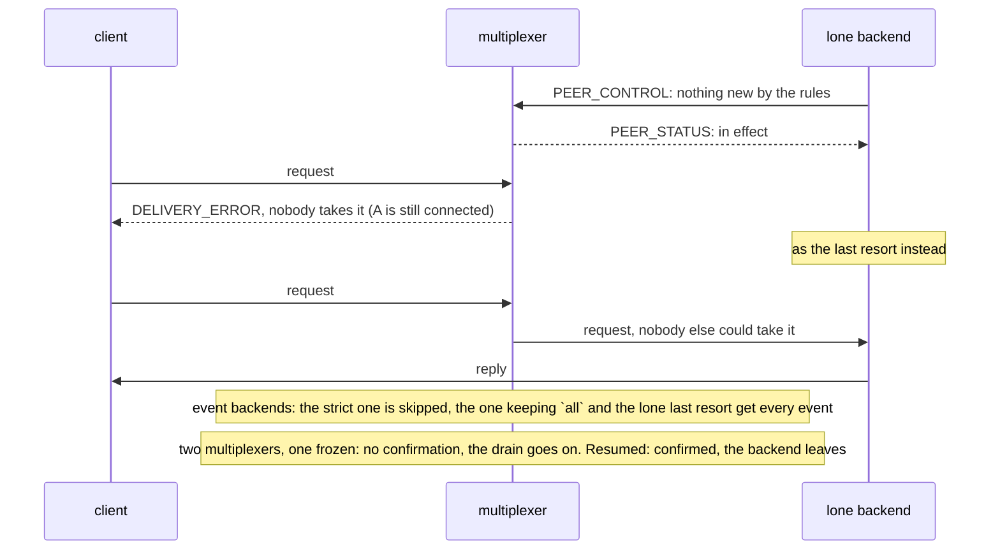

# Drain routing

What a draining backend still takes is its choice: nothing new by default, events with `all` kept, everything as the last resort when it is alone.

Four runs. A lone backend drains with the default routing while staying
registered: the client's next requests fail at once with `OperationFailed`
rather than waiting for a timeout, although the backend is still there.
The same backend draining as the last resort keeps getting every request
until its period is up, since nobody else could take them. An event
backend draining with the default gets no more events while another one is
there, one draining with `all` kept still gets every one, and a lone one
draining as the last resort keeps getting them too. Behind two
multiplexers, a drain is not over until both have confirmed: with one
multiplexer frozen the backend keeps serving, and it leaves once the
multiplexer is back.

## What happens



## What is checked

- Strict: after the confirmation, and with the backend still in the multiplexer's peers file, three queries fail with `OperationFailed` within a second each; the backend served only what came before.
- Last resort: five queries after the confirmation are served, and the backend leaves when its period is up.
- Events: the staying backend and the one keeping `all` receive all 200 events, the strict one receives none after its confirmation, and a lone last-resort event backend receives every event sent to it.
- Two multiplexers: no `acked` while one multiplexer is frozen, `acked` and a clean exit once it is resumed.

## Run

```
bazel test //tests/scenarios:drain_routing_py
```

The suffix is the backends' language; the clients are the Python ones.

The scenario is [drain_routing.py](drain_routing.py); the roles it spawns are described in
[tests/README.md](../../README.md), the drain in [docs/leaving.md](../../../docs/leaving.md).
