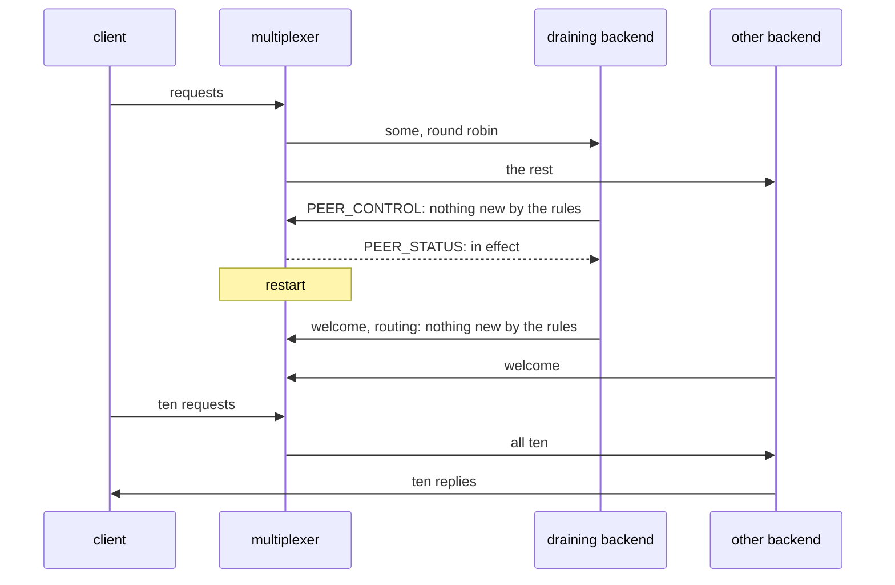

# Drain survives a multiplexer restart

A multiplexer restarts under a draining backend: the backend registers again as draining, and nothing new reaches it.

One multiplexer, two backends of one type. One drains with a long period
and a rule of its own that keeps it from leaving, so it stays draining.
The multiplexer restarts; both backends reconnect within 3 s, the draining
one with its routing in its welcome, so the multiplexer routes it nothing
from its first request on: every query goes to the other backend, none
fails, and the draining one served nothing after the restart.

## What happens



## What is checked

- Both backends are registered again after the restart.
- Every query after the restart is answered, by the other backend only.
- The draining backend's request count did not move after its confirmation.

## Run

```
bazel test //tests/scenarios:drain_survives_mx_restart_py
```

The suffix is the backend's language; the client is the Python one.

The scenario is [drain_survives_mx_restart.py](drain_survives_mx_restart.py); the roles it spawns are described in
[tests/README.md](../../README.md), the drain in [docs/leaving.md](../../../docs/leaving.md).
