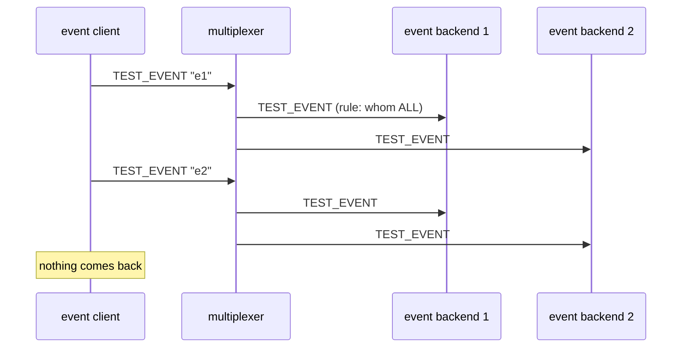

# Event all backends

A client's events reach every event backend (whom: ALL).

## What happens



## What is checked

- Every event backend received every event, in order.
- The sender reported each event as sent; nobody answered.

## Run

```
bazel test //tests/scenarios:event_all_backends_py_py
```

The two suffixes are the languages of the roles, first the event backend's
and then the event client's.

The scenario is [event_all_backends.py](event_all_backends.py); the roles it spawns are described in
[tests/README.md](../../README.md).
