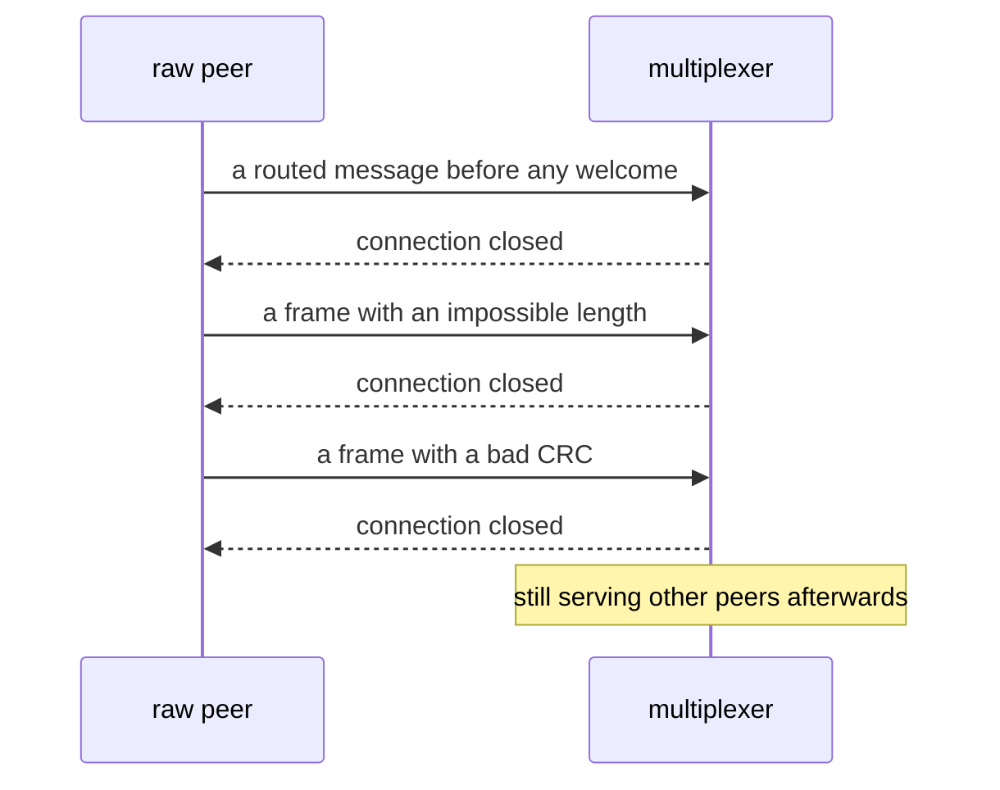

# Hostile input

Malformed and out-of-order input must cost the peer its connection,

never the multiplexer.

Each case sends bytes that used to crash the server or bypass the handshake,
then proves the server is still serving by completing a fresh handshake.

## What happens



## What is checked

- Each kind of malformed or out-of-order input costs the sender its connection and nothing else.
- The multiplexer keeps serving: a good peer still completes a handshake and events still flow.

## Run

```
bazel test //tests/scenarios:hostile_input_py
```

The peer under test is a raw one, driven by the scenario itself; the
suffix is the language of the event backend that stands by, and only the
Python one is used.

The scenario is [hostile_input.py](hostile_input.py); the roles it spawns are described in
[tests/README.md](../../README.md).
