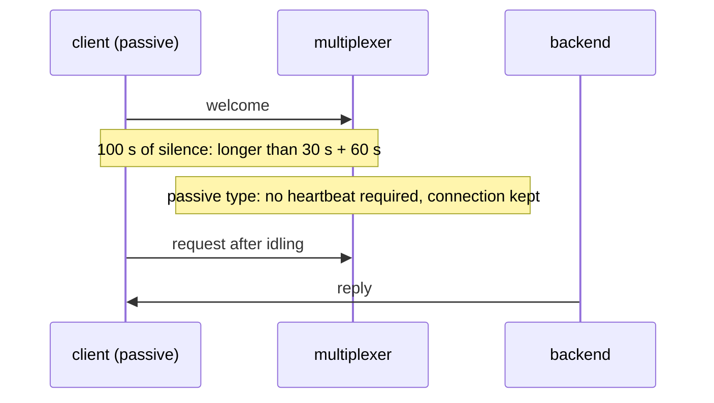

# Idle client

A passive client idles past both drop intervals and still works.

## What happens



## What is checked

- A passive client that idles past both drop intervals is still connected and its query works.
- Slow: it really waits.

## Run

```
bazel test //tests/scenarios:idle_client_py
```

The suffix is the client's language: `_py` a Python client, `_cc` a C++
one; the backend is the Python one.

The scenario is [idle_client.py](idle_client.py); the roles it spawns are described in
[tests/README.md](../../README.md).
