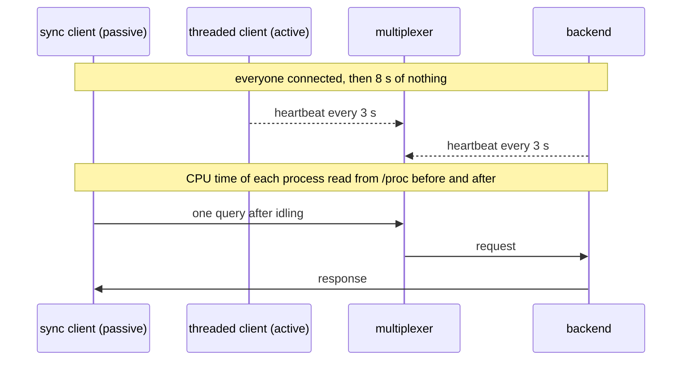

# Idle CPU

An idle deployment uses no CPU: every wait loop sleeps, none spins.

A multiplexer, a backend, a synchronous client and a threaded client sit
idle for a while, heartbeats and all. The CPU time of every process over
that window, read from /proc, stays within a few hundredths of a second: a
loop that spins would burn a whole core into it. This is the check that a
wait somewhere did not turn into a busy loop.

## What happens



## What is checked

- Each of the four processes used under 0.15 s of CPU during the 8 s idle window.
- Both clients still get their answer after idling, so the idleness was real, not a hang.

## Run

```
bazel test //tests/scenarios:idle_cpu_py_py
```

The two suffixes are the languages of the roles, first the backend's and
then the client's.
