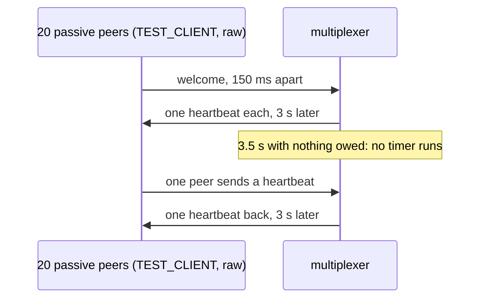

# Idle passive peers

Idle passive peers cost the multiplexer no wakeups, and a frame one sends is owed a heartbeat.

A passive peer is sent one heartbeat per frame it sends, so that one that
reads only inside its calls never finds a pile of them. Twenty passive
peers connect 150 ms apart, so that their connections' timers fall
apart, and each is sent the one heartbeat its welcome is owed. Over the
next 3.5 s, longer than the 3 s heartbeat interval, the multiplexer's
threads are woken a handful of times at most, counted from /proc, where
every idle passive connection's timer woke them every interval to find
nothing owed. Then one peer sends a heartbeat and is sent one back. The
periodic rules check is off, so that only the connections could wake the
multiplexer.

## What happens



## What is checked

- Over the 3.5 s with nothing owed, the multiplexer's threads are woken fewer than five times: no timer runs for an idle passive connection.
- A frame from an idle passive peer is answered with its one heartbeat.

## Run

```
bazel test //tests/scenarios:idle_passive_peers_test
```

This scenario spawns no roles, so it has one configuration.

The scenario is [idle_passive_peers.py](idle_passive_peers.py); heartbeats are described in
[docs/semantics.md](../../../docs/semantics.md).
