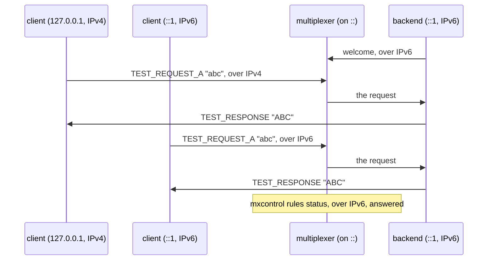

# IPv6 dual stack

A multiplexer listening on [::] serves peers over IPv6 and over IPv4 at once.

One multiplexer listens on every address, `Cluster(host="::")`, and its
port file says `[::]:PORT`. The backend role is given `[::1]:PORT`, so it
reaches the multiplexer over IPv6 only; then one client role is given
`127.0.0.1:PORT`, IPv4 only, and another `[::1]:PORT`, and each one's
queries are answered by that backend. `mxcontrol rules status -M
[::1]:PORT` reaches the multiplexer too. Every role reads its `--mx` with
the brackets, the Python ones with `multiplexer.endpoints`, the C++ ones
with `multiplexer/endpoint.h`. The scenario needs an IPv6 loopback and
IPv4 mapped onto an IPv6 socket bound to `::`, which Linux does unless
`net.ipv6.bindv6only` is set; it is skipped without them, in a container
with IPv6 off say.

## What happens



## What is checked

- The multiplexer's port file gives its address in brackets, `[::]:PORT`.
- The backend, given only `[::1]:PORT`, registers.
- The client given only `127.0.0.1:PORT` and the one given only `[::1]:PORT` each get every answer, from that backend, upper case.
- `mxcontrol rules status -M [::1]:PORT` answers with the multiplexer's rules.

## Run

```
bazel test //tests/scenarios:ipv6_dual_stack_py
```

The suffix is the roles' language: `_py` the Python roles, `_cc` the C++
ones, the backend and the clients alike.

The scenario is [ipv6_dual_stack.py](ipv6_dual_stack.py); the address
forms are described in [docs/mxcontrol.md](../../../docs/mxcontrol.md#addresses).
