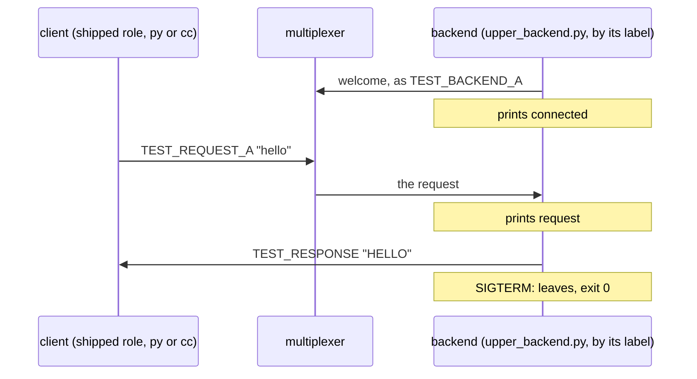

# Label role

A binary named by its label plays the backend role next to the shipped client.

mx_integration_test's roles may name a binary of your own instead of "py"
or "cc": here upper_backend.py, the smallest program following the role
contract, plays the backend while the shipped client role queries it.

## What happens



## What is checked

- The scenario sees the label-named role as `bin` and spawns it like any other.
- The backend registers, and the shipped client's query is answered in upper case.
- The backend reports the request as a `request` event, and exits with 0 on SIGTERM.

## Run

```
bazel test //tests/scenarios:label_role_py
```

The suffix is the client's language: `_py` the Python client, `_cc` the
C++ one; the backend is always [upper_backend.py](upper_backend.py), named
in `tests/scenarios/BUILD` by its label, `:upper_backend`.

The scenario is [label_role.py](label_role.py); the role contract a binary
of your own follows is in [tests/README.md](../../README.md).
