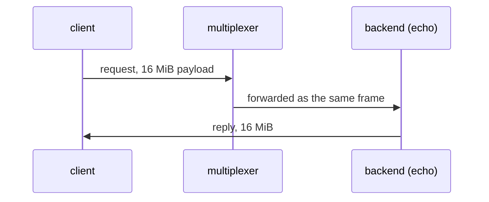

# Large payload

A 16 MiB query and its echo make the round trip intact.

## What happens



## What is checked

- The 16 MiB reply arrives with the right size and hash: frames well above the socket buffers survive the round trip.

## Run

```
bazel test //tests/scenarios:large_payload_py
```

The suffix is the client's language: `_py` a Python client, `_cc` a C++
one; the backend is the Python one.

The scenario is [large_payload.py](large_payload.py); the roles it spawns are described in
[tests/README.md](../../README.md).
