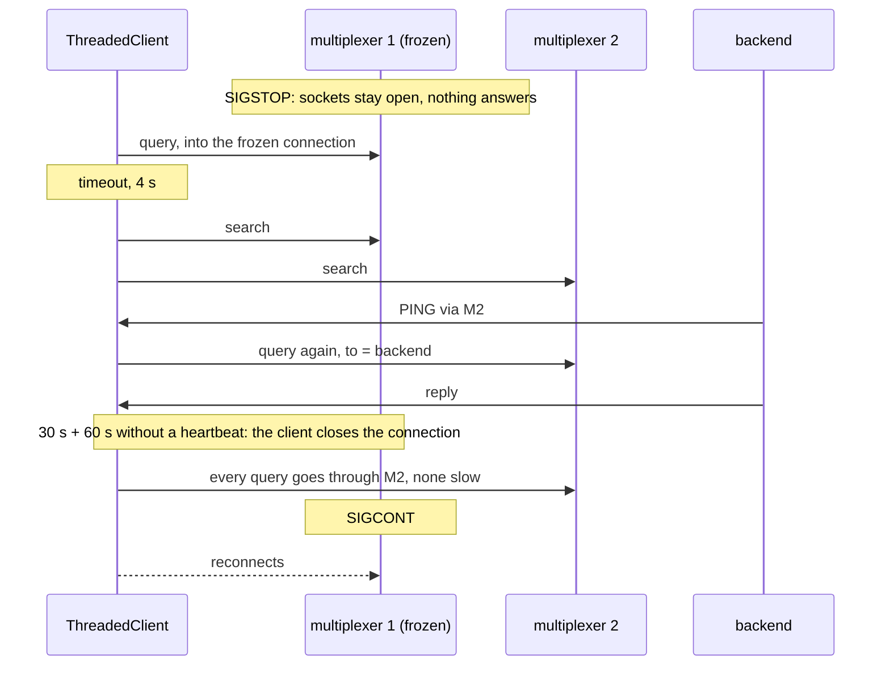

# Mx hangs

One of two multiplexers hangs without closing its sockets; queries survive, some slowly.

A frozen multiplexer (SIGSTOP) is worse than a dead one: nothing tells the
peers, so a client keeps using the connection until its heartbeats go
unanswered. A query that picks it waits out its timeout, then finds the
backend through the search on the other multiplexer and is answered. After
the heartbeat drop interval the client's own timers close the connection
and nothing is slow any more. When the multiplexer comes back, the client
reconnects.

## What happens



## What is checked

- Every query is answered, none fails.
- Some queries were slow (they picked the frozen connection) and none of them cost more than one timeout: the search found the backend on the other multiplexer.
- No slow query after the heartbeat drop interval: the client had closed the frozen connection itself.
- The client is connected to both multiplexers again at the end.

## Run

```
bazel test //tests/scenarios:mx_hangs_py
```

The suffix is the client's language: `_py` a Python client, `_cc` a C++
one; the backend is the Python one. It is tagged slow: it waits out the
drop interval.
