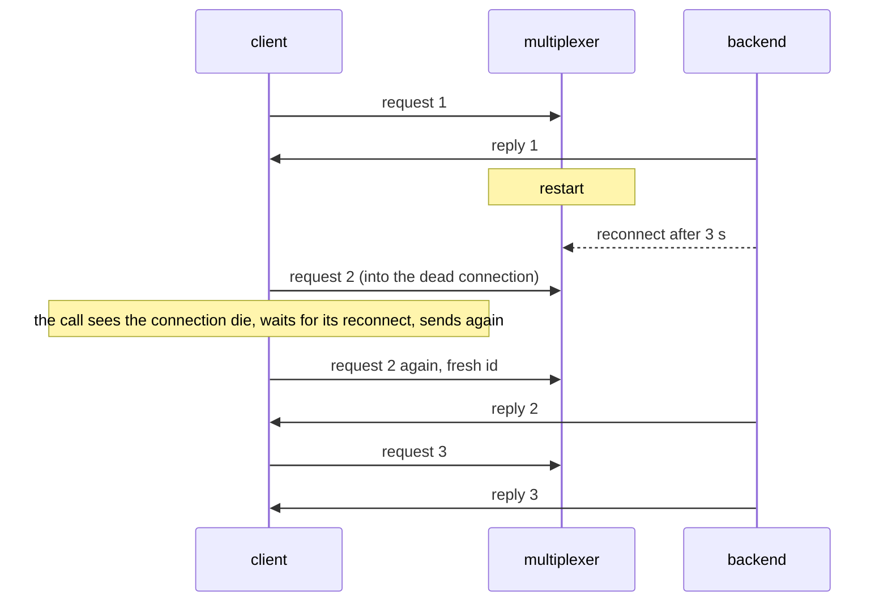

# Mx restarts

The multiplexer restarts under a live backend and a passive client; nobody notices.

The backend, which runs the loop, reconnects after AUTO_RECONNECT_TIME. The
client's next call finds its connection dead, waits for the reconnect inside
the call and sends again, so every query is answered and none fails.

## What happens



## What is checked

- No query fails across the restart; the second one just takes a few seconds.
- The backend saw all three requests.

## Run

```
bazel test //tests/scenarios:mx_restarts_py
```

The suffix is the client's language: `_py` a Python client, `_cc` a C++
one; the backend is the Python one.

The scenario is [mx_restarts.py](mx_restarts.py); the roles it spawns are described in
[tests/README.md](../../README.md).
