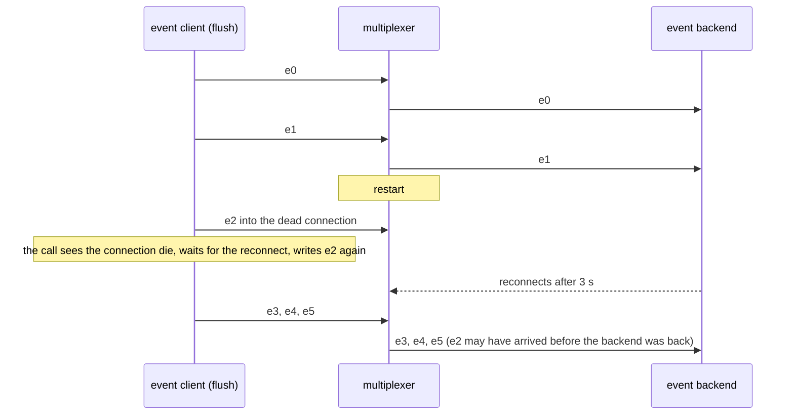

# Mx restarts under events

The multiplexer restarts between two events; a flushing sender loses none of its calls.

A passive event client sends one event every second and flushes each. The
multiplexer restarts after the second one. The send that finds its
connection dead waits for the reconnect inside the call and writes the
event again, so every send succeeds; the backend, which reconnects on its
own, receives every event sent after both are back.

## What happens



## What is checked

- Every send returns as written, none fails, and the sender's connection count is back to 1.
- The backend receives the events sent after both peers reconnected, the last one included; an event written while the backend was still away is dropped by design (nobody to deliver to).

## Run

```
bazel test //tests/scenarios:mx_restarts_under_events_py_py
```

The two suffixes are the languages of the roles, first the event backend's
and then the event client's.
