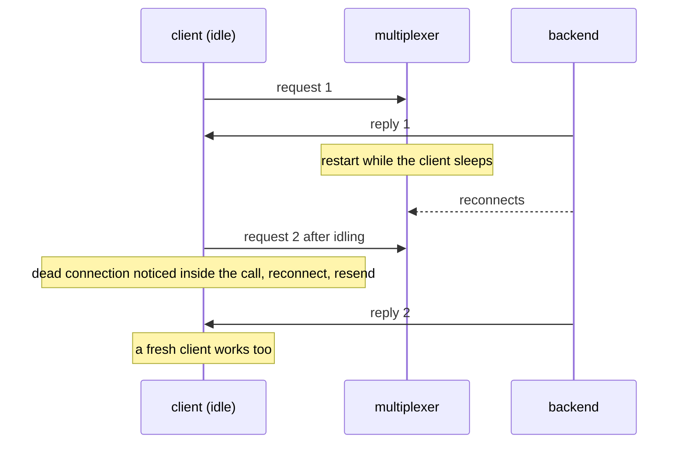

# Mx restarts under idle client

The multiplexer restarts while a passive client is idle; its next call still works.

The client learns of the dead connection inside that call, waits for the
reconnect there and sends again. A fresh client works too.

## What happens



## What is checked

- The idle client's next call succeeds.
- A client started after the restart works as well.

## Run

```
bazel test //tests/scenarios:mx_restarts_under_idle_client_py
```

The suffix is the client's language: `_py` a Python client, `_cc` a C++
one; the backend is the Python one.

The scenario is [mx_restarts_under_idle_client.py](mx_restarts_under_idle_client.py); the roles it spawns are described in
[tests/README.md](../../README.md).
